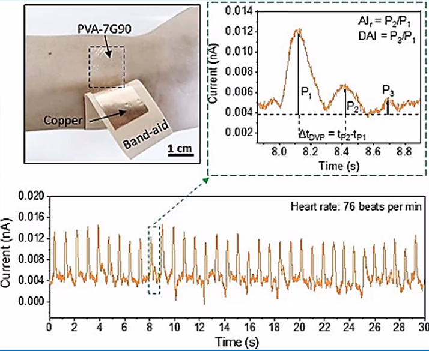

# What is Calculus?

Definition from Encyclopedia Britannica states that: "A branch of mathematics concerned with the calculation of instantaneous rates of change and the summation of infinitely many small factors to determine some whole."

- instantaneous: Something happening **right away**, or at one point.

- instantaneous rates of change: The **Slope**, $m=\dfrac{\Delta y}{\Delta x}$.

## Derivatives

Derivatives refers the slope at a point, as a slope is a $\dfrac{\Delta y}{\Delta x}$, and at a point is, that derivatives **DEVIDE** the units of Y by the units of X.
$$
\frac{\delta y}{\delta x}=\lim _{\Delta \mathrm{X} \rightarrow 0} \frac{\Delta \mathrm{y}}{\Delta \mathrm{x}}
$$

## Integral

The area under a curve, yet an area is two dimensional; it **MULTIPLY** the units of y times the units of x.
$$
\text { Area }=\lim _{n \rightarrow \infty} \sum_{i=1}^{n} f\left(a+\left(\frac{b-a}{n}\right) i\right)\left(\frac{b-a}{n}\right)=\int_{a}^{b} f(x) d x
$$

> **Example 1**: Find the derivatives and integration of the following scenario represented in the following electro cardiogram graph.
>   
> - Derivatives: $\dfrac{(\text{Units of }y)}{(\text{Units of }x)}=\dfrac{nA}{s}$
> - Integration: $(\text{Units of }y)(\text{Units of }x)d=nAs$
