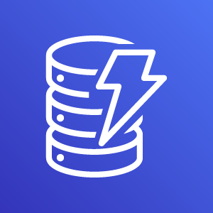
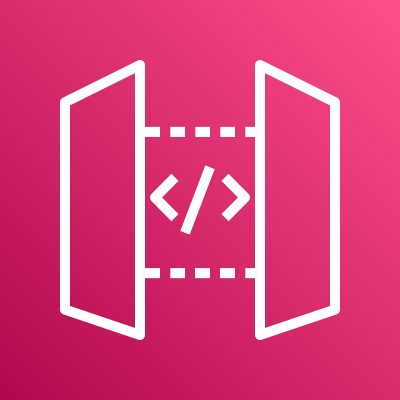

# AWS 入門

## AWS とは？

本書では，クラウドの実践を行うプラットフォームとして， AWS を用いる． 実践にあたって，最低限必要な AWS の知識を本章では解説しよう．

[AWS (Amazon Web Services)](https://aws.amazon.com) は Amazon 社が提供する総合的なクラウドプラットフォームである． AWS は Amazon 社が持つ膨大な計算リソースを貸し出すクラウドサービスとして，2006 年に誕生した． 2021 年では，クラウドプロバイダーとして最大のマーケットシェア (約 32%) を保持している ([参照](https://www.canalys.com/newsroom/global-cloud-market-Q121))． Netflix や Slack をはじめとした多くのウェブ関連のサービスで，一部または全てのサーバーリソースが AWS から提供されているとのことである． よって，知らないうちに AWS の恩恵にあずかっている人も少なくないはずだ．

最大のシェアをもつだけに，機能・サービスの幅広さはほかのクラウドプラットフォームと比べ抜きんでている． また，利用者数が多いことを反映して，公式あるいはサードパーティによる技術紹介記事が数多くウェブ上に存在しているだけでなく，ライブラリのユーザーコミュニティも大きく問題解決が捗るのも魅力の一つだ． 初期のころウェブビジネスを行う企業がユーザーの大半を占めていたが，最近は大学などでの科学研究用途としても頻繁に用いられるようになってきている．

## AWS の機能・サービス

[figure_title](#fig_aws_services) は，執筆時点において AWS で提供されている主要な機能・サービスの一覧である．


計算，ストレージ，データベース，ネットワーク，セキュリティなど，クラウドの構築に必要な様々な要素が**独立したコンポーネント**として提供されている． 基本的に，これらを組み合わせることで一つのクラウドシステムができあがる．

また，機械学習・音声認識・AR/VR など，特定のアプリケーションにパッケージ済みのサービスも提供されている． これらを合計すると全部で 170 個以上のサービスが提供されているとのことである ([参照](https://dev.classmethod.jp/articles/aws-summary-2020/))．

AWS の初心者が陥りがちなのは，**大量のサービスの数に圧倒され，どこから手をつけたらよいのかわからなくなる**，という状況である． たくさんのサービスの中から，どのサービスをどの順番で学んでいったらいいのか，その道筋すら明らかでなく，大きな参入障壁となっていることは間違いない． だが実のところ， AWS の**基本的な構成要素はそのうちの数個**のみに限られる． 基本要素となる機能の使い方を知れば， AWS のおおよそのリソースを使いこなすことが可能になる． ほかの機能の多くは，基本の要素を組み合わせて特定のアプリケーションに特化したパッケージとして AWS が用意したものである． そのポイントを認知することが， AWS の学習の最初のステップである．

ここでは， AWS 上でクラウドシステムを構築するときの基本となる構成要素を列挙する． これらは後のハンズオンで実際にプログラムを書きながら体験する． 現時点では，名前だけでも頭の片隅に記憶してもらえればよい．

### 計算

 **EC2 (Elastic Compute Cloud)** 様々なスペックの仮想マシンを作成し，計算を実行することができる． クラウドの最も基本となる構成要素である． [???](#sec_first_ec2), [???](#sec_jupyter_and_deep_learning), [???](#sec_aws_batch) で詳しく触れる．

 **Lambda** Function as a Service (FaaS) とよばれる，小さな計算を**サーバーなし**で実行するためのサービス． サーバーレスアーキテクチャの章 ([???](#sec_serverless)) で詳しく解説する．

### ストレージ

 **EBS (Elastic Block Store)** EC2 に付与することのできる仮想データドライブ． いわゆる"普通の"(一般的な OS で使われている)ファイルシステムを思い浮かべてくれたらよい．

 **S3 (Simple Storage Service)** Object Storage とよばれる，API を使ってデータの読み書きを行う，いうなれば”クラウド・ネイティブ”なデータの格納システムである． サーバーレスアーキテクチャの章 ([???](#sec_serverless)) で詳しく解説する．

### データベース

 **DynamoDB** NoSQL 型のデータベースサービス (知っている人は `mongoDB` などを思い浮かべたらよい)． サーバーレスアーキテクチャの章 ([???](#sec_serverless)) で詳しく解説する．

### ネットワーク

 **VPC(Virtual Private Cloud)** AWS 上に仮想ネットワーク環境を作成し，仮想サーバー間の接続を定義したり，外部からのアクセスなどを管理する． EC2 は VPC の内部に配置されなければならない．

**API Gateway**  API のエンドポイントとバックエンドのサービス (Lambda など) を接続する際に用いる，リバースプロキシとしての役割を担う． [???](#sec_bashoutter) で詳しく解説する．

## Region と Availability Zone

AWS を使用する際に知っておかなければならない重要な概念として， **リージョン (Region)** と **Availability Zone (AZ)** がある ([figure_title](#fig_aws_regions_and_azs))． 以下ではこの概念について簡単に記述する．


**リージョン (Region)** とは，おおまかに言うとデータセンターの所在地のことである． 執筆時点において， AWS は世界の 25 の国と地域でデータセンターを所有している． [figure_title](#fig_aws_regions) は執筆時点で利用できるリージョンの世界地図を示している． 日本では東京と大阪にデータセンターがある． 各リージョンには固有の ID がついており，例えば東京は `ap-northeast-1`, 米国オハイオ州は `us-east-2`，などと定義されている．


AWS コンソールにログインすると，画面右上のメニューバーでリージョンを選択することができる([figure_title](#fig_aws_console_regions), 赤丸で囲った箇所)． EC2, S3 などの AWS のリソースは，リージョンごとに完全に独立である． したがって，**リソースを新たにデプロイする際，あるいはデプロイ済みのリソースを閲覧する際は，コンソールのリージョンが正しく設定されているか，確認する必要がある**． ウェブビジネスを展開する場合などは，世界の各地にクラウドを展開する必要があるが，個人的な研究用途として用いる場合は，最寄りのリージョン (i.e. 東京) を使えば基本的に問題ない．


`Avaialibity Zone (AZ)` とは，リージョン内で地理的に隔離されたデータセンターのことである． それぞれのリージョンは 2 個以上の AZ を有しており，もし一つの AZ で火災や停電などが起きた場合でも，ほかの AZ がその障害をカバーすることができる． また， AZ 間は高速な AWS 専用ネットワーク回線で結ばれているため， AZ 間のデータ転送は極めて早い． AZ は，ビジネスなどでサーバーダウンが許容されない場合などに注意すべき概念であり，個人的な用途で使う限りにおいてはあまり深く考慮する必要はない．言葉の意味だけ知っておけば十分である．

AWS を使用する際，どこのリージョンを指定するのがよいのだろうか？ インターネットの接続速度の観点からは，地理的に一番近いリージョンを使用するのが一般的によいだろう． 一方， EC2 の利用料などはリージョンごとに価格設定が若干 (10-20%程度) 異なる． したがって，自分が最も頻繁に利用するサービスの価格が最も安く設定されているリージョンを選択する，というのも重要な視点である． また，いくつかのサービスは，特定のリージョンで利用できない場合もある． これらのポイントから総合的に判断して使用するリージョンを決めると良い．

AWS Educate を利用している読者へ

執筆時点において，AWS Educate による Starter Account を使用している場合は `us-east-1` region のみ利用できる ([参照](https://awseducate-starter-account-services.s3.amazonaws.com/AWS_Educate_Starter_Account_Services_Supported.pdf))．

-   [AWS documentation "Regions, Availability Zones, and Local Zones"](https://docs.aws.amazon.com/AWSEC2/latest/UserGuide/using-regions-availability-zones.html)

## AWS でのクラウド開発

AWS のクラウドの全体像がわかってきたところで，次のトピックとして，どのようにして AWS 上にクラウドの開発を行い，展開していくかについての概略を解説しよう．

AWS のリソースを追加・編集・削除するなどの操作を実行するには，**コンソールを用いる**方法と，**API を用いる方法**の，二つの経路がある．

### コンソール画面からリソースを操作する

AWS のアカウントにログインすると，まず最初に表示されるのが**AWS コンソール**である ([figure_title](#aws_console_window))．


コンソールを使うことで， EC2 のインスタンスを立ち上げたり，S3 のデータを追加・削除したり，ログを閲覧したりなど，AWS 上のあらゆるリソースの操作を GUI (Graphical User Interface) を通して実行することができる． **初めて触る機能をポチポチと試したり，デバッグを行うときなどにとても便利である**．

コンソールはさらっと機能を試したり，開発中のクラウドのデバッグをするときには便利なのであるが，実際にクラウドの開発をする場面でこれを直接いじることはあまりない． むしろ，次に紹介する API を使用して，プログラムとしてクラウドのリソースを記述することで開発を行うのが一般的である． そのような理由で，本書では AWS コンソールを使った AWS の使い方はあまり触れない． AWS のドキュメンテーションには，たくさんの [チュートリアル](https://aws.amazon.com/getting-started/hands-on/) が用意されており，コンソール画面から様々な操作を行う方法が記述されているので，興味がある読者はそちらを参照されたい．

### API からリソースを操作する

**API (Application Programming Interface)** を使うことで，コマンドを AWS に送信し，クラウドのリソースの操作をすることができる． API とは，端的に言えば AWS が公開しているコマンドの一覧であり，`GET`, `POST`, `DELETE` などの **REST API** から構成されている (REST API については [???](#sec_rest_api) で簡単に解説する)． が，直接 REST API を入力するのは面倒であるので，その手間を解消するための様々なツールが提供されている．

例えば， [AWS CLI](https://docs.aws.amazon.com/cli/latest/index.html) は， UNIX コンソールから AWS API を実行するための CLI (Command Line Interface) である． CLI に加えて，いろいろなプログラミング言語での SDK (Software Development Kit) が提供されている．以下に一例を挙げる．

-   Python ⇒ [boto3](https://boto3.amazonaws.com/v1/documentation/api/latest/index.html)

-   Ruby ⇒ [AWS SDK for Ruby](https://aws.amazon.com/sdk-for-ruby/)

-   Node.js ⇒ [AWS SDK for Node.js](https://aws.amazon.com/sdk-for-node-js/)

具体的な API の使用例を見てみよう．

S3 に新しい保存領域 (`Bucket (バケット)` とよばれる) を追加したいとしよう． AWS CLI を使った場合は，次のようなコマンドを打てばよい．

```shell
$ aws s3 mb s3://my-bucket --region ap-northeast-1
```

上記のコマンドは， `my-bucket` という名前のバケットを， `ap-northeast-1` のリージョンに作成する．

Python からこれと同じ操作を実行するには， `boto3` ライブラリを使って，次のようなスクリプトを実行する．

```python
import boto3

s3_client = boto3.client("s3", region_name="ap-northeast-1")
s3_client.create_bucket(Bucket="my-bucket")
```

もう一つ例をあげよう．

新しい EC2 のインスタンス(インスタンスとは，起動状態にある仮想サーバーの意味である)を起動するには，次のようなコマンドを打てば良い．

```shell
$ aws ec2 run-instances --image-id ami-xxxxxxxx --count 1 --instance-type t2.micro --key-name MyKeyPair --security-group-ids sg-903004f8 --subnet-id subnet-6e7f829e
```

このコマンドにより， [t2.micro](https://aws.amazon.com/ec2/instance-types/t2/) というタイプ (1 vCPU, 1.0 GB RAM) のインスタンスが起動する． ここではその他のパラメータの詳細の説明は省略する (ハンズオン ([???](#sec_first_ec2)) で詳しく解説する)．

Python から上記と同じ操作を実行するには，以下のようなスクリプトを使う．

```python
import boto3

ec2_client = boto3.client("ec2")
ec2_client.run_instances(
    ImageId="ami-xxxxxxxxx",
    MinCount=1,
    MaxCount=1,
    KeyName="MyKeyPair",
    InstanceType="t2.micro",
    SecurityGroupIds=["sg-903004f8"],
    SubnetId="subnet-6e7f829e",
)
```

以上の例を通じて，API によるクラウドのリソースの操作のイメージがつかめてきただろうか？ コマンド一つで，新しい仮想サーバーを起動したり，データの保存領域を追加したり，任意の操作を実行できるわけである． 基本的に，このようなコマンドを複数組み合わせていくことで，自分の望む CPU・RAM・ネットワーク・ストレージが備わった計算環境を構築することができる． もちろん，逆の操作 (リソースの削除) も API を使って実行できる．

### ミニ・ハンズオン: AWS CLI を使ってみよう

ここでは，ミニ・ハンズオンとして，AWS CLI を実際に使ってみる． AWS CLI は先述のとおり， AWS 上の任意のリソースの操作が可能であるが，ここでは一番シンプルな，**S3 を使ったファイルの読み書きを実践する** (EC2 の操作は少し複雑なので，第一回ハンズオンで行う)． `aws s3` コマンドの詳しい使い方は [公式ドキュメンテーション](https://docs.aws.amazon.com/cli/latest/reference/s3/index.html#cli-aws-s3)を参照．

AWS CLI のインストールについては， [???](#aws_cli_install) を参照．

以下に紹介するハンズオンは，基本的に [S3 の無料枠](https://aws.amazon.com/free/?all-free-tier.sort-by=item.additionalFields.SortRank&all-free-tier.sort-order=asc) の範囲内で実行することができる．

以下のコマンドを実行する前に，AWS の認証情報が正しく設定されていることを確認する． これには `~/.aws/credentials` のファイルに設定が書き込まれているか，環境変数 (`AWS_ACCESS_KEY_ID`, `AWS_SECRET_ACCESS_KEY`, `AWS_DEFAULT_REGION`) が定義されている必要がある． 詳しくは [???](#aws_cli_install) を参照．

まずは，S3 にデータの格納領域 (`Bucket` とよばれる．一般的な OS での"ドライブ"に相当する) を作成するところから始めよう．

```shell
$ bucketName="mybucket-$(openssl rand -hex 12)"
$ echo $bucketName
$ aws s3 mb "s3://${bucketName}"
```

S3 のバケットの名前は， AWS 全体で一意的でなければならないことから，前述のコマンドではランダムな文字列を含んだバケットの名前を生成し，`bucketName` という変数に格納している． そして， `aws s3 mb` (`mb` は make bucket の略) によって，新しいバケットを作成する．

次に，バケットの一覧を取得してみよう．

```shell
$ aws s3 ls

2020-06-07 23:45:44 mybucket-c6f93855550a72b5b66f5efe
```

先ほど作成したバケットがリストにあることを確認できる．

本書のノーテーションとして，コマンドラインに入力するコマンドは，それがコマンドであると明示する目的で先頭に `$` がつけてある． `$` はコマンドをコピー&ペーストするときは除かなければならない． 逆に，コマンドの出力は `$` なしで表示されている．

次に，バケットにファイルをアップロードする．

```shell
$ echo "Hello world" > hello_world.txt
$ aws s3 cp hello_world.txt "s3://${bucketName}/hello_world.txt"
```

上では `hello_world.txt` というダミーのファイルを作成して，それをアップロードした．

それでは，バケットの中にあるファイルの一覧を取得してみる．

```shell
$ aws s3 ls "s3://${bucketName}" --human-readable

2020-06-07 23:54:19   13 Bytes hello_world.txt
```

先ほどアップロードしたファイルがたしかに存在することがわかる．

最後に，使い終わったバケットを削除する．

```shell
$ aws s3 rb "s3://${bucketName}" --force
```

`rb` は remove bucket の略である． デフォルトでは，バケットの中にファイルが存在すると削除できない． 空でないバケットを強制的に削除するには `--force` のオプションを付ける．

以上のように，AWS CLI を使って S3 バケットに対しての一連の操作を実行できた． EC2 や Lambda, DynamoDB などについても同様に AWS CLI を使ってあらゆる操作を実行できる．

**Amazon Resource Name (ARN)**

AWS 上のあらゆるリソースには， Amazon Resource Name (ARN) という固有の ID が付与されている． ARN は `arn:aws:s3:::my_bucket/` のようなフォーマットで記述され，ARN を使用することで，特定の AWS リソース (S3 のバケットや EC2 のインスタンス) を一意的に参照することができる．

S3 バケットや EC2 インスタンスなどには ARN に加えて，人間が読みやすい名前を定義することも可能である． この場合は，ARN または名前のどちらを用いても同じリソースを参照することが可能である．

## CloudFormation と AWS CDK

### CloudFormation による Infrastructure as Code (IaC)

前節で述べたように，AWS API を使うことでクラウドの**あらゆる**リソースの作成・管理が可能である． よって，原理上は， API のコマンドを組み合わせていくことで，自分の作りたいクラウドを設計することができる．

しかし，ここで実用上考慮しなければならない点が一つある． AWS API には大きく分けて，**リソースを操作する**コマンドと，**タスクを実行する**コマンドがあることである ([figure_title](#fig_aws_iac))．


**リソースを操作する**とは，EC2 のインスタンスを起動したり，S3 のバケットを作成したり，データベースに新たなテーブルを追加する，などの**静的なリソースを準備する** 操作を指す． "ハコ"を作る操作とよんでも良いだろう． このようなコマンドは，**クラウドのデプロイ時にのみ，一度だけ実行されればよい**．

**タスクを実行するコマンド** とは， EC2 のインスタンスにジョブを投入したり， S3 のバケットにデータを読み書きするなどの操作を指す． これは， EC2 や S3 などのリソース ("ハコ") を前提として，その内部で実行されるべき計算を記述するものである． 前者に比べてこちらは**動的な操作**を担当する，と捉えることもできる．

そのような観点から，**インフラを記述するプログラム**と**タスクを実行するプログラム**はある程度分けて管理されるべきである． クラウドの開発は，クラウドの(静的な)リソースを記述するプログラムを作成するステップと，インフラ上で動く動的な操作を行うプログラムを作成するステップの二段階に分けて考えることができる．

AWS での静的リソースを管理するための仕組みが， [CloudFormation](https://aws.amazon.com/cloudformation/) である． CloudFormation とは， CloudFormation の文法に従ったテキストファイルを使って，AWS のインフラを記述する仕組みである． CloudFormation を使って，たとえば，EC2 のインスタンスをどれくらいのスペックで，何個起動するか，インスタンス間はどのようなネットワークで結び，どのようなアクセス権限を付与するか，などのリソースの要件を逐次的に記述することができる． 一度 CloudFormation ファイルができ上がれば，それにしたがったクラウドシステムをコマンド一つで AWS 上に展開することができる． また，CloudFormation ファイルを交換することで，全く同一のクラウド環境を他者が簡単に再現することも可能になる． このように，本来は物理的な実体のあるハードウェアを，プログラムによって記述し，管理するという考え方を，**Infrastructure as Code (IaC)**とよぶ．

CloudFormation を記述するには，基本的に **JSON** (JavaScript Object Notation) とよばれるフォーマットを使う． 次のコードは，JSON で記述された CloudFormation ファイルの一例 (抜粋) である．

```json
"Resources" : {
  ...
  "WebServer": {
    "Type" : "AWS::EC2::Instance",
    "Properties": {
      "ImageId" : { "Fn::FindInMap" : [ "AWSRegionArch2AMI", { "Ref" : "AWS::Region" },
                        { "Fn::FindInMap" : [ "AWSInstanceType2Arch", { "Ref" : "InstanceType" }, "Arch" ] } ] },
      "InstanceType"   : { "Ref" : "InstanceType" },
      "SecurityGroups" : [ {"Ref" : "WebServerSecurityGroup"} ],
      "KeyName"        : { "Ref" : "KeyName" },
      "UserData" : { "Fn::Base64" : { "Fn::Join" : ["", [
                     "#!/bin/bash -xe\n",
                     "yum update -y aws-cfn-bootstrap\n",

                     "/opt/aws/bin/cfn-init -v ",
                     "         --stack ", { "Ref" : "AWS::StackName" },
                     "         --resource WebServer ",
                     "         --configsets wordpress_install ",
                     "         --region ", { "Ref" : "AWS::Region" }, "\n",

                     "/opt/aws/bin/cfn-signal -e $? ",
                     "         --stack ", { "Ref" : "AWS::StackName" },
                     "         --resource WebServer ",
                     "         --region ", { "Ref" : "AWS::Region" }, "\n"
      ]]}}
    },
    ...
  },
  ...
},
```

ここでは， "WebServer" という名前のつけられた EC2 インスタンスを定義している．かなり長大で複雑な記述であるが，これによって所望のスペック・OS をもつ EC2 インスタンスを自動的に生成することが可能になる．

### AWS CDK

前節で紹介した CloudFormation は，見てわかるとおり大変記述が複雑であり，またそれのどれか一つにでも誤りがあってはいけない． また，基本的に"テキスト"を書いていくことになるので，プログラミング言語で使うような変数やクラスといった便利な概念が使えない　(厳密には， CloudFormation にも変数に相当するような機能は存在する)． また，記述の多くの部分は繰り返しが多く，自動化できる部分も多い．

そのような悩みを解決してくれるのが， [AWS Cloud Development Kit (CDK)](https://aws.amazon.com/cdk/) である． **CDK は Python などのプログラミング言語を使って CloudFormation を自動的に生成してくれるツールである．** CDK は 2019 年にリリースされたばかりの比較的新しいツールで，日々改良が進められている ([GitHub リポジトリ](https://github.com/aws/aws-cdk/releases) のリリースを見ればその開発のスピードの速さがわかるだろう)． CDK は TypeScript (JavaScript), Python, Java など複数の言語でサポートされている．

CDK を使うことで，CloudFormation に相当するクラウドリソースの記述を，より親しみのあるプログラミング言語を使って行うことができる． かつ，典型的なリソース操作に関してはパラメータの多くの部分を自動で決定してくれるので，記述しなければならない量もかなり削減される．

以下に Python を使った CDK のコードの一例 (抜粋) を示す．

```python
from aws_cdk import (
    core,
    aws_ec2 as ec2,
)

class MyFirstEc2(core.Stack):

    def __init__(self, scope, name, **kwargs):
        super().__init__(scope, name, **kwargs)

        vpc = ec2.Vpc(
            ... # some parameters
        )

        sg = ec2.SecurityGroup(
            ... # some parameters
        )

        host = ec2.Instance(
            self, "MyGreatEc2",
            instance_type=ec2.InstanceType("t2.micro"),
            machine_image=ec2.MachineImage.latest_amazon_linux(),
            vpc=vpc,
            ...
        )
```

このコードは，一つ前に示した JSON を使った CloudFormation と実質的に同じことを記述している． とても煩雑だった CloudFormation ファイルに比べて， CDK と Python を使うことで格段に短く，わかりやすく記述できることができるのがわかるだろう．

本書の主題は，**CDK を使って，コードを書きながら AWS の概念や開発方法を学んでいくことである**． 後の章では CDK を使って様々なハンズオンを実施していく． 早速，最初のハンズオンでは， CDK を使って EC2 インスタンスを作成する方法を学んでいこう．

-   [AWS CDK Examples](https://github.com/aws-samples/aws-cdk-examples): CDK を使ったプロジェクトの例が多数紹介されている． ここにある例をテンプレートに自分のアプリケーションの開発を進めるとよい．
