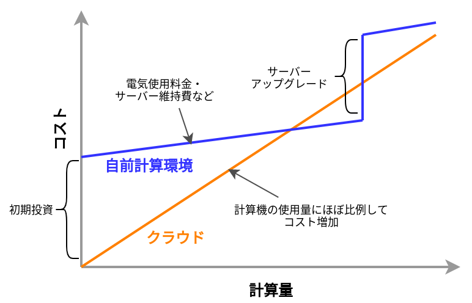

# クラウド概論

## クラウドとは？

クラウドとはなにか？ クラウドという言葉は，それ自身がとても広い意味をもつので，厳密な定義付けを行うことは難しい．

学術的な意味でのクラウドの定義づけをするとしたら，NIST(米国・国立標準技術研究所) による [The NIST Definition of Cloud Computing](https://csrc.nist.gov/publications/detail/sp/800-145/final) が引用されることが多い． ここに記載されたクラウドの定義・モデルを図示したのが [figure_title](#fig:nist_cloud_definition) である．

これによると，クラウドとは以下の要件が満たされたハードウェア/ソフトウェアの総体のことをいう．

-   **On-demand self-service** 利用者のリクエストに応じて計算資源が自動的に割り当てられる．

-   **Broad network access** 利用者はネットワークを通じてクラウドにアクセスできる．

-   **Resource pooling** クラウドプロバイダーは，所有する計算資源を分割することで複数の利用者に計算資源を割り当てる．

-   **Rapid elasticity** 利用者のリクエストに応じて，迅速に計算資源の拡大あるいは縮小を行うことができる．

-   **Measured service** 計算資源の利用量を計測・監視することができる．

…と，いわれても抽象的でよくわからないかもしれない．もう少し具体的な話をする．

個人が所有する計算機で， CPU をアップグレードしようと思ったら，物理的に筐体を開け，CPU ソケットを露出させ，新しい CPU に交換する必要があるだろう． あるいは，ストレージがいっぱいになってしまったら，古いディスクを抜き取り，新しいディスクを挿入する必要がある． 計算機の場所を移動させたときには，新しい部屋の LAN ケーブルを差し込まないとネットワークには接続できない．

クラウドでは，これらの操作が**プログラムからのコマンドによって実行できる**． CPU が 1000 個欲しいと思ったならば，そのようにクラウドプロバイダーにリクエストを送れば良い． すると，数分もしないうちに 1000 CPU の計算資源が割り当てられる． ストレージを 1TB から 10TB に拡張しようと思ったならば，そのようにコマンドを送ればよい (これは，Google Drive や Dropbox などのサービスなどで馴染みのある人も多いだろう)． 計算資源を使い終わったら，そのことをプロバイダーに伝えれば，割り当て分はすぐさま削除される． クラウドプロバイダーは，使った計算資源の量を正確にモニタリングしており，その量をもとに利用料金の計算が行われる．

このように，クラウドの本質は物理的なハードウェアの仮想化・抽象化であり，利用者はコマンドを通じて，**まるでソフトウェアの一部かのように，物理的なハードウェアの管理・運用を行うことができる**． もちろん，背後では，データセンターに置かれた膨大な数の計算機が大量の電力を消費しながら稼働している． クラウドプロバイダーはデータセンターの計算資源を上手にやりくりし，ソフトウェアとしてのインターフェースをユーザーに提供することで，このような仮想化・抽象化を達成しているわけである． クラウドプロバイダーの視点からすると，大勢のユーザーに計算機を貸し出し，データセンターの稼働率を常時 100%に近づけることで，利益率の最大化を図っているのである．

著者の言葉で，クラウドの重要な特性を定義するならば，以下のようになる．

> クラウドとは計算機ハードウェアの抽象化である．つまり，物理的なハードウェアをソフトウェアの一部かのように自在に操作・拡大・接続することを可能にする技術である．

先述の The NIST Definition of Cloud Computing に戻ると，クラウドプロバイダーによるクラウドサービスの形態としては，次の三つが定義されている ([figure_title](#fig:nist_cloud_definition))．

-   Software as a Service (SaaS): クラウド上で実行されるアプリケーションをサービスとして利用者に提供する形態． 例として， Google Drive や Slack などが挙げられる． 利用者は，背後にあるクラウドのインフラ (ネットワークやサーバーなど) には直接触れず，アプリケーションとして提供されているクラウドサービスを享受する．

-   Platform as a Service (PaaS): 顧客の作成したアプリケーション (多くの場合データベースと API リクエスト処理を行うサーバーのコードから構成される) をデプロイする環境をサービスとして利用者に提供する形態． PaaS では利用者はクラウドのインフラに直接触れることはなく，計算負荷が増減した際のサーバーのスケーリングはクラウドプロバイダーによってなされる． 例としては， Google App Engine や Heroku などがある．

-   Infrastructure as a Service (IaaS): クラウド上の計算インフラストラクチャーを従量課金制で利用者に提供する形態． 利用者は必要なネットワーク・サーバー・ストレージをプロバイダーから借り受け，そこに自身のアプリケーションを展開し運用する． IaaS の例としては AWS EC2 などが挙げられる．

本書が扱うのは，主に IaaS におけるクラウド開発である． すなわち，開発者がクラウドのインフラを直接操作し，所望のネットワーク・サーバー・ストレージなどを一から構成し，そこにアプリケーションを展開するというクラウド開発である． この意味において，クラウドの開発とは**クラウドインフラストラクチャーを定義・展開するプログラムを構築するステップ**と**インフラ上で実際に走るアプリケーションを作成するステップ**の二つに分けることができる． この二つは，プログラマーの技術としてはある程度分業を行うことが可能であるが，最も効率化・最適化されたクラウドシステムを構築するためには両方の理解が必須である． 本書では，前者 (クラウドインフラの記述) に重きを置きつつ，アプリケーションレイヤーの話題も取り扱う． PaaS とは，開発者はアプリケーションレイヤーの開発に注力し，クラウドインフラの部分はクラウドプロバイダーに依存するという概念である． PaaS は，クラウドインフラの開発が不要になることで開発の時間が短縮されるが，細かなインフラの挙動はコントロールできないという限界がある． 本書では PaaS についてはとくに取り扱わない．

SaaS は本書の文脈では開発による"成果物"と捉えられるだろう． すなわち， IaaS を構成するプログラムを作成し展開することによって，一般の人が利用できるようなウェブ上の計算サービスやデータベースを提供することが開発の最終ゴールである． 本書のハンズオンではその実例として，シンプルな SNS の作成 ([???](#sec_bashoutter)) などの演習を提供する．

なお，最近では Function as a Service (FaaS) やサーバーレスコンピューティングなども新たなクラウドのカテゴリとして認知されている． これらの概念については [???](#sec_intro_serverless) などの章で詳しく触れていく． 本書を読み進める中で明らかになるように，クラウドの技術は日進月歩である． 本書では実用的・教育的な観点から，従来的なクラウドの設計概念に触れたあと，サーバーレスなどの最新の技術も網羅するので，楽しみにしながら読み進めていただきたい．

最後に，The NIST Definition of Cloud Computing によると，クラウドの運用形態について次のような定義がなされている ([figure_title](#fig:nist_cloud_definition))． 特定の組織・団体・企業の内部のみで使用されるクラウドを，**プライベートクラウド (private cloud)** とよぶ． 例えば，大学や研究機関では，その機関の構成員向けの大規模計算機サーバーが運用されていることが多い． プライベートクラウドは，組織の構成員ならば無料もしくは極めて割安のコストで計算を実行できる． しかし，使用できる計算資源の上限は限られる場合が多く，拡張時の柔軟性に欠ける場合もある．

一方，商用のサービスとして一般の顧客に向けたクラウドのことを，**パブリッククラウド (public cloud)** とよぶ． 有名なパブリッククラウドプラットフォームの例を挙げると， Google 社が提供する [Google Cloud Platform (GCP)](https://cloud.google.com/)， Microsoft 社が提供する [Azure](https://azure.microsoft.com)， Amazon 社が提供する [Amazon Web Services (AWS)](https://aws.amazon.com) などがある． パブリッククラウドを利用する場合は，プロバイダーの設定した利用料金を支払うことになる． その分，巨大なデータセンターを運用する企業の計算資源にアクセスすることができるので，計算のキャパシティは無尽蔵にあるといって過言でない．

第三のクラウドの運用形態として，コミュニティクラウド (community cloud) が挙げられる． これは，例えば政府の省庁・機関など目的・役割を共有する団体・組織が共有して運用するクラウドを指す． 最後に，ハイブリッドクラウド (hybrid cloud) という形態もあり，これはプライベート・パブリック・コミュニティクラウドの二つ以上の組み合わせによって構成されるクラウドのことである． データ保護の観点から，いくつかの機密データやプライバシーに関わる情報はプライベートクラウドに保持し，残りのシステムをパブリッククラウドに依存する，などの形態が想定される．

本書で説明するのは，基本的にパブリッククラウドを使ったクラウド開発である． 特に，Amazon Web Services (AWS) を使用して，具体的な技術と概念を学んでいく． 一方で，サーバーのスケーリングや仮想計算環境などのテクニックはすべてのクラウドに共通な概念であるので，クラウドのプラットフォームが変わろうと一般に通用する知識も同時に身につくはずだ．

## なぜクラウドを使うのか？

上述のように，クラウドとはプログラムを通じて自由に計算資源を操作することのできる計算環境である． ここでは，リアルなローカル計算環境と比べて，なぜクラウドを使うと良いことがあるのかについて述べたい．

1.  **自由にサーバーのサイズをスケールできる**

    なにか新しいプロジェクトを始めるとき，あらかじめ必要なサーバーのスペックを知るのは難しい． いきなり大きなサーバーを買うのはリスクが高い． 一方で，小さすぎるサーバーでは，後のアップグレードが面倒である． クラウドを利用すれば，プロジェクトを進めながら，必要な分だけの計算資源を確保することができる． 2. **自分でサーバーをメンテナンスする必要がない**

    悲しいことに，コンピュータとは古くなるものである．最近の技術の進歩の速度からすると，5 年も経てば，もはや当時の最新コンピュータも化石と同じである． 5 年ごとにサーバーを入れ替えるのは相当な手間である． またサーバーの停電や故障など不意の障害への対応も必要である． クラウドでは，そのようなインフラの整備やメンテナンスはプロバイダーが自動でやってくれるので，ユーザーが心配する必要がない． 3. **初期コスト 0**

    自前の計算環境とクラウドの，経済的なコストのイメージを示したのが [figure_title](#cloud_economic_curve) である． クラウドを利用する場合の初期コストは基本的に 0 である． その後，使った利用量に応じてコストが増大していく． 一方，自前の計算環境では，大きな初期コストが生じる． その分，初期投資後のコストの増加は，電気利用料やサーバー維持費などに留まるため，クラウドを利用した場合よりも傾きは小さくなる． 自前の計算機では，ある一定期間後，サーバーのアップグレードなどによる支出が生じることがある． 一方，クラウドを利用する場合は，そのような非連続なコストの増大は基本的に生じない． クラウドのコストのカーブが，自前計算環境のコストのカーブの下にある範囲においては，クラウドを使うことは経済的なコスト削減につながる．

    

とくに，**1.**の点は研究の場面では重要であると筆者は感じる． 研究をやっていて，四六時中計算を走らせ続けるという場合は少ない． むしろ，新しいアルゴリズムが完成したとき・新しいデータが届いたとき，集中的・突発的に計算タスクが増大することが多いだろう． そういったときに，フレキシブルに計算力を増強させることができるのは，クラウドを使う大きなメリットである．

ここまでクラウドを使うメリットを述べたが，逆に，デメリットというのも当然存在する．

1.  **クラウドは賢く使わないといけない**

    [figure_title](#cloud_economic_curve) で示したコストのカーブにあるとおり，使い方によっては自前の計算環境のほうがコスト的に有利な場面は存在しうる． クラウドを利用する際は，使い終わった計算資源はすぐに削除するなど，利用者が賢く管理を行う必要があり，これを怠ると思いもしない額の請求が届く可能性がある． 2. **セキュリティ**

    クラウドは，インターネットを通じて世界のどこからでもアクセスできる状態にあり，セキュリティ管理を怠ると簡単にハッキングの対象となりうる． ハッキングを受けると，情報流出だけでなく，経済的な損失を被る可能性がある． 3. **ラーニングカーブ**

    上記のように，コスト・セキュリティなど，クラウドを利用する際に留意しなければならない点は多い． 賢くクラウドを使うには，十分なクラウドの理解が必要であり，そのラーニングカーブを乗り越える必要がある．

Mac/Linux などでコマンドを入力するときに使用する，あの黒い画面のことを Terminal とよんだりする． この言葉の語源をご存知だろうか？

この言葉の語源は，コンピュータが誕生して間もない頃の時代に遡る． その頃のコンピュータというと，何千何万のという数の真空管が接続された，会議室一個分くらいのサイズのマシンであった． そのような高価でメンテが大変な機材であるから，当然みんなでシェアして使うことが前提となる． ユーザーがコンピュータにアクセスするため，マシンからは何本かのケーブルが伸び，それぞれにキーボードとスクリーンが接続されていた… これを **Terminal** とよんでいたのである． 人々は，代わる代わる Terminal の前に座って，計算機との対話を行っていた．

時代は流れ，Windows や Mac などのいわゆるパーソナルコンピュータの出現により，コンピュータはみんなで共有するものではなく，個人が所有するものになった．

最近のクラウドの台頭は，みんなで大きなコンピュータをシェアするという，最初のコンピュータの使われ方に原点回帰していると捉えることもできる． 一方で，スマートフォンやウェアラブルなどのエッジデバイスの普及も盛んであり，個人が複数の"小さな"コンピュータを所有する，という流れも同時に進行しているのである．
