# Hands-on \#2: AWS でディープラーニングを実践

## 準備

ハンズオン第二回では， GPU を搭載した EC2 インスタンスを起動し，深層学習モデルの学習と推論を実行する演習を行う．

ハンズオンのソースコードは GitHub の [handson/mnist](https://github.com/tomomano/learn-aws-by-coding/tree/main/handson/mnist) に置いてある．

本ハンズオンの実行には，第一回ハンズオンで説明した準備 ([???](#handson_01_prep)) が整っていることを前提とする． それ以外に必要な準備はない．

初期状態の AWS アカウントでは， GPU 搭載の G タイプのインスタンスの起動上限が 0 になっていることがある． これを確認するには， AWS コンソールから EC2 の画面を開き，左のメニューから `Limits` を選択する． その中の `Running On-Demand All G instances` という数字が G インスタンスの起動上限を表している．

もし，これが 0 になっていた場合は， AWS の自動申請フォームから上限緩和のリクエストを送る必要がある． 詳しくは [公式ドキュメンテーション "Amazon EC2 service quotas"](https://docs.aws.amazon.com/AWSEC2/latest/UserGuide/ec2-resource-limits.html) を参照のこと．

このハンズオンは， `g4dn.xlarge` タイプの EC2 インスタンスを使うので，東京 (`ap-northeast-1`) リージョンでは 0.71 $/hour のコストが発生する．

AWS Educate Starter Account を使用している読者へ: 執筆時点においては， Starter Account には GPU 搭載型インスタンスを起動できないという制限が設けられている． したがって， Starter Account のユーザーはこのハンズオンを実行することはできない． 興味のある読者は，制限のない一般アカウントを自分自身で取得する必要があることに注意．

## アプリケーションの説明

このハンズオンで作成するアプリケーションの概要を [figure_title](#handson_02_architecture) に示す．


図の多くの部分が，第一回ハンズオンで作成したアプリケーションと共通していることに気がつくだろう． 少しの変更で，簡単にディープラーニングを走らせる環境を構築することができるのである！主な変更点は次の３点である．

-   GPU を搭載した `g4dn.xlarge` インスタンスタイプを使用

-   ディープラーニングに使うプログラムがあらかじめインストールされた DLAMI (後述) を使用

-   SSH にポートフォワーディングのオプションつけてサーバーに接続し，サーバーで起動している Jupyter Notebook (後述) を使ってプログラムを書いたり実行したりする

ハンズオンで使用するプログラムのコードをみてみよう [handson/mnist/app.py](https://github.com/tomomano/learn-aws-by-coding/tree/main/handson/mnist/app.py))． コードは第一回目とほとんど共通である．変更点のみ解説を行う．

```python
class Ec2ForDl(core.Stack):

    def __init__(self, scope: core.App, name: str, key_name: str, **kwargs) -> None:
        super().__init__(scope, name, **kwargs)

        vpc = ec2.Vpc(
            self, "Ec2ForDl-Vpc",
            max_azs=1,
            cidr="10.10.0.0/23",
            subnet_configuration=[
                ec2.SubnetConfiguration(
                    name="public",
                    subnet_type=ec2.SubnetType.PUBLIC,
                )
            ],
            nat_gateways=0,
        )

        sg = ec2.SecurityGroup(
            self, "Ec2ForDl-Sg",
            vpc=vpc,
            allow_all_outbound=True,
        )
        sg.add_ingress_rule(
            peer=ec2.Peer.any_ipv4(),
            connection=ec2.Port.tcp(22),
        )

        host = ec2.Instance(
            self, "Ec2ForDl-Instance",
            instance_type=ec2.InstanceType("g4dn.xlarge"), #
            machine_image=ec2.MachineImage.generic_linux({
                "us-east-1": "ami-060f07284bb6f9faf",
                "ap-northeast-1": "ami-09c0c16fc46a29ed9"
            }), #
            vpc=vpc,
            vpc_subnets=ec2.SubnetSelection(subnet_type=ec2.SubnetType.PUBLIC),
            security_group=sg,
            key_name=key_name
        )
```

-   ここで， `g4dn.xlarge` インスタンスタイプを選択している (第一回では， CPU のみの `t2.micro` だった)． `g4dn.xlarge` のインスタンスタイプは， [???](#sec_scientific_computing) ですでに触れた通り， `NVIDIA T4` と呼ばれる廉価版モデルの GPU を搭載したインスタンスである． CPU は 4 core, メインメモリーは 16GB が割り当てあられている．

-   ここでは，Deep Learning 用の諸々のソフトウェアがプリンストールされた AMI ([Deep Learning Amazon Machine Image; DLAMI](https://docs.aws.amazon.com/dlami/latest/devguide/what-is-dlami.html)) を選択している (第一回では，Amazon Linux という AMI を使用していた)． 使用する AMI の ID は リージョンごとに指定する必要があり，ここでは `us-east-1` と `ap-northeast-1` でそれぞれ定義している．

DLAMI という新しい概念が出てきたので，説明しよう．

AMI が `us-east-1` と `ap-northeast-1` でしか定義されていないので，提供されているコードはこの二つのリージョンのみでデプロイ可能である． もしほかのリージョンを利用したい場合は， AMI の ID を自身で検索し，コードに書き込む必要がある．

### DLAMI (Deep Learning Amazon Machine Image)

**AMI (Amazon Machine Image)** とは，大まかには OS (Operating System) に相当する概念である． 当然のことながら， OS がなければコンピュータはなにもできないので，EC2 インスタンスを起動するときには必ずなにかの OS を"インストール"する必要がある． EC2 が起動したときにロードされる OS に相当するものが， AMI である． AMI には，たとえば [Ubuntu](https://ubuntu.com/) などの Linux 系 OS に加えて，Windows Server を選択することもできる． また， EC2 での使用に最適化された [Amazon Linux](https://aws.amazon.com/amazon-linux-ami/) という AMI も提供されている．

しかしながら， AMI を単なる OS と理解するのは過剰な単純化である． AMI には，ベースとなる (空っぽの) OS を選択することもできるが，それに加えて，各種のプログラムがインストール済みの AMI も定義することができる． 必要なプログラムがインストールされている AMI を見つけることができれば，自身でインストールを行ったり環境設定したりする手間が大幅に省ける． 具体例を挙げると，ハンズオン第一回では EC2 インスタンスに Python 3.6 をインストールする例を示したが，そのような操作をインスタンスが起動するたびに行うのは手間である！

AMI は， AWS 公式のものに加えて，サードパーティから提供されているものもある． また，自分自身の AMI を作って登録することも可能である ([参考](https://docs.aws.amazon.com/AWSEC2/latest/UserGuide/creating-an-ami-instance-store.html))． AMI は EC2 のコンソールから検索することが可能である． あるいは，AWS CLI を使って，次のコマンドでリストを取得することができる ([参考](https://docs.aws.amazon.com/AWSEC2/latest/UserGuide/finding-an-ami.html))．

```shell
$ aws ec2 describe-images --owners amazon
```

ディープラーニングで頻繁に使われるプログラムがあらかじめインストールしてある AMI が， [DLAMI (Deep Learning AMI)](https://docs.aws.amazon.com/dlami/latest/devguide/what-is-dlami.html) である． DLAMI には `TensorFlow`, `PyTorch` などの人気の高いディープラーニングのフレームワーク・ライブラリがすでにインストールされているため， EC2 インスタンスを起動してすぐさまディープラーニングの計算を実行できる．

本ハンズオンでは， Amazon Linux 2 をベースにした DLAMI を使用する (AMI ID = ami-09c0c16fc46a29ed9．この AMI は ap-northeast-1 でしか使用できない点に注意)． AWS CLI を使って，この AMI の詳細情報を取得してみよう．

```shell
$ aws ec2 describe-images --owners amazon --image-ids "ami-09c0c16fc46a29ed9" --region ap-northeast-1
```

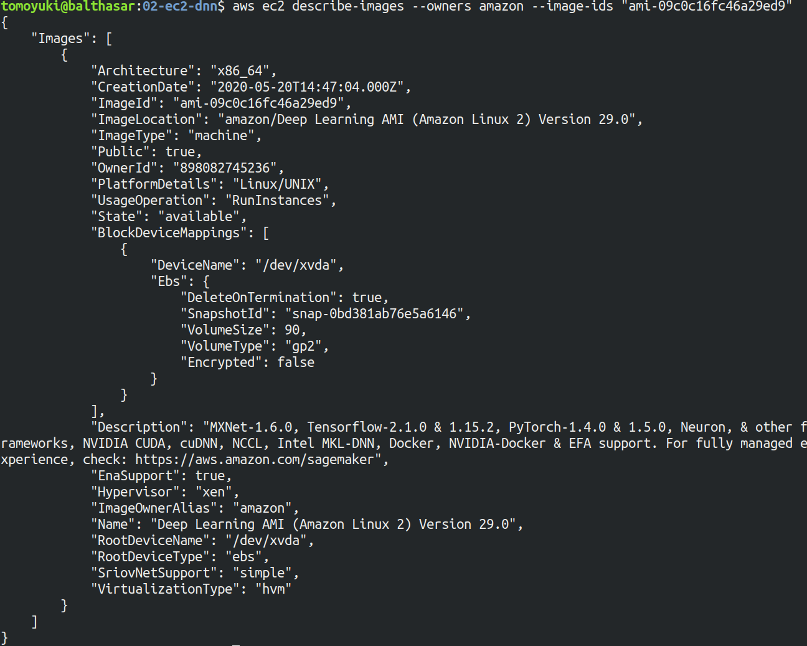

[figure_title](#handson_02_ami-info) のような出力が得られるはずである．得られた出力から，この DLAMI には PyTorch のバージョン 1.4.0 と 1.5.0 がインストールされていることがわかる． この DLAMI を使って，早速ディープラーニングの計算を実行してみよう．

DLAMI には具体的には何がインストールされているのだろうか？ 興味のある読者のために，簡単な解説をしよう (参考: [公式ドキュメンテーション "What Is the AWS Deep Learning AMI?"](https://docs.aws.amazon.com/dlami/latest/devguide/what-is-dlami.html))．

最も low-level なレイヤーとしては， GPU ドライバー がインストールされている． GPU ドライバーなしには OS は GPU とコマンドのやり取りをすることができない． 次のレイヤーが [CUDA](https://developer.nvidia.com/about-cuda) と [cuDNN](https://developer.nvidia.com/cudnn) である． CUDA は， NVIDIA 社が開発した， GPU 上で汎用コンピューティングを行うための言語であり， C++ 言語を拡張したシンタックスを備える． cuDNN は CUDA で書かれたディープラーニングのライブラリであり，n 次元の畳み込みなどの演算が実装されている． ここまでが， "Base" とよばれるタイプの DLAMI の中身である．

これに加えて， "Conda" とよばれるタイプには， "Base" のプログラム基盤の上に， `TensorFlow` や `PyTorch` などのライブラリがインストールされている． さらに， [Anaconda](https://docs.conda.io/projects/conda/en/latest/index.html) による仮想環境を使うことによって， `TensorFlow` の環境・ `PyTorch` の環境・ `MxNet` の環境など，フレームワークを簡単に切り替えることができる (これについては，後のハンズオンで触れる)． また， Jupyter Notebook もインストール済みである．

## スタックのデプロイ

スタックの中身が理解できたところで，早速スタックをデプロイしてみよう．

デプロイの手順は，ハンズオン 1 とほとんど共通である． ここでは，コマンドのみ列挙する (`#` で始まる行はコメントである)． それぞれのコマンドの意味を忘れてしまった場合は，ハンズオン 1 に戻って復習していただきたい． シークレットキーの設定も忘れずに ([???](#aws_cli_install))．

```shell
# プロジェクトのディレクトリに移動
$ cd handson/mnist

# venv を作成し，依存ライブラリのインストールを行う
$ python3 -m venv .env
$ source .env/bin/activate
$ pip install -r requirements.txt

# SSH鍵を生成
$ export KEY_NAME="HirakeGoma"
$ aws ec2 create-key-pair --key-name ${KEY_NAME} --query 'KeyMaterial' --output text > ${KEY_NAME}.pem
$ mv HirakeGoma.pem ~/.ssh/
$ chmod 400 ~/.ssh/HirakeGoma.pem

# デプロイを実行
$ cdk deploy -c key_name="HirakeGoma"
```

ハンズオン 1 で作成した SSH 鍵の削除を行わなかった場合は， SSH 鍵を改めて作成する必要はない． 逆に言うと，同じ名前の SSH がすでに存在する場合は，鍵生成のコマンドはエラーを出力する．

デプロイのコマンドが無事に実行されれば， [figure_title](#handson_02_cdk_output) のような出力が得られるはずである．AWS により割り振られた IP アドレス (`InstancePublicIp` に続く文字列) をメモしておこう．

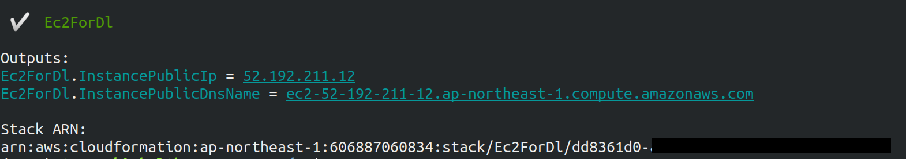

## ログイン

早速，デプロイしたインスタンスに SSH でログインしてみよう． ここでは，この後で使う Jupyter Notebook に接続するため，**ポートフォワーディング (port forwarding)** のオプション (`-L`) をつけてログインする．

```shell
$ ssh -i ~/.ssh/HirakeGoma.pem -L localhost:8931:localhost:8888 ec2-user@<IP address>
```

ポートフォワーディングとは，クライアントマシンの特定のアドレスへの接続を， SSH の暗号化された通信を介して，リモートマシンの特定のアドレスへ転送する，という意味である． このコマンドの `-L localhost:8931:localhost:8888` は，自分のローカルマシンの `localhost:8931` へのアクセスを，リモートサーバーの `localhost:8888` のアドレスに転送せよ，という意味である (`:` につづく数字は TCP/IP ポートの番号を意味している)． リモートサーバーのポート 8888 には，後述する Jupyter Notebook が起動している． したがって，ローカルマシンの `localhost:8931` にアクセスすることで，リモートサーバーの Jupyter Notebook にアクセスすることができるのである ([figure_title](#fig:ssh_port_forwarding))． このような SSH による接続方式を**トンネル接続**とよぶ．

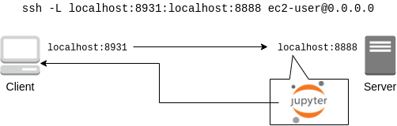

ポートフォワーディングのオプションで，ポートの番号 (`:8931`, `:8888` など) には 1 から 65535 までの任意の整数を指定できる． しかし，たとえば ポート 22 (SSH) やポート 80 (HTTP) など，いくつかすでに使われているポート番号もあることに注意する． また， Jupyter Notebook はデフォルトではポート 8888 番を使用する． したがって，リモート側のポート番号は，8888 を使うのがよい．

SSH ログインコマンドの `<IP address>` 部分は自身のインスタンスの IP アドレスを代入することを忘れずに．

**本書の提供している Docker を使ってデプロイを実行した人へ**

SSH によるログインは， **Docker の外** (すなわちクライアントマシン本体) から行わなければならない． なぜなら，Jupyter を開くウェブブラウザは Docker の外にあるからである．

その際，秘密鍵を Docker の外にもってこなければならない． 手っ取り早い方法は， `cat ~/.ssh/HirakeGoma` と打って，出力結果をコピーしてホストマシンのファイルに書き込む方法である． あるいは `-v` オプションをつけて，ファイルシステムをマウントしてもよい (詳しくは [Docker 公式ドキュメンテーション "Use volumes"](https://docs.docker.com/storage/volumes/) を参照)．

SSH によるログインができたら，早速， GPU の状態を確認してみよう． 次のコマンドを実行する．

```shell
$ nvidia-smi
```

[figure_title](#handson_02_nvidia-smi) のような出力が得られるはずである． 出力を見ると， Tesla T4 型の GPU が 1 台搭載されていることが確認できる． その他，GPU Driver や CUDA のバージョン， GPU の負荷・メモリー使用率などの情報を確認することができる．

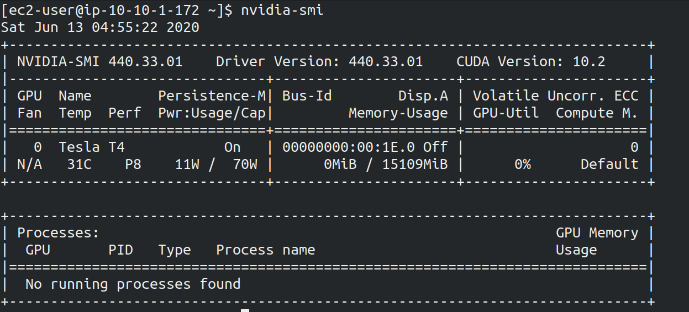

## Jupyter Notebook の起動

[Jupyter Notebook](https://jupyter.org/) とは，インタラクティブに Python のプログラムを書いたり実行したりするためのツールである． Jupyter は GUI としてウェブブラウザを介してアクセスする形式をとっており，まるでノートを書くように，プロットやテーブルのデータも美しく表示することができる ([figure_title](#handson_02_welcome_jupyter))． Python に慣れている読者は，きっと一度は使ったことがあるだろう．

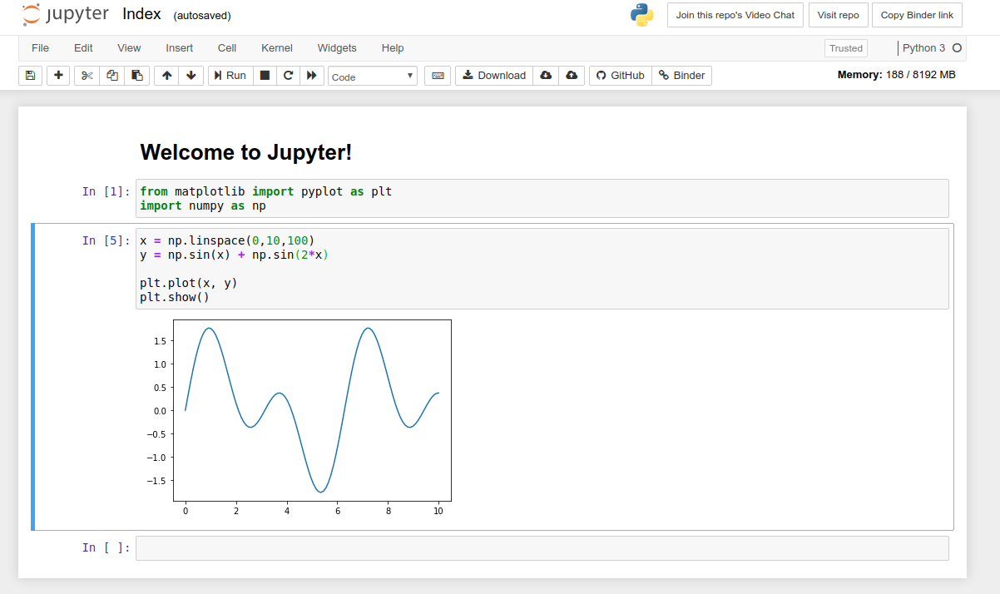

このハンズオンでは， Jupyter Notebook を使ってディープラーニングのプログラムをインタラクティブに実行していく． DLAMI には既に Jupyter がインストールされているので，特段の設定なしに使い始めることができる．

早速， Jupyter を起動しよう． SSH でログインした先の EC2 インスタンスで，次のコマンドを実行すればよい．

```shell
$ cd ~ # go to home directory
$ jupyter notebook
```

このコマンドを実行すると， [figure_title](#handson_02_jupyter_launch) のような出力が確認できるだろう． この出力から，Jupyter のサーバーが EC2 インスタンスの `localhost:8888` というアドレスに起動していることがわかる． また， `localhost:8888` に続く `?token=XXXX` は，アクセスに使うための一時的なトークンである．

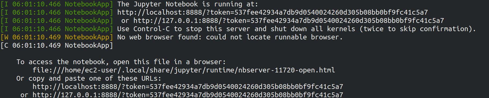

Jupyter Notebook を初回に起動するときは，起動に数分程度の時間がかかることがある． ほかの動作も起動直後は遅く，いくつかプログラムを走らせていくうちに俊敏に反応するようになってくる． これは， AWS の GPU 搭載型仮想マシンの運用方法に起因する現象だと考えられる．

先ほど，ポートフォワーディングのオプションをつけて SSH 接続をしているので， Jupyter の起動している `localhost:8888` には，ローカルマシンの `localhost:8931` からアクセスすることができる． したがって，ローカルマシンから Jupyter にアクセスするには，ウェブブラウザ (Chrome, FireFox など)から次のアドレスにアクセスすれば良い．

http://localhost:8931/?token=XXXX&lt;/programlisting&gt;

`?token=XXXX` の部分は，上で Jupyter を起動したときに発行されたトークンの値に置き換える．

上のアドレスにアクセスすると， Jupyter のホーム画面が起動するはずである ([figure_title](#handson_02_jupyter_home))． これで， Jupyter の準備が整った！

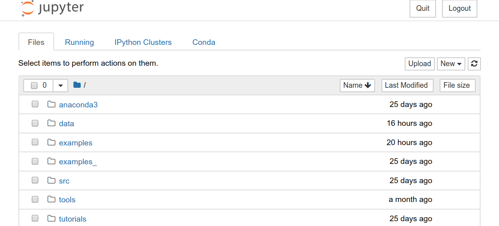

Jupyter Notebook の使い方 (超簡易版)

-   `Shift` + `Enter`: セルを実行

-   `Esc`: **Command mode** に遷移

-   メニューバーの "+" ボタン または Command mode で `A` ⇒ セルを追加

-   メニューバーの "ハサミ" ボタン または Command mode で `X` ⇒ セルを削除

ショートカットの一覧などは [Ventsislav Yordanov 氏によるブログ](https://towardsdatascience.com/jypyter-notebook-shortcuts-bf0101a98330) が参考になる．

## PyTorch はじめの一歩

[PyTorch](https://pytorch.org/) は Facebook AI Research LAB (FAIR) が中心となって開発を進めている，オープンソースのディープラーニングのライブラリである． PyTorch は 有名な例で言えば Tesla 社の自動運転プロジェクトなどで使用されており，執筆時点において最も人気の高いディープラーニングライブラリの一つである． 本ハンズオンでは， PyTorch を使ってディープラーニングの実践を行う．

PyTorch の歴史のお話

Facebook は PyTorch のほかに Caffe2 とよばれるディープラーニングのフレームワークを開発していた (初代 Caffe は UC Berkley の博士課程学生だった Yangqing Jia によって創られた)． Caffe2 は 2018 年に PyTorch プロジェクトに合併された．

また，2019 年 12 月，日本の Preferred Networks 社が開発していた [Chainer](https://chainer.org/) も開発を終了し，PyTorch の開発チームと協業していくことが発表された (詳しくは [プレスリリース](https://chainer.org/announcement/2019/12/05/released-v7-ja.html) を参照)． PyTorch には，開発統合前から Chainer からインスパイアされた API がいくつもあり， Chainer の DNA は今も PyTorch に引き継がれているのである…!

本格的なディープラーニングの計算に移る前に， PyTorch ライブラリを使って， GPU で計算を行うとはどういうものか，その入り口に触れてみよう．

まずは，新しいノートブックを作成する． Jupyter のホーム画面の右上の "New" を押し，"conda_pytorch_p36" という環境を選択したうえで，新規ノートブックを作成する ([figure_title](#handson_02_jupyeter_new))． "conda_pytorch_p36" の仮想環境には， PyTorch がインストール済みである．

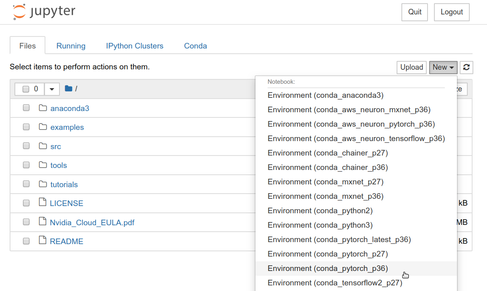

ここでは，次のようなプログラムを書いて，実行していく． ([figure_title](#handson_02_jupyeter_pytorch))．

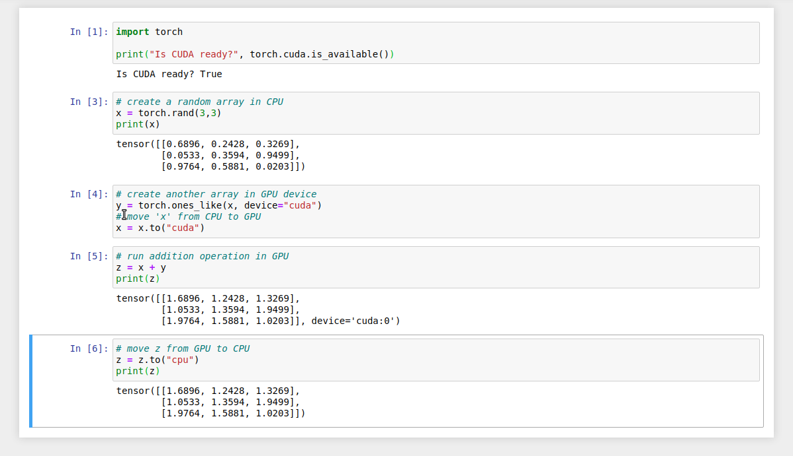

まずは， PyTorch をインポートする．さらに， GPU が使える環境にあるか，確認する．

```python
import torch
print("Is CUDA ready?", torch.cuda.is_available())
```

出力:

Is CUDA ready? True&lt;/programlisting&gt;

次に，3x3 のランダムな行列を **CPU** 上に作ってみよう．

```python
x = torch.rand(3,3)
print(x)
```

出力:

tensor(\[\[0.6896, 0.2428, 0.3269\], \[0.0533, 0.3594, 0.9499\], \[0.9764, 0.5881, 0.0203\]\])&lt;/programlisting&gt;

次に，行列を **GPU** 上に作成する．

```python
y = torch.ones_like(x, device="cuda")
x = x.to("cuda")
```

そして，行列 `x` と `y` の加算を，**GPU 上で実行する**．

```python
z = x + y
print(z)
```

出力:

tensor(\[\[1.6896, 1.2428, 1.3269\], \[1.0533, 1.3594, 1.9499\], \[1.9764, 1.5881, 1.0203\]\], device='cuda:0')&lt;/programlisting&gt;

最後に， GPU 上にある行列を， CPU に戻す．

```python
z = z.to("cpu")
print(z)
```

出力:

tensor(\[\[1.6896, 1.2428, 1.3269\], \[1.0533, 1.3594, 1.9499\], \[1.9764, 1.5881, 1.0203\]\])&lt;/programlisting&gt;

以上の例は， GPU を使った計算の初歩の初歩であるが，雰囲気はつかめただろうか？ CPU と GPU で明示的にデータを交換するのが肝である． この例はたった 3x3 の行列の足し算なので， GPU を使う意味はまったくないが，これが数千，数万のサイズの行列になったとき， GPU は格段の威力を発揮する．

完成した Jupyter Notebook は [/handson/mnist/pytorch/pytorch_get_started.ipynb](https://github.com/tomomano/learn-aws-by-coding/blob/main/handson/mnist/pytorch/pytorch_get_started.ipynb) にある． Jupyter の画面右上の "Upload" からこのファイルをアップロードして，コードを走らせることが可能である．

しなしながら，勉強のときにはコードはすべて自分の手で打つことが，記憶に残りやすくより効果的である，というのが筆者の意見である．

実際にベンチマークを取ることで GPU と CPU の速度を比較をしてみよう． 実行時間を計測するツールとして， Jupyter の提供する [%time](https://ipython.readthedocs.io/en/stable/interactive/magics.html) マジックコマンドを利用する．

まずは CPU を使用して，10000x10000 の行列の行列積を計算した場合の速度を測ってみよう． 先ほどのノートブックの続きに，次のコードを実行する．

```python
s = 10000
device = "cpu"
x = torch.rand(s, s, device=device, dtype=torch.float32)
y = torch.rand(s, s, device=device, dtype=torch.float32)

%time z = torch.matmul(x,y)
```

出力は以下のようなものが得られるだろう． これは，行列積の計算に実時間で 5.8 秒かかったことを意味する (実行のたびに計測される時間はばらつくことに留意)．

CPU times: user 11.5 s, sys: 140 ms, total: 11.6 s Wall time: 5.8 s&lt;/programlisting&gt;

次に， GPU を使用して，同じ演算を行った場合の速度を計測しよう．

```python
s = 10000
device = "cuda"
x = torch.rand(s, s, device=device, dtype=torch.float32)
y = torch.rand(s, s, device=device, dtype=torch.float32)
torch.cuda.synchronize()

%time z = torch.matmul(x,y); torch.cuda.synchronize()
```

出力は以下のようなものになるだろう． GPU では 553 ミリ秒 で計算を終えることができた！

CPU times: user 334 ms, sys: 220 ms, total: 554 ms Wall time: 553 ms&lt;/programlisting&gt;

PyTorch において， GPU での演算は asynchronous (非同期) で実行される． その理由で，上のベンチマークコードでは， `torch.cuda.synchronize()` というステートメントを埋め込んである．

このベンチマークでは， `dtype=torch.float32` と指定することで，32bit の浮動小数点型を用いている． ディープラーニングの学習および推論の計算には，32bit 型，場合によっては 16bit 型が使われるのが一般的である． これの主な理由として，教師データやミニバッチに起因するノイズが，浮動小数点の精度よりも大きいことがあげられる． 32bit/16bit を採用することで，メモリー消費を抑えたり，計算速度の向上が達成できる．

上記のベンチマークから，GPU を用いることで，**約 10 倍のスピードアップ**を実現することができた． スピードアップの性能は，演算の種類や行列のサイズに依存する． 行列積は，そのなかでも最も速度向上が見込まれる演算の一つである．

## 実践ディープラーニング! MNIST 手書き数字認識タスク

ここまで，AWS 上でディープラーニングの計算をするための概念や前提知識をながながと説明してきたが，ついにここからディープラーニングの計算を実際に走らせてみる．

ここでは，機械学習のタスクで最も初歩的かつ有名な **MNIST データセットを使った数字認識**を扱う ([figure_title](#handson_02_mnist_examples))． これは，0 から 9 までの手書きの数字の画像が与えられ，その数字が何の数字なのかを当てる，というシンプルなタスクである．

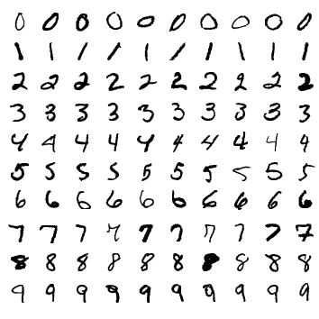

今回は， MNIST 文字認識タスクを，**畳み込みニューラルネットワーク (Convolutional Neural Network; CNN)** を使って解く． ソースコードは [/handson/minist/pytorch/](https://github.com/tomomano/learn-aws-by-coding-source-code/tree/main/handson/mnist/pytorch) にある `mnist.ipynb` と `simple_mnist.py` である． なお，このプログラムは， [PyTorch の公式 Example Project 集](https://github.com/pytorch/examples/tree/master/mnist) を参考に，多少の改変を行ったものである．

まずは，カスタムのクラスや関数が定義された `simple_mnist.py` をアップロードしよう ([figure_title](#handson_02_jupyter_upload))． 画面右上の "Upload" ボタンをクリックし，ファイルを選択することでアップロードができる． この Python プログラムの中に，CNN のモデルや，学習の各イテレーションにおけるパラメータの更新などが記述されている． 今回はこの中身を説明することはしないが，興味のある読者は自身でソースコードを読んでみるとよい．


`simple_mnist.py` をアップロードできたら，次に新しい notebook を作成しよう． "conda_pytorch_p36" の環境を選択することを忘れずに．

新しいノートブックが起動したら，まずは必要なライブラリをインポートしよう．

```python
import torch
import torch.optim as optim
import torchvision
from torchvision import datasets, transforms
from matplotlib import pyplot as plt

# custom functions and classes
from simple_mnist import Model, train, evaluate
```

[torchvision](https://pytorch.org/docs/stable/torchvision/index.html) パッケージには，MNIST データセットをロードするなどの便利な関数が含まれている． また，今回のハンズオンで使うカスタムのクラス・関数 (`Model`, `train`, `evaluate`) のインポートを行っている．

次に，MNIST テストデータをダウンロードしよう． 同時に，画像データの輝度の正規化も行っている．

```python
transf = transforms.Compose([transforms.ToTensor(),
                             transforms.Normalize((0.1307,), (0.3081,))])

trainset = datasets.MNIST(root='./data', train=True, download=True, transform=transf)
trainloader = torch.utils.data.DataLoader(trainset, batch_size=64, shuffle=True)

testset = datasets.MNIST(root='./data', train=False, download=True, transform=transf)
testloader = torch.utils.data.DataLoader(testset, batch_size=1000, shuffle=True)
```

今回扱う MNIST データは 28x28 ピクセルの正方形の画像(モノクロ)と，それぞれのラベル(0 - 9 の数字)の組で構成されている． いくつかのデータを抽出して，可視化してみよう． [figure_title](#handson_02_mnist_ground_truth) のような出力が得られるはずである．

```python
examples = iter(testloader)
example_data, example_targets = examples.next()

print("Example data size:", example_data.shape)

fig = plt.figure(figsize=(10,4))
for i in range(10):
    plt.subplot(2,5,i+1)
    plt.tight_layout()
    plt.imshow(example_data[i][0], cmap='gray', interpolation='none')
    plt.title("Ground Truth: {}".format(example_targets[i]))
    plt.xticks([])
    plt.yticks([])
plt.show()
```

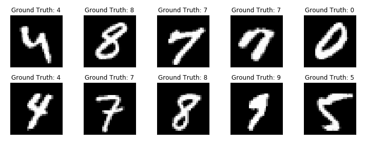

次に， CNN のモデルを定義する．

```python
model = Model()
model.to("cuda") # load to GPU
```

今回使う `Model` は `simple_mnist.py` の中で定義されている． このモデルは，[figure_title](#handson_02_cnn_architecture) に示したような，２層の畳み込み層と 2 層の全結合層からなるネットワークである． 出力層 (output layer) には Softmax 関数を使用し，損失関数 (Loss function) には 負の対数尤度関数 (Negative log likelyhood; NLL) を使用している．

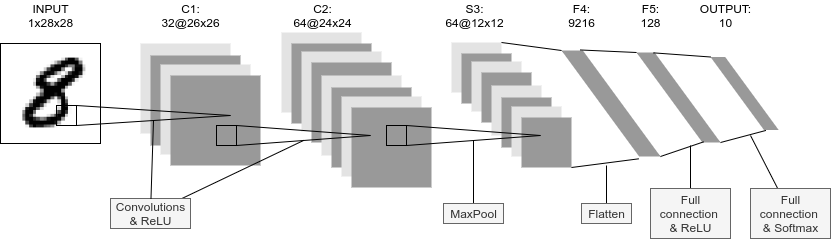

続いて， CNN のパラメータを更新する最適化アルゴリズムを定義する． ここでは， **確率的勾配降下法 (Stochastic Gradient Descent; SGD)** を使用している．

```python
optimizer = optim.SGD(model.parameters(), lr=0.01, momentum=0.5)
```

これで，準備が整った． CNN の学習ループを開始しよう!

```python
train_losses = []
for epoch in range(5):
    losses = train(model, trainloader, optimizer, epoch)
    train_losses = train_losses + losses
    test_loss, test_accuracy = evaluate(model, testloader)
    print(f"\nTest set: Average loss: {test_loss:.4f}, Accuracy: {test_accuracy:.1f}%\n")

plt.figure(figsize=(7,5))
plt.plot(train_losses)
plt.xlabel("Iterations")
plt.ylabel("Train loss")
plt.show()
```

ここでは 5 エポック分の学習を行っている． GPU を使えば，これくらいの計算であれば 1 分程度で完了するだろう．

出力として， [figure_title](#handson_02_train_loss) のようなプロットが得られるはずである． イテレーションを重ねるにつれて，損失関数 (Loss function) の値が減少している (=精度が向上している) ことがわかる．

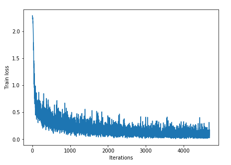

出力にはテキスト形式で各エポック終了後のテストデータに対する精度も表示されている． 最終的には 98% 以上の極めて高い精度を実現できていることが確認できるだろう ([figure_title](#handson_02_mnist_final_score))．


学習した CNN の推論結果を可視化してみよう． 次のコードを実行することで， [figure_title](#handson_02_mnist_mnist_prediction) のような出力が得られるだろう． この図で，下段右から二番目は，"1"に近い見た目をしているが，きちんと"9"と推論できている． なかなか賢い CNN を作り出すことができたようだ！

```python
model.eval()

with torch.no_grad():
    output = model(example_data.to("cuda"))

fig = plt.figure(figsize=(10,4))
for i in range(10):
    plt.subplot(2,5,i+1)
    plt.tight_layout()
    plt.imshow(example_data[i][0], cmap='gray', interpolation='none')
    plt.title("Prediction: {}".format(output.data.max(1, keepdim=True)[1][i].item()))
    plt.xticks([])
    plt.yticks([])
plt.show()
```

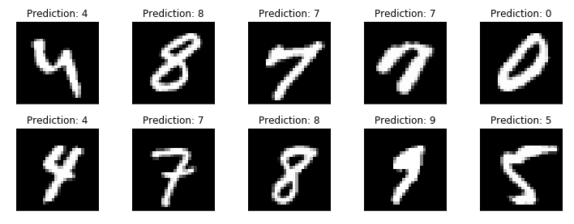

最後に，学習したニューラルネットワークのパラメータを `mnist_cnn.pt` というファイル名で保存しておこう． これで，将来いつでも今回学習したモデルを再現し，別の実験に使用することができる．

```python
torch.save(model.state_dict(), "mnist_cnn.pt")
```

以上が， AWS クラウドの仮想サーバーを立ち上げ，最初のディープラーニングの計算を行う一連の流れである． MNIST 文字認識のタスクを行うニューラルネットを，クラウド上の GPU を使って高速に学習させ，現実的な問題を一つ解くことができたのである． 興味のある読者は，今回のハンズオンを雛形に，自分の所望の計算を走らせてみるとよいだろう．

## スタックの削除

これにて，ハンズオン第二回の内容はすべて説明した． クラウドの利用料金を最小化するため，使い終わった EC2 インスタンスはすぐさま削除しよう．

ハンズオン第一回と同様に， AWS の CloudFormation コンソールか， AWS CLI により削除を実行する (詳細は [???](#handson_01_delete_stack) 参照)．

```shell
$ cdk destroy
```

**スタックの削除は各自で必ず行うこと！** 行わなかった場合，EC2 インスタンスの料金が発生し続けることになる！ `g4dn.xlarge` は $0.71 / hour の料金設定なので，一日起動しつづけると約$17 の請求が発生することになる！

**AWS のバジェットアラート**

AWS の初心者が (あるいは経験者も) しばしば陥る失敗が，インスタンスの停止忘れなどで無駄なリソースがクラウドで放置されてしまい，巨大な額の請求が届く，というミスだ． 特に，開発を行っている間はこのような事態は起こりうるものだと思って，備えておかなければならない． このような事態を未然に防ぐため， AWS Budgets という機能が無料で提供されている． AWS Budgets を利用することで，月の利用金額がある閾値を超えた場合にユーザーにメールが送信される，などのアラートを設定することができる． 詳細な手順は [AWS の公式ブログ "Getting Started with AWS Budgets"](https://aws.amazon.com/blogs/aws-cost-management/getting-started-with-aws-budgets/) を参照のこと． 本書の読者も，ぜひこのタイミングでアラートを設定しておくことを推奨する．
