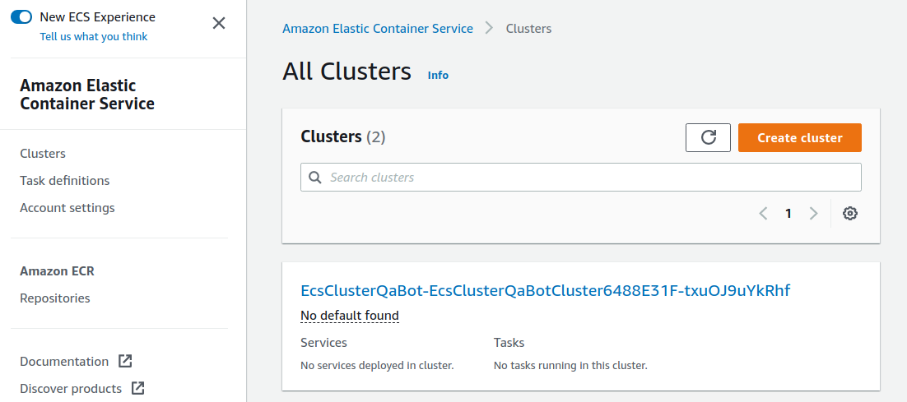
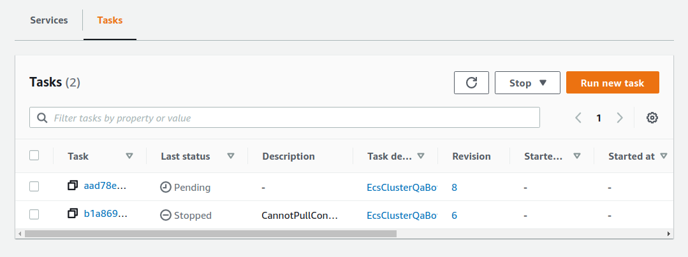
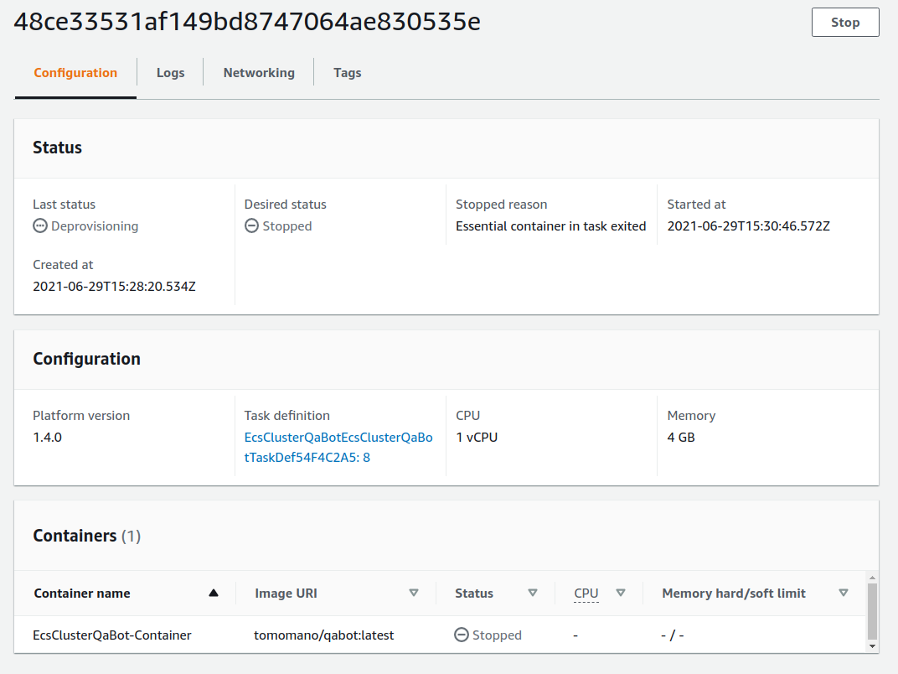

# Hands-on \#3: AWS で自動質問回答ボットを走らせる

ハンズオン第三回では， Docker と ECS を駆使した機械学習アプリケーションを実装しよう． 具体的には，深層学習による自然言語処理を行うことで，クライアントから与えられた文章題に対して回答を生成する，自動 Question & Answering ボットを作成しよう． ECS を利用することで，ジョブの数によって動的にインスタンスの数を制御し，並列にタスクを実行するようなシステムを構築しよう．

通常の機械学習のワークフローでは，モデルの訓練 ⇒ 推論 (データへの適用) が基本的な流れである． しかしながら， GPU 搭載型の EC2 クラスターを使ったモデルの訓練はやや難易度が高いため，次章 ([???](#sec_aws_batch)) で取り扱う． 本章は，クラウド上でのクラスターの構築・タスクの管理などの概念に慣れるため，よりシンプルな実装で実現できる Fargate クラスターを用いた推論計算の並列化を紹介する．

## Fargate

ハンズオンに入っていく前に， **Fargate** という AWS の機能を知っておく必要がある ([figure_title](#fig:fargate_logo))．


ECS の概要を示した [???](#ecs_overview) をもう一度見てみよう． この図で， ECS の管理下にあるクラスターが示されているが，このクラスターの中で計算を行う実体としては二つの選択肢がある． **EC2 あるいは Fargate** のいずれかである． EC2 を用いた場合は，先の章 ([???](#sec_first_ec2), [???](#sec_jupyter_and_deep_learning)) で説明したような流れでインスタンスが起動し，計算が実行される． しかし， EC2 を用いた計算機クラスターの作成・管理は技術的な難易度がやや高いので，次章 ([???](#sec_aws_batch)) で説明することにする．

Fargate とは， **ECS での利用に特化**して設計された，**コンテナを使用した計算タスク**を走らせるための仕組みである． 計算を走らせるという点では EC2 と役割は似ているが， Fargate は EC2 インスタンスのような物理的実体はもたない． 物理的実体をもたないというのは，たとえば SSH でログインすることは基本的に想定されていないし，なにかのソフトウェアをインストールしたりなどの概念も存在しない． Fargate ではすべての計算は Docker コンテナを介して行われる． すなわち， Fargate を利用するには，ユーザーは最初に所望の Docker イメージを指定しておき， Fargate は `docker run` のコマンドを使用することで計算タスクを実行する． Fargate を用いる利点は， Fargate を ECS のクラスターに指定すると，スケーリングなどの操作が簡単な設定・プログラムで構築できる点である．

Fargate では， EC2 と同様に CPU とメモリーのサイズを必要な分だけ指定できる． 執筆時点では， CPU は 0.25 - 4 コア， RAM は 0.5 - 30 GB の間で選択することができる (詳しくは [公式ドキュメンテーション "Amazon ECS on AWS Fargate"](https://docs.aws.amazon.com/AmazonECS/latest/developerguide/AWS_Fargate.html) 参照)． クラスターのスケーリングが容易な分， Fargate では EC2 ほど大きな CPU コア・ RAM 容量を単一インスタンスに付与することができず，また GPU を利用することもできない．

以上が Fargate の概要であったが，くどくど言葉で説明してもなかなかピンとこないだろう． ここからは実際に手を動かしながら， ECS と Fargate を使った並列タスクの処理の仕方を学んでいこう．

厳密には， ECS に付与するクラスターには EC2 と Fargate のハイブリッドを使用することも可能である．

## 準備

ハンズオンのソースコードは GitHub の [handson/qa-bot](https://github.com/tomomano/learn-aws-by-coding/tree/main/handson/qa-bot) にある．

本ハンズオンの実行には，第一回ハンズオンで説明した準備 ([???](#handson_01_prep)) が整っていることを前提とする． また， Docker が自身のローカルマシンにインストール済みであることも必要である．

このハンズオンでは 1CPU/4GB RAM の Fargate インスタンスを使用する． 計算の実行には 0.025 $/hour のコストが発生することに注意．

## Transformer を用いた question-answering プログラム

このハンズオンで開発する，自動質問回答システムをより具体的に定義しよう． 次のような文脈 (context) と質問 (question) が与えられた状況を想定する．

```txt
context: Albert Einstein (14 March 1879 – 18 April 1955) was a German-born theoretical physicist who developed the theory of relativity, one of the two pillars of modern physics (alongside quantum mechanics). His work is also known for its influence on the philosophy of science. He is best known to the general public for his mass–energy equivalence formula E = mc2, which has been dubbed \"the world's most famous equation\". He received the 1921 Nobel Prize in Physics \"for his services to theoretical physics, and especially for his discovery of the law of the photoelectric effect\", a pivotal step in the development of quantum theory.

question: In what year did Einstein win the Nobel prize?
```

今回作成する自動回答システムは，このような問題に対して， context に含まれる文字列から正解となる言葉を見つけ出すものとする． 上の問題では，次のような回答を返すべきである．

    answer: 1921

人間にとっては，このような文章を理解することは容易であるが，コンピュータにそれを解かせるのは難しいことは容易に想像ができるだろう． しかし，近年の深層学習を使った自然言語処理の進歩は著しく，上で示したような例題などは極めて高い正答率で回答できるモデルを作ることができる．

今回は， [huggingface/transformers](https://github.com/huggingface/transformers) で公開されている学習済みの言語モデルを利用することで，上で定義した問題を解く Q&A ボットを作る． この Q&A ボットは [Transformer](<https://en.wikipedia.org/wiki/Transformer_(machine_learning_model)>) とよばれるモデルを使った自然言語処理に支えられえている ([figure_title](#transformer_architecture))． このプログラムを， Docker にパッケージしたものが [著者の Docker Hub リポジトリ](https://hub.docker.com/repository/docker/tomomano/qabot) に用意してある． クラウドの設計に入る前に，まずはこのプログラムを単体で動かしてみよう．

)](imgs/transformer.png)

なお，今回は学習済みのモデルを用いているので，私達が行うのは与えられた入力をモデルに投入して予測を行う (推論) のみである． 推論の演算は， CPU だけでも十分高速に行うことができるので，コストの削減と，実装をシンプルにする目的で，このハンズオンでは GPU は利用しない． 一般的に， ニューラルネットは学習のほうが圧倒的に計算コストが大きく，そのような場合に GPU はより威力を発揮する．

次のコマンドで，今回使う Docker image を ローカルにダウンロード (pull) してこよう．

```shell
$ docker pull tomomano/qabot:latest
```

pull できたら，早速この Docker に質問を投げかけてみよう． まずは context と question をコマンドラインの変数として定義する．

```shell
$ context="Albert Einstein (14 March 1879 – 18 April 1955) was a German-born theoretical physicist who developed the theory of relativity, one of the two pillars of modern physics (alongside quantum mechanics). His work is also known for its influence on the philosophy of science. He is best known to the general public for his mass–energy equivalence formula E = mc2, which has been dubbed the world's most famous equation. He received the 1921 Nobel Prize in Physics for his services to theoretical physics, and especially for his discovery of the law of the photoelectric effect, a pivotal step in the development of quantum theory."
$ question="In what year did Einstein win the Nobel prize ?"
```

そうしたら，次のコマンドによってコンテナを実行する．

```shell
$ docker run tomomano/qabot "${context}" "${question}" foo --no_save
```

今回用意した Docker image は，第一引数に context となる文字列を，第二引数に question に相当する文字列を受けつける． 第三引数，第四引数については，クラウドに展開するときの実装上の都合なので，いまは気にしなくてよい．

このコマンドを実行すると，次のような出力が得られるはずである．

```json
{ "score": 0.9881729286683587, "start": 437, "end": 441, "answer": "1921" }
```

"score" は正解の自信度を表す数字で， \[0,1\] の範囲で与えられる． "start", "end" は， context 中の何文字目が正解に相当するかを示しており， "answer" が正解と予測された文字列である． 1921 年という，正しい答えが返ってきていることに注目してほしい．

もう少し難しい質問を投げかけてみよう．

```shell
$ question="Why did Einstein win the Nobel prize ?"
$ docker run tomomano/qabot "${context}" "${question}" foo --no_save
```

出力：

```json
{ "score": 0.5235594527494207, "start": 470, "end": 506, "answer": "his services to theoretical physics," }
```

今度は， score が 0.52 と，少し自信がないようだが，それでも正しい答えにたどりつけていることがわかる．

このように， 深層学習に支えられた言語モデルを用いることで，実用にも役に立ちそうな Q&A ボットを実現できていることがわかる． 以降では，このプログラムをクラウドに展開することで，大量の質問に自動で対応できるようなシステムを設計していく．

今回使用する Question & Answering システムには， DistilBERT という Transformer を基にした言語モデルが用いられている． 興味のある読者は， [原著論文](https://arxiv.org/abs/1910.01108) を参照してもらいたい． また， huggingface/transformers による DistilBert の実装のドキュメンテーションは [公式ドキュメンテーション](https://huggingface.co/transformers/model_doc/distilbert.html) を参照のこと．

今回提供する Q-A ボットの Docker のソースコードは <https://github.com/tomomano/learn-aws-by-coding/blob/main/handson/qa-bot/docker/Dockerfile> にある．

## アプリケーションの説明

このハンズオンで作成するアプリケーションの概要を [figure_title](#handson_03_architecture) に示す．


簡単にまとめると，以下のような設計である．

-   クライアントは，質問を AWS 上のアプリケーションに送信する．

-   質問のタスクは ECS によって処理される．

-   ECS は， Docker Hub から，イメージをダウンロードする．

-   次に，ECS はクラスター内に新たな Fargate インスタンスを立ち上げ，ダウンロードされた Docker イメージをこの新規インスタンスに配置する．

    -   このとき，一つの質問に対し一つの Fargate インスタンスを立ち上げることで，複数の質問を並列的に処理できるようにする．

-   ジョブが実行される．

-   ジョブの実行結果 (質問への回答) は， データベース (DynamoDB) に書き込まれる．

-   最後に，クライアントは DynamoDB から質問への回答を読み取る．

それでは，プログラムのソースコードを見てみよう ([handson/qa-bot/app.py](https://github.com/tomomano/learn-aws-by-coding/blob/main/handson/qa-bot/app.py))．

```python
class EcsClusterQaBot(core.Stack):

    def __init__(self, scope: core.App, name: str, **kwargs) -> None:
        super().__init__(scope, name, **kwargs)

        #
        # dynamoDB table to store questions and answers
        table = dynamodb.Table(
            self, "EcsClusterQaBot-Table",
            partition_key=dynamodb.Attribute(
                name="item_id", type=dynamodb.AttributeType.STRING
            ),
            billing_mode=dynamodb.BillingMode.PAY_PER_REQUEST,
            removal_policy=core.RemovalPolicy.DESTROY
        )

        #
        vpc = ec2.Vpc(
            self, "EcsClusterQaBot-Vpc",
            max_azs=1,
        )

        #
        cluster = ecs.Cluster(
            self, "EcsClusterQaBot-Cluster",
            vpc=vpc,
        )

        #
        taskdef = ecs.FargateTaskDefinition(
            self, "EcsClusterQaBot-TaskDef",
            cpu=1024, # 1 CPU
            memory_limit_mib=4096, # 4GB RAM
        )

        # grant permissions
        table.grant_read_write_data(taskdef.task_role)
        taskdef.add_to_task_role_policy(
            iam.PolicyStatement(
                effect=iam.Effect.ALLOW,
                resources=["*"],
                actions=["ssm:GetParameter"]
            )
        )

        #
        container = taskdef.add_container(
            "EcsClusterQaBot-Container",
            image=ecs.ContainerImage.from_registry(
                "tomomano/qabot:latest"
            ),
        )
```

-   ここでは，回答の結果を書き込むためのデータベースを用意している． DynamoDB については，サーバーレスアーキテクチャの章で扱うので，今は気にしなくてよい．

-   ここでは，ハンズオン \#1, \#2 で行ったのと同様に， VPC を定義している．

-   ここで， ECS のクラスター (cluster) を定義している． クラスターとは，仮想サーバーのプールのことであり，クラスターの中に複数の仮想インスタンスを配置する．

-   ここで，実行するタスクを定義している (task definition)．

-   ここで， タスクの実行で使用する Docker イメージを定義している．

### ECS と Fargate

ECS と Fargate の部分について，コードをくわしく見てみよう．

```python
cluster = ecs.Cluster(
    self, "EcsClusterQaBot-Cluster",
    vpc=vpc,
)

taskdef = ecs.FargateTaskDefinition(
    self, "EcsClusterQaBot-TaskDef",
    cpu=1024, # 1 CPU
    memory_limit_mib=4096, # 4GB RAM
)

container = taskdef.add_container(
    "EcsClusterQaBot-Container",
    image=ecs.ContainerImage.from_registry(
        "tomomano/qabot:latest"
    ),
)
```

`cluster =` の箇所で，空の ECS クラスターを定義している．

次に， `taskdef=ecs.FargateTaskDefinition` の箇所で， Fargate インスタンスを使ったタスクを定義しており，とくにここでは 1 CPU, 4GB RAM というマシンスペックを指定している． また，このようにして定義されたタスクは，デフォルトで 1 タスクにつき 1 インスタンスが使用される．

最後に， `container =` の箇所で，タスクの実行で使用する Docker image を定義している． ここでは， Docker Hub に置いてある image をダウンロードしてくるよう指定している．

このようにわずか数行のコードであるが，これだけで前述したような，タスクのスケジューリングなどが自動で実行される．

このコードで `cpu=1024` と指定されているのに注目してほしい． これは CPU ユニットと呼ばれる数で， 以下の換算表に従って仮想 CPU (virtual CPU; vCPU) が割り当てられる． 1024 が 1 CPU に相当する． 0.25 や 0.5 vCPU などの数字は，それぞれ実効的に 1/4, 1/2 の CPU 時間が割り当てられることを意味する． また， CPU ユニットによって使用できるメモリー量も変わってくる． たとえば， 1024 CPU ユニットを選択した場合は， 2 から 8 GB の範囲でのみメモリー量を指定することができる． 最新の情報は [公式ドキュメンテーション "Amazon ECS on AWS Fargate"](https://docs.aws.amazon.com/AmazonECS/latest/developerguide/AWS_Fargate.html) を参照のこと．

<table><caption>CPU　ユニットと 指定可能なメモリー量の換算表</caption><colgroup><col style="width: 50%" /><col style="width: 50%" /></colgroup><tbody><tr class="odd"><td><p>CPU ユニット</p></td><td><p>メモリーの値</p></td></tr><tr class="even"><td><p>256 (.25 vCPU)</p></td><td><p>0.5 GB, 1 GB, 2 GB</p></td></tr><tr class="odd"><td><p>512 (.5 vCPU)</p></td><td><p>1 GB, 2 GB, 3 GB, 4 GB</p></td></tr><tr class="even"><td><p>1024 (1 vCPU)</p></td><td><p>2 GB, 3 GB, 4 GB, 5 GB, 6 GB, 7 GB, 8 GB</p></td></tr><tr class="odd"><td><p>2048 (2 vCPU)</p></td><td><p>Between 4 GB and 16 GB in 1-GB increments</p></td></tr><tr class="even"><td><p>4096 (4 vCPU)</p></td><td><p>Between 8 GB and 30 GB in 1-GB increments</p></td></tr></tbody></table>

## スタックのデプロイ

スタックの中身が理解できたところで，早速スタックをデプロイしてみよう．

デプロイの手順は，これまでのハンズオンとほとんど共通である． SSH によるログインの必要がないので，むしろ単純なくらいである． ここでは，コマンドのみ列挙する (`#` で始まる行はコメントである)． それぞれの意味を忘れてしまった場合は，ハンズオン 1, 2 に戻って復習していただきたい． シークレットキーの設定も忘れずに ([???](#aws_cli_install))．

```shell
# プロジェクトのディレクトリに移動
$ cd handson/qa-bot

# venv を作成し，依存ライブラリのインストールを行う
$ python3 -m venv .env
$ source .env/bin/activate
$ pip install -r requirements.txt

# デプロイを実行
$ cdk deploy
```

デプロイのコマンドが無事に実行されれば， [figure_title](#handson_03_cdk_output) のような出力が得られるはずである．


AWS コンソールにログインして，デプロイされたスタックの中身を確認してみよう． コンソールから，ECS のページに行くと [figure_title](#handson_03_ecs_console) のような画面が表示されるはずである． `EcsClusterQaBot-XXXX` という名前ついたクラスターを見つけよう．

Cluster というのが，先ほど説明したとおり，複数の仮想インスタンスを束ねる一つの単位である． [figure_title](#handson_03_ecs_console) で， FARGATE という文字の下に `0 Running tasks`, `0 Pending tasks` と表示されていることを確認しよう． この時点では一つもタスクが走っていないので，数字はすべて 0 になっている．



続いて，この画面の左のメニューバーから `Task Definitions` という項目を見つけ，クリックしよう． 移動した先のページで `EcsClusterQaBotEcsClusterQaBotTaskDefXXXX` という項目が見つかるので，開く． 開いた先のページをスクロールすると [figure_title](#handson_03_ecs_task_definition) に示したような情報が見つかるだろう． 使用する CPU ・メモリーの量や， Docker container の実行に関する設定などが，この Task Definition の画面から確認することができる．


## タスクの実行

それでは，質問をデプロイしたクラウドに提出してみよう．

ECS にタスクを投入するのはやや複雑なので，タスクの投入を簡単にするプログラム (`run_task.py`) を用意した ([handson/qa-bot/run_task.py](https://github.com/tomomano/learn-aws-by-coding/blob/main/handson/qa-bot/run_task.py))．

次のようなコマンドで，ECS クラスターに新しい質問を投入することができる．

```shell
$ python run_task.py ask "A giant peach was flowing in the river. She picked it up and brought it home. Later, a healthy baby was born from the peach. She named the baby Momotaro." "What is the name of the baby?"
```

`run_task.py` を実行するには， コマンドラインで AWS の認証情報が設定されていることが前提である．

"ask" の引数に続き，文脈 (context) と質問 (question) を引数として渡している．

このコマンドを実行すると， "Waiting for the task to finish…" と出力が表示され，回答を得るまでしばらく待たされる． この間， AWS では ECS がタスクを受理し，新しい Fargate のインスタンスを起動し， Docker イメージをそのインスタンスに配置する，という一連の処理がなされている． AWS コンソールから，この一連の様子をモニタリングしてみよう．

先ほどの ECS コンソール画面にもどり，クラスターの名前をクリックすることで，クラスターの詳細画面を開く． 次に， "Tasks" という名前のタブがあるので，それを開く ([figure_title](#ecs_task_monitoring))． すると，実行中のタスクの一覧が表示されるだろう．



[figure_title](#ecs_task_monitoring) で見て取れるように， "Last status = Pending" となっていることから，この時点では，タスクを実行する準備をしている段階である，ということがわかる． Fargate のインスタンスを起動し， Docker image を配置するまでおよそ 1-2 分の時間がかかる．

しばらく待つうちに， Status が "RUNNING" に遷移し，計算が始まる． 計算が終わると， Status は "STOPPED" に遷移し， ECS によって Fargate インスタンスは自動的にシャットダウンされる．

[figure_title](#ecs_task_monitoring) の画面から， "Task" の列にあるタスク ID クリックすることで，タスクの詳細画面を開いてみよう ([figure_title](#ecs_task_detail))． "Last status", "Platform version" など，タスクの情報が表示されている． また， "Logs" のタブを開くことで，コンテナの吐き出した実行ログを閲覧することができる．



さて， `run_task.py` を実行したコマンドラインに戻ってきてみると， [figure_title](#ask_question_output) のような出力が得られているはずである． "Momotaro" という正しい回答が返ってきている！


## タスクの同時実行

さて，先ほどはたった一つの質問を投入したわけだが，今回設計したアプリケーションは， ECS と Fargate を使うことで同時にたくさんの質問を処理することができる． 実際に，たくさんの質問を一度に投入してみよう． `run_task.py` に `ask_many` というオプションを付けることで，複数の質問を一度に送信できる． 質問の内容は [handson/qa-bot/problems.json](https://github.com/tomomano/learn-aws-by-coding/blob/main/handson/qa-bot/problems.json) に定義されている．

次のようなコマンドを実行しよう．

```shell
$ python run_task.py ask_many
```

このコマンドを実行した後で，先ほどの ECS コンソールに行き，タスクの一覧を見てみよう ([figure_title](#ecs_many_tasks))． 複数の Fargate インスタンスが起動され，タスクが並列に実行されているのがわかる．


すべてのタスクのステータスが "STOPPED" になったことを確認した上で，質問への回答を取得しよう． それには，次のコマンドを実行する．

```shell
$ python run_task.py list_answers
```

結果として， [figure_title](#ask_many_output) のような出力が得られるだろう． 複雑な文章問題に対し，高い正答率で回答できていることがわかるだろう．


おめでとう！ ここまでついてこれた読者はとても初歩的ながらも，深層学習による言語モデルを使って自動で質問への回答を生成するシステムを創り上げることができた！ それも，数百の質問にも同時に対応できるような，とても高いスケーラビリティーをもったシステムである！ 今回は GUI (Graphical User Interface) を用意することはしなかったが，このシステムに簡単な GUI を追加すればなかなか立派なウェブサービスとして運用できるだろう．

`run_task.py` で質問を投入し続けると，回答を記録しているデータベースにどんどんエントリーが溜まっていく． これらのエントリーをすべて消去するには，次のコマンドを使う．

```shell
$ python run_task.py clear
```

## スタックの削除

これにて，今回のハンズオンは終了である． 最後にスタックを削除しよう．

スタックを削除するには，前回までと同様に， AWS コンソールにログインし CloudFormation の画面から DELETE ボタンをクリックするか，コマンドラインからコマンドを実行する． コマンドラインから行う場合は，次のコマンドを使用する．

```shell
$ cdk destroy
```
