# はじめに!

## 本書の目的・内容

本書は，東京大学計数工学科で 2021 年度 S1/S2 タームに開講されている"システム情報工学特論"の講義資料として作成された．

本書の目的は，クラウドの初心者を対象とし，クラウドの基礎的な知識・概念を解説する． また， Amazon Web Services (以下， AWS) の提供するクラウド環境を実例として，具体的なクラウドの利用方法をハンズオンを通して学ぶ．

とくに，科学・エンジニアリングの学生を対象として，研究などの目的でクラウドを利用するための実践的な手順を紹介する． 知識・理論の説明は最小限に留め，実践を行う中で必要な概念の解説を行う予定である． 読者が今後，研究などでクラウドを利用する際の，足がかりとなれば本書の目的は十分達成されたことになる．

本書は以下のような三部構成になっている．

<table><caption>本書の構成</caption><colgroup><col style="width: 20%" /><col style="width: 40%" /><col style="width: 40%" /></colgroup><thead><tr class="header"><th></th><th>テーマ</th><th>ハンズオン</th></tr></thead><tbody><tr class="odd"><td><p>第一部 (1章-4章)</p></td><td><p>クラウドの基礎</p></td><td><ul><li><p>AWSに自分のサーバーを立ち上げる</p></li></ul></td></tr><tr class="even"><td><p>第二部 (5章-9章)</p></td><td><p>クラウドを活用した機械学習</p></td><td><ul><li><p>AWS と Jupyter を使って始めるディープラーニング</p></li><li><p>スケーラブルな自動質問回答ボットを作る</p></li><li><p>並列化されたハイパーパラメータサーチの実装</p></li></ul></td></tr><tr class="odd"><td><p>第三部 (10章-13章)</p></td><td><p>サーバーレスアーキテクチャ入門</p></td><td><ul><li><p>Lambda, DynamoDB, S3 の演習</p></li><li><p>俳句を投稿する SNS "Bashoutter" を作る</p></li></ul></td></tr></tbody></table>

第一部は，クラウドの基礎となる概念・知識を解説する． セキュリティやネットワークなど，クラウドを利用する上で最低限おさえなければいけないポイントを説明する． ハンズオンでは，はじめての仮想サーバーを AWS に立ち上げる演習を行う．

第二部では，クラウド上で科学計算 (とくに機械学習) を走らせるための入門となる知識・技術を解説する． あわせて， [Docker](https://www.docker.com/) とよばれる仮想計算環境の使用方法を紹介する． 一つ目のハンズオンでは， AWS のクラウドで Jupyter Notebook を起動し簡単な機械学習の計算を走らせる課題を実践する． 二つ目のハンズオンでは，深層学習を用いた自然言語処理により，質問に自動で回答を生成するボットを作成する． 最後に，複数台の GPU インスタンスからなるクラスターを起動し，並列に深層学習のハイパーパラメータサーチを行う方法を紹介する．

第三部では，サーバーレスアーキテクチャとよばれる最新のクラウドのアーキテクチャを紹介する． これは，サーバーの処理能力を負荷に応じてより柔軟に拡大・縮小するための概念であり，それ以前 (Serverful としばしばよばれる) と質的に異なる設計思想をクラウドに導入するものである． ハンズオンでは，サーバーレスクラウドの主要なコンポーネントである Lambda, DynamoDB, S3 の演習を提供する． さらに，サーバーレスの技術を使用して簡単な SNS をクラウド上に作成する．

これらの豊富なハンズオンにより， AWS 上にクラウドシステムを開発するための知識と技術が身につくはずである． いずれのハンズオンも，実用性を重視したものになっており，これらをベースにカスタマイズを施すことで様々な応用が可能である．

## 本書のフィロソフィー

本書のフィロソフィーを一言で表すなら， **"ロケットで宇宙まで飛んでいって一度地球を眺めてみよう！"** である．

どういうことか？

ここでいう"地球"とは，クラウドコンピューティングの全体像のことである． 言うまでもなく，クラウドという技術は非常に広範かつ複雑な概念で，幾多の情報技術・ハードウェア・アルゴリズムが精緻に組み合わさってできた総体である． そして，今日では科学研究から日常のインフラ設備に至るまで，我々の社会の多くの部分がクラウド技術によって支えられている．

ここでいう"ロケット"とはこの講義のことである． この講義では，ロケットに乗って宇宙まで飛び立ち，地球(クラウド)の全体を自身の目で眺めてもらう． その際，ロケットの成り立ちや仕組み (背後にある要素技術やプログラムのソースコード) を深くは問わない． 将来，自分が研究などの目的でクラウドを利用することになった際に，改めて学んでもらえば良い． 本書の目的はむしろ，クラウドの最先端に実際に触れ，そこからどんな景色が見えるか(どんな応用が可能か)を実感してもらうことである．

そのような理由で，本書はクラウドの基礎から応用まで幅広いテーマを取り扱う． 第一部はクラウドの基礎から始め，第二部では一気にレベルアップし機械学習(深層学習)をクラウドで実行する手法を解説する． さらに第三部では，サーバーレス・アーキテクチャというここ数年のうちに確立した全く新しいクラウドの設計について解説する． それぞれで本一冊分以上の内容に相当するものであるが，本書はあえてこれらを一冊にまとめ連続的に俯瞰するという野心的な意図をもって執筆された．

決して楽な搭乗体験ではないかもしれないが，このロケットにしがみついてきてもらえれば，とてもエキサイティングな景色が見られることを約束したい．


## AWS アカウント

本書では，ハンズオン形式で AWS のクラウドを実際に動かす演習を提供する． 自分でハンズオンを実行してみたい読者は，各自で AWS のアカウントの作成をしていただく． AWS のアカウントの作成の仕方は巻末付録 ([AWS アカウントの取得](#sec:create_aws_account)) に簡単に記載したので，必要に応じて参照していただきたい．

AWS にはいくつかの機能に対して無料利用枠が設定されており，いくつかのハンズオンは無料の範囲内で実行できる． 一方，ほかのハンズオン (とくに機械学習を扱うもの) では数ドル程度のコストが発生する． ハンズオンごとに発生するおおよそのコストについて記述があるので，注意をしながらハンズオンに取り組んでいただきたい．

また，大学などの教育機関における講義で AWS を使用する際は， [AWS Educate](https://aws.amazon.com/education/awseducate/) というプログラムを利用することも可能である． これは，講義の担当者が申請を行うことで，受講する学生に対し AWS クレジットが提供されるというプログラムである． AWS Educate を利用することで金銭的な負担なしに AWS を体験することができる． また，講義を経由せず個人でも AWS Educate に参加することも可能である． AWS Educate からは様々な学習教材が提供されているので，ぜひ活用してもらいたい．

## 環境構築

本書では， AWS 上にクラウドアプリケーションを展開するハンズオンを実施する． そこで紹介するプログラムを実行するためには，以下の計算機環境が必要である． インストールの方法については，巻末付録 ([Appendix: 環境構築](#sec:appendix_settingup)) に記してある． 必要に応じて参照し，環境構築を各自実施していただきたい．

-   **UNIX 系コンソール**: ハンズオンで紹介するコマンドを実行したり， SSH でサーバーにアクセスするため， UNIX 系のコンソール環境が必要である． Mac または Linux のユーザーは， OS に標準搭載のコンソール(ターミナルとも呼ばれる)を使用すればよい． Windows のユーザーは， [Windows Subsystem for Linux (WSL)](https://docs.microsoft.com/en-us/windows/wsl/about) を使い， Linux の仮想環境のインストールを推奨する ([WSL のインストール](#sec:install_wsl) 参照)．

-   **Docker**: 本書では Docker とよばれる仮想計算環境の利用方法を解説する． インストール手順については [Docker のインストール](#sec:install_docker) を参照のこと．

-   **Python**: Version 3.6 以上をインストールする． とくに，ハンズオンでは `venv` モジュールを使用する． `venv` の使い方は [Python クイックガイド](#venv_quick_guide) 参照のこと．

-   **Node.js**: version 12.0 以上 をインストールする．

-   **AWS CLI**: [Version 2](https://docs.aws.amazon.com/cli/latest/userguide/install-cliv2.html) をインストールする． インストール手順については [AWS CLI のインストール](#aws_cli_install) 参照のこと．

-   **AWS CDK**: Version 1.100 以上をインストールする． Version 2 以降には未対応である． インストール手順については [AWS CDK のインストール](#aws_cdk_install) 参照のこと．

-   **AWS 認証鍵の設定**: AWS API をコマンドラインから呼ぶには，認証鍵 (secret key) が設定されている必要がある． 認証鍵の設定については [AWS CLI のインストール](#aws_cli_install) 参照のこと．

### ハンズオン実行用の Docker Image

Python, Node.js, AWS CDK など，ハンズオンのプログラムを実行するために必要なプログラム/ライブラリがインストール済みの Docker image を用意した． また，ハンズオンのソースコードもクローン済みである． Docker の使い方を知っている読者は，これを使えば，諸々のインストールをする必要なく，すぐにハンズオンのプログラムを実行できる．

次のコマンドで起動する．

```shell
$ docker run -it tomomano/labc
```

この Docker image の使い方や詳細は [ハンズオン実行用の Docker image の使い方](#sec_handson_docker) に記載している．

## 前提知識

本書を読むにあたり，要求する前提知識は大学初等程度の計算機科学の知識 (OS，プログラミングなど)のみである． それ以上の前提知識はとくに仮定しない． クラウドの利用経験もゼロで問題ない． が，以下の事前知識があるとよりスムーズに理解をすることができるだろう．

-   **Python の基本的な理解**: 本書では Python を使ってプログラムの作成を行う． 使用するライブラリは十分抽象化されており，関数の名前を見ただけで意味が明瞭なものがほとんどであるので， Python に詳しくなくても心配する必要はない．

-   **Linux コマンドラインの基礎的な理解**: クラウドを利用する際，クラウド上に立ち上がるサーバーは基本的に Linux である． Linux のコマンドラインについて知識があると，トラブルシュートなどが容易になる． 筆者のおすすめの参考書は [The Linux Command Line by William Shotts](http://linuxcommand.org/tlcl.php) である． ウェブで無料で読むことができるので，読んだことのない人はぜひ一読を．

## 講義に関連する資料

ハンズオンで使うプログラムや教科書のソースコードは以下のウェブページで公開している．

<https://github.com/tomomano/learn-aws-by-coding>

## 本書で使用するノーテーションなど

-   コードやシェルのコマンドは `monospace letter` で記述する．

-   シェルに入力するコマンドは，それがシェルコマンドであると明示する目的で，先頭に `$` がつけてある． `$` はコマンドをコピー&ペーストするときは除かなければならない． 逆に，コマンドの出力には `$` はついていない点に留意する．

また，以下のような形式で注意やチップスを提供する．

追加のコメントなどを記す．

発展的な議論やアイディアなどを紹介する．

陥りやすいミスなどの注意事項を述べる．

絶対に犯してはならないミスを指摘する．

# クラウド概論

## クラウドとは？


クラウドとはなにか？ クラウドという言葉は，それ自身がとても広い意味をもつので，厳密な定義付けを行うことは難しい．

学術的な意味でのクラウドの定義づけをするとしたら，NIST(米国・国立標準技術研究所) による [The NIST Definition of Cloud Computing](https://csrc.nist.gov/publications/detail/sp/800-145/final) が引用されることが多い． ここに記載されたクラウドの定義・モデルを図示したのが [figure_title](#fig:nist_cloud_definition) である．


これによると，クラウドとは以下の要件が満たされたハードウェア/ソフトウェアの総体のことをいう．

-   **On-demand self-service** 利用者のリクエストに応じて計算資源が自動的に割り当てられる．

-   **Broad network access** 利用者はネットワークを通じてクラウドにアクセスできる．

-   **Resource pooling** クラウドプロバイダーは，所有する計算資源を分割することで複数の利用者に計算資源を割り当てる．

-   **Rapid elasticity** 利用者のリクエストに応じて，迅速に計算資源の拡大あるいは縮小を行うことができる．

-   **Measured service** 計算資源の利用量を計測・監視することができる．

…と，いわれても抽象的でよくわからないかもしれない．もう少し具体的な話をする．

個人が所有する計算機で， CPU をアップグレードしようと思ったら，物理的に筐体を開け，CPU ソケットを露出させ，新しい CPU に交換する必要があるだろう． あるいは，ストレージがいっぱいになってしまったら，古いディスクを抜き取り，新しいディスクを挿入する必要がある． 計算機の場所を移動させたときには，新しい部屋の LAN ケーブルを差し込まないとネットワークには接続できない．

クラウドでは，これらの操作が**プログラムからのコマンドによって実行できる**． CPU が 1000 個欲しいと思ったならば，そのようにクラウドプロバイダーにリクエストを送れば良い． すると，数分もしないうちに 1000 CPU の計算資源が割り当てられる． ストレージを 1TB から 10TB に拡張しようと思ったならば，そのようにコマンドを送ればよい (これは，Google Drive や Dropbox などのサービスなどで馴染みのある人も多いだろう)． 計算資源を使い終わったら，そのことをプロバイダーに伝えれば，割り当て分はすぐさま削除される． クラウドプロバイダーは，使った計算資源の量を正確にモニタリングしており，その量をもとに利用料金の計算が行われる．

このように，クラウドの本質は物理的なハードウェアの仮想化・抽象化であり，利用者はコマンドを通じて，**まるでソフトウェアの一部かのように，物理的なハードウェアの管理・運用を行うことができる**． もちろん，背後では，データセンターに置かれた膨大な数の計算機が大量の電力を消費しながら稼働している． クラウドプロバイダーはデータセンターの計算資源を上手にやりくりし，ソフトウェアとしてのインターフェースをユーザーに提供することで，このような仮想化・抽象化を達成しているわけである． クラウドプロバイダーの視点からすると，大勢のユーザーに計算機を貸し出し，データセンターの稼働率を常時 100%に近づけることで，利益率の最大化を図っているのである．

著者の言葉で，クラウドの重要な特性を定義するならば，以下のようになる．

> クラウドとは計算機ハードウェアの抽象化である．つまり，物理的なハードウェアをソフトウェアの一部かのように自在に操作・拡大・接続することを可能にする技術である．

先述の The NIST Definition of Cloud Computing に戻ると，クラウドプロバイダーによるクラウドサービスの形態としては，次の三つが定義されている ([figure_title](#fig:nist_cloud_definition))．

-   Software as a Service (SaaS): クラウド上で実行されるアプリケーションをサービスとして利用者に提供する形態． 例として， Google Drive や Slack などが挙げられる． 利用者は，背後にあるクラウドのインフラ (ネットワークやサーバーなど) には直接触れず，アプリケーションとして提供されているクラウドサービスを享受する．

-   Platform as a Service (PaaS): 顧客の作成したアプリケーション (多くの場合データベースと API リクエスト処理を行うサーバーのコードから構成される) をデプロイする環境をサービスとして利用者に提供する形態． PaaS では利用者はクラウドのインフラに直接触れることはなく，計算負荷が増減した際のサーバーのスケーリングはクラウドプロバイダーによってなされる． 例としては， Google App Engine や Heroku などがある．

-   Infrastructure as a Service (IaaS): クラウド上の計算インフラストラクチャーを従量課金制で利用者に提供する形態． 利用者は必要なネットワーク・サーバー・ストレージをプロバイダーから借り受け，そこに自身のアプリケーションを展開し運用する． IaaS の例としては AWS EC2 などが挙げられる．

本書が扱うのは，主に IaaS におけるクラウド開発である． すなわち，開発者がクラウドのインフラを直接操作し，所望のネットワーク・サーバー・ストレージなどを一から構成し，そこにアプリケーションを展開するというクラウド開発である． この意味において，クラウドの開発とは**クラウドインフラストラクチャーを定義・展開するプログラムを構築するステップ**と**インフラ上で実際に走るアプリケーションを作成するステップ**の二つに分けることができる． この二つは，プログラマーの技術としてはある程度分業を行うことが可能であるが，最も効率化・最適化されたクラウドシステムを構築するためには両方の理解が必須である． 本書では，前者 (クラウドインフラの記述) に重きを置きつつ，アプリケーションレイヤーの話題も取り扱う． PaaS とは，開発者はアプリケーションレイヤーの開発に注力し，クラウドインフラの部分はクラウドプロバイダーに依存するという概念である． PaaS は，クラウドインフラの開発が不要になることで開発の時間が短縮されるが，細かなインフラの挙動はコントロールできないという限界がある． 本書では PaaS についてはとくに取り扱わない．

SaaS は本書の文脈では開発による"成果物"と捉えられるだろう． すなわち， IaaS を構成するプログラムを作成し展開することによって，一般の人が利用できるようなウェブ上の計算サービスやデータベースを提供することが開発の最終ゴールである． 本書のハンズオンではその実例として，シンプルな SNS の作成 ([Hands-on \#6: Bashoutter](#sec_bashoutter)) などの演習を提供する．

なお，最近では Function as a Service (FaaS) やサーバーレスコンピューティングなども新たなクラウドのカテゴリとして認知されている． これらの概念については [Hands-on \#5: サーバーレス入門](#sec_intro_serverless) などの章で詳しく触れていく． 本書を読み進める中で明らかになるように，クラウドの技術は日進月歩である． 本書では実用的・教育的な観点から，従来的なクラウドの設計概念に触れたあと，サーバーレスなどの最新の技術も網羅するので，楽しみにしながら読み進めていただきたい．

最後に，The NIST Definition of Cloud Computing によると，クラウドの運用形態について次のような定義がなされている ([figure_title](#fig:nist_cloud_definition))． 特定の組織・団体・企業の内部のみで使用されるクラウドを，**プライベートクラウド (private cloud)** とよぶ． 例えば，大学や研究機関では，その機関の構成員向けの大規模計算機サーバーが運用されていることが多い． プライベートクラウドは，組織の構成員ならば無料もしくは極めて割安のコストで計算を実行できる． しかし，使用できる計算資源の上限は限られる場合が多く，拡張時の柔軟性に欠ける場合もある．

一方，商用のサービスとして一般の顧客に向けたクラウドのことを，**パブリッククラウド (public cloud)** とよぶ． 有名なパブリッククラウドプラットフォームの例を挙げると， Google 社が提供する [Google Cloud Platform (GCP)](https://cloud.google.com/)， Microsoft 社が提供する [Azure](https://azure.microsoft.com)， Amazon 社が提供する [Amazon Web Services (AWS)](https://aws.amazon.com) などがある． パブリッククラウドを利用する場合は，プロバイダーの設定した利用料金を支払うことになる． その分，巨大なデータセンターを運用する企業の計算資源にアクセスすることができるので，計算のキャパシティは無尽蔵にあるといって過言でない．

第三のクラウドの運用形態として，コミュニティクラウド (community cloud) が挙げられる． これは，例えば政府の省庁・機関など目的・役割を共有する団体・組織が共有して運用するクラウドを指す． 最後に，ハイブリッドクラウド (hybrid cloud) という形態もあり，これはプライベート・パブリック・コミュニティクラウドの二つ以上の組み合わせによって構成されるクラウドのことである． データ保護の観点から，いくつかの機密データやプライバシーに関わる情報はプライベートクラウドに保持し，残りのシステムをパブリッククラウドに依存する，などの形態が想定される．

本書で説明するのは，基本的にパブリッククラウドを使ったクラウド開発である． 特に，Amazon Web Services (AWS) を使用して，具体的な技術と概念を学んでいく． 一方で，サーバーのスケーリングや仮想計算環境などのテクニックはすべてのクラウドに共通な概念であるので，クラウドのプラットフォームが変わろうと一般に通用する知識も同時に身につくはずだ．

## なぜクラウドを使うのか？

上述のように，クラウドとはプログラムを通じて自由に計算資源を操作することのできる計算環境である． ここでは，リアルなローカル計算環境と比べて，なぜクラウドを使うと良いことがあるのかについて述べたい．

1.  **自由にサーバーのサイズをスケールできる**

    なにか新しいプロジェクトを始めるとき，あらかじめ必要なサーバーのスペックを知るのは難しい． いきなり大きなサーバーを買うのはリスクが高い． 一方で，小さすぎるサーバーでは，後のアップグレードが面倒である． クラウドを利用すれば，プロジェクトを進めながら，必要な分だけの計算資源を確保することができる． 2. **自分でサーバーをメンテナンスする必要がない**

    悲しいことに，コンピュータとは古くなるものである．最近の技術の進歩の速度からすると，5 年も経てば，もはや当時の最新コンピュータも化石と同じである． 5 年ごとにサーバーを入れ替えるのは相当な手間である． またサーバーの停電や故障など不意の障害への対応も必要である． クラウドでは，そのようなインフラの整備やメンテナンスはプロバイダーが自動でやってくれるので，ユーザーが心配する必要がない． 3. **初期コスト 0**

    自前の計算環境とクラウドの，経済的なコストのイメージを示したのが [figure_title](#cloud_economic_curve) である． クラウドを利用する場合の初期コストは基本的に 0 である． その後，使った利用量に応じてコストが増大していく． 一方，自前の計算環境では，大きな初期コストが生じる． その分，初期投資後のコストの増加は，電気利用料やサーバー維持費などに留まるため，クラウドを利用した場合よりも傾きは小さくなる． 自前の計算機では，ある一定期間後，サーバーのアップグレードなどによる支出が生じることがある． 一方，クラウドを利用する場合は，そのような非連続なコストの増大は基本的に生じない． クラウドのコストのカーブが，自前計算環境のコストのカーブの下にある範囲においては，クラウドを使うことは経済的なコスト削減につながる．

    

とくに，**1.**の点は研究の場面では重要であると筆者は感じる． 研究をやっていて，四六時中計算を走らせ続けるという場合は少ない． むしろ，新しいアルゴリズムが完成したとき・新しいデータが届いたとき，集中的・突発的に計算タスクが増大することが多いだろう． そういったときに，フレキシブルに計算力を増強させることができるのは，クラウドを使う大きなメリットである．

ここまでクラウドを使うメリットを述べたが，逆に，デメリットというのも当然存在する．

1.  **クラウドは賢く使わないといけない**

    [figure_title](#cloud_economic_curve) で示したコストのカーブにあるとおり，使い方によっては自前の計算環境のほうがコスト的に有利な場面は存在しうる． クラウドを利用する際は，使い終わった計算資源はすぐに削除するなど，利用者が賢く管理を行う必要があり，これを怠ると思いもしない額の請求が届く可能性がある． 2. **セキュリティ**

    クラウドは，インターネットを通じて世界のどこからでもアクセスできる状態にあり，セキュリティ管理を怠ると簡単にハッキングの対象となりうる． ハッキングを受けると，情報流出だけでなく，経済的な損失を被る可能性がある． 3. **ラーニングカーブ**

    上記のように，コスト・セキュリティなど，クラウドを利用する際に留意しなければならない点は多い． 賢くクラウドを使うには，十分なクラウドの理解が必要であり，そのラーニングカーブを乗り越える必要がある．

Mac/Linux などでコマンドを入力するときに使用する，あの黒い画面のことを Terminal とよんだりする． この言葉の語源をご存知だろうか？


この言葉の語源は，コンピュータが誕生して間もない頃の時代に遡る． その頃のコンピュータというと，何千何万のという数の真空管が接続された，会議室一個分くらいのサイズのマシンであった． そのような高価でメンテが大変な機材であるから，当然みんなでシェアして使うことが前提となる． ユーザーがコンピュータにアクセスするため，マシンからは何本かのケーブルが伸び，それぞれにキーボードとスクリーンが接続されていた… これを **Terminal** とよんでいたのである． 人々は，代わる代わる Terminal の前に座って，計算機との対話を行っていた．

時代は流れ，Windows や Mac などのいわゆるパーソナルコンピュータの出現により，コンピュータはみんなで共有するものではなく，個人が所有するものになった．

最近のクラウドの台頭は，みんなで大きなコンピュータをシェアするという，最初のコンピュータの使われ方に原点回帰していると捉えることもできる． 一方で，スマートフォンやウェアラブルなどのエッジデバイスの普及も盛んであり，個人が複数の"小さな"コンピュータを所有する，という流れも同時に進行しているのである．

# AWS 入門

## AWS とは？

本書では，クラウドの実践を行うプラットフォームとして， AWS を用いる． 実践にあたって，最低限必要な AWS の知識を本章では解説しよう．

[AWS (Amazon Web Services)](https://aws.amazon.com) は Amazon 社が提供する総合的なクラウドプラットフォームである． AWS は Amazon 社が持つ膨大な計算リソースを貸し出すクラウドサービスとして，2006 年に誕生した． 2021 年では，クラウドプロバイダーとして最大のマーケットシェア (約 32%) を保持している ([参照](https://www.canalys.com/newsroom/global-cloud-market-Q121))． Netflix や Slack をはじめとした多くのウェブ関連のサービスで，一部または全てのサーバーリソースが AWS から提供されているとのことである． よって，知らないうちに AWS の恩恵にあずかっている人も少なくないはずだ．

最大のシェアをもつだけに，機能・サービスの幅広さはほかのクラウドプラットフォームと比べ抜きんでている． また，利用者数が多いことを反映して，公式あるいはサードパーティによる技術紹介記事が数多くウェブ上に存在しているだけでなく，ライブラリのユーザーコミュニティも大きく問題解決が捗るのも魅力の一つだ． 初期のころウェブビジネスを行う企業がユーザーの大半を占めていたが，最近は大学などでの科学研究用途としても頻繁に用いられるようになってきている．

## AWS の機能・サービス

[figure_title](#fig_aws_services) は，執筆時点において AWS で提供されている主要な機能・サービスの一覧である．


計算，ストレージ，データベース，ネットワーク，セキュリティなど，クラウドの構築に必要な様々な要素が**独立したコンポーネント**として提供されている． 基本的に，これらを組み合わせることで一つのクラウドシステムができあがる．

また，機械学習・音声認識・AR/VR など，特定のアプリケーションにパッケージ済みのサービスも提供されている． これらを合計すると全部で 170 個以上のサービスが提供されているとのことである ([参照](https://dev.classmethod.jp/articles/aws-summary-2020/))．

AWS の初心者が陥りがちなのは，**大量のサービスの数に圧倒され，どこから手をつけたらよいのかわからなくなる**，という状況である． たくさんのサービスの中から，どのサービスをどの順番で学んでいったらいいのか，その道筋すら明らかでなく，大きな参入障壁となっていることは間違いない． だが実のところ， AWS の**基本的な構成要素はそのうちの数個**のみに限られる． 基本要素となる機能の使い方を知れば， AWS のおおよそのリソースを使いこなすことが可能になる． ほかの機能の多くは，基本の要素を組み合わせて特定のアプリケーションに特化したパッケージとして AWS が用意したものである． そのポイントを認知することが， AWS の学習の最初のステップである．

ここでは， AWS 上でクラウドシステムを構築するときの基本となる構成要素を列挙する． これらは後のハンズオンで実際にプログラムを書きながら体験する． 現時点では，名前だけでも頭の片隅に記憶してもらえればよい．

### 計算

 **EC2 (Elastic Compute Cloud)** 様々なスペックの仮想マシンを作成し，計算を実行することができる． クラウドの最も基本となる構成要素である． [Hands-on \#1: 初めての EC2 インスタンスを起動する](#sec_first_ec2), [Hands-on \#2: AWS でディープラーニングを実践](#sec_jupyter_and_deep_learning), [Hands-on \#4: AWS Batch を使って機械学習のハイパーパラメータサーチを並列化する](#sec_aws_batch) で詳しく触れる．

 **Lambda** Function as a Service (FaaS) とよばれる，小さな計算を**サーバーなし**で実行するためのサービス． サーバーレスアーキテクチャの章 ([Serverless architecture](#sec_serverless)) で詳しく解説する．

### ストレージ

 **EBS (Elastic Block Store)** EC2 に付与することのできる仮想データドライブ． いわゆる"普通の"(一般的な OS で使われている)ファイルシステムを思い浮かべてくれたらよい．

 **S3 (Simple Storage Service)** Object Storage とよばれる，API を使ってデータの読み書きを行う，いうなれば”クラウド・ネイティブ”なデータの格納システムである． サーバーレスアーキテクチャの章 ([Serverless architecture](#sec_serverless)) で詳しく解説する．

### データベース

 **DynamoDB** NoSQL 型のデータベースサービス (知っている人は `mongoDB` などを思い浮かべたらよい)． サーバーレスアーキテクチャの章 ([Serverless architecture](#sec_serverless)) で詳しく解説する．

### ネットワーク

 **VPC(Virtual Private Cloud)** AWS 上に仮想ネットワーク環境を作成し，仮想サーバー間の接続を定義したり，外部からのアクセスなどを管理する． EC2 は VPC の内部に配置されなければならない．

**API Gateway**  API のエンドポイントとバックエンドのサービス (Lambda など) を接続する際に用いる，リバースプロキシとしての役割を担う． [Hands-on \#6: Bashoutter](#sec_bashoutter) で詳しく解説する．

## Region と Availability Zone

AWS を使用する際に知っておかなければならない重要な概念として， **リージョン (Region)** と **Availability Zone (AZ)** がある ([figure_title](#fig_aws_regions_and_azs))． 以下ではこの概念について簡単に記述する．

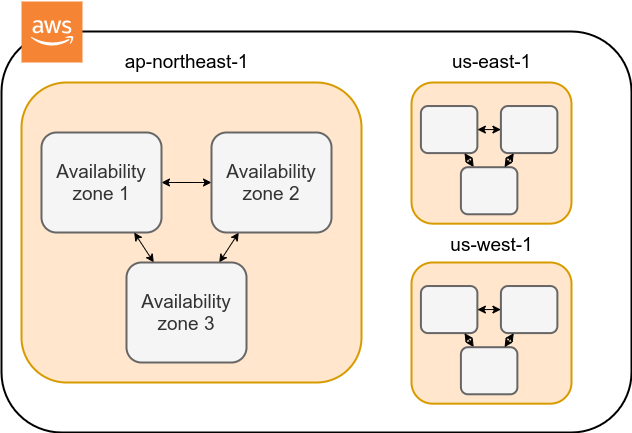

**リージョン (Region)** とは，おおまかに言うとデータセンターの所在地のことである． 執筆時点において， AWS は世界の 25 の国と地域でデータセンターを所有している． [figure_title](#fig_aws_regions) は執筆時点で利用できるリージョンの世界地図を示している． 日本では東京と大阪にデータセンターがある． 各リージョンには固有の ID がついており，例えば東京は `ap-northeast-1`, 米国オハイオ州は `us-east-2`，などと定義されている．


AWS コンソールにログインすると，画面右上のメニューバーでリージョンを選択することができる([figure_title](#fig_aws_console_regions), 赤丸で囲った箇所)． EC2, S3 などの AWS のリソースは，リージョンごとに完全に独立である． したがって，**リソースを新たにデプロイする際，あるいはデプロイ済みのリソースを閲覧する際は，コンソールのリージョンが正しく設定されているか，確認する必要がある**． ウェブビジネスを展開する場合などは，世界の各地にクラウドを展開する必要があるが，個人的な研究用途として用いる場合は，最寄りのリージョン (i.e. 東京) を使えば基本的に問題ない．

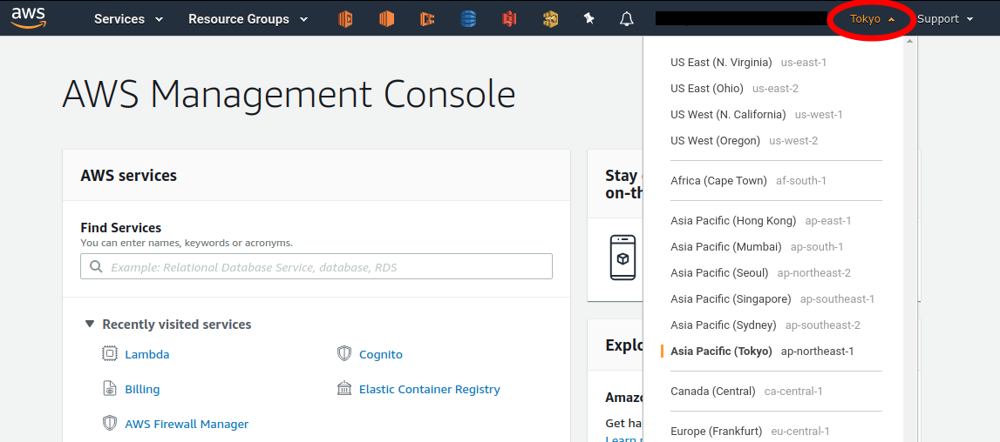

`Avaialibity Zone (AZ)` とは，リージョン内で地理的に隔離されたデータセンターのことである． それぞれのリージョンは 2 個以上の AZ を有しており，もし一つの AZ で火災や停電などが起きた場合でも，ほかの AZ がその障害をカバーすることができる． また， AZ 間は高速な AWS 専用ネットワーク回線で結ばれているため， AZ 間のデータ転送は極めて早い． AZ は，ビジネスなどでサーバーダウンが許容されない場合などに注意すべき概念であり，個人的な用途で使う限りにおいてはあまり深く考慮する必要はない．言葉の意味だけ知っておけば十分である．

AWS を使用する際，どこのリージョンを指定するのがよいのだろうか？ インターネットの接続速度の観点からは，地理的に一番近いリージョンを使用するのが一般的によいだろう． 一方， EC2 の利用料などはリージョンごとに価格設定が若干 (10-20%程度) 異なる． したがって，自分が最も頻繁に利用するサービスの価格が最も安く設定されているリージョンを選択する，というのも重要な視点である． また，いくつかのサービスは，特定のリージョンで利用できない場合もある． これらのポイントから総合的に判断して使用するリージョンを決めると良い．

AWS Educate を利用している読者へ

執筆時点において，AWS Educate による Starter Account を使用している場合は `us-east-1` region のみ利用できる ([参照](https://awseducate-starter-account-services.s3.amazonaws.com/AWS_Educate_Starter_Account_Services_Supported.pdf))．

-   [AWS documentation "Regions, Availability Zones, and Local Zones"](https://docs.aws.amazon.com/AWSEC2/latest/UserGuide/using-regions-availability-zones.html)

## AWS でのクラウド開発

AWS のクラウドの全体像がわかってきたところで，次のトピックとして，どのようにして AWS 上にクラウドの開発を行い，展開していくかについての概略を解説しよう．

AWS のリソースを追加・編集・削除するなどの操作を実行するには，**コンソールを用いる**方法と，**API を用いる方法**の，二つの経路がある．

### コンソール画面からリソースを操作する

AWS のアカウントにログインすると，まず最初に表示されるのが**AWS コンソール**である ([figure_title](#aws_console_window))．


コンソールを使うことで， EC2 のインスタンスを立ち上げたり，S3 のデータを追加・削除したり，ログを閲覧したりなど，AWS 上のあらゆるリソースの操作を GUI (Graphical User Interface) を通して実行することができる． **初めて触る機能をポチポチと試したり，デバッグを行うときなどにとても便利である**．

コンソールはさらっと機能を試したり，開発中のクラウドのデバッグをするときには便利なのであるが，実際にクラウドの開発をする場面でこれを直接いじることはあまりない． むしろ，次に紹介する API を使用して，プログラムとしてクラウドのリソースを記述することで開発を行うのが一般的である． そのような理由で，本書では AWS コンソールを使った AWS の使い方はあまり触れない． AWS のドキュメンテーションには，たくさんの [チュートリアル](https://aws.amazon.com/getting-started/hands-on/) が用意されており，コンソール画面から様々な操作を行う方法が記述されているので，興味がある読者はそちらを参照されたい．

### API からリソースを操作する

**API (Application Programming Interface)** を使うことで，コマンドを AWS に送信し，クラウドのリソースの操作をすることができる． API とは，端的に言えば AWS が公開しているコマンドの一覧であり，`GET`, `POST`, `DELETE` などの **REST API** から構成されている (REST API については [REST API](#sec_rest_api) で簡単に解説する)． が，直接 REST API を入力するのは面倒であるので，その手間を解消するための様々なツールが提供されている．

例えば， [AWS CLI](https://docs.aws.amazon.com/cli/latest/index.html) は， UNIX コンソールから AWS API を実行するための CLI (Command Line Interface) である． CLI に加えて，いろいろなプログラミング言語での SDK (Software Development Kit) が提供されている．以下に一例を挙げる．

-   Python ⇒ [boto3](https://boto3.amazonaws.com/v1/documentation/api/latest/index.html)

-   Ruby ⇒ [AWS SDK for Ruby](https://aws.amazon.com/sdk-for-ruby/)

-   Node.js ⇒ [AWS SDK for Node.js](https://aws.amazon.com/sdk-for-node-js/)

具体的な API の使用例を見てみよう．

S3 に新しい保存領域 (`Bucket (バケット)` とよばれる) を追加したいとしよう． AWS CLI を使った場合は，次のようなコマンドを打てばよい．

```shell
$ aws s3 mb s3://my-bucket --region ap-northeast-1
```

上記のコマンドは， `my-bucket` という名前のバケットを， `ap-northeast-1` のリージョンに作成する．

Python からこれと同じ操作を実行するには， `boto3` ライブラリを使って，次のようなスクリプトを実行する．

```python
import boto3

s3_client = boto3.client("s3", region_name="ap-northeast-1")
s3_client.create_bucket(Bucket="my-bucket")
```

もう一つ例をあげよう．

新しい EC2 のインスタンス(インスタンスとは，起動状態にある仮想サーバーの意味である)を起動するには，次のようなコマンドを打てば良い．

```shell
$ aws ec2 run-instances --image-id ami-xxxxxxxx --count 1 --instance-type t2.micro --key-name MyKeyPair --security-group-ids sg-903004f8 --subnet-id subnet-6e7f829e
```

このコマンドにより， [t2.micro](https://aws.amazon.com/ec2/instance-types/t2/) というタイプ (1 vCPU, 1.0 GB RAM) のインスタンスが起動する． ここではその他のパラメータの詳細の説明は省略する (ハンズオン ([Hands-on \#1: 初めての EC2 インスタンスを起動する](#sec_first_ec2)) で詳しく解説する)．

Python から上記と同じ操作を実行するには，以下のようなスクリプトを使う．

```python
import boto3

ec2_client = boto3.client("ec2")
ec2_client.run_instances(
    ImageId="ami-xxxxxxxxx",
    MinCount=1,
    MaxCount=1,
    KeyName="MyKeyPair",
    InstanceType="t2.micro",
    SecurityGroupIds=["sg-903004f8"],
    SubnetId="subnet-6e7f829e",
)
```

以上の例を通じて，API によるクラウドのリソースの操作のイメージがつかめてきただろうか？ コマンド一つで，新しい仮想サーバーを起動したり，データの保存領域を追加したり，任意の操作を実行できるわけである． 基本的に，このようなコマンドを複数組み合わせていくことで，自分の望む CPU・RAM・ネットワーク・ストレージが備わった計算環境を構築することができる． もちろん，逆の操作 (リソースの削除) も API を使って実行できる．

### ミニ・ハンズオン: AWS CLI を使ってみよう

ここでは，ミニ・ハンズオンとして，AWS CLI を実際に使ってみる． AWS CLI は先述のとおり， AWS 上の任意のリソースの操作が可能であるが，ここでは一番シンプルな，**S3 を使ったファイルの読み書きを実践する** (EC2 の操作は少し複雑なので，第一回ハンズオンで行う)． `aws s3` コマンドの詳しい使い方は [公式ドキュメンテーション](https://docs.aws.amazon.com/cli/latest/reference/s3/index.html#cli-aws-s3)を参照．

AWS CLI のインストールについては， [AWS CLI のインストール](#aws_cli_install) を参照．

以下に紹介するハンズオンは，基本的に [S3 の無料枠](https://aws.amazon.com/free/?all-free-tier.sort-by=item.additionalFields.SortRank&all-free-tier.sort-order=asc) の範囲内で実行することができる．

以下のコマンドを実行する前に，AWS の認証情報が正しく設定されていることを確認する． これには `~/.aws/credentials` のファイルに設定が書き込まれているか，環境変数 (`AWS_ACCESS_KEY_ID`, `AWS_SECRET_ACCESS_KEY`, `AWS_DEFAULT_REGION`) が定義されている必要がある． 詳しくは [AWS CLI のインストール](#aws_cli_install) を参照．

まずは，S3 にデータの格納領域 (`Bucket` とよばれる．一般的な OS での"ドライブ"に相当する) を作成するところから始めよう．

```shell
$ bucketName="mybucket-$(openssl rand -hex 12)"
$ echo $bucketName
$ aws s3 mb "s3://${bucketName}"
```

S3 のバケットの名前は， AWS 全体で一意的でなければならないことから，前述のコマンドではランダムな文字列を含んだバケットの名前を生成し，`bucketName` という変数に格納している． そして， `aws s3 mb` (`mb` は make bucket の略) によって，新しいバケットを作成する．

次に，バケットの一覧を取得してみよう．

```shell
$ aws s3 ls

2020-06-07 23:45:44 mybucket-c6f93855550a72b5b66f5efe
```

先ほど作成したバケットがリストにあることを確認できる．

本書のノーテーションとして，コマンドラインに入力するコマンドは，それがコマンドであると明示する目的で先頭に `$` がつけてある． `$` はコマンドをコピー&ペーストするときは除かなければならない． 逆に，コマンドの出力は `$` なしで表示されている．

次に，バケットにファイルをアップロードする．

```shell
$ echo "Hello world" > hello_world.txt
$ aws s3 cp hello_world.txt "s3://${bucketName}/hello_world.txt"
```

上では `hello_world.txt` というダミーのファイルを作成して，それをアップロードした．

それでは，バケットの中にあるファイルの一覧を取得してみる．

```shell
$ aws s3 ls "s3://${bucketName}" --human-readable

2020-06-07 23:54:19   13 Bytes hello_world.txt
```

先ほどアップロードしたファイルがたしかに存在することがわかる．

最後に，使い終わったバケットを削除する．

```shell
$ aws s3 rb "s3://${bucketName}" --force
```

`rb` は remove bucket の略である． デフォルトでは，バケットの中にファイルが存在すると削除できない． 空でないバケットを強制的に削除するには `--force` のオプションを付ける．

以上のように，AWS CLI を使って S3 バケットに対しての一連の操作を実行できた． EC2 や Lambda, DynamoDB などについても同様に AWS CLI を使ってあらゆる操作を実行できる．

**Amazon Resource Name (ARN)**

AWS 上のあらゆるリソースには， Amazon Resource Name (ARN) という固有の ID が付与されている． ARN は `arn:aws:s3:::my_bucket/` のようなフォーマットで記述され，ARN を使用することで，特定の AWS リソース (S3 のバケットや EC2 のインスタンス) を一意的に参照することができる．

S3 バケットや EC2 インスタンスなどには ARN に加えて，人間が読みやすい名前を定義することも可能である． この場合は，ARN または名前のどちらを用いても同じリソースを参照することが可能である．

## CloudFormation と AWS CDK

### CloudFormation による Infrastructure as Code (IaC)

前節で述べたように，AWS API を使うことでクラウドの**あらゆる**リソースの作成・管理が可能である． よって，原理上は， API のコマンドを組み合わせていくことで，自分の作りたいクラウドを設計することができる．

しかし，ここで実用上考慮しなければならない点が一つある． AWS API には大きく分けて，**リソースを操作する**コマンドと，**タスクを実行する**コマンドがあることである ([figure_title](#fig_aws_iac))．


**リソースを操作する**とは，EC2 のインスタンスを起動したり，S3 のバケットを作成したり，データベースに新たなテーブルを追加する，などの**静的なリソースを準備する** 操作を指す． "ハコ"を作る操作とよんでも良いだろう． このようなコマンドは，**クラウドのデプロイ時にのみ，一度だけ実行されればよい**．

**タスクを実行するコマンド** とは， EC2 のインスタンスにジョブを投入したり， S3 のバケットにデータを読み書きするなどの操作を指す． これは， EC2 や S3 などのリソース ("ハコ") を前提として，その内部で実行されるべき計算を記述するものである． 前者に比べてこちらは**動的な操作**を担当する，と捉えることもできる．

そのような観点から，**インフラを記述するプログラム**と**タスクを実行するプログラム**はある程度分けて管理されるべきである． クラウドの開発は，クラウドの(静的な)リソースを記述するプログラムを作成するステップと，インフラ上で動く動的な操作を行うプログラムを作成するステップの二段階に分けて考えることができる．

AWS での静的リソースを管理するための仕組みが， [CloudFormation](https://aws.amazon.com/cloudformation/) である． CloudFormation とは， CloudFormation の文法に従ったテキストファイルを使って，AWS のインフラを記述する仕組みである． CloudFormation を使って，たとえば，EC2 のインスタンスをどれくらいのスペックで，何個起動するか，インスタンス間はどのようなネットワークで結び，どのようなアクセス権限を付与するか，などのリソースの要件を逐次的に記述することができる． 一度 CloudFormation ファイルができ上がれば，それにしたがったクラウドシステムをコマンド一つで AWS 上に展開することができる． また，CloudFormation ファイルを交換することで，全く同一のクラウド環境を他者が簡単に再現することも可能になる． このように，本来は物理的な実体のあるハードウェアを，プログラムによって記述し，管理するという考え方を，**Infrastructure as Code (IaC)**とよぶ．

CloudFormation を記述するには，基本的に **JSON** (JavaScript Object Notation) とよばれるフォーマットを使う． 次のコードは，JSON で記述された CloudFormation ファイルの一例 (抜粋) である．

```json
"Resources" : {
  ...
  "WebServer": {
    "Type" : "AWS::EC2::Instance",
    "Properties": {
      "ImageId" : { "Fn::FindInMap" : [ "AWSRegionArch2AMI", { "Ref" : "AWS::Region" },
                        { "Fn::FindInMap" : [ "AWSInstanceType2Arch", { "Ref" : "InstanceType" }, "Arch" ] } ] },
      "InstanceType"   : { "Ref" : "InstanceType" },
      "SecurityGroups" : [ {"Ref" : "WebServerSecurityGroup"} ],
      "KeyName"        : { "Ref" : "KeyName" },
      "UserData" : { "Fn::Base64" : { "Fn::Join" : ["", [
                     "#!/bin/bash -xe\n",
                     "yum update -y aws-cfn-bootstrap\n",

                     "/opt/aws/bin/cfn-init -v ",
                     "         --stack ", { "Ref" : "AWS::StackName" },
                     "         --resource WebServer ",
                     "         --configsets wordpress_install ",
                     "         --region ", { "Ref" : "AWS::Region" }, "\n",

                     "/opt/aws/bin/cfn-signal -e $? ",
                     "         --stack ", { "Ref" : "AWS::StackName" },
                     "         --resource WebServer ",
                     "         --region ", { "Ref" : "AWS::Region" }, "\n"
      ]]}}
    },
    ...
  },
  ...
},
```

ここでは， "WebServer" という名前のつけられた EC2 インスタンスを定義している．かなり長大で複雑な記述であるが，これによって所望のスペック・OS をもつ EC2 インスタンスを自動的に生成することが可能になる．

### AWS CDK

前節で紹介した CloudFormation は，見てわかるとおり大変記述が複雑であり，またそれのどれか一つにでも誤りがあってはいけない． また，基本的に"テキスト"を書いていくことになるので，プログラミング言語で使うような変数やクラスといった便利な概念が使えない　(厳密には， CloudFormation にも変数に相当するような機能は存在する)． また，記述の多くの部分は繰り返しが多く，自動化できる部分も多い．

そのような悩みを解決してくれるのが， [AWS Cloud Development Kit (CDK)](https://aws.amazon.com/cdk/) である． **CDK は Python などのプログラミング言語を使って CloudFormation を自動的に生成してくれるツールである．** CDK は 2019 年にリリースされたばかりの比較的新しいツールで，日々改良が進められている ([GitHub リポジトリ](https://github.com/aws/aws-cdk/releases) のリリースを見ればその開発のスピードの速さがわかるだろう)． CDK は TypeScript (JavaScript), Python, Java など複数の言語でサポートされている．

CDK を使うことで，CloudFormation に相当するクラウドリソースの記述を，より親しみのあるプログラミング言語を使って行うことができる． かつ，典型的なリソース操作に関してはパラメータの多くの部分を自動で決定してくれるので，記述しなければならない量もかなり削減される．

以下に Python を使った CDK のコードの一例 (抜粋) を示す．

```python
from aws_cdk import (
    core,
    aws_ec2 as ec2,
)

class MyFirstEc2(core.Stack):

    def __init__(self, scope, name, **kwargs):
        super().__init__(scope, name, **kwargs)

        vpc = ec2.Vpc(
            ... # some parameters
        )

        sg = ec2.SecurityGroup(
            ... # some parameters
        )

        host = ec2.Instance(
            self, "MyGreatEc2",
            instance_type=ec2.InstanceType("t2.micro"),
            machine_image=ec2.MachineImage.latest_amazon_linux(),
            vpc=vpc,
            ...
        )
```

このコードは，一つ前に示した JSON を使った CloudFormation と実質的に同じことを記述している． とても煩雑だった CloudFormation ファイルに比べて， CDK と Python を使うことで格段に短く，わかりやすく記述できることができるのがわかるだろう．

本書の主題は，**CDK を使って，コードを書きながら AWS の概念や開発方法を学んでいくことである**． 後の章では CDK を使って様々なハンズオンを実施していく． 早速，最初のハンズオンでは， CDK を使って EC2 インスタンスを作成する方法を学んでいこう．

-   [AWS CDK Examples](https://github.com/aws-samples/aws-cdk-examples): CDK を使ったプロジェクトの例が多数紹介されている． ここにある例をテンプレートに自分のアプリケーションの開発を進めるとよい．

# Hands-on \#1: 初めての EC2 インスタンスを起動する

ハンズオンの第一回では， CDK を使って EC2 のインスタンス(仮想サーバー)を作成し，SSH でサーバーにログインする，という演習を行う． このハンズオンを終えれば，あなたは自分だけのサーバーを AWS 上に立ち上げ，自由に計算を走らせることができるようになるのである！

## 準備

ハンズオンのソースコードは GitHub の [handson/ec2-get-started](https://github.com/tomomano/learn-aws-by-coding/tree/main/handson/ec2-get-started) に置いてある．

このハンズオンは，基本的に [AWS の無料枠](https://aws.amazon.com/free/?all-free-tier.sort-by=item.additionalFields.SortRank&all-free-tier.sort-order=asc) の範囲内で実行することができる．

まずは，ハンズオンを実行するための環境を整える． これらの環境整備は，後のハンズオンでも前提となるものなので確実にミスなく行っていただきたい．

-   **AWS Account**: ハンズオンを実行するには個人の AWS アカウントが必要である． AWS アカウントの取得については [AWS アカウントの取得](#sec:create_aws_account) を参照のこと．
-   **Python と Node.js**: 本ハンズオンを実行するには，Python (3.6 以上)，Node.js (12.0 以上) がインストールされていなければならない．
-   **AWS CLI**: AWS CLI のインストールについては， [AWS CLI のインストール](#aws_cli_install) を参照． ここに記載されている認証鍵の設定も済ませておくこと．
-   **AWS CDK**: AWS CDK のインストールについては， [AWS CDK のインストール](#aws_cdk_install) を参照．
-   **ソースコードのダウンロード**: 本ハンズオンで使用するプログラムのソースコードを，以下のコマンドを使って GitHub からダウンロードする．

```shell
$ git clone https://github.com/tomomano/learn-aws-by-coding.git
```

あるいは， `https://github.com/tomomano/learn-aws-by-coding` のページに行って，右上のダウンロードボタンからダウンロードすることもできる．

**Docker を使用する場合**

Python, Node.js, AWS CDK など，ハンズオンのプログラムを実行するために必要なプログラム/ライブラリがインストール済みの Docker image を用意した． また，ハンズオンのソースコードもパッケージ済みである． Docker の使い方を知っている読者は，これを使えば，諸々のインストールをする必要なく，すぐにハンズオンのプログラムを実行できる．

使用方法については [ハンズオン実行用の Docker image の使い方](#sec_handson_docker) を参照のこと．

## SSH

**SSH (secure shell)** は Unix 系のリモートサーバーに安全にアクセスするためのツールである． 本ハンズオンでは， SSH を使って仮想サーバーにアクセスする． SSH に慣れていない読者のため，簡単な説明をここで行おう．

SSH による通信はすべて暗号化されているので，機密情報をインターネットを介して安全に送受信することができる． 本ハンズオンで，リモートのサーバーにアクセスするための SSH クライアントがローカルマシンにインストールされている必要がある． SSH クライアントは Linux/Mac には標準搭載されている． Windows の場合は WSL をインストールすることで SSH クライアントを利用することを推奨する ([環境構築](#environments) を参照)．

SSH コマンドの基本的な使い方を次に示す． `<host name>` はアクセスする先のサーバーの IP アドレスや DNS によるホストネームが入る． `<user name>` は接続する先のユーザー名である．

```shell
$ ssh <user name>@<host name>
```

SSH は平文のパスワードによる認証を行うこともできるが，より強固なセキュリティを施すため，**公開鍵暗号方式(Public Key Cryptography)による認証**を行うことが強く推奨されており， EC2 はこの方法でしかアクセスを許していない． 公開鍵暗号方式の仕組みについては各自勉強してほしい． 本ハンズオンにおいて大事なことは，**EC2 インスタンスが公開鍵(Public key)を保持し，クライアントとなるコンピュータ(読者自身のコンピュータ)が秘密鍵(Private key)を保持する**，という点である． EC2 のインスタンスには秘密鍵を持ったコンピュータのみがアクセスすることができる．逆に言うと，秘密鍵が漏洩すると第三者もサーバーにアクセスできることになるので，**秘密鍵は絶対に漏洩することのないよう注意して管理する**．

SSH コマンドでは，ログインのために使用する秘密鍵ファイルを `-i` もしくは `--identity_file` のオプションで指定することができる． たとえば，次のように使う．

```shell
$ ssh -i Ec2SecretKey.pem <user name>@<host name>
```

## アプリケーションの説明

このハンズオンで作成するアプリケーションの概要を [figure_title](#handson_01_architecture) に示す．


このアプリケーションではまず，**VPC (Virtual Private Cloud)** を使ってプライベートな仮想ネットワーク環境を立ち上げている． その VPC の public subnet の内側に，**EC2 (Elatic Compute Cloud)** の仮想サーバーを配置する． さらに，セキュリティのため， **Security Group** による EC2 インスタンスへのアクセス制限を設定している． このようにして作成された仮想サーバーに，SSH を使ってアクセスし，簡単な計算を行う．

[figure_title](#handson_01_architecture) のようなアプリケーションを，CDK を使って構築する．

早速ではあるが，今回のハンズオンで使用するプログラムを見てみよう ([handson/ec2-get-started/app.py](https://github.com/tomomano/learn-aws-by-coding/blob/main/handson/ec2-get-started/app.py))．

```python
class MyFirstEc2(core.Stack):

    def __init__(self, scope: core.App, name: str, key_name: str, **kwargs) -> None:
        super().__init__(scope, name, **kwargs)

        #
        vpc = ec2.Vpc(
            self, "MyFirstEc2-Vpc",
            max_azs=1,
            cidr="10.10.0.0/23",
            subnet_configuration=[
                ec2.SubnetConfiguration(
                    name="public",
                    subnet_type=ec2.SubnetType.PUBLIC,
                )
            ],
            nat_gateways=0,
        )

        #
        sg = ec2.SecurityGroup(
            self, "MyFirstEc2Vpc-Sg",
            vpc=vpc,
            allow_all_outbound=True,
        )
        sg.add_ingress_rule(
            peer=ec2.Peer.any_ipv4(),
            connection=ec2.Port.tcp(22),
        )

        #
        host = ec2.Instance(
            self, "MyFirstEc2Instance",
            instance_type=ec2.InstanceType("t2.micro"),
            machine_image=ec2.MachineImage.latest_amazon_linux(),
            vpc=vpc,
            vpc_subnets=ec2.SubnetSelection(subnet_type=ec2.SubnetType.PUBLIC),
            security_group=sg,
            key_name=key_name
        )
```

-   まず最初に，VPC を定義する．

-   次に， security group (SG) を定義している． ここでは，任意の IPv4 のアドレスからの，ポート 22 (SSH の接続に使用される)への接続を許可している． それ以外の接続は拒絶される．

-   最後に，上記で作った VPC と SG が付与された EC2 インスタンスを作成している． インスタンスタイプは `t2.micro` を選択し， [Amazon Linux](https://aws.amazon.com/amazon-linux-ami/) を OS として設定している．

それぞれについて，もう少し詳しく説明しよう．

### VPC (Virtual Private Cloud)

**VPC のアイコン.**


VPC は AWS 上にプライベートな仮想ネットワーク環境を構築するツールである．高度な計算システムを構築するには，複数のサーバーを連動させて計算を行う必要があるが，そのような場合に互いのアドレスなどを管理する必要があり，そういった目的で VPC は有用である．

本ハンズオンでは，サーバーは一つしか起動しないので，VPC の恩恵はよく分からないかもしれない．しかし，EC2 インスタンスは必ず VPC の中に配置されなければならない，という制約があるので，このハンズオンでもミニマルな VPC を構成している．

興味のある読者のために，VPC のコードについてもう少し詳しく説明しよう．

```python
vpc = ec2.Vpc(
    self, "MyFirstEc2-Vpc",
    max_azs=1,
    cidr="10.10.0.0/23",
    subnet_configuration=[
        ec2.SubnetConfiguration(
            name="public",
            subnet_type=ec2.SubnetType.PUBLIC,
        )
    ],
    nat_gateways=0,
)
```

-   `max_azs=1` : このパラメータは，前章で説明した avaialibility zone (AZ) を設定している． このハンズオンでは，特にデータセンターの障害などを気にする必要はないので `1` にしている．

-   `cidr="10.10.0.0/23"` : このパラメータは，VPC 内の IPv4 のレンジを指定している． CIDR 記法については， [Wikipedia](https://en.wikipedia.org/wiki/Classless_Inter-Domain_Routing)などを参照． `10.10.0.0/23` は `10.10.0.0` から `10.10.1.255` までの 512 個の連続したアドレス範囲を指している． つまり，この VPC では最大で 512 個のユニークな IPv4 アドレスが使えることになる． 今回はサーバーは一つなので 512 個は明らかに多すぎるが，VPC はアドレスの数はどれだけ作成しても無料なので，多めに作成した．

-   `subnet_configuration=...` : このパラメータは，VPC にどのようなサブネットを作るか，を決めている． サブネットの種類には **private subnet** と **public subnet** の二種類がある． private subnet は基本的にインターネットとは遮断されたサブネット環境である． インターネットと繋がっていないので，セキュリティは極めて高く， VPC 内のサーバーとのみ通信を行えばよい EC2 インスタンスはここに配置する． Public subnet とはインターネットに繋がったサブネットである． 本ハンズオンで作成するサーバーは，外から SSH でログインを行いたいので， Public subnet 内に配置する． より詳細な記述は [公式ドキュメンテーション](https://docs.aws.amazon.com/vpc/latest/userguide/VPC_Subnets.html#vpc-subnet-basics) を参照．

-   `natgateways=0` : これは少し高度な内容なので省略する (興味のある読者は [公式ドキュメンテーション](https://docs.aws.amazon.com/vpc/latest/userguide/vpc-nat-gateway.html)を参照)． が，**これを 0 にしておかないと，NAT Gateway の利用料金が発生してしまうので，注意！**

### Security Group

Security group (SG) は， EC2 インスタンスに付与することのできる仮想ファイアーウォールである． たとえば，特定の IP アドレスから来た接続を許可・拒絶したり　(インバウンド・トラフィックの制限) ，逆に特定の IP アドレスへのアクセスを禁止したり (アウトバウンド・トラフィックの制限) することができる．

コードの該当部分を見てみよう．

```python
sg = ec2.SecurityGroup(
    self, "MyFirstEc2Vpc-Sg",
    vpc=vpc,
    allow_all_outbound=True,
)
sg.add_ingress_rule(
    peer=ec2.Peer.any_ipv4(),
    connection=ec2.Port.tcp(22),
)
```

本ハンズオンでは， SSH による外部からの接続を許容するため， `sg.add_ingress_rule(peer=ec2.Peer.any_ipv4(), connection=ec2.Port.tcp(22))` により，すべての IPv4 アドレスからのポート 22 番へのアクセスを許容している． また， SSH で EC2 インスタンスにログインしたのち，インターネットからプログラムなどをダウンロードできるよう， `allow_all_outbound=True` のパラメータを設定している．

SSH はデフォルトでは 22 番ポートを使用するのが慣例である．

セキュリティ上の観点からは，SSH の接続は自宅や大学・職場など特定の地点からの接続のみを許す方が望ましい．

### EC2 (Elastic Compute Cloud)

**EC2 のアイコン.**


EC2 は AWS 上に仮想サーバーを立ち上げるサービスである． 個々の起動状態にある仮想サーバーのことをインスタンス (instance) とよぶ (しかし，口語的なコミュニケーションにおいては，サーバーとインスタンスという言葉は相互互換的に用いられることが多い)．

EC2 では用途に応じて様々なインスタンスタイプが提供されている． [table_title](#ec2_instance_types) に，代表的なインスタンスタイプの例を挙げる (執筆時点での情報)． EC2 のインスタンスタイプのすべてのリストは [公式ドキュメンテーション "Amazon EC2 Instance Types"](https://aws.amazon.com/ec2/instance-types/) で見ることができる．

<table><caption>EC2 instance types</caption><colgroup><col style="width: 20%" /><col style="width: 20%" /><col style="width: 20%" /><col style="width: 20%" /><col style="width: 20%" /></colgroup><thead><tr class="header"><th>Instance</th><th>vCPU</th><th>Memory (GiB)</th><th>Network bandwidth (Gbps)</th><th>Price per hour ($)</th></tr></thead><tbody><tr class="odd"><td><p>t2.micro</p></td><td><p>1</p></td><td><p>1</p></td><td><p>-</p></td><td><p>0.0116</p></td></tr><tr class="even"><td><p>t2.small</p></td><td><p>1</p></td><td><p>2</p></td><td><p>-</p></td><td><p>0.023</p></td></tr><tr class="odd"><td><p>t2.medium</p></td><td><p>2</p></td><td><p>4</p></td><td><p>-</p></td><td><p>0.0464</p></td></tr><tr class="even"><td><p>c5.24xlarge</p></td><td><p>96</p></td><td><p>192</p></td><td><p>25</p></td><td><p>4.08</p></td></tr><tr class="odd"><td><p>c5n.18xlarge</p></td><td><p>72</p></td><td><p>192</p></td><td><p>100</p></td><td><p>3.888</p></td></tr><tr class="even"><td><p>x1e.16xlarge</p></td><td><p>64</p></td><td><p>1952</p></td><td><p>10</p></td><td><p>13.344</p></td></tr></tbody></table>

[table_title](#ec2_instance_types) からわかるように， CPU は 1 コアから 96 コアまで，メモリーは 1GB から 2TB 以上まで，ネットワーク帯域は最大で 100Gbps まで，幅広く選択することができる． また，時間あたりの料金は，CPU・メモリーの占有数にほぼ比例する形で増加する． EC2 はサーバーの起動時間を秒単位で記録しており，**利用料金は使用時間に比例する形で決定される**． 例えば， `t2.medium` のインスタンスを 10 時間起動した場合，0.0464 \* 10 = 0.464 ドルの料金が発生する．

AWS には [無料利用枠](https://aws.amazon.com/free/?all-free-tier.sort-by=item.additionalFields.SortRank&all-free-tier.sort-order=asc) というものがあり， `t2.micro` であれば月に 750 時間までは無料で利用することができる．

[table_title](#ec2_instance_types) の価格は `us-east-1` のものである． リージョンによって多少価格設定が異なる．

上記で t2.micro の $0.0116 / hour という金額は， On-demand インスタンスというタイプを選択した場合の価格である． EC2 ではほかに， [Spot instance](https://docs.aws.amazon.com/AWSEC2/latest/UserGuide/using-spot-instances.html) とよばれるインスタンスも存在しする． Spot instance は，AWS のデータセンターの負荷が増えた場合，ユーザーのプログラムが実行中であっても AWS の判断により強制シャットダウンされる，という不便さを抱えているのだが，その分大幅に安い料金設定になっている． AWS で一時的に生じた余剰な空き CPU をユーザーに割安で貸し出す，という発想である． 科学計算やウェブサーバーなどの用途でコストを削減する目的で， Spot Instance を活用する事例も多数報告されている．

EC2 インスタンスを定義しているコードの該当部分を見てみよう．

```python
host = ec2.Instance(
    self, "MyFirstEc2Instance",
    instance_type=ec2.InstanceType("t2.micro"),
    machine_image=ec2.MachineImage.latest_amazon_linux(),
    vpc=vpc,
    vpc_subnets=ec2.SubnetSelection(subnet_type=ec2.SubnetType.PUBLIC),
    security_group=sg,
    key_name=key_name
)
```

ここでは， `t2.micro` というインスタンスタイプを選択している． さらに， `machine_image` として， [Amazon Linux](https://aws.amazon.com/amazon-linux-ami/) を選択している (Machine image は OS と似た概念である． Machine image については， [Hands-on \#2: AWS でディープラーニングを実践](#sec_jupyter_and_deep_learning) でより詳しく触れる)． さらに，上で定義した VPC, SG をこのインスタンスに付与している．

以上が，今回使用するプログラムの簡単な解説であった． ミニマルな形のプログラムではあるが，仮想サーバーを作成するのに必要なステップがおわかりいただけただろうか？

## プログラムを実行する

さて，ハンズオンのコードの理解ができたところで，プログラムを実際に実行してみよう．繰り返しになるが， [準備](#handson_01_prep) での準備ができていることが前提である．

### Python の依存ライブラリのインストール

まずは，Python の依存ライブラリをインストールする．以下では，Python のライブラリを管理するツールとして， [venv](https://docs.python.org/3/library/venv.html) を使用する．

まずは， `handson/ec2-get-started` のディレクトリに移動しよう．

```shell
$ cd handson/ec2-get-started
```

ディレクトリを移動したら， `venv` で新しい仮想環境を作成し，インストールを実行する．

```shell
$ python3 -m venv .env
$ source .env/bin/activate
$ pip install -r requirements.txt
```

これで Python の環境構築は完了だ．

`venv` の簡単な説明は [Python クイックガイド](#venv_quick_guide) に記述してある．

環境によっては `pip` ではなく `pip3` あるいは `python3 -m pip` に置き換える必要がある．

### AWS のシークレットキーをセットする

AWS CLI および AWS CDK を使うには， AWS のシークレットキーが設定されている必要がある． シークレットキーの発行については [AWS のシークレットキーの作成](#aws_secrets) を参照のこと． シークレットキーを発行したら， [AWS CLI のインストール](#aws_cli_install) を参照し，コマンドラインの設定を行う．

手順をここに短く要約すると，一つ目の方法は `AWS_ACCESS_KEY_ID` などの環境変数を設定するやり方である． もう一つの方法は， `~/.aws/credentials` に認証情報を保存しておく方式である． シークレットキーの設定は AWS CLI/CDK を使用するうえで共通のステップになるので，しっかりと理解しておくように．

### SSH 鍵を生成

EC2 インスタンスには SSH を使ってログインする． EC2 インスタンスを作成するのに先行して，今回のハンズオンで専用に使う SSH の公開鍵・秘密鍵のペアを準備する必要がある．

次の AWS CLI コマンドにより， `HirakeGoma` という名前のついた鍵を生成する．

```shell
$ export KEY_NAME="HirakeGoma"
$ aws ec2 create-key-pair --key-name ${KEY_NAME} --query 'KeyMaterial' --output text > ${KEY_NAME}.pem
```

このコマンドを実行すると，現在のディレクトリに `HirakeGoma.pem` というファイルが作成される．これが，サーバーにアクセスするための秘密鍵である． SSH でこの鍵を使うため， `~/.ssh/` のディレクトリに鍵を移動する． さらに，秘密鍵が書き換えられたり第三者に閲覧されないよう，ファイルのアクセス権限を `400` に設定する．

```shell
$ mv HirakeGoma.pem ~/.ssh/
$ chmod 400 ~/.ssh/HirakeGoma.pem
```

### デプロイを実行

これまでのステップで， EC2 インスタンスをデプロイするための準備が整った！ 早速，次のコマンドによりアプリケーションを AWS にデプロイしよう． `-c key_name="HirakeGoma"` というオプションで，先ほど生成した `HirakeGoma` という名前の鍵を使うよう指定している．

```shell
$ cdk deploy -c key_name="HirakeGoma"
```

このコマンドを実行すると， VPC， EC2 などが AWS 上に展開される． そして，コマンドの出力の最後に [figure_title](#handson_01_cdk_output) のような出力が得られるはずである． **出力の中で `InstancePublicIp` に続く数字が，起動したインスタンスのパブリック IP アドレスである．** IP アドレスはデプロイごとにランダムなアドレスが割り当てられる．


### SSH でログイン

早速，SSH 　で接続してみよう．

```shell
$ ssh -i ~/.ssh/HirakeGoma.pem ec2-user@<IP address>
```

`-i` オプションで，先ほど生成した秘密鍵を指定している． EC2 インスタンスにはデフォルトで `ec2-user` という名前のユーザーが作られているので，それを使用する． 最後に， `<IP address>` の部分は自身が作成した EC2 インスタンスの IP アドレスで置き換える (`12.345.678.9` など）．

ログインに成功すると， [figure_title](#fig_handson_01_ssh_login) のような画面が表示される． リモートのサーバーにログインしているので，プロンプトが `[ec2-user@ip-10-10-1-217 ~]$` のようになっていることを確認しよう．


**おめでとう！これで，めでたく AWS 上に EC2 仮想サーバーを起動し，リモートからアクセスできるようになった！**

### 起動した EC2 インスタンスで遊んでみる

せっかく新しいインスタンスを起動したので，少し遊んでみよう．

ログインした EC2 インスタンスで，次のコマンドを実行してみよう． CPU の情報を取得することができる．

```shell
$ cat /proc/cpuinfo

processor       : 0
vendor_id       : GenuineIntel
cpu family      : 6
model           : 63
model name      : Intel(R) Xeon(R) CPU E5-2676 v3 @ 2.40GHz
stepping        : 2
microcode       : 0x43
cpu MHz         : 2400.096
cache size      : 30720 KB
```

次に，実行中のプロセスやメモリの消費を見てみよう．

```shell
$  top -n 1

top - 09:29:19 up 43 min,  1 user,  load average: 0.00, 0.00, 0.00
Tasks:  76 total,   1 running,  51 sleeping,   0 stopped,   0 zombie
Cpu(s):  0.3%us,  0.3%sy,  0.1%ni, 98.9%id,  0.2%wa,  0.0%hi,  0.0%si,  0.2%st
Mem:   1009140k total,   270760k used,   738380k free,    14340k buffers
Swap:        0k total,        0k used,        0k free,   185856k cached

  PID USER      PR  NI  VIRT  RES  SHR S %CPU %MEM    TIME+  COMMAND
    1 root      20   0 19696 2596 2268 S  0.0  0.3   0:01.21 init
    2 root      20   0     0    0    0 S  0.0  0.0   0:00.00 kthreadd
    3 root      20   0     0    0    0 I  0.0  0.0   0:00.00 kworker/0:0
```

`t2.micro` インスタンスなので， 1009140k = 1GB のメモリーがあることがわかる．

今回起動したインスタンスには Python 2 はインストール済みだが， Python 3 は入っていない． Python 3.6 のインストールを行ってみよう． インストールは簡単である．

```shell
$ sudo yum update -y
$ sudo yum install -y python36
```

インストールした Python を起動してみよう．

```shell
$ python3
Python 3.6.10 (default, Feb 10 2020, 19:55:14)
[GCC 4.8.5 20150623 (Red Hat 4.8.5-28)] on linux
Type "help", "copyright", "credits" or "license" for more information.
>>>
```

Python のインタープリタが起動した！ `Ctrl + D` あるいは `exit()` と入力することで，インタープリタを閉じることができる．

さて，サーバーでのお遊びはこんなところにしておこう (興味があれば各自いろいろと試してみると良い) ． 次のコマンドでログアウトする．

```shell
$ exit
```

### AWS コンソールから確認

これまでは，すべてコマンドラインから EC2 に関連する操作を行ってきた． EC2 インスタンスの状態を確認したり，サーバーをシャットダウンするなどの操作は，AWS コンソールから実行することもできる． 軽くこれを紹介しよう．

まず，ウェブブラウザを開いて AWS コンソールにログインする． ログインしたら， `Services` から `EC2` を検索(選択)する． 次に，左のサイドバーの `Instances` とページをたどる. すると， [figure_title](#aws_ec2_console) のような画面が得られるはずである． この画面で，自分のアカウントの管理下にあるインスタンスを確認できる． 同様に，VPC・SG についてもコンソールから確認できる．


**コンソール右上で，正しいリージョン (今回の場合は ap-northeast-1, Tokyo) が選択されているか，注意する！**

前章で CloudFormation について触れたが，今回デプロイしたアプリケーションも，CloudFormation のスタックとして管理されている． **スタック (stack)** とは， AWS リソースの集合のことを指す． 今回の場合は， VPC/EC2/SG などがスタックの中に含まれている． コンソールで `CloudFormation` のページに行ってみよう ([figure_title](#aws_cloudformation_console))．


"MyFirstEc2" という名前のスタックがあることが確認できる． クリックをして中身を見てみると，EC2, VPC などのリソースがこのスタックに紐付いていることがわかる．

### スタックを削除

これにて，第一回のハンズオンで説明すべき事柄はすべて完了した． 最後に，使わなくなったスタックを削除しよう． スタックの削除には，二つの方法がある．

一つ目の方法は，前節の Cloudformation のコンソール画面で， "Delete" ボタンを押すことである ([figure_title](#cloudformation_delete))． すると，スタックの状態が `"DELETE_IN_PROGRESS"` に変わり，削除が完了すると CloudFormation のスタックの一覧から消える．


二つ目の方法は，コマンドラインから行う方法である． 先ほど，デプロイを行ったコマンドラインに戻ろう． そうしたら，次のコマンドを実行する．

```shell
$ cdk destroy
```

このコマンドを実行すると，スタックの削除が始まる． 削除した後は，VPC, EC2 など，すべて跡形もなく消え去っていることを自身で確かめよう． CloudFormation を用いることで関連するすべての AWS リソースを一度に管理・削除することができるので，大変便利である．

**スタックの削除は各自で必ず行うこと！** 行わなかった場合， EC2 インスタンスの料金が発生し続けることになる！

また，本ハンズオンのために作成した SSH 鍵ペアも不要なので，削除しておく． まず， EC2 側に登録してある公開鍵を削除する． これも，コンソールおよびコマンドラインの二つの方法で実行できる．

コンソールから実行するには， `EC2` の画面に行き，左のサイドバーの `Key Pairs` を選択する． 鍵の一覧が表示されるので， `HirakeGoma` とある鍵にチェックを入れ，画面右上の `Actions` から， `Delete` を実行する ([figure_title](#delete_ec2_key_pair))．


コマンドラインから実行するには，次のコマンドを使う．

```shell
$ aws ec2 delete-key-pair --key-name "HirakeGoma"
```

最後に，ローカルのコンピュータから鍵を削除する．

```shell
$ rm -f ~/.ssh/HirakeGoma.pem
```

これで，クラウドの片付けもすべて終了だ．

なお，頻繁に EC2 インスタンスを起動したりする場合は，いちいち SSH 鍵を削除する必要はない．

## 小括

ここまでが，本書の第一部の内容である． 盛りだくさんの内容であったが，ついてこれたであろうか？

[クラウド概論](#chap_cloud_basics) では，クラウドの定義と用語の説明を行ったあと，なぜクラウドを使うのか，という点を議論した． 続いて [AWS 入門](#sec_aws_general_introduction) では，クラウドを学ぶ具体的なプラットフォームとして AWS を取り上げ， AWS を使用するにあたり最低限必要な知識と用語の説明を行った． さらに， [Hands-on \#1: 初めての EC2 インスタンスを起動する](#sec_first_ec2) のハンズオンでは AWS CLI と AWS CDK を使って，自身のプライベートなサーバーを AWS 上に立ち上げる演習を行った．

これらを通じて，いかに簡単に (たった数行のコマンドで！) 仮想サーバーを立ち上げたり，削除したりすることができるか，体験できただろう． 筆者は，[クラウド概論](#chap_cloud_basics) でクラウドの最も重要な側面はダイナミックに計算リソースを拡大・縮小できることである，と述べた． この言葉の意味が，ハンズオンを通じてより明らかになっただろうか？ ここで学んだ技術を少し応用するだけで，自分のウェブページをホストする仮想サーバーを作成したり，大量のコアを搭載した EC2 インスタンスを用意して科学計算を実行するなど，いろいろなアプリケーションが実現できる．

次章からは，今回学んだクラウドの技術を基に，より現実に即した問題を解くことを体験してもらう． お楽しみに！

# クラウドで行う科学計算・機械学習

計算機が発達した現代では，計算機によるシミュレーションやビッグデータの解析は，科学・エンジニアリングの研究の主要な柱である． これらの大規模な計算を実行するには，クラウドは最適である． 本章から始まる第二部では，どのようにしてクラウド上で科学計算を実行するのかを，ハンズオンとともに体験してもらう． 科学計算の具体的な題材として，今回は機械学習(深層学習)を取り上げる．

なお，本書では [PyTorch](https://pytorch.org/) ライブラリを使って深層学習のアルゴリズムを実装するが，深層学習および PyTorch の知識は不要である． 講義ではなぜ・どうやって深層学習をクラウドで実行するかに主眼を置いているので，実行するプログラムの詳細には立ち入らない． 将来，自分で深層学習を使う機会が来たときに，詳しく学んでもらいたい．

## なぜ機械学習をクラウドで行うのか？

2010 年頃に始まった第三次 AI ブームのおかげで，学術研究だけでなく社会・ビジネスの文脈でも機械学習に高い関心が寄せられている． とくに，**深層学習 (ディープラーニング)** とよばれる多層のレイヤーからなるニューラルネットワークを用いたアルゴリズムは，画像認識や自然言語処理などの分野で圧倒的に高い性能を実現し，革命をもたらしている．

深層学習の特徴は，なんといってもそのパラメータの多さである． 層が深くなるほど，層間のニューロンを結ぶ重みパラメータの数が増大していく． たとえば，最新の言語モデルである [GPT-3](https://arxiv.org/abs/2005.14165) には**1750 億個**ものパラメータが含まれている． このような膨大なパラメータを有することで，深層学習は高い表現力と汎化性能を実現しているのである．

GPT-3 に限らず，最近の SOTA (State-of-the-art) の性能を達成するニューラルネットワークでは，百万から億のオーダーのパラメータを内包することは頻繁になってきている． そのような巨大なニューラルネットを訓練 (最適化) させるのは，当然のことながら膨大な計算コストがかかる． 結果として，ひとつの計算機では丸一日以上の時間がかかる場合も珍しくない． 深層学習の発展の速度は目覚ましく，研究・ビジネス両方の観点からも，いかにスループットよくニューラルネットワークの最適化を行えるかが鍵となってくる． そのような問題を解決するのにとても有効な手段が，クラウドである！ [Hands-on \#1: 初めての EC2 インスタンスを起動する](#sec_first_ec2) でその片鱗を見たように，クラウドを使用することでゼロから数千に至るまでの数のインスタンスを動的に起動し，並列に計算を実行することができる． さらに，深層学習を加速させる目的で，深層学習の演算に専用設計された計算チップ (GPU など) がある． クラウドを利用すると，そのような専用計算チップも無尽蔵に利用することができる． 事実，先述した GPT-3 の学習も，詳細は明かされていないが，Microsoft 社のクラウドを使って行われたと報告されている．

## GPU による深層学習の高速化

深層学習の計算で欠かすことのできない技術として， **GPU (Graphics Processing Unit)** について少し説明する．

GPU は，その名のとおり，元々はコンピュータグラフィックスを出力するための専用計算チップである． CPU (Central Processing Unit) に対し，グラフィックスの演算に特化した設計がなされている． 身近なところでは， XBox や PS5 などのゲームコンソールなどに搭載されているし，ハイエンドなノート型・デスクトップ型計算機にも搭載されていることがある． コンピュータグラフィックスでは，スクリーンにアレイ状に並んだ数百万個の画素をビデオレート (30 fps) 以上で処理する必要がある． そのため，GPU はコアあたりの演算能力は比較的小さいかわりに，チップあたり数百から数千のコアを搭載しており ([figure_title](#gpu_architecture))，スクリーンの画素を並列的に処理することで，リアルタイムでの描画を実現している．


このように，コンピュータグラフィクスの目的で生まれた GPU だが，2010 年前後から，その高い並列計算能力をグラフィックス以外の計算 (科学計算など) に用いるという流れ (**General-purpose computing on GPU; GPGPU**) が生まれた． GPU のコアは，その設計から，行列の計算など，単純かつ規則的な演算が得意であり，そのような演算に対しては数個程度のコアしかもたない CPU に比べて圧倒的に高い計算速度を実現することができる． 現在では GPGPU は分子動力学や気象シミュレーション，そして機械学習など多くの分野で使われている．

ディープラーニングで最も頻繁に起こる演算が，ニューロンの出力を次の層のニューロンに伝える**畳み込み (Convolution)** 演算である ([figure_title](#fig:convolution))． 畳み込み演算は，まさに GPU が得意とする演算であり， CPU ではなく GPU を用いることで学習を飛躍的に (最大で数百倍程度) 加速させることができる．


このように GPU は機械学習の計算で欠かせないものであるが，なかなか高価である． たとえば，科学計算・機械学習に専用設計された NVIDIA 社の Tesla V100 というチップは，一台で約百万円の価格が設定されている． 機械学習を始めるのに，いきなり百万円の投資はなかなか大きい． だが，クラウドを使えば，初期コスト０で GPU を使用することができる．

機械学習を行うのに， V100 が必ずしも必要というわけではない． むしろ，研究者などでしばしば行われるのは，コンピュータゲームに使われるグラフィックス用の GPU を買ってきて (NVIDIA GeForce シリーズなど)，開発のときはをそれを用いる，というアプローチである． グラフィックス用のいわゆる"コンシューマ GPU"は，市場の需要が大きいおかげで，10 万円前後の価格で購入することができる． V100 と比べると，コンシューマ GPU はコアの数が少なかったり，メモリーが小さかったりなどで劣る点があるが， それらを除いては計算能力にとくに制限があるわけではなく，開発の段階では十分な性能である場合がほとんどである． プログラムができあがって，ビッグデータの解析や，モデルをさらに大きくしたいときなどに，クラウドは有効だろう．

クラウドで GPU を使うには， GPU が搭載された EC2 インスタンスタイプ (`P3`, `P2`, `G3`, `G4` など) を選択しなければならない． [table_title](#table_gpu_instances) に，代表的な GPU 搭載のインスタンスタイプを挙げる (執筆時点での情報)．

<table style="width:100%;"><caption>GPUを搭載したEC2インスタンスタイプ</caption><colgroup><col style="width: 14%" /><col style="width: 14%" /><col style="width: 14%" /><col style="width: 14%" /><col style="width: 14%" /><col style="width: 14%" /><col style="width: 14%" /></colgroup><thead><tr class="header"><th>Instance</th><th>GPUs</th><th>GPU model</th><th>GPU Mem (GiB)</th><th>vCPU</th><th>Mem (GiB)</th><th>Price per hour ($)</th></tr></thead><tbody><tr class="odd"><td><p>p3.2xlarge</p></td><td><p>1</p></td><td><p>NVIDIA V100</p></td><td><p>16</p></td><td><p>8</p></td><td><p>61</p></td><td><p>3.06</p></td></tr><tr class="even"><td><p>p3n.16xlarge</p></td><td><p>8</p></td><td><p>NVIDIA V100</p></td><td><p>128</p></td><td><p>64</p></td><td><p>488</p></td><td><p>24.48</p></td></tr><tr class="odd"><td><p>p2.xlarge</p></td><td><p>1</p></td><td><p>NVIDIA K80</p></td><td><p>12</p></td><td><p>4</p></td><td><p>61</p></td><td><p>0.9</p></td></tr><tr class="even"><td><p>g4dn.xlarge</p></td><td><p>1</p></td><td><p>NVIDIA T4</p></td><td><p>16</p></td><td><p>4</p></td><td><p>16</p></td><td><p>0.526</p></td></tr></tbody></table>

[table_title](#table_gpu_instances) からわかるとおり， CPU のみのインスタンスと比べると少し高い価格設定になっている． また，古い世代の GPU (V100 に対しての K80) はより安価な価格で提供されている． 1 インスタンスあたりの GPU の搭載数は 1 台から最大で 8 台まで選択することが可能である．

GPU を搭載した一番安いインスタンスタイプは， `g4dn.xlarge` であり，これには廉価かつ省エネルギー設計の NVIDIA T4 が搭載されている． 後のハンズオンでは，このインスタンスを使用して，ディープラーニングの計算を行ってみる．

[table_title](#table_gpu_instances) の価格は `us-east-1` のものである． リージョンによって多少価格設定が異なる．

V100 を一台搭載した `p3.2xlarge` の利用料金は一時間あたり $3.06 である． V100 が約百万円で売られていることを考えると，約 3000 時間 (= 124 日間)，通算で計算を行った場合に，クラウドを使うよりも V100 を自分で買ったほうがお得になる，という計算になる (実際には，自前で V100 を用意する場合は， V100 だけでなく， CPU やネットワーク機器，電気使用料も必要なので，百万円よりもさらにコストがかかる)．

GPT-3 で使われた計算リソースの詳細は論文でも明かされていないのだが， [Lambda 社のブログ](https://lambdalabs.com/blog/demystifying-gpt-3/)で興味深い考察が行われている (Lambda 社は機械学習に特化したクラウドサービスを提供している)．

記事によると，1750 億のパラメータを訓練するには，一台の GPU (NVIDIA V100) を用いた場合，342 年の月日と 460 万ドルのクラウド利用料が必要となる，とのことである． GPT-3 のチームは，複数の GPU に処理を分散することで現実的な時間のうちに訓練を完了させたのであろうが，このレベルのモデルになってくるとクラウド技術の限界を攻めないと達成できないことは確かである．

深層学習を詳しく勉強したい人には以下の参考書を推薦したい． 深層学習の基礎的な概念や理論は普遍的であるが，この分野は日進月歩なので，常に最新の情報を取り入れることを忘れずに．

-   [Deep Learning (Ian Goodfellow, Yoshua Bengio and Aaron Courville)](https://www.deeplearningbook.org/) 出版されてから数年が経つが，深層学習の理論的な側面を学びたいならばおすすめの入門書． ウェブで無料で読むことができる． 日本語版も出版されている． 実装についてはほとんど触れられていないので，理論家向けの本．

-   [ゼロから作る Deep Learning (斎藤 康毅)](https://www.oreilly.co.jp/books/9784873117584/) 合計三冊からなるシリーズ． 理論と実装がバランスよく説明されていて，深層学習の入門書の決定版．

-   [Dive into Deep Learning (Aston Zhang, Zachary C. Lipton, Mu Li, and Alexander J. Smola)](https://d2l.ai/) 深層学習の基礎から最新のアルゴリズムまでを，実装を通して学んでいくスタイルの本． ウェブで無料で読むことができる，1000 ページ越えの超大作． これを読破することができれば，深層学習の実装で困ることはないだろう．

# Hands-on \#2: AWS でディープラーニングを実践

## 準備

ハンズオン第二回では， GPU を搭載した EC2 インスタンスを起動し，深層学習モデルの学習と推論を実行する演習を行う．

ハンズオンのソースコードは GitHub の [handson/mnist](https://github.com/tomomano/learn-aws-by-coding/tree/main/handson/mnist) に置いてある．

本ハンズオンの実行には，第一回ハンズオンで説明した準備 ([準備](#handson_01_prep)) が整っていることを前提とする． それ以外に必要な準備はない．

初期状態の AWS アカウントでは， GPU 搭載の G タイプのインスタンスの起動上限が 0 になっていることがある． これを確認するには， AWS コンソールから EC2 の画面を開き，左のメニューから `Limits` を選択する． その中の `Running On-Demand All G instances` という数字が G インスタンスの起動上限を表している．

もし，これが 0 になっていた場合は， AWS の自動申請フォームから上限緩和のリクエストを送る必要がある． 詳しくは [公式ドキュメンテーション "Amazon EC2 service quotas"](https://docs.aws.amazon.com/AWSEC2/latest/UserGuide/ec2-resource-limits.html) を参照のこと．

このハンズオンは， `g4dn.xlarge` タイプの EC2 インスタンスを使うので，東京 (`ap-northeast-1`) リージョンでは 0.71 $/hour のコストが発生する．

AWS Educate Starter Account を使用している読者へ: 執筆時点においては， Starter Account には GPU 搭載型インスタンスを起動できないという制限が設けられている． したがって， Starter Account のユーザーはこのハンズオンを実行することはできない． 興味のある読者は，制限のない一般アカウントを自分自身で取得する必要があることに注意．

## アプリケーションの説明

このハンズオンで作成するアプリケーションの概要を [figure_title](#handson_02_architecture) に示す．


図の多くの部分が，第一回ハンズオンで作成したアプリケーションと共通していることに気がつくだろう． 少しの変更で，簡単にディープラーニングを走らせる環境を構築することができるのである！主な変更点は次の３点である．

-   GPU を搭載した `g4dn.xlarge` インスタンスタイプを使用

-   ディープラーニングに使うプログラムがあらかじめインストールされた DLAMI (後述) を使用

-   SSH にポートフォワーディングのオプションつけてサーバーに接続し，サーバーで起動している Jupyter Notebook (後述) を使ってプログラムを書いたり実行したりする

ハンズオンで使用するプログラムのコードをみてみよう [handson/mnist/app.py](https://github.com/tomomano/learn-aws-by-coding/tree/main/handson/mnist/app.py))． コードは第一回目とほとんど共通である．変更点のみ解説を行う．

```python
class Ec2ForDl(core.Stack):

    def __init__(self, scope: core.App, name: str, key_name: str, **kwargs) -> None:
        super().__init__(scope, name, **kwargs)

        vpc = ec2.Vpc(
            self, "Ec2ForDl-Vpc",
            max_azs=1,
            cidr="10.10.0.0/23",
            subnet_configuration=[
                ec2.SubnetConfiguration(
                    name="public",
                    subnet_type=ec2.SubnetType.PUBLIC,
                )
            ],
            nat_gateways=0,
        )

        sg = ec2.SecurityGroup(
            self, "Ec2ForDl-Sg",
            vpc=vpc,
            allow_all_outbound=True,
        )
        sg.add_ingress_rule(
            peer=ec2.Peer.any_ipv4(),
            connection=ec2.Port.tcp(22),
        )

        host = ec2.Instance(
            self, "Ec2ForDl-Instance",
            instance_type=ec2.InstanceType("g4dn.xlarge"), #
            machine_image=ec2.MachineImage.generic_linux({
                "us-east-1": "ami-060f07284bb6f9faf",
                "ap-northeast-1": "ami-09c0c16fc46a29ed9"
            }), #
            vpc=vpc,
            vpc_subnets=ec2.SubnetSelection(subnet_type=ec2.SubnetType.PUBLIC),
            security_group=sg,
            key_name=key_name
        )
```

-   ここで， `g4dn.xlarge` インスタンスタイプを選択している (第一回では， CPU のみの `t2.micro` だった)． `g4dn.xlarge` のインスタンスタイプは， [クラウドで行う科学計算・機械学習](#sec_scientific_computing) ですでに触れた通り， `NVIDIA T4` と呼ばれる廉価版モデルの GPU を搭載したインスタンスである． CPU は 4 core, メインメモリーは 16GB が割り当てあられている．

-   ここでは，Deep Learning 用の諸々のソフトウェアがプリンストールされた AMI ([Deep Learning Amazon Machine Image; DLAMI](https://docs.aws.amazon.com/dlami/latest/devguide/what-is-dlami.html)) を選択している (第一回では，Amazon Linux という AMI を使用していた)． 使用する AMI の ID は リージョンごとに指定する必要があり，ここでは `us-east-1` と `ap-northeast-1` でそれぞれ定義している．

DLAMI という新しい概念が出てきたので，説明しよう．

AMI が `us-east-1` と `ap-northeast-1` でしか定義されていないので，提供されているコードはこの二つのリージョンのみでデプロイ可能である． もしほかのリージョンを利用したい場合は， AMI の ID を自身で検索し，コードに書き込む必要がある．

### DLAMI (Deep Learning Amazon Machine Image)

**AMI (Amazon Machine Image)** とは，大まかには OS (Operating System) に相当する概念である． 当然のことながら， OS がなければコンピュータはなにもできないので，EC2 インスタンスを起動するときには必ずなにかの OS を"インストール"する必要がある． EC2 が起動したときにロードされる OS に相当するものが， AMI である． AMI には，たとえば [Ubuntu](https://ubuntu.com/) などの Linux 系 OS に加えて，Windows Server を選択することもできる． また， EC2 での使用に最適化された [Amazon Linux](https://aws.amazon.com/amazon-linux-ami/) という AMI も提供されている．

しかしながら， AMI を単なる OS と理解するのは過剰な単純化である． AMI には，ベースとなる (空っぽの) OS を選択することもできるが，それに加えて，各種のプログラムがインストール済みの AMI も定義することができる． 必要なプログラムがインストールされている AMI を見つけることができれば，自身でインストールを行ったり環境設定したりする手間が大幅に省ける． 具体例を挙げると，ハンズオン第一回では EC2 インスタンスに Python 3.6 をインストールする例を示したが，そのような操作をインスタンスが起動するたびに行うのは手間である！

AMI は， AWS 公式のものに加えて，サードパーティから提供されているものもある． また，自分自身の AMI を作って登録することも可能である ([参考](https://docs.aws.amazon.com/AWSEC2/latest/UserGuide/creating-an-ami-instance-store.html))． AMI は EC2 のコンソールから検索することが可能である． あるいは，AWS CLI を使って，次のコマンドでリストを取得することができる ([参考](https://docs.aws.amazon.com/AWSEC2/latest/UserGuide/finding-an-ami.html))．

```shell
$ aws ec2 describe-images --owners amazon
```

ディープラーニングで頻繁に使われるプログラムがあらかじめインストールしてある AMI が， [DLAMI (Deep Learning AMI)](https://docs.aws.amazon.com/dlami/latest/devguide/what-is-dlami.html) である． DLAMI には `TensorFlow`, `PyTorch` などの人気の高いディープラーニングのフレームワーク・ライブラリがすでにインストールされているため， EC2 インスタンスを起動してすぐさまディープラーニングの計算を実行できる．

本ハンズオンでは， Amazon Linux 2 をベースにした DLAMI を使用する (AMI ID = ami-09c0c16fc46a29ed9．この AMI は ap-northeast-1 でしか使用できない点に注意)． AWS CLI を使って，この AMI の詳細情報を取得してみよう．

```shell
$ aws ec2 describe-images --owners amazon --image-ids "ami-09c0c16fc46a29ed9" --region ap-northeast-1
```

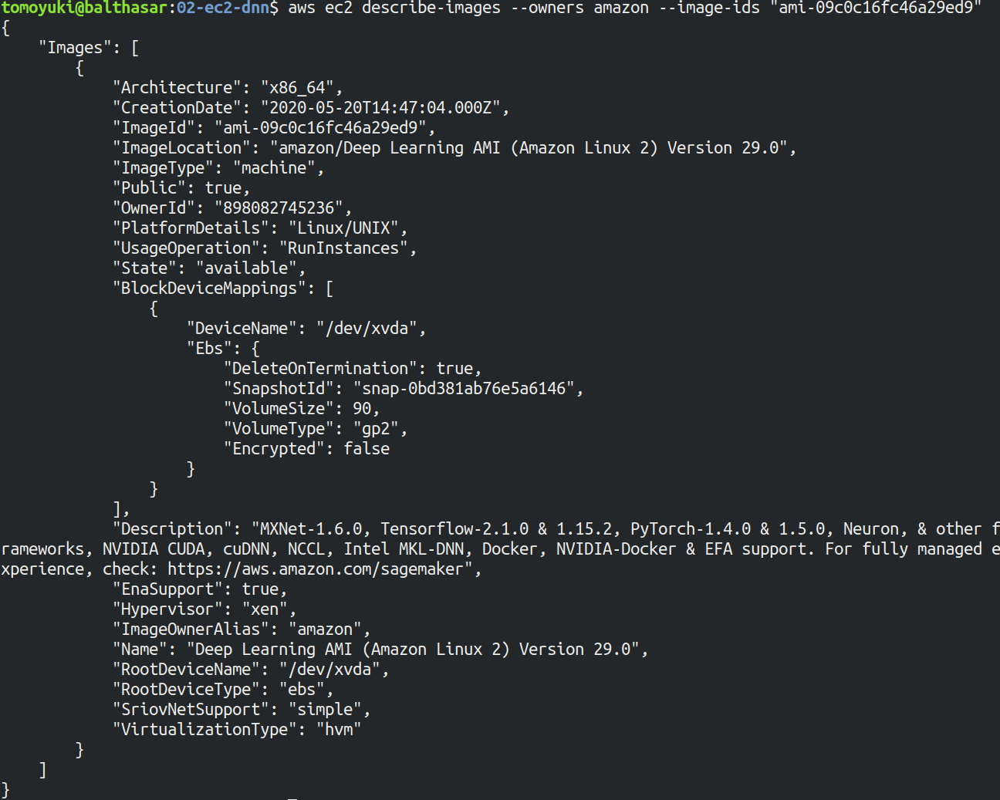

[figure_title](#handson_02_ami-info) のような出力が得られるはずである．得られた出力から，この DLAMI には PyTorch のバージョン 1.4.0 と 1.5.0 がインストールされていることがわかる． この DLAMI を使って，早速ディープラーニングの計算を実行してみよう．

DLAMI には具体的には何がインストールされているのだろうか？ 興味のある読者のために，簡単な解説をしよう (参考: [公式ドキュメンテーション "What Is the AWS Deep Learning AMI?"](https://docs.aws.amazon.com/dlami/latest/devguide/what-is-dlami.html))．

最も low-level なレイヤーとしては， GPU ドライバー がインストールされている． GPU ドライバーなしには OS は GPU とコマンドのやり取りをすることができない． 次のレイヤーが [CUDA](https://developer.nvidia.com/about-cuda) と [cuDNN](https://developer.nvidia.com/cudnn) である． CUDA は， NVIDIA 社が開発した， GPU 上で汎用コンピューティングを行うための言語であり， C++ 言語を拡張したシンタックスを備える． cuDNN は CUDA で書かれたディープラーニングのライブラリであり，n 次元の畳み込みなどの演算が実装されている． ここまでが， "Base" とよばれるタイプの DLAMI の中身である．

これに加えて， "Conda" とよばれるタイプには， "Base" のプログラム基盤の上に， `TensorFlow` や `PyTorch` などのライブラリがインストールされている． さらに， [Anaconda](https://docs.conda.io/projects/conda/en/latest/index.html) による仮想環境を使うことによって， `TensorFlow` の環境・ `PyTorch` の環境・ `MxNet` の環境など，フレームワークを簡単に切り替えることができる (これについては，後のハンズオンで触れる)． また， Jupyter Notebook もインストール済みである．

## スタックのデプロイ

スタックの中身が理解できたところで，早速スタックをデプロイしてみよう．

デプロイの手順は，ハンズオン 1 とほとんど共通である． ここでは，コマンドのみ列挙する (`#` で始まる行はコメントである)． それぞれのコマンドの意味を忘れてしまった場合は，ハンズオン 1 に戻って復習していただきたい． シークレットキーの設定も忘れずに ([AWS CLI のインストール](#aws_cli_install))．

```shell
# プロジェクトのディレクトリに移動
$ cd handson/mnist

# venv を作成し，依存ライブラリのインストールを行う
$ python3 -m venv .env
$ source .env/bin/activate
$ pip install -r requirements.txt

# SSH鍵を生成
$ export KEY_NAME="HirakeGoma"
$ aws ec2 create-key-pair --key-name ${KEY_NAME} --query 'KeyMaterial' --output text > ${KEY_NAME}.pem
$ mv HirakeGoma.pem ~/.ssh/
$ chmod 400 ~/.ssh/HirakeGoma.pem

# デプロイを実行
$ cdk deploy -c key_name="HirakeGoma"
```

ハンズオン 1 で作成した SSH 鍵の削除を行わなかった場合は， SSH 鍵を改めて作成する必要はない． 逆に言うと，同じ名前の SSH がすでに存在する場合は，鍵生成のコマンドはエラーを出力する．

デプロイのコマンドが無事に実行されれば， [figure_title](#handson_02_cdk_output) のような出力が得られるはずである．AWS により割り振られた IP アドレス (`InstancePublicIp` に続く文字列) をメモしておこう．

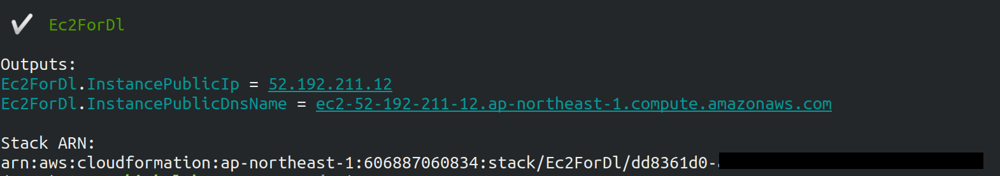

## ログイン

早速，デプロイしたインスタンスに SSH でログインしてみよう． ここでは，この後で使う Jupyter Notebook に接続するため，**ポートフォワーディング (port forwarding)** のオプション (`-L`) をつけてログインする．

```shell
$ ssh -i ~/.ssh/HirakeGoma.pem -L localhost:8931:localhost:8888 ec2-user@<IP address>
```

ポートフォワーディングとは，クライアントマシンの特定のアドレスへの接続を， SSH の暗号化された通信を介して，リモートマシンの特定のアドレスへ転送する，という意味である． このコマンドの `-L localhost:8931:localhost:8888` は，自分のローカルマシンの `localhost:8931` へのアクセスを，リモートサーバーの `localhost:8888` のアドレスに転送せよ，という意味である (`:` につづく数字は TCP/IP ポートの番号を意味している)． リモートサーバーのポート 8888 には，後述する Jupyter Notebook が起動している． したがって，ローカルマシンの `localhost:8931` にアクセスすることで，リモートサーバーの Jupyter Notebook にアクセスすることができるのである ([figure_title](#fig:ssh_port_forwarding))． このような SSH による接続方式を**トンネル接続**とよぶ．

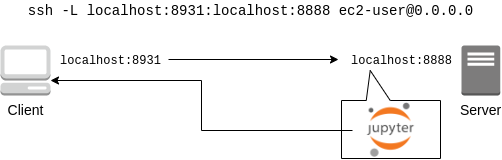

ポートフォワーディングのオプションで，ポートの番号 (`:8931`, `:8888` など) には 1 から 65535 までの任意の整数を指定できる． しかし，たとえば ポート 22 (SSH) やポート 80 (HTTP) など，いくつかすでに使われているポート番号もあることに注意する． また， Jupyter Notebook はデフォルトではポート 8888 番を使用する． したがって，リモート側のポート番号は，8888 を使うのがよい．

SSH ログインコマンドの `<IP address>` 部分は自身のインスタンスの IP アドレスを代入することを忘れずに．

**本書の提供している Docker を使ってデプロイを実行した人へ**

SSH によるログインは， **Docker の外** (すなわちクライアントマシン本体) から行わなければならない． なぜなら，Jupyter を開くウェブブラウザは Docker の外にあるからである．

その際，秘密鍵を Docker の外にもってこなければならない． 手っ取り早い方法は， `cat ~/.ssh/HirakeGoma` と打って，出力結果をコピーしてホストマシンのファイルに書き込む方法である． あるいは `-v` オプションをつけて，ファイルシステムをマウントしてもよい (詳しくは [Docker 公式ドキュメンテーション "Use volumes"](https://docs.docker.com/storage/volumes/) を参照)．

SSH によるログインができたら，早速， GPU の状態を確認してみよう． 次のコマンドを実行する．

```shell
$ nvidia-smi
```

[figure_title](#handson_02_nvidia-smi) のような出力が得られるはずである． 出力を見ると， Tesla T4 型の GPU が 1 台搭載されていることが確認できる． その他，GPU Driver や CUDA のバージョン， GPU の負荷・メモリー使用率などの情報を確認することができる．

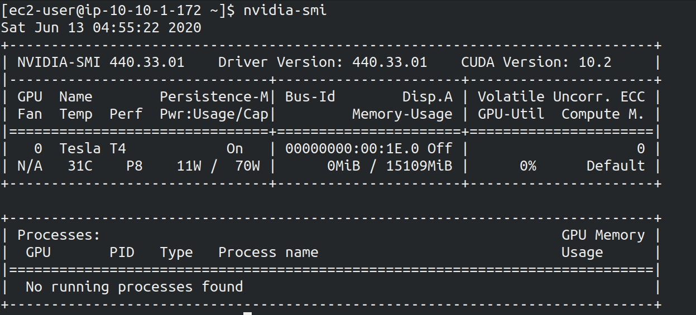

## Jupyter Notebook の起動

[Jupyter Notebook](https://jupyter.org/) とは，インタラクティブに Python のプログラムを書いたり実行したりするためのツールである． Jupyter は GUI としてウェブブラウザを介してアクセスする形式をとっており，まるでノートを書くように，プロットやテーブルのデータも美しく表示することができる ([figure_title](#handson_02_welcome_jupyter))． Python に慣れている読者は，きっと一度は使ったことがあるだろう．

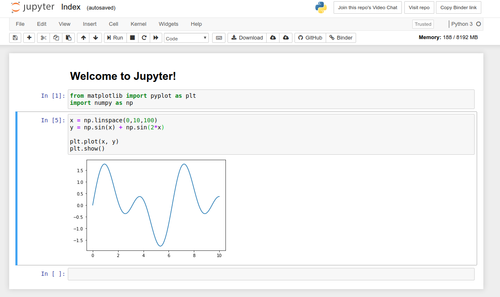

このハンズオンでは， Jupyter Notebook を使ってディープラーニングのプログラムをインタラクティブに実行していく． DLAMI には既に Jupyter がインストールされているので，特段の設定なしに使い始めることができる．

早速， Jupyter を起動しよう． SSH でログインした先の EC2 インスタンスで，次のコマンドを実行すればよい．

```shell
$ cd ~ # go to home directory
$ jupyter notebook
```

このコマンドを実行すると， [figure_title](#handson_02_jupyter_launch) のような出力が確認できるだろう． この出力から，Jupyter のサーバーが EC2 インスタンスの `localhost:8888` というアドレスに起動していることがわかる． また， `localhost:8888` に続く `?token=XXXX` は，アクセスに使うための一時的なトークンである．

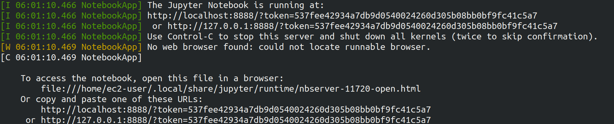

Jupyter Notebook を初回に起動するときは，起動に数分程度の時間がかかることがある． ほかの動作も起動直後は遅く，いくつかプログラムを走らせていくうちに俊敏に反応するようになってくる． これは， AWS の GPU 搭載型仮想マシンの運用方法に起因する現象だと考えられる．

先ほど，ポートフォワーディングのオプションをつけて SSH 接続をしているので， Jupyter の起動している `localhost:8888` には，ローカルマシンの `localhost:8931` からアクセスすることができる． したがって，ローカルマシンから Jupyter にアクセスするには，ウェブブラウザ (Chrome, FireFox など)から次のアドレスにアクセスすれば良い．

http://localhost:8931/?token=XXXX&lt;/programlisting&gt;

`?token=XXXX` の部分は，上で Jupyter を起動したときに発行されたトークンの値に置き換える．

上のアドレスにアクセスすると， Jupyter のホーム画面が起動するはずである ([figure_title](#handson_02_jupyter_home))． これで， Jupyter の準備が整った！

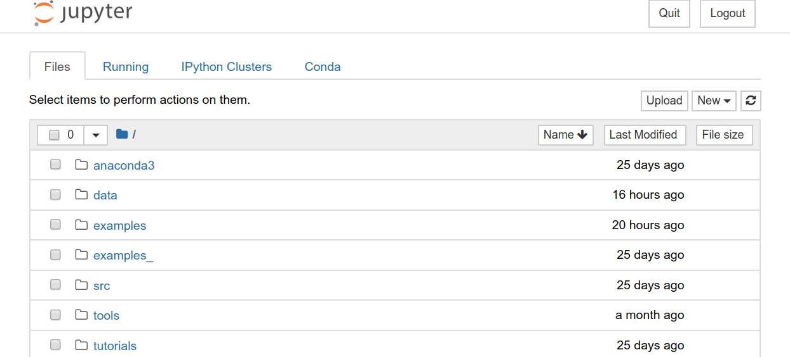

Jupyter Notebook の使い方 (超簡易版)

-   `Shift` + `Enter`: セルを実行

-   `Esc`: **Command mode** に遷移

-   メニューバーの "+" ボタン または Command mode で `A` ⇒ セルを追加

-   メニューバーの "ハサミ" ボタン または Command mode で `X` ⇒ セルを削除

ショートカットの一覧などは [Ventsislav Yordanov 氏によるブログ](https://towardsdatascience.com/jypyter-notebook-shortcuts-bf0101a98330) が参考になる．

## PyTorch はじめの一歩

[PyTorch](https://pytorch.org/) は Facebook AI Research LAB (FAIR) が中心となって開発を進めている，オープンソースのディープラーニングのライブラリである． PyTorch は 有名な例で言えば Tesla 社の自動運転プロジェクトなどで使用されており，執筆時点において最も人気の高いディープラーニングライブラリの一つである． 本ハンズオンでは， PyTorch を使ってディープラーニングの実践を行う．

PyTorch の歴史のお話

Facebook は PyTorch のほかに Caffe2 とよばれるディープラーニングのフレームワークを開発していた (初代 Caffe は UC Berkley の博士課程学生だった Yangqing Jia によって創られた)． Caffe2 は 2018 年に PyTorch プロジェクトに合併された．

また，2019 年 12 月，日本の Preferred Networks 社が開発していた [Chainer](https://chainer.org/) も開発を終了し，PyTorch の開発チームと協業していくことが発表された (詳しくは [プレスリリース](https://chainer.org/announcement/2019/12/05/released-v7-ja.html) を参照)． PyTorch には，開発統合前から Chainer からインスパイアされた API がいくつもあり， Chainer の DNA は今も PyTorch に引き継がれているのである…!

本格的なディープラーニングの計算に移る前に， PyTorch ライブラリを使って， GPU で計算を行うとはどういうものか，その入り口に触れてみよう．

まずは，新しいノートブックを作成する． Jupyter のホーム画面の右上の "New" を押し，"conda_pytorch_p36" という環境を選択したうえで，新規ノートブックを作成する ([figure_title](#handson_02_jupyeter_new))． "conda_pytorch_p36" の仮想環境には， PyTorch がインストール済みである．


ここでは，次のようなプログラムを書いて，実行していく． ([figure_title](#handson_02_jupyeter_pytorch))．

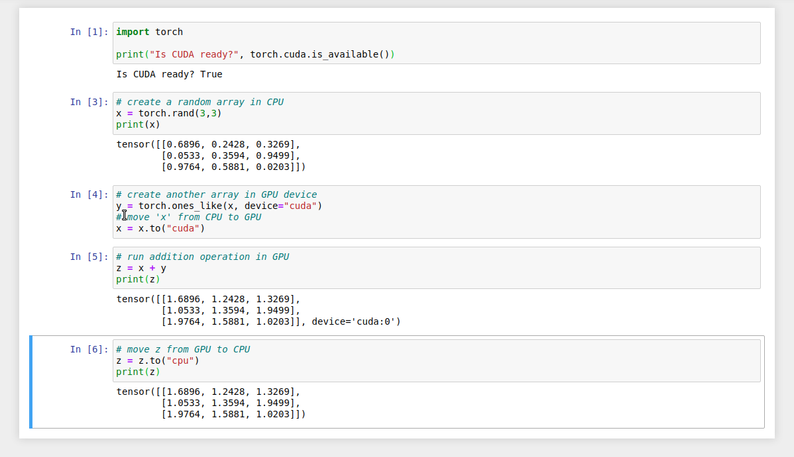

まずは， PyTorch をインポートする．さらに， GPU が使える環境にあるか，確認する．

```python
import torch
print("Is CUDA ready?", torch.cuda.is_available())
```

出力:

Is CUDA ready? True&lt;/programlisting&gt;

次に，3x3 のランダムな行列を **CPU** 上に作ってみよう．

```python
x = torch.rand(3,3)
print(x)
```

出力:

tensor(\[\[0.6896, 0.2428, 0.3269\], \[0.0533, 0.3594, 0.9499\], \[0.9764, 0.5881, 0.0203\]\])&lt;/programlisting&gt;

次に，行列を **GPU** 上に作成する．

```python
y = torch.ones_like(x, device="cuda")
x = x.to("cuda")
```

そして，行列 `x` と `y` の加算を，**GPU 上で実行する**．

```python
z = x + y
print(z)
```

出力:

tensor(\[\[1.6896, 1.2428, 1.3269\], \[1.0533, 1.3594, 1.9499\], \[1.9764, 1.5881, 1.0203\]\], device='cuda:0')&lt;/programlisting&gt;

最後に， GPU 上にある行列を， CPU に戻す．

```python
z = z.to("cpu")
print(z)
```

出力:

tensor(\[\[1.6896, 1.2428, 1.3269\], \[1.0533, 1.3594, 1.9499\], \[1.9764, 1.5881, 1.0203\]\])&lt;/programlisting&gt;

以上の例は， GPU を使った計算の初歩の初歩であるが，雰囲気はつかめただろうか？ CPU と GPU で明示的にデータを交換するのが肝である． この例はたった 3x3 の行列の足し算なので， GPU を使う意味はまったくないが，これが数千，数万のサイズの行列になったとき， GPU は格段の威力を発揮する．

完成した Jupyter Notebook は [/handson/mnist/pytorch/pytorch_get_started.ipynb](https://github.com/tomomano/learn-aws-by-coding/blob/main/handson/mnist/pytorch/pytorch_get_started.ipynb) にある． Jupyter の画面右上の "Upload" からこのファイルをアップロードして，コードを走らせることが可能である．

しなしながら，勉強のときにはコードはすべて自分の手で打つことが，記憶に残りやすくより効果的である，というのが筆者の意見である．

実際にベンチマークを取ることで GPU と CPU の速度を比較をしてみよう． 実行時間を計測するツールとして， Jupyter の提供する [%time](https://ipython.readthedocs.io/en/stable/interactive/magics.html) マジックコマンドを利用する．

まずは CPU を使用して，10000x10000 の行列の行列積を計算した場合の速度を測ってみよう． 先ほどのノートブックの続きに，次のコードを実行する．

```python
s = 10000
device = "cpu"
x = torch.rand(s, s, device=device, dtype=torch.float32)
y = torch.rand(s, s, device=device, dtype=torch.float32)

%time z = torch.matmul(x,y)
```

出力は以下のようなものが得られるだろう． これは，行列積の計算に実時間で 5.8 秒かかったことを意味する (実行のたびに計測される時間はばらつくことに留意)．

CPU times: user 11.5 s, sys: 140 ms, total: 11.6 s Wall time: 5.8 s&lt;/programlisting&gt;

次に， GPU を使用して，同じ演算を行った場合の速度を計測しよう．

```python
s = 10000
device = "cuda"
x = torch.rand(s, s, device=device, dtype=torch.float32)
y = torch.rand(s, s, device=device, dtype=torch.float32)
torch.cuda.synchronize()

%time z = torch.matmul(x,y); torch.cuda.synchronize()
```

出力は以下のようなものになるだろう． GPU では 553 ミリ秒 で計算を終えることができた！

CPU times: user 334 ms, sys: 220 ms, total: 554 ms Wall time: 553 ms&lt;/programlisting&gt;

PyTorch において， GPU での演算は asynchronous (非同期) で実行される． その理由で，上のベンチマークコードでは， `torch.cuda.synchronize()` というステートメントを埋め込んである．

このベンチマークでは， `dtype=torch.float32` と指定することで，32bit の浮動小数点型を用いている． ディープラーニングの学習および推論の計算には，32bit 型，場合によっては 16bit 型が使われるのが一般的である． これの主な理由として，教師データやミニバッチに起因するノイズが，浮動小数点の精度よりも大きいことがあげられる． 32bit/16bit を採用することで，メモリー消費を抑えたり，計算速度の向上が達成できる．

上記のベンチマークから，GPU を用いることで，**約 10 倍のスピードアップ**を実現することができた． スピードアップの性能は，演算の種類や行列のサイズに依存する． 行列積は，そのなかでも最も速度向上が見込まれる演算の一つである．

## 実践ディープラーニング! MNIST 手書き数字認識タスク

ここまで，AWS 上でディープラーニングの計算をするための概念や前提知識をながながと説明してきたが，ついにここからディープラーニングの計算を実際に走らせてみる．

ここでは，機械学習のタスクで最も初歩的かつ有名な **MNIST データセットを使った数字認識**を扱う ([figure_title](#handson_02_mnist_examples))． これは，0 から 9 までの手書きの数字の画像が与えられ，その数字が何の数字なのかを当てる，というシンプルなタスクである．


今回は， MNIST 文字認識タスクを，**畳み込みニューラルネットワーク (Convolutional Neural Network; CNN)** を使って解く． ソースコードは [/handson/minist/pytorch/](https://github.com/tomomano/learn-aws-by-coding-source-code/tree/main/handson/mnist/pytorch) にある `mnist.ipynb` と `simple_mnist.py` である． なお，このプログラムは， [PyTorch の公式 Example Project 集](https://github.com/pytorch/examples/tree/master/mnist) を参考に，多少の改変を行ったものである．

まずは，カスタムのクラスや関数が定義された `simple_mnist.py` をアップロードしよう ([figure_title](#handson_02_jupyter_upload))． 画面右上の "Upload" ボタンをクリックし，ファイルを選択することでアップロードができる． この Python プログラムの中に，CNN のモデルや，学習の各イテレーションにおけるパラメータの更新などが記述されている． 今回はこの中身を説明することはしないが，興味のある読者は自身でソースコードを読んでみるとよい．


`simple_mnist.py` をアップロードできたら，次に新しい notebook を作成しよう． "conda_pytorch_p36" の環境を選択することを忘れずに．

新しいノートブックが起動したら，まずは必要なライブラリをインポートしよう．

```python
import torch
import torch.optim as optim
import torchvision
from torchvision import datasets, transforms
from matplotlib import pyplot as plt

# custom functions and classes
from simple_mnist import Model, train, evaluate
```

[torchvision](https://pytorch.org/docs/stable/torchvision/index.html) パッケージには，MNIST データセットをロードするなどの便利な関数が含まれている． また，今回のハンズオンで使うカスタムのクラス・関数 (`Model`, `train`, `evaluate`) のインポートを行っている．

次に，MNIST テストデータをダウンロードしよう． 同時に，画像データの輝度の正規化も行っている．

```python
transf = transforms.Compose([transforms.ToTensor(),
                             transforms.Normalize((0.1307,), (0.3081,))])

trainset = datasets.MNIST(root='./data', train=True, download=True, transform=transf)
trainloader = torch.utils.data.DataLoader(trainset, batch_size=64, shuffle=True)

testset = datasets.MNIST(root='./data', train=False, download=True, transform=transf)
testloader = torch.utils.data.DataLoader(testset, batch_size=1000, shuffle=True)
```

今回扱う MNIST データは 28x28 ピクセルの正方形の画像(モノクロ)と，それぞれのラベル(0 - 9 の数字)の組で構成されている． いくつかのデータを抽出して，可視化してみよう． [figure_title](#handson_02_mnist_ground_truth) のような出力が得られるはずである．

```python
examples = iter(testloader)
example_data, example_targets = examples.next()

print("Example data size:", example_data.shape)

fig = plt.figure(figsize=(10,4))
for i in range(10):
    plt.subplot(2,5,i+1)
    plt.tight_layout()
    plt.imshow(example_data[i][0], cmap='gray', interpolation='none')
    plt.title("Ground Truth: {}".format(example_targets[i]))
    plt.xticks([])
    plt.yticks([])
plt.show()
```


次に， CNN のモデルを定義する．

```python
model = Model()
model.to("cuda") # load to GPU
```

今回使う `Model` は `simple_mnist.py` の中で定義されている． このモデルは，[figure_title](#handson_02_cnn_architecture) に示したような，２層の畳み込み層と 2 層の全結合層からなるネットワークである． 出力層 (output layer) には Softmax 関数を使用し，損失関数 (Loss function) には 負の対数尤度関数 (Negative log likelyhood; NLL) を使用している．

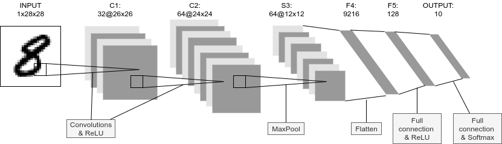

続いて， CNN のパラメータを更新する最適化アルゴリズムを定義する． ここでは， **確率的勾配降下法 (Stochastic Gradient Descent; SGD)** を使用している．

```python
optimizer = optim.SGD(model.parameters(), lr=0.01, momentum=0.5)
```

これで，準備が整った． CNN の学習ループを開始しよう!

```python
train_losses = []
for epoch in range(5):
    losses = train(model, trainloader, optimizer, epoch)
    train_losses = train_losses + losses
    test_loss, test_accuracy = evaluate(model, testloader)
    print(f"\nTest set: Average loss: {test_loss:.4f}, Accuracy: {test_accuracy:.1f}%\n")

plt.figure(figsize=(7,5))
plt.plot(train_losses)
plt.xlabel("Iterations")
plt.ylabel("Train loss")
plt.show()
```

ここでは 5 エポック分の学習を行っている． GPU を使えば，これくらいの計算であれば 1 分程度で完了するだろう．

出力として， [figure_title](#handson_02_train_loss) のようなプロットが得られるはずである． イテレーションを重ねるにつれて，損失関数 (Loss function) の値が減少している (=精度が向上している) ことがわかる．

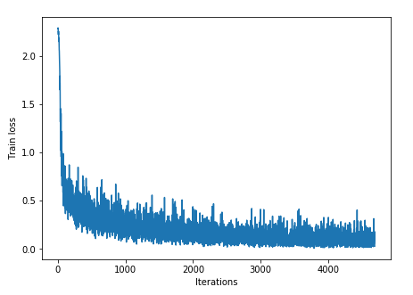

出力にはテキスト形式で各エポック終了後のテストデータに対する精度も表示されている． 最終的には 98% 以上の極めて高い精度を実現できていることが確認できるだろう ([figure_title](#handson_02_mnist_final_score))．


学習した CNN の推論結果を可視化してみよう． 次のコードを実行することで， [figure_title](#handson_02_mnist_mnist_prediction) のような出力が得られるだろう． この図で，下段右から二番目は，"1"に近い見た目をしているが，きちんと"9"と推論できている． なかなか賢い CNN を作り出すことができたようだ！

```python
model.eval()

with torch.no_grad():
    output = model(example_data.to("cuda"))

fig = plt.figure(figsize=(10,4))
for i in range(10):
    plt.subplot(2,5,i+1)
    plt.tight_layout()
    plt.imshow(example_data[i][0], cmap='gray', interpolation='none')
    plt.title("Prediction: {}".format(output.data.max(1, keepdim=True)[1][i].item()))
    plt.xticks([])
    plt.yticks([])
plt.show()
```

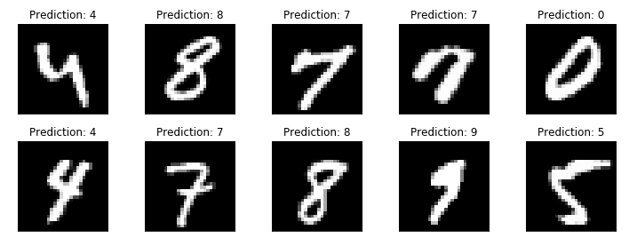

最後に，学習したニューラルネットワークのパラメータを `mnist_cnn.pt` というファイル名で保存しておこう． これで，将来いつでも今回学習したモデルを再現し，別の実験に使用することができる．

```python
torch.save(model.state_dict(), "mnist_cnn.pt")
```

以上が， AWS クラウドの仮想サーバーを立ち上げ，最初のディープラーニングの計算を行う一連の流れである． MNIST 文字認識のタスクを行うニューラルネットを，クラウド上の GPU を使って高速に学習させ，現実的な問題を一つ解くことができたのである． 興味のある読者は，今回のハンズオンを雛形に，自分の所望の計算を走らせてみるとよいだろう．

## スタックの削除

これにて，ハンズオン第二回の内容はすべて説明した． クラウドの利用料金を最小化するため，使い終わった EC2 インスタンスはすぐさま削除しよう．

ハンズオン第一回と同様に， AWS の CloudFormation コンソールか， AWS CLI により削除を実行する (詳細は [スタックを削除](#handson_01_delete_stack) 参照)．

```shell
$ cdk destroy
```

**スタックの削除は各自で必ず行うこと！** 行わなかった場合，EC2 インスタンスの料金が発生し続けることになる！ `g4dn.xlarge` は $0.71 / hour の料金設定なので，一日起動しつづけると約$17 の請求が発生することになる！

**AWS のバジェットアラート**

AWS の初心者が (あるいは経験者も) しばしば陥る失敗が，インスタンスの停止忘れなどで無駄なリソースがクラウドで放置されてしまい，巨大な額の請求が届く，というミスだ． 特に，開発を行っている間はこのような事態は起こりうるものだと思って，備えておかなければならない． このような事態を未然に防ぐため， AWS Budgets という機能が無料で提供されている． AWS Budgets を利用することで，月の利用金額がある閾値を超えた場合にユーザーにメールが送信される，などのアラートを設定することができる． 詳細な手順は [AWS の公式ブログ "Getting Started with AWS Budgets"](https://aws.amazon.com/blogs/aws-cost-management/getting-started-with-aws-budgets/) を参照のこと． 本書の読者も，ぜひこのタイミングでアラートを設定しておくことを推奨する．

# Docker 入門

ここまでの章で扱ってきたハンズオンでは，**単一のサーバー**を立ち上げ，それに SSH でログインをして，コマンドを叩くことで計算を行ってきた． いわば，*パーソナルコンピュータの延長*のような形でクラウドを使ってきたわけである． このような，インターネットのどこからでもアクセスできるパーソナルコンピュータとしてのクラウドという使い方も，もちろん便利であるし，いろいろな応用の可能性がある． しかし，これだけではクラウドの本当の価値は十分に発揮されていないと言うべきだろう． [クラウド概論](#chap_cloud_basics) で述べたように，現代的なクラウドの一番の強みは自由に計算機の規模を拡大できることにある． すなわち，**多数のサーバーを同時に起動し，複数のジョブを分散並列的に実行させることで大量のデータを処理してこそ，クラウドの本領が発揮される**のである．

本章からはじまる 3 章分 ([Docker 入門](#sec_docker_introduction), [Hands-on \#3: AWS で自動質問回答ボットを走らせる](#sec_fargate_qabot), [Hands-on \#4: AWS Batch を使って機械学習のハイパーパラメータサーチを並列化する](#sec_aws_batch)) を使って，クラウドを利用することでどのように大規模な計算システムを構築しビッグデータの解析に立ち向かうのか，その片鱗をお見せしたい． とくに，前章で扱った深層学習をどのようにビッグデータに適用していくかという点に焦点を絞って議論していきたい． そのための前準備として，本章では [Docker](https://www.docker.com/) とよばれる計算機環境の仮想化ソフトウェアを紹介する ([figure_title](#fig:docker_logo))． 現代のクラウドは Docker なしには成り立たないといっても過言ではないだろう． クラウドに限らず，ローカルで行う計算処理にも Docker は大変便利である． AWS からは少し話が離れるが，しっかりと理解して前に進んでもらいたい．

## 機械学習の大規模化

先ほどから"計算システムの大規模化"と繰り返し唱えているが，それは具体的にはどのようなものを指しているのか？ ここでは大規模データを処理するための計算機システムを，機械学習を例にとって見てみよう．

[クラウドで行う科学計算・機械学習](#sec_scientific_computing) で紹介した [GPT-3](https://github.com/openai/gpt-3) のような，超巨大な数のパラメータを有する深層学習モデルを学習させたいとしよう． そのような計算を行いたい場合，一つのサーバーでは計算力が到底足りない． したがって，典型的には [figure_title](#big_dnn_training) に示すような計算システムの設計がなされる． すなわち，大量の教師データを小さなチャンクとして複数のマシンに分散し，並列的にニューラルネットのパラメータを最適化していくという構造である．


あるいは，学習済みのモデルを大量のデータに適用し，解析を行いたいとしよう． たとえば， SNS のプラットフォームで大量の画像が与えられて，それぞれの写真に何が写っているのかをラベルづけする，などのアプリケーションを想定できる． そのような場合は， [figure_title](#big_dnn_inference) のようなアーキテクチャが考えられるだろう． すなわち，大量のデータを複数のマシンで分割し，それぞれのマシンで推論の計算を行うというような構造である．


このような複数の計算機を同時に走らせるようなアプリケーションをクラウド上で実現するには，どのようにすればよいのだろうか？

重要なポイントとして， [figure_title](#big_dnn_training) や [figure_title](#big_dnn_inference) で起動している複数のマシンは，**基本的に全く同一の OS・計算環境を有している**点である． ここで，個人のコンピュータで行うようなインストールの操作を，各マシンで行うこともできるが，それは大変な手間であるし，メンテナンスも面倒だろう． すなわち，大規模な計算システムを構築するには，**簡単に計算環境を複製できるような仕組み**が必要であるということがわかる．

そのような目的を実現するために使われるのが， [Docker](https://www.docker.com/) とよばれるソフトウェアである．

## Docker とは

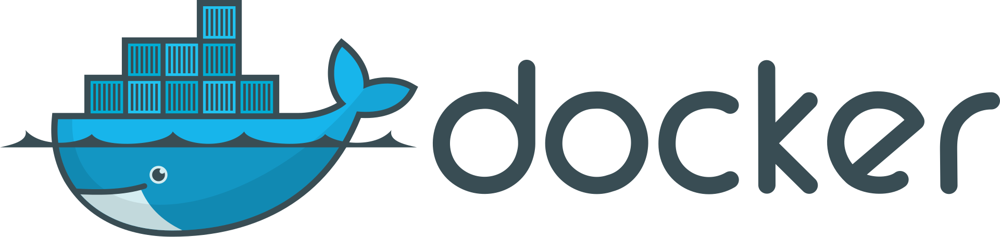

Docker とは， **コンテナ (Container)** とよばれる仮想環境下で，ホスト OS とは独立した別の計算環境を走らせるためのソフトウェアである． Docker を使うことで， OS を含めたすべてのプログラムをコンパクトにパッケージングすることが可能になる (パッケージされた一つの計算環境のことを **イメージ (Image)**とよぶ)． Docker を使うことで，クラウドのサーバー上に瞬時に計算環境を複製することが可能になり， [figure_title](#big_dnn_inference) で見たような複数の計算機を同時に走らせるためのシステムが実現できる．

Docker は 2013 年に Solomon Hykes らを中心に開発され，それ以降爆発的に普及し，クラウドコンピューティングだけでなく，機械学習・科学計算の文脈などでも欠かすことのできないソフトウェアとなった． Docker はエンタープライズ向けの製品を除き無料で使用することができ，コアの部分は [オープンソースプロジェクト](https://github.com/moby/moby) として公開されている． Docker は Linux, Windows, Mac いずれの OS でも提供されている． 概念としては， Docker は仮想マシン (Virtual machine; VM) にとても近い． ここでは， VM との対比をしながら，Docker とはなにかを簡単に説明しよう．

仮想マシン (VM) とは，ホストとなるマシンの上に，仮想化された OS を走らせる技術である ([figure_title](#docker_vs_vm))． VM には **ハイパーバイザー (Hypervisor)** とよばれるレイヤーが存在する． Hypervisor はまず，物理的な計算機リソース (CPU, RAM, network など) を分割し，仮想化する． たとえば， ホストマシンに物理的な CPU が 4 コアあるとして，ハイパーバイザーはそれを (2,2) 個の組に仮想的に分割することができる． VM 上で起動する OS には，ハイパーバイザーによって仮想化されたハードウェアが割り当てられる． VM 上で起動する OS は基本的に完全に独立であり，たとえば OS-A は OS-B に割り当てられた CPU やメモリー領域にアクセスすることはできない (これを isolation とよぶ)． VM を作成するための有名なソフトウェアとしては， [VMware](https://www.vmware.com/)， [VirtualBox](https://www.virtualbox.org/)， [Xen](https://xenproject.org/) などがある． また，これまで触ってきた EC2 も，基本的に VM 技術を使うことで所望のスペックをもった仮想マシンがユーザーに提示される．

Docker も， VM と同様に，仮想化された OS をホストの OS 上に走らせるための技術である． VM に対し， Docker ではハードウェアレベルの仮想化は行われておらず，すべての**仮想化はソフトウェアレベルで実現されている** ([figure_title](#docker_vs_vm))． Docker で走る仮想 OS は，**多くの部分をホストの OS に依存しており，結果として非常にコンパクトである**． その結果， Docker で仮想 OS を起動するために要する時間は， VM に比べて圧倒的に早い． また， パッケージ化された環境 (=イメージ) のサイズも完全な OS に比べ圧倒的に小さくなるので，ネットワークを通じたやり取りが非常に高速化される点も重要である 加えて， VM のいくつかの実装では，メタル (仮想化マシンに対して，物理的なハードウェア上で直接起動する場合のこと) と比べ，ハイパーバイザーレイヤーでのオーバーヘッドなどにより性能が低下することが知られているが， Docker ではメタルとほぼ同様の性能を引き出すことができるとされている．

その他， VM との相違点などはたくさんあるのだが，ここではこれ以上詳細には立ち入らない． 大事なのは， **Docker とはとてもコンパクトかつハイパフォーマンスな仮想計算環境を作るツールである**，という点である． その手軽さゆえに，2013 年の登場以降，クラウドシステムでの利用が急速に増加し，現代のクラウドでは欠くことのできない中心的な技術になっている．


職業的プログラマーにとっての"三種の神器"とはなんだろうか？ 多様な意見があると思うが，筆者は **Git**, **Vim** そして **Docker** を挙げたい．

Git は多くの読者がご存じの通り，コードの変更を追跡するためのシステムである． Linux の作成者である Linus Torvalds によって 2005 年に誕生した． チームでの開発を進める際には欠かせないツールだ．

Vim は 1991 年から 30 年以上の間プログラマーたちに愛されてきたテキストエディターである． [Stackoverflow が行った 2019 年のアンケート](https://insights.stackoverflow.com/survey/2019#technology-development-environments-and-tools-all-respondents) によると，開発環境の部門で 5 位の人気を獲得している． たくさんのショートカットと様々なカスタム設定が提供されているので，初見の人にはなかなかハードルが高いが，一度マスターすれば他のモダンなエディターや統合開発環境に負けない，あるいはそれ以上の開発体験を実現することができる．

これらの十年以上の歴史あるツールに並んで，第三番目の三種の神器として挙げたいのが Docker だ． Docker はプログラマーの開発のワークフローを一変させた． たとえば，プロジェクトごとに Docker イメージを作成することで，どの OS・コンピュータ でも全く同じ計算環境で開発・テストを実行することができるようになった． また， [DevOps](https://en.wikipedia.org/wiki/DevOps) や [CI](https://en.wikipedia.org/wiki/Continuous_integration) / [CD](https://en.wikipedia.org/wiki/Continuous_delivery) (Continuous Integration / Continuous Deployment) といった最近の開発ワークフローも Docker のようなコンテナ技術の存在に立脚している． さらにはサーバーレスコンピューティング ([Serverless architecture](#sec_serverless)) といった概念も，コンテナ技術の生んだ大きな技術革新といえる．

あなたにとっての三種の神器はなんだろうか？ また，これからの未来ではどんな新しいツールが三種の神器としてプログラマーのワークフローを革新していくだろうか？

## Docker チュートリアル

Docker とはなにかを理解するためには，実際に触って動かしてみるのが一番有効な手立てである． ここでは， Docker の簡単なチュートリアルを行っていく．

Docker のインストールについては， [Docker のインストール](#sec:install_docker) および [公式のドキュメンテーション](https://docs.docker.com/engine/install/) を参照してもらいたい． Docker のインストールが完了している前提で，以下は話を進めるものとする．

### Docker 用語集

Docker を使い始めるに当たり，最初に主要な用語を解説しよう． 次のパラグラフで太字で強調された用語を頭に入れた上で，続くチュートリアルに取り組んでいただきたい．

Docker を起動する際の大まかなステップを示したのが [figure_title](#fig:docker_image_container) である． パッケージされた一つの計算環境のことを **イメージ (Image)**とよぶ． イメージは， Docker Hub などのリポジトリで配布されているものをダウンロードするか，自分でカスタムのイメージを作成することも可能である． イメージを作成するための”レシピ”を記述したファイルが **Dockerfile** である． Dockerfile からイメージを作成する操作を **build** とよぶ． イメージがホストマシンのメモリにロードされ，起動状態にある計算環境のことを **コンテナ (Container)** とよぶ． Container を起動するために使用されるコマンドが **run** である．


### イメージをダウンロード

パッケージ化された Docker の仮想環境 (= **イメージ (Image)**) は， [Docker Hub](https://hub.docker.com/) からダウンロードできる． Docker Hub には，個人や企業・団体が作成した Docker イメージが集められており， GitHub などと同じ感覚で，オープンな形で公開されている．

たとえば， Ubuntu のイメージは [Ubuntu の公式リポジトリ](https://hub.docker.com/_/ubuntu) で公開されており， `pull` コマンドを使うことでローカルにダウンロードすることができる．

```shell
$ docker pull ubuntu:18.04
```

ここで，イメージ名の `:` (コロン) 以降に続く文字列を **タグ (tag)** と呼び，主にバージョンを指定するなどの目的で使われる．

`pull` コマンドはデフォルトでは Docker Hub でイメージを検索し，ダウンロードを行う． Docker イメージを公開するためのデータベース (レジストリ (registry) とよぶ) は Docker Hub だけではなく，たとえば GitLab や GitHub は独自のレジストリ機能を提供しているし，個人のサーバーでレジストリを立ち上げることも可能である． Docker Hub 以外のレジストリから pull するには， `myregistry.local:5000/testing/test-image` のように，イメージ名の先頭につける形でレジストリのアドレス (さらにオプションとしてポート番号) を指定する．

### コンテナを起動

Pull してきたイメージを起動するには， `run` コマンドを使う．

```shell
$ docker run -it ubuntu:18.04
```

ここで， `-it` とは，インタラクティブな shell のセッションを開始するために必要なオプションである．

このコマンドを実行すると，仮想化された Ubuntu が起動され，コマンドラインからコマンドが打ち込めるようになる ([figure_title](#docker_shell))． このように起動状態にある計算環境 (ランタイム) のことを **Container (コンテナ)** とよぶ．


ここで使用した `ubuntu:18.04` のイメージは，空の Ubuntu OS だが，すでにプログラムがインストール済みのものもある． これは， [Hands-on \#2: AWS でディープラーニングを実践](#sec_jupyter_and_deep_learning) でみた DLAMI と概念として似ている． たとえば， PyTorch がインストール済みのイメージは [PyTorch 公式の Docker Hub リポジトリ](https://hub.docker.com/r/pytorch/pytorch) で公開されている．

これを起動してみよう．

```shell
$ docker run -it pytorch/pytorch
```

`docker run` を実行したとき，ローカルに該当するイメージが見つからない場合は，自動的に Docker Hub からダウンロードされる．

pytorch のコンテナが起動したら， Python のシェルを立ち上げて， pytorch をインポートしてみよう．

```shell
$ python3
Python 3.7.7 (default, May  7 2020, 21:25:33)
[GCC 7.3.0] :: Anaconda, Inc. on linux
Type "help", "copyright", "credits" or "license" for more information.
>>> import torch
>>> torch.cuda.is_available()
False
```

このように， Docker を使うことで簡単に特定の OS・プログラムの入った計算環境を再現することが可能になる．

### 自分だけのイメージを作る

自分の使うソフトウェア・ライブラリがインストールされた，自分だけのイメージを作ることも可能である．

たとえば， [本書のハンズオン実行用に提供している docker イメージ](https://hub.docker.com/repository/docker/tomomano/labc) には， Python, Node.js, AWS CLI, AWS CDK などのソフトウェアがインストール済みであり，ダウンロードしてくるだけですぐにハンズオンのプログラムが実行できるようになっている．

カスタムの docker イメージを作るには， `Dockerfile` という名前のついたファイルを用意し，その中にどんなプログラムをインストールするかなどを記述していく．

具体例として，本書で提供している Docker イメージのレシピを見てみよう ([docker/Dockerfile](https://github.com/tomomano/learn-aws-by-coding/blob/main/docker/Dockerfile))．

```python
FROM node:12
LABEL maintainer="Tomoyuki Mano"

RUN apt-get update \
    && apt-get install nano

#
RUN cd /opt \
    && curl -q "https://www.python.org/ftp/python/3.7.6/Python-3.7.6.tgz" -o Python-3.7.6.tgz \
    && tar -xzf Python-3.7.6.tgz \
    && cd Python-3.7.6 \
    && ./configure --enable-optimizations \
    && make install

RUN cd /opt \
    && curl "https://awscli.amazonaws.com/awscli-exe-linux-x86_64.zip" -o "awscliv2.zip" \
    && unzip awscliv2.zip \
    && ./aws/install

#
RUN npm install -g aws-cdk@1.100

# clean up unnecessary files
RUN rm -rf /opt/*

# copy hands-on source code in /root/
COPY handson/ /root/handson
```

`Dockerfile` の中身の説明は詳しくは行わないが，たとえば上のコードで &lt;1&gt; で示したところは， Python 3.7 のインストールを実行している． また， &lt;2&gt; で示したところは， AWS CDK のインストールを行っていることがわかるだろう． このように，リアルな OS で行うのと同じ流れでインストールのコマンドを逐一記述していくことで，自分だけの Docker イメージを作成することができる． 一度イメージを作成すれば，それを配布することで，他者も同一の計算環境を簡単に再構成することができる．

"ぼくの環境ではそのプログラム走ったのにな…" というのは，プログラミング初心者ではよく耳にする会話だが， Docker を使いこなせばそのような心配とは無縁である． そのような意味で，クラウド以外の場面でも， Docker の有用性・汎用性は極めて高い．

コンテナを用いた仮想計算環境ツールとして Docker を紹介したが， ほかに選択肢はないのか？ よくぞ聞いてくれた！ Docker の登場以降，複数のコンテナベースの仮想環境ツールが開発されてきた． いずれのツールも，概念や API については Docker と共通するものが多いが，Docker にはない独自の特徴を提供している． ここではその中でも有名ないくつかを紹介しよう．

[Singularity](https://github.com/hpcng/singularity) は科学計算や HPC (High Performance Computing) の分野で人気の高いコンテナプラットフォームである． Singularity では大学・研究機関の HPC クラスターでの運用に適したような設計が施されている． たとえば， Docker は基本的には root 権限で実行されるのに対し， Singularity はユーザー権限 (コマンドを実行したユーザー自身) でプログラムが実行される． root 権限での実行は Web サーバーのように個人・企業がある特定のサービスのために運用するサーバーでは問題ないが，多数のユーザーが多様な目的で計算を実行する HPC クラスターでは問題となる． また，Singularity は独自のイメージの作成方法・エコシステムをもっているが， Docker イメージを Singularity のイメージに変換し実行する機能も有している．

[podman](https://github.com/containers/podman) は Red Hat 社によって開発されたもう一つのコンテナプラットフォームである． podman は基本的に Docker と同一のコマンドを採用しているが，実装は Red Hat によってスクラッチから行われた． podman では， Singularity と同様にユーザー権限でのプログラムの実行を可能であり，クラウドおよび HPC の両方の環境に対応するコンテナプラットフォームを目指して作られた． また，その名前にあるとおり pod とよばれる独自の概念が導入されている．

著者の個人的な意見としては，現時点では Docker をマスターしておけば当面は困ることはないと考えるが，興味のある読者はぜひこれらのツールも試してみてはいかがだろうか？

## Elastic Container Service (ECS)


ここまでに説明してきたように， Docker を使うことで仮想計算環境を簡単に複製・起動することが可能になる． 本章の最後の話題として， AWS 上で Docker を使った計算システムを構築する方法を解説しよう．

**Elastic Container Service (ECS)** とは， Docker を使った計算機クラスターを AWS 上に作成するためのツールである ([figure_title](#fig:logo_ecs))． ECS を使用することで， Docker にパッケージされたアプリケーションを計算機クラスターに投入したり，計算機クラスターのインスタンスを追加・削除する操作 (=スケーリング) を行うことができる．

ECS の概要を示したのが [figure_title](#ecs_overview) である． ECS は，**タスク (Task)** と呼ばれる単位で管理された計算ジョブを受け付ける． システムにタスクが投入されると，ECS は最初にタスクで指定された Docker イメージを外部レジストリからダウンロードしてくる． 外部レジストリとしては， Docker Hub や AWS 独自の Docker レジストリである **ECR (Elastic Container Registry)** を指定することができる．

ECS の次の重要な役割はタスクの配置である． あらかじめ定義されたクラスター内で，計算負荷が小さい仮想インスタンスを選び出し，そこに Docker イメージを配置することで指定された計算タスクが開始される． "計算負荷が小さい仮想インスタンスを選び出す" と言ったが，具体的にどのような戦略・ポリシーでこの選択を行うかは，ユーザーの指定したパラメータに従う．

また，クラスターのスケーリングも ECS における重要な概念である． スケーリングとは，クラスター内のインスタンスの計算負荷をモニタリングし，計算負荷に応じてインスタンスの起動・停止を行う操作を指す． クラスター全体の計算負荷が指定された閾値 (たとえば 80%の稼働率) を超えていた場合，新たな仮想インスタンスをクラスター内に立ち上げる操作を scale-out (スケールアウト) とよび， 負荷が減った場合に不要なインスタンスを停止する操作を scale-in (スケールイン) とよぶ． クラスターのスケーリングは， ECS がほかの AWS のサービスと連携することで実現される． 具体的には， EC2 の **Auto scaling group (ASG)** や **Fargate** の２つの選択肢が多くの場合選択される． **ASG** については [Hands-on \#4: AWS Batch を使って機械学習のハイパーパラメータサーチを並列化する](#sec_aws_batch), Fargate については [Hands-on \#3: AWS で自動質問回答ボットを走らせる](#sec_fargate_qabot) でより詳細に解説する．

これら一連のタスクの管理を， ECS は自動でやってくれる． クラスターのスケーリングやタスクの配置に関してのパラメータを一度指定してしまえば，ユーザーは (ほとんどなにも考えずに) 大量のタスクを投入することができる． クラスターのスケーリングによってタスクの量にちょうど十分なだけのインスタンスが起動し，タスクが完了した後は不要なインスタンスはすべて停止される．

さて，ここまで説明的な話が続いてしまったが，次章からは早速 Docker と AWS を使って大規模な並列計算システムを構築していこう！


# Hands-on \#3: AWS で自動質問回答ボットを走らせる

ハンズオン第三回では， Docker と ECS を駆使した機械学習アプリケーションを実装しよう． 具体的には，深層学習による自然言語処理を行うことで，クライアントから与えられた文章題に対して回答を生成する，自動 Question & Answering ボットを作成しよう． ECS を利用することで，ジョブの数によって動的にインスタンスの数を制御し，並列にタスクを実行するようなシステムを構築しよう．

通常の機械学習のワークフローでは，モデルの訓練 ⇒ 推論 (データへの適用) が基本的な流れである． しかしながら， GPU 搭載型の EC2 クラスターを使ったモデルの訓練はやや難易度が高いため，次章 ([Hands-on \#4: AWS Batch を使って機械学習のハイパーパラメータサーチを並列化する](#sec_aws_batch)) で取り扱う． 本章は，クラウド上でのクラスターの構築・タスクの管理などの概念に慣れるため，よりシンプルな実装で実現できる Fargate クラスターを用いた推論計算の並列化を紹介する．

## Fargate

ハンズオンに入っていく前に， **Fargate** という AWS の機能を知っておく必要がある ([figure_title](#fig:fargate_logo))．


ECS の概要を示した [figure_title](#ecs_overview) をもう一度見てみよう． この図で， ECS の管理下にあるクラスターが示されているが，このクラスターの中で計算を行う実体としては二つの選択肢がある． **EC2 あるいは Fargate** のいずれかである． EC2 を用いた場合は，先の章 ([Hands-on \#1: 初めての EC2 インスタンスを起動する](#sec_first_ec2), [Hands-on \#2: AWS でディープラーニングを実践](#sec_jupyter_and_deep_learning)) で説明したような流れでインスタンスが起動し，計算が実行される． しかし， EC2 を用いた計算機クラスターの作成・管理は技術的な難易度がやや高いので，次章 ([Hands-on \#4: AWS Batch を使って機械学習のハイパーパラメータサーチを並列化する](#sec_aws_batch)) で説明することにする．

Fargate とは， **ECS での利用に特化**して設計された，**コンテナを使用した計算タスク**を走らせるための仕組みである． 計算を走らせるという点では EC2 と役割は似ているが， Fargate は EC2 インスタンスのような物理的実体はもたない． 物理的実体をもたないというのは，たとえば SSH でログインすることは基本的に想定されていないし，なにかのソフトウェアをインストールしたりなどの概念も存在しない． Fargate ではすべての計算は Docker コンテナを介して行われる． すなわち， Fargate を利用するには，ユーザーは最初に所望の Docker イメージを指定しておき， Fargate は `docker run` のコマンドを使用することで計算タスクを実行する． Fargate を用いる利点は， Fargate を ECS のクラスターに指定すると，スケーリングなどの操作が簡単な設定・プログラムで構築できる点である．

Fargate では， EC2 と同様に CPU とメモリーのサイズを必要な分だけ指定できる． 執筆時点では， CPU は 0.25 - 4 コア， RAM は 0.5 - 30 GB の間で選択することができる (詳しくは [公式ドキュメンテーション "Amazon ECS on AWS Fargate"](https://docs.aws.amazon.com/AmazonECS/latest/developerguide/AWS_Fargate.html) 参照)． クラスターのスケーリングが容易な分， Fargate では EC2 ほど大きな CPU コア・ RAM 容量を単一インスタンスに付与することができず，また GPU を利用することもできない．

以上が Fargate の概要であったが，くどくど言葉で説明してもなかなかピンとこないだろう． ここからは実際に手を動かしながら， ECS と Fargate を使った並列タスクの処理の仕方を学んでいこう．

厳密には， ECS に付与するクラスターには EC2 と Fargate のハイブリッドを使用することも可能である．

## 準備

ハンズオンのソースコードは GitHub の [handson/qa-bot](https://github.com/tomomano/learn-aws-by-coding/tree/main/handson/qa-bot) にある．

本ハンズオンの実行には，第一回ハンズオンで説明した準備 ([準備](#handson_01_prep)) が整っていることを前提とする． また， Docker が自身のローカルマシンにインストール済みであることも必要である．

このハンズオンでは 1CPU/4GB RAM の Fargate インスタンスを使用する． 計算の実行には 0.025 $/hour のコストが発生することに注意．

## Transformer を用いた question-answering プログラム

このハンズオンで開発する，自動質問回答システムをより具体的に定義しよう． 次のような文脈 (context) と質問 (question) が与えられた状況を想定する．

```txt
context: Albert Einstein (14 March 1879 – 18 April 1955) was a German-born theoretical physicist who developed the theory of relativity, one of the two pillars of modern physics (alongside quantum mechanics). His work is also known for its influence on the philosophy of science. He is best known to the general public for his mass–energy equivalence formula E = mc2, which has been dubbed \"the world's most famous equation\". He received the 1921 Nobel Prize in Physics \"for his services to theoretical physics, and especially for his discovery of the law of the photoelectric effect\", a pivotal step in the development of quantum theory.

question: In what year did Einstein win the Nobel prize?
```

今回作成する自動回答システムは，このような問題に対して， context に含まれる文字列から正解となる言葉を見つけ出すものとする． 上の問題では，次のような回答を返すべきである．

```shell
answer: 1921
```

人間にとっては，このような文章を理解することは容易であるが，コンピュータにそれを解かせるのは難しいことは容易に想像ができるだろう． しかし，近年の深層学習を使った自然言語処理の進歩は著しく，上で示したような例題などは極めて高い正答率で回答できるモデルを作ることができる．

今回は， [huggingface/transformers](https://github.com/huggingface/transformers) で公開されている学習済みの言語モデルを利用することで，上で定義した問題を解く Q&A ボットを作る． この Q&A ボットは [Transformer](<https://en.wikipedia.org/wiki/Transformer_(machine_learning_model)>) とよばれるモデルを使った自然言語処理に支えられえている ([figure_title](#transformer_architecture))． このプログラムを， Docker にパッケージしたものが [著者の Docker Hub リポジトリ](https://hub.docker.com/repository/docker/tomomano/qabot) に用意してある． クラウドの設計に入る前に，まずはこのプログラムを単体で動かしてみよう．

)](imgs/transformer.png)

なお，今回は学習済みのモデルを用いているので，私達が行うのは与えられた入力をモデルに投入して予測を行う (推論) のみである． 推論の演算は， CPU だけでも十分高速に行うことができるので，コストの削減と，実装をシンプルにする目的で，このハンズオンでは GPU は利用しない． 一般的に， ニューラルネットは学習のほうが圧倒的に計算コストが大きく，そのような場合に GPU はより威力を発揮する．

次のコマンドで，今回使う Docker image を ローカルにダウンロード (pull) してこよう．

```shell
$ docker pull tomomano/qabot:latest
```

pull できたら，早速この Docker に質問を投げかけてみよう． まずは context と question をコマンドラインの変数として定義する．

```shell
$ context="Albert Einstein (14 March 1879 – 18 April 1955) was a German-born theoretical physicist who developed the theory of relativity, one of the two pillars of modern physics (alongside quantum mechanics). His work is also known for its influence on the philosophy of science. He is best known to the general public for his mass–energy equivalence formula E = mc2, which has been dubbed the world's most famous equation. He received the 1921 Nobel Prize in Physics for his services to theoretical physics, and especially for his discovery of the law of the photoelectric effect, a pivotal step in the development of quantum theory."
$ question="In what year did Einstein win the Nobel prize ?"
```

そうしたら，次のコマンドによってコンテナを実行する．

```shell
$ docker run tomomano/qabot "${context}" "${question}" foo --no_save
```

今回用意した Docker image は，第一引数に context となる文字列を，第二引数に question に相当する文字列を受けつける． 第三引数，第四引数については，クラウドに展開するときの実装上の都合なので，いまは気にしなくてよい．

このコマンドを実行すると，次のような出力が得られるはずである．

```shell
{'score': 0.9881729286683587, 'start': 437, 'end': 441, 'answer': '1921'}
```

"score" は正解の自信度を表す数字で， \[0,1\] の範囲で与えられる． "start", "end" は， context 中の何文字目が正解に相当するかを示しており， "answer" が正解と予測された文字列である． 1921 年という，正しい答えが返ってきていることに注目してほしい．

もう少し難しい質問を投げかけてみよう．

```shell
$ question="Why did Einstein win the Nobel prize ?"
$ docker run tomomano/qabot "${context}" "${question}" foo --no_save
```

出力：

```shell
{'score': 0.5235594527494207, 'start': 470, 'end': 506, 'answer': 'his services to theoretical physics,'}
```

今度は， score が 0.52 と，少し自信がないようだが，それでも正しい答えにたどりつけていることがわかる．

このように， 深層学習に支えられた言語モデルを用いることで，実用にも役に立ちそうな Q&A ボットを実現できていることがわかる． 以降では，このプログラムをクラウドに展開することで，大量の質問に自動で対応できるようなシステムを設計していく．

今回使用する Question & Answering システムには， DistilBERT という Transformer を基にした言語モデルが用いられている． 興味のある読者は， [原著論文](https://arxiv.org/abs/1910.01108) を参照してもらいたい． また， huggingface/transformers による DistilBert の実装のドキュメンテーションは [公式ドキュメンテーション](https://huggingface.co/transformers/model_doc/distilbert.html) を参照のこと．

今回提供する Q-A ボットの Docker のソースコードは <https://github.com/tomomano/learn-aws-by-coding/blob/main/handson/qa-bot/docker/Dockerfile> にある．

## アプリケーションの説明

このハンズオンで作成するアプリケーションの概要を [figure_title](#handson_03_architecture) に示す．

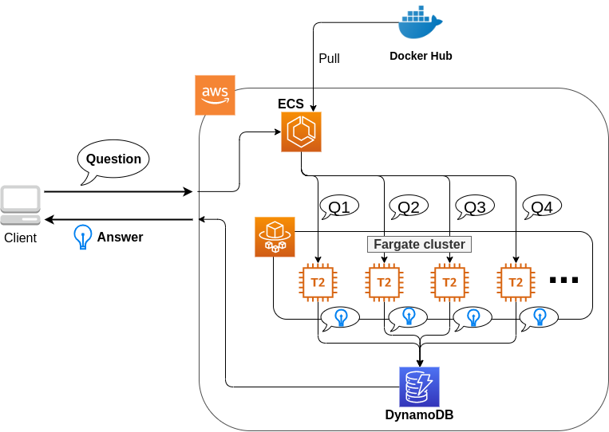

簡単にまとめると，以下のような設計である．

-   クライアントは，質問を AWS 上のアプリケーションに送信する．

-   質問のタスクは ECS によって処理される．

-   ECS は， Docker Hub から，イメージをダウンロードする．

-   次に，ECS はクラスター内に新たな Fargate インスタンスを立ち上げ，ダウンロードされた Docker イメージをこの新規インスタンスに配置する．

    -   このとき，一つの質問に対し一つの Fargate インスタンスを立ち上げることで，複数の質問を並列的に処理できるようにする．

-   ジョブが実行される．

-   ジョブの実行結果 (質問への回答) は， データベース (DynamoDB) に書き込まれる．

-   最後に，クライアントは DynamoDB から質問への回答を読み取る．

それでは，プログラムのソースコードを見てみよう ([handson/qa-bot/app.py](https://github.com/tomomano/learn-aws-by-coding/blob/main/handson/qa-bot/app.py))．

```shell
class EcsClusterQaBot(core.Stack):

    def __init__(self, scope: core.App, name: str, **kwargs) -> None:
        super().__init__(scope, name, **kwargs)

        #
        # dynamoDB table to store questions and answers
        table = dynamodb.Table(
            self, "EcsClusterQaBot-Table",
            partition_key=dynamodb.Attribute(
                name="item_id", type=dynamodb.AttributeType.STRING
            ),
            billing_mode=dynamodb.BillingMode.PAY_PER_REQUEST,
            removal_policy=core.RemovalPolicy.DESTROY
        )

        #
        vpc = ec2.Vpc(
            self, "EcsClusterQaBot-Vpc",
            max_azs=1,
        )

        #
        cluster = ecs.Cluster(
            self, "EcsClusterQaBot-Cluster",
            vpc=vpc,
        )

        #
        taskdef = ecs.FargateTaskDefinition(
            self, "EcsClusterQaBot-TaskDef",
            cpu=1024, # 1 CPU
            memory_limit_mib=4096, # 4GB RAM
        )

        # grant permissions
        table.grant_read_write_data(taskdef.task_role)
        taskdef.add_to_task_role_policy(
            iam.PolicyStatement(
                effect=iam.Effect.ALLOW,
                resources=["*"],
                actions=["ssm:GetParameter"]
            )
        )

        #
        container = taskdef.add_container(
            "EcsClusterQaBot-Container",
            image=ecs.ContainerImage.from_registry(
                "tomomano/qabot:latest"
            ),
        )
```

-   ここでは，回答の結果を書き込むためのデータベースを用意している． DynamoDB については，サーバーレスアーキテクチャの章で扱うので，今は気にしなくてよい．

-   ここでは，ハンズオン \#1, \#2 で行ったのと同様に， VPC を定義している．

-   ここで， ECS のクラスター (cluster) を定義している． クラスターとは，仮想サーバーのプールのことであり，クラスターの中に複数の仮想インスタンスを配置する．

-   ここで，実行するタスクを定義している (task definition)．

-   ここで， タスクの実行で使用する Docker イメージを定義している．

### ECS と Fargate

ECS と Fargate の部分について，コードをくわしく見てみよう．

```shell
cluster = ecs.Cluster(
    self, "EcsClusterQaBot-Cluster",
    vpc=vpc,
)

taskdef = ecs.FargateTaskDefinition(
    self, "EcsClusterQaBot-TaskDef",
    cpu=1024, # 1 CPU
    memory_limit_mib=4096, # 4GB RAM
)

container = taskdef.add_container(
    "EcsClusterQaBot-Container",
    image=ecs.ContainerImage.from_registry(
        "tomomano/qabot:latest"
    ),
)
```

`cluster =` の箇所で，空の ECS クラスターを定義している．

次に， `taskdef=ecs.FargateTaskDefinition` の箇所で， Fargate インスタンスを使ったタスクを定義しており，とくにここでは 1 CPU, 4GB RAM というマシンスペックを指定している． また，このようにして定義されたタスクは，デフォルトで 1 タスクにつき 1 インスタンスが使用される．

最後に， `container =` の箇所で，タスクの実行で使用する Docker image を定義している． ここでは， Docker Hub に置いてある image をダウンロードしてくるよう指定している．

このようにわずか数行のコードであるが，これだけで前述したような，タスクのスケジューリングなどが自動で実行される．

このコードで `cpu=1024` と指定されているのに注目してほしい． これは CPU ユニットと呼ばれる数で， 以下の換算表に従って仮想 CPU (virtual CPU; vCPU) が割り当てられる． 1024 が 1 CPU に相当する． 0.25 や 0.5 vCPU などの数字は，それぞれ実効的に 1/4, 1/2 の CPU 時間が割り当てられることを意味する． また， CPU ユニットによって使用できるメモリー量も変わってくる． たとえば， 1024 CPU ユニットを選択した場合は， 2 から 8 GB の範囲でのみメモリー量を指定することができる． 最新の情報は [公式ドキュメンテーション "Amazon ECS on AWS Fargate"](https://docs.aws.amazon.com/AmazonECS/latest/developerguide/AWS_Fargate.html) を参照のこと．

<table><caption>CPU　ユニットと 指定可能なメモリー量の換算表</caption><colgroup><col style="width: 50%" /><col style="width: 50%" /></colgroup><tbody><tr class="odd"><td><p>CPU ユニット</p></td><td><p>メモリーの値</p></td></tr><tr class="even"><td><p>256 (.25 vCPU)</p></td><td><p>0.5 GB, 1 GB, 2 GB</p></td></tr><tr class="odd"><td><p>512 (.5 vCPU)</p></td><td><p>1 GB, 2 GB, 3 GB, 4 GB</p></td></tr><tr class="even"><td><p>1024 (1 vCPU)</p></td><td><p>2 GB, 3 GB, 4 GB, 5 GB, 6 GB, 7 GB, 8 GB</p></td></tr><tr class="odd"><td><p>2048 (2 vCPU)</p></td><td><p>Between 4 GB and 16 GB in 1-GB increments</p></td></tr><tr class="even"><td><p>4096 (4 vCPU)</p></td><td><p>Between 8 GB and 30 GB in 1-GB increments</p></td></tr></tbody></table>

## スタックのデプロイ

スタックの中身が理解できたところで，早速スタックをデプロイしてみよう．

デプロイの手順は，これまでのハンズオンとほとんど共通である． SSH によるログインの必要がないので，むしろ単純なくらいである． ここでは，コマンドのみ列挙する (`#` で始まる行はコメントである)． それぞれの意味を忘れてしまった場合は，ハンズオン 1, 2 に戻って復習していただきたい． シークレットキーの設定も忘れずに ([AWS CLI のインストール](#aws_cli_install))．

```shell
# プロジェクトのディレクトリに移動
$ cd handson/qa-bot

# venv を作成し，依存ライブラリのインストールを行う
$ python3 -m venv .env
$ source .env/bin/activate
$ pip install -r requirements.txt

# デプロイを実行
$ cdk deploy
```

デプロイのコマンドが無事に実行されれば， [figure_title](#handson_03_cdk_output) のような出力が得られるはずである．


AWS コンソールにログインして，デプロイされたスタックの中身を確認してみよう． コンソールから，ECS のページに行くと [figure_title](#handson_03_ecs_console) のような画面が表示されるはずである． `EcsClusterQaBot-XXXX` という名前ついたクラスターを見つけよう．

Cluster というのが，先ほど説明したとおり，複数の仮想インスタンスを束ねる一つの単位である． [figure_title](#handson_03_ecs_console) で， FARGATE という文字の下に `0 Running tasks`, `0 Pending tasks` と表示されていることを確認しよう． この時点では一つもタスクが走っていないので，数字はすべて 0 になっている．


続いて，この画面の左のメニューバーから `Task Definitions` という項目を見つけ，クリックしよう． 移動した先のページで `EcsClusterQaBotEcsClusterQaBotTaskDefXXXX` という項目が見つかるので，開く． 開いた先のページをスクロールすると [figure_title](#handson_03_ecs_task_definition) に示したような情報が見つかるだろう． 使用する CPU ・メモリーの量や， Docker container の実行に関する設定などが，この Task Definition の画面から確認することができる．


## タスクの実行

それでは，質問をデプロイしたクラウドに提出してみよう．

ECS にタスクを投入するのはやや複雑なので，タスクの投入を簡単にするプログラム (`run_task.py`) を用意した ([handson/qa-bot/run_task.py](https://github.com/tomomano/learn-aws-by-coding/blob/main/handson/qa-bot/run_task.py))．

次のようなコマンドで，ECS クラスターに新しい質問を投入することができる．

```shell
$ python run_task.py ask "A giant peach was flowing in the river. She picked it up and brought it home. Later, a healthy baby was born from the peach. She named the baby Momotaro." "What is the name of the baby?"
```

`run_task.py` を実行するには， コマンドラインで AWS の認証情報が設定されていることが前提である．

"ask" の引数に続き，文脈 (context) と質問 (question) を引数として渡している．

このコマンドを実行すると， "Waiting for the task to finish…" と出力が表示され，回答を得るまでしばらく待たされる． この間， AWS では ECS がタスクを受理し，新しい Fargate のインスタンスを起動し， Docker イメージをそのインスタンスに配置する，という一連の処理がなされている． AWS コンソールから，この一連の様子をモニタリングしてみよう．

先ほどの ECS コンソール画面にもどり，クラスターの名前をクリックすることで，クラスターの詳細画面を開く． 次に， "Tasks" という名前のタブがあるので，それを開く ([figure_title](#ecs_task_monitoring))． すると，実行中のタスクの一覧が表示されるだろう．


[figure_title](#ecs_task_monitoring) で見て取れるように， "Last status = Pending" となっていることから，この時点では，タスクを実行する準備をしている段階である，ということがわかる． Fargate のインスタンスを起動し， Docker image を配置するまでおよそ 1-2 分の時間がかかる．

しばらく待つうちに， Status が "RUNNING" に遷移し，計算が始まる． 計算が終わると， Status は "STOPPED" に遷移し， ECS によって Fargate インスタンスは自動的にシャットダウンされる．

[figure_title](#ecs_task_monitoring) の画面から， "Task" の列にあるタスク ID クリックすることで，タスクの詳細画面を開いてみよう ([figure_title](#ecs_task_detail))． "Last status", "Platform version" など，タスクの情報が表示されている． また， "Logs" のタブを開くことで，コンテナの吐き出した実行ログを閲覧することができる．


さて， `run_task.py` を実行したコマンドラインに戻ってきてみると， [figure_title](#ask_question_output) のような出力が得られているはずである． "Momotaro" という正しい回答が返ってきている！


## タスクの同時実行

さて，先ほどはたった一つの質問を投入したわけだが，今回設計したアプリケーションは， ECS と Fargate を使うことで同時にたくさんの質問を処理することができる． 実際に，たくさんの質問を一度に投入してみよう． `run_task.py` に `ask_many` というオプションを付けることで，複数の質問を一度に送信できる． 質問の内容は [handson/qa-bot/problems.json](https://github.com/tomomano/learn-aws-by-coding/blob/main/handson/qa-bot/problems.json) に定義されている．

次のようなコマンドを実行しよう．

```shell
$ python run_task.py ask_many
```

このコマンドを実行した後で，先ほどの ECS コンソールに行き，タスクの一覧を見てみよう ([figure_title](#ecs_many_tasks))． 複数の Fargate インスタンスが起動され，タスクが並列に実行されているのがわかる．


すべてのタスクのステータスが "STOPPED" になったことを確認した上で，質問への回答を取得しよう． それには，次のコマンドを実行する．

```shell
$ python run_task.py list_answers
```

結果として， [figure_title](#ask_many_output) のような出力が得られるだろう． 複雑な文章問題に対し，高い正答率で回答できていることがわかるだろう．


おめでとう！ ここまでついてこれた読者はとても初歩的ながらも，深層学習による言語モデルを使って自動で質問への回答を生成するシステムを創り上げることができた！ それも，数百の質問にも同時に対応できるような，とても高いスケーラビリティーをもったシステムである！ 今回は GUI (Graphical User Interface) を用意することはしなかったが，このシステムに簡単な GUI を追加すればなかなか立派なウェブサービスとして運用できるだろう．

`run_task.py` で質問を投入し続けると，回答を記録しているデータベースにどんどんエントリーが溜まっていく． これらのエントリーをすべて消去するには，次のコマンドを使う．

```shell
$ python run_task.py clear
```

## スタックの削除

これにて，今回のハンズオンは終了である． 最後にスタックを削除しよう．

スタックを削除するには，前回までと同様に， AWS コンソールにログインし CloudFormation の画面から DELETE ボタンをクリックするか，コマンドラインからコマンドを実行する． コマンドラインから行う場合は，次のコマンドを使用する．

```shell
$ cdk destroy
```

# Hands-on \#4: AWS Batch を使って機械学習のハイパーパラメータサーチを並列化する

ハンズオン第三回では， ECS と Fargate を使って自動質問回答システムを構築した． シンプルながらも，複数の質問が送られた場合には並列にジョブが実行され，ユーザーに答えが返されるシステムを作ることができた． ここでは，すでに学習済みの言語モデルを用いてアプリケーションを構築した． しかし，一般的に言って，機械学習のワークフローでは自分で作ったモデルを訓練することが最初のステップにあるはずである． そこで，ハンズオン第四回では，クラウドを用いて機械学習の訓練を並列化・高速化することを考える．

本ハンズオンでは深層学習におけるハイパーパラメータ最適化を取り上げる． ハイパーパラメータとは，勾配降下法によって最適化されるニューラルネットのパラメータの外にあるパラメータのことであり，具体的にはモデルの層の幅・深さなどネットワークのアーキテクチャに関わるもの，学習率やモメンタムなどパラメータの更新則に関わるものなどが含まる． 深層学習においてハイパーパラメータの調整はとても重要なタスクである． しかしながら，ハイパーパラメータを調整するには，少しずつ条件を変えながら何度もニューラルネットを学習させる必要があり，多くの計算時間がかかる． 研究・開発においては，スループットよくたくさんのモデルの可能性を探索することが生産性を決める重要なファクターであり，ハイパーパラメータ探索を高速に解くという問題は極めて関心が高い． 本ハンズオンでは，クラウドの強力な計算リソースを利用して並列的にニューラルネットの訓練を実行することで，この問題を解く方法を学んでいこう．

## Auto scaling groups (ASG)

ハンズオンに入っていく前に， **Auto scaling groups (ASG)** とよばれる EC2 の概念を知っておく必要がある．

ECS の概要を示した [figure_title](#ecs_overview) を振り返って見てほしい． 前章 ([Hands-on \#3: AWS で自動質問回答ボットを走らせる](#sec_fargate_qabot)) でも説明したが， ECS のクラスターで計算を担う実体としては EC2 と Fargate を指定することができる． Fargate については前章で記述した． Fargate を用いると，自在にスケールする計算環境をとても簡単な設定で構築することができた． しかし， GPU を利用することができないなど，いくつかの制約があった． EC2 を使用した計算環境を指定することで，プログラミングの複雑度は増すが， GPU やその他のより高度かつ複雑な設定を伴ったクラスターを構築することができる．

EC2 クラスターには **ASG** と呼ばれるサービスが配置される． ASG は複数の EC2 インスタンスをロジカルな単位でグループ化することでクラスターを構成する． ASG はクラスター内に新しいインスタンスを起動する，あるいは不要になったインスタンスを停止するなどのスケーリングを担う． ASG で重要な概念として， **desired capacity**, **minimum capacity**, **maximum capacity** というパラメータがある． minimum capacity， maximum capacity は，それぞれクラスター内に配置できるインスタンスの数の最小値・最大値を指定するパラメータである． 前者は，クラスターに負荷がかかっていない場合でもアイドリング状態にあるインスタンスを維持することで，急に負荷が増大した時などのバッファーとして作用することができる． 後者は，負荷が急に増えたときに，過剰な数のインスタンスが起動する事態を防ぎ，経済的なコストの上限を定める役割を果たす．

desired capacity が，その時々でシステムが要求するインスタンスの数を指定する． desired capacity は，例えば 24 時間のリズムに合わせてインスタンスの数を増減させる (昼は多く夜は少なくなど) などの決まったスケジュールに基づいた設定を適用することができる． あるいはクラスター全体にかかっている負荷に応じて， desired capacity を動的に制御することも可能である． どのような基準でクラスターのスケーリングを行うかを定めるルールのことを，**スケーリングポリシー**とよぶ． たとえば，クラスター全体の稼働率 (負荷) を常に 80% に維持する，などのスケーリングポリシーが想定できる． この場合，クラスター全体の負荷が 80%を下回ったときにはクラスターからインスタンスが削除され，80%を超える (あるいは超えると予測される) 場合はインスタンスを追加する，という操作が ASG によって自動的に行われる．

上記のようなパラメータを検討し，ユーザーは ASG を作成する． ASG を作成したのち， ECS との連携をプログラムしてあげることで， ECS を介して ASG による EC2 クラスターにタスクを投入することが可能になる．

## AWS Batch


先に説明したように， ECS と ASG を組み合わせることで，所望の計算クラスターを構築することが可能である． しかしながら， ECS と ASG にはかなり込み入った設定が必要であり，初心者にとっても経験者にとってもなかなか面倒なプログラミングが要求される． そこで， ECS と ASG によるクラスターの設計を自動化してくれるサービスが提供されている． それが **AWS Batch** である．

AWS Batch はその名のとおりバッチ (Batch) 化されたジョブ (入力データだけが異なる独立した演算が繰り返し実行されること) を想定している． 多くの科学計算や機械学習がバッチ計算に当てはまる． たとえば，初期値のパラメータを変えて複数のシミュレーションを走らせる，といったケースだ． AWS Batch を用いることの利点は，クラスターのスケーリングやジョブの割り振りはすべて自動で実行され， ユーザーはクラウドの舞台裏の詳細を気にすることなく，大量のジョブを投入できるシステムが手に入る点である． が，知識として背後では ECS/ASG/EC2 の三つ巴が協調して動作しているという点は知っておいてほしい．

AWS Batch では，ジョブの投入・管理をスムーズに行うため，次のような概念が定義されている ([figure_title](#fig_batch_concept))． まず， **ジョブ (Job)** というのが，AWS Batch によって実行される一つの計算の単位である． **Job definitions** とはジョブの内容を定義するものであり，これには実行されるべき Docker のイメージのアドレスや，割り当てる CPU・RAM の容量，環境変数などの設定が含まれる． Job definition に基づいて個々のジョブが実行される． ジョブが実行されると，ジョブは **Job queues** に入る． Job queues とは，実行待ち状態にあるジョブの列のことであり，時間的に最も先頭に投入されたジョブが最初に実行される． また，複数の queue を配置し， queue ごとに priority (優先度) を設定することが可能であり， priority の高い queue に溜まったジョブが優先的に実行される (筆者はこれをディズニーランドの"ファストパス"を連想して捉えている)． **Compute environment** とは，先述したクラスターとほぼ同義の概念であり，計算が実行される場所 (EC2 や Fargate からなるクラスター) を指す． Compute environment には，使用する EC2 のインスタンスタイプや同時に起動するインスタンス数の上限などの簡易なスケーリングポリシーが指定されている． Job queues は Compute environment の空き状況を監視しており， それに応じてジョブを Compute environment に投下する．

以上が AWS Batch を使用するうえで理解しておかなければならない概念であるが，くどくど言葉で説明してもなかなかピンとこないだろう． ここからは，実際に自分で手を動かしながら学んでいこう．


**EC2 or Fargate?**

ECS でクラスターを構成する際，計算を実行する場として EC2 と Fargate の二つの選択肢があることを説明した． それぞれ長所と短所を抱えているのだが，どのような場合にどちらを使うべきだろうか？ それを検討するため，まずは [table_title](#tab:ec2_vs_fargate) を見てみよう． これは EC2 と Fargate の特徴をまとめたものである． 説明の都合上，大幅な粗視化が行われている点は留意していただきたい．

<table><caption>EC2 vs Fargate</caption><colgroup><col style="width: 33%" /><col style="width: 33%" /><col style="width: 33%" /></colgroup><thead><tr class="header"><th></th><th>EC2</th><th>Fargate</th></tr></thead><tbody><tr class="odd"><td><p>Compute capacity</p></td><td><p>Medium to large</p></td><td><p>Small to medium</p></td></tr><tr class="even"><td><p>GPU</p></td><td><p>Yes</p></td><td><p>No</p></td></tr><tr class="odd"><td><p>Launch speed</p></td><td><p>Slow</p></td><td><p>Fast</p></td></tr><tr class="even"><td><p>Task placement flexibility</p></td><td><p>Low</p></td><td><p>High</p></td></tr><tr class="odd"><td><p>Programming complexity</p></td><td><p>High</p></td><td><p>Low</p></td></tr></tbody></table>

これまでに見てきたように， EC2 は最大の CPU 数・メモリーサイズが大きかったり， GPU を利用できたりするなど，単一のインスタンスでの計算能力は高い． 対して， Fargate は単一インスタンスの最大 CPU 数は 4 コアが上限である． その一方で，インスタンスの起動に要する時間は Fargate のほうが圧倒的に早く，より俊敏にクラスターのスケーリングを行うことができる． また，タスクをクラスターに投入する際のフレキシビリティも Fargate のほうが高い． フレキシビリティというのは，例えば一つのインスタンスで 2 つ以上のコンテナを走らせる，などの状況である． 単位 CPU あたりで処理されるタスクの数を最大化する際には，このような設計がしばしば採用される． プログラミングの複雑さという観点からは， Fargate のほうが一般的にシンプルな実装になる．

このように， EC2 と Fargate は互いに相補的な特性を有しており，アプリケーションによって最適な計算環境は検討される必要がある． また，EC2 と Fargate を両方用いたハイブリッドクラスターというのも定義可能であり，そのような選択肢もしばしば用いられる．

## 準備

ハンズオンのソースコードは GitHub の [handson/aws-batch](https://github.com/tomomano/learn-aws-by-coding/tree/main/handson/aws-batch) にある．

本ハンズオンの実行には，第一回ハンズオンで説明した準備 ([準備](#handson_01_prep)) が整っていることを前提とする． また， Docker が自身のローカルマシンにインストール済みであることも必要である．

このハンズオンは， `g4dn.xlarge` タイプの EC2 インスタンスを使うので，アメリカ東部 (`us-east-1`) リージョンでは 0.526 $/hour のコストが発生する． 東京 (`ap-northeast-1`) を選択した場合は 0.71 $/hour のコストが発生する．

[準備](#sec:jupyter_and_deep_learning_setup) でも注意したが，このハンズオンを始める前に G タイプインスタンスの起動上限を AWS コンソールの EC2 管理画面から確認しよう． もし上限が 0 になっていた場合は，上限緩和の申請を行う必要がある． [アプリケーションの説明](#sec:aws_batch_code) にも関連した情報を記載しているので，併せて参照されたい．

## MNIST 手書き文字認識 (再訪)

今回のハンズオンでは，機械学習のハイパーパラメータ調整を取り上げると冒頭で述べた． その最もシンプルな例題として， [実践ディープラーニング! MNIST 手書き数字認識タスク](#sec_mnist_using_jupyter) で扱った MNIST 手書き文字認識の問題を再度取り上げよう． [実践ディープラーニング! MNIST 手書き数字認識タスク](#sec_mnist_using_jupyter) では，適当にチョイスしたハイパーパラメータを用いてモデルの訓練を行った． ここで使用したプログラムのハイパーパラメータとしては，確率的勾配降下法 (SGD) における学習率やモメンタムが含まれる． コードでいうと，次の行が該当する．

```python
optimizer = optim.SGD(model.parameters(), lr=0.01, momentum=0.5)
```

ここで使用された 学習率 (`lr=0.01`) やモメンタム (`momentum=0.5`) は恣意的に選択された値であり，これがベストな数値であるのかはわからない． たまたまこのチョイスが最適であるかもしれないし，もっと高い精度を出すハイパーパラメータの組が存在するかもしれない． この問題に答えるため，ハイパーパラメータサーチを行おう． 今回は，最もシンプルなアプローチとして，**グリッドサーチ**によるハイパーパラメータサーチを行おう．

機械学習のハイパーパラメータの最適化には大きく３つのアプローチが挙げられる． グリッドサーチ，ランダムサーチ，そしてベイズ最適化による方法である．

グリッドサーチとは，ハイパーパラメータの組をある範囲の中で可能な組み合わせをすべて計算し，最適なパラメータの組を見出す方法である． 最もシンプルかつ確実な方法であるが，すべての組み合わせの可能性を愚直に計算するので計算コストが大きい．

ランダムサーチ法とは，ハイパーパラメータの組をある範囲の中でランダムに抽出し，大量に試行されたランダムな組の中から最適なパラメータの組を見出す方法である． すべての可能性を網羅的に探索できるわけではないが，調整すべきパラメータの数が多数ある場合に，グリッドサーチよりも効率的に広い探索空間をカバーすることができる．

ベイズ最適化を用いた方法では，過去の探索結果から次にどの組み合わせを探索すべきかという指標を計算し，次に探索するパラメータを決定する． これにより，理論的にはグリッドサーチやランダムサーチ法よりも少ない試行回数で最適なパラメータにたどり着くことができる．

並列化の観点でいうと，グリッドサーチとランダムサーチは各ハイパーパラメータの組の計算は独立に実行することができるため並列化が容易である． このように独立したジョブとして分割・並列化可能な問題を Embarrassingly parallel な問題とよぶ (直訳すると"恥ずかしいほど並列化可能な問題"，ということになる)． Embarrassingly parallel な問題はクラウドの強力な計算リソースを用いることで，非常なシンプルな実装で解くことができる． この章ではこのようなタイプの並列計算を取り上げる．

一方，ベイズ最適化による方法は，過去の結果をもとに次の探索が決定されるので，並列化はそれほど単純ではない． 最近では [optuna](https://optuna.org/) などのハイパーパラメータ探索のためのライブラリが発達しており，ベイズ最適化の数理的な処理を自動で実行してくれるので便利である． これらのライブラリを使うと，もし一台のコンピュータ (ノード) の中に複数の GPU が存在する場合は，並列に計算を実行することができる． しかしながら，一台のノードにとどまらず，複数のノードをまたいだ並列化は，高度なプログラミングテクニックが必要とされるだけでなく，ノード間の接続様式などクラウドのアーキテクチャにも深く依存するものである． 本書ではここまで高度なクラウドの使用方法には立ち入らない．

まずは，本ハンズオンで使用する Docker イメージをローカルで実行してみよう．

Docker イメージのソースコードは [handson/aws-batch/docker](https://github.com/tomomano/learn-aws-by-coding/blob/main/handson/aws-batch/docker) にある． 基本的に [実践ディープラーニング! MNIST 手書き数字認識タスク](#sec_mnist_using_jupyter) のハンズオンを元にし，本ハンズオン専用の軽微な変更が施してある． 興味のある読者はソースコードも含めて読んでいただきたい．

練習として，この Docker イメージを手元でビルドするところからはじめてみよう． `Dockerfile` が保存されているディレクトリに移動し， `mymnist` という名前 (Tag) をつけてビルドを実行する．

```shell
$ cd handson/aws-batch/docker
$ docker build -t mymnist .
```

`docker build` でエラーが出たときは次の可能性を疑ってほしい． ビルドの中で， MNIST の画像データセットを <http://yann.lecun.com/exdb/mnist/> からダウンロードするのだが，ダウンロード先のサーバーがしばしばダウンしている． 世界中の機械学習ユーザーがアクセスするので，これはしばしば発生するようである． サーバーがダウンしているとビルドも失敗してしまう． エラーメッセージにそれらしい文言が含まれていたら，この可能性を疑おう．

手元でビルドするかわりに， Docker Hub から pull することも可能である． その場合は次のコマンドを実行する．

```shell
$ docker pull tomomano/mymnist:latest
```

イメージの準備ができたら，次のコマンドでコンテナを起動し， MNIST の学習を実行する．．

```shell
$ docker run mymnist --lr 0.1 --momentum 0.5 --epochs 10
```

このコマンドを実行すると，指定したハイパーパラメータ (`--lr` で与えられる学習率と `--momentum` で与えられるモメンタム) を使ってニューラルネットの最適化が始まる． 学習を行う最大のエポック数は `--epochs` パラメータで指定する． [Hands-on \#2: AWS でディープラーニングを実践](#sec_jupyter_and_deep_learning) のハンズオンで見たような， Loss の低下がコマンドライン上に出力されるだろう ([figure_title](#fig_mnist_log_output))．


上に示したコマンドを使うと，計算は CPU を使って実行される． もし，ローカルの計算機に GPU が備わっており， [nvidia-docker](https://github.com/NVIDIA/nvidia-docker) の設定が済んでいるならば， 次のコマンドにより GPU を使って計算を実行できる．

```shell
$ docker run --gpus all mymnist --lr 0.1 --momentum 0.5 --epochs 10
```

このコマンドでは，`--gpus all` というパラメータが加わった．

CPU/GPU どちらで実行した場合でも，エポックを重ねるにつれて訓練データ (Train データ) の Loss は単調に減少していくのが見て取れるだろう． 一方，**検証データ (Validation データ) の Loss および Accuracy は，ある程度まで減少した後，それ以上性能が向上しない**ことに気がつくだろう． これを実際にプロットしてみると [figure_title](#fig_loss_epoch_profile) のようになるはずである．


これは**オーバーフィッティング**とよばれる現象で，ニューラルネットが訓練データに過度に最適化され，訓練データの外のデータに対しての精度 (汎化性能) が向上していないことを示している． このような場合の対処法として， **Early stopping** とよばれるテクニックが知られている． Early stopping とは，検証データの Loss を追跡し，それが減少から増加に転じるエポックで学習をうち止め，そのエポックでのウェイトパラメータを採用する，というものである． 本ハンズオンでも， Early stopping によって訓練の終了を判断し，モデルの性能評価を行っていく．

MNIST 手書き文字データセットでは，訓練データとして 60,000 枚，テストデータとして 10,000 枚の画像が与えられている． 本ハンズオンで使用するコードでは，訓練データのうち 80% の 48,000 枚を訓練データとして使用し，残り 20% の 12,000 枚を検証データとして用いている． 詳しくはソースコードを参照のこと．

## アプリケーションの説明

このハンズオンで作成するアプリケーションの概要を [figure_title](#fig_batch_architecture) に示す．


簡単にまとめると，次のような設計である．

-   クライアントは，あるハイパーパラメータの組を指定して Batch にジョブを提出する

-   Batch はジョブを受け取ると， EC2 からなるクラスターで計算を実行する

-   クラスター内では `g4dn.xlarge` インスタンスが起動する

-   Docker イメージは， AWS 内に用意された ECR (Elastic Container Registry) から取得される

-   複数のジョブが投下された場合は，その数だけのインスタンスが起動し並列に実行される

-   各ジョブによる計算の結果は S3 に保存される

-   最後にクライアントは S3 から結果をダウンロードし，最適なハイパーパラメータの組を決定する

それでは，プログラムのソースコードを見てみよう ([handson/aws-batch/app.py](https://github.com/tomomano/learn-aws-by-coding/blob/main/handson/aws-batch/app.py))．

```python
class SimpleBatch(core.Stack):

    def __init__(self, scope: core.App, name: str, **kwargs) -> None:
        super().__init__(scope, name, **kwargs)

        #
        bucket = s3.Bucket(
            self, "bucket",
            removal_policy=core.RemovalPolicy.DESTROY,
            auto_delete_objects=True,
        )

        vpc = ec2.Vpc(
            self, "vpc",
            # other parameters...
        )

        #
        managed_env = batch.ComputeEnvironment(
            self, "managed-env",
            compute_resources=batch.ComputeResources(
                vpc=vpc,
                allocation_strategy=batch.AllocationStrategy.BEST_FIT,
                desiredv_cpus=0,
                maxv_cpus=64,
                minv_cpus=0,
                instance_types=[
                    ec2.InstanceType("g4dn.xlarge")
                ],
            ),
            managed=True,
            compute_environment_name=self.stack_name + "compute-env"
        )

        #
        job_queue = batch.JobQueue(
            self, "job-queue",
            compute_environments=[
                batch.JobQueueComputeEnvironment(
                    compute_environment=managed_env,
                    order=100
                )
            ],
            job_queue_name=self.stack_name + "job-queue"
        )

        #
        job_role = iam.Role(
            self, "job-role",
            assumed_by=iam.CompositePrincipal(
                iam.ServicePrincipal("ecs-tasks.amazonaws.com")
            )
        )
        # allow read and write access to S3 bucket
        bucket.grant_read_write(job_role)

        #
        repo = ecr.Repository(
            self, "repository",
            removal_policy=core.RemovalPolicy.DESTROY,
        )

        #
        job_def = batch.JobDefinition(
            self, "job-definition",
            container=batch.JobDefinitionContainer(
                image=ecs.ContainerImage.from_ecr_repository(repo),
                command=["python3", "main.py"],
                vcpus=4,
                gpu_count=1,
                memory_limit_mib=12000,
                job_role=job_role,
                environment={
                    "BUCKET_NAME": bucket.bucket_name
                }
            ),
            job_definition_name=self.stack_name + "job-definition",
            timeout=core.Duration.hours(2),
        )
```

-   で，計算結果を保存するための S3 バケットを用意している

-   で， Compute environment を定義している． ここでは `g4dn.xlarge` のインスタンスタイプを使用するとし，最大の vCPU 使用数は 64 と指定している． また，最小の vCPU は 0 である． 今回は，負荷がかかっていないときにアイドリング状態にあるインスタンスを用意する利点は全くないので，ここは 0 にするのが望ましい．

-   で， &lt;2&gt; で作成した Compute environment と紐付いた Job queue を定義している．

-   で，ジョブが計算結果を S3 に書き込むことができるよう， IAM ロールを定義している． (IAM とはリソースがもつ権限を管理する仕組みである．詳しくは [AWS における権限の管理 (IAM)](#sec:bashoutter_iam) を参照)

-   では， Docker image を配置するための ECR を定義している．

-   で Job definition を作成している． ここでは，4 vCPU， 12000 MB (=12GB) の RAM を使用するように指定している． また，今後必要となる環境変数 (`BUCKET_NAME`) を設定している． さらに， &lt;4&gt; で作った IAM を付与している．

`g4dn.xlarge` は 1 台あたり 4 vCPU が割り当てられている． このプログラムでは Compute environment の maximum vCPUs を 64 と指定しているので，最大で 16 台のインスタンスが同時に起動することになる． ここで maxium vCPUs を 64 に限定しているのは，なんらかのミスで意図せぬジョブを大量にクラスターに投入してしまった事態で，高額の AWS 利用料金が発生するのを防ぐためである． もし，自分のアプリケーションで必要と判断したならば自己責任において 64 よりも大きな数を設定して構わない．

ここで注意が一点ある． AWS では各アカウントごとに EC2 で起動できるインスタンスの上限が設定されている． この上限は AWS コンソールにログインし， EC2 コンソールの左側メニューバーの `Limits` をクリックすることで確認できる ([figure_title](#fig_ec2_limits))． `g4dn.xlarge` (EC2 の区分でいうと G ファミリーに属する) の制限を確認するには， `Running On-Demand All G instances` という名前の項目を見る． ここにある数字が， AWS によって課されたアカウントの上限であり，この上限を超えたインスタンスを起動することはできない． もし，自分の用途に対して上限が低すぎる場合は，上限の緩和申請を行うことができる． 詳しくは [公式ドキュメンテーション "Amazon EC2 service quotas"](https://docs.aws.amazon.com/AWSEC2/latest/UserGuide/ec2-resource-limits.html) を参照のこと．


## スタックのデプロイ

スタックの中身が理解できたところで，早速スタックをデプロイしてみよう．

デプロイの手順は，これまでのハンズオンとほとんど共通である． ここでは，コマンドのみ列挙する (\# で始まる行はコメントである)． シークレットキーの設定も忘れずに ([AWS CLI のインストール](#aws_cli_install))．

```shell
# プロジェクトのディレクトリに移動
$ cd handson/aws-batch

# venv を作成し，依存ライブラリのインストールを行う
$ python3 -m venv .env
$ source .env/bin/activate
$ pip install -r requirements.txt

# デプロイを実行
$ cdk deploy
```

デプロイのコマンドが無事に実行されたことが確認できたら，AWS コンソールにログインして，デプロイされたスタックを確認してみよう． コンソールの検索バーで `batch` と入力し， AWS Batch の管理画面を開く ([figure_title](#fig_batch_console))．


まず目を向けてほしいのが，画面の一番下にある Compute environment overview の中の `SimpleBatchcompute-env` という名前の項目だ． Compute environment とは，先ほど述べたとおり，計算が実行される環境 (クラスターと読み替えてもよい) である． プログラムで指定したとおり， `g4dn.xlarge` が実際に使用されるインスタンスタイプとして表示されている． また， `Minimum vCPUs` が 0，`Maximum vCPUs` が 64 と設定されていることも見て取れる． 加えて，この時点では一つもジョブが走っていないので， `Desired vCPUs` は 0 になっている． より詳細な Compute environment の情報を閲覧したい場合は，名前をクリックすることで詳細画面が開く．

次に，Job queue overview にある `SimpleBatch-queue` という項目に注目してほしい． ここでは実行待ちのジョブ・実行中のジョブ・実行が完了したジョブを一覧で確認することができる． `PENDING`, `RUNNING`, `SUCCEEDED`, `FAILED` などのカラムがあることが確認できる．ジョブが進行するにつれて，ジョブの状態がこのカラムにしたがって遷移していく． 後でジョブを実際にサブミットしたときに戻ってこよう．

最後に，今回作成した Job definition を確認しよう． 左側のメニューから　`Job definitions` を選択し，次の画面で `SimpleBatchjob-definition` という項目を見つけて開く． ここから Job definition の詳細を閲覧することができる ([figure_title](#fig:batch_job_definition))． 中でも重要な情報としては，　`vCPUs`, `Memory`, `GPU` がそれぞれ Docker に割り当てられる vCPU・メモリー・ GPU の量を規定している． また， `Image` と書いてあるところに，ジョブで使用される Docker イメージが指定されている． ここでは， ECR のレポジトリを参照している． 現時点ではこの ECR は空である． 次のステップとして，この ECR にイメージを配置する作業を行おう．


## Docker image を ECR に配置する

さて， Batch がジョブを実行するには，どこか指定された場所から Docker イメージをダウンロード (pull) してくる必要がある． 前回のハンズオン ([Hands-on \#3: AWS で自動質問回答ボットを走らせる](#sec_fargate_qabot)) では，公開設定にしてある Docker Hub からイメージを pull してきた． 今回のハンズオンでは， AWS から提供されているレジストリである **ECR (Elastic Container Registry)** に image を配置するという設計を採用する． ECR を利用する利点は，自分だけがアクセスすることのできるプライベートなイメージの置き場所を用意できる点である． Batch は ECR からイメージを pull してくることで，タスクを実行する ([figure_title](#fig_batch_architecture))．

スタックのソースコードでいうと，次の箇所が ECR を定義している．

```python
#
repo = ecr.Repository(
    self, "repository",
    removal_policy=core.RemovalPolicy.DESTROY,
)

job_def = batch.JobDefinition(
    self, "job-definition",
    container=batch.JobDefinitionContainer(
        image=ecs.ContainerImage.from_ecr_repository(repo), #
        ...
    ),
    ...
)
```

-   で，新規の ECR を作成している．

-   で Job definition を定義する中で，イメージを &lt;1&gt; で作った ECR から取得するように指定している． これと同時に， Job definition には ECR へのアクセス権限が IAM を通じて自動的に付与される．

さて，スタックをデプロイした時点では， ECR は空っぽである． ここに自分のアプリケーションで使う Docker イメージを push してあげる必要がある．

そのために，まずは AWS コンソールから ECR の画面を開こう (検索バーに `Elastic Container Registry` と入力すると出てくる)． `Private` というタブを選択すると， `simplebatch-repositoryXXXXXX` という名前のレポジトリが見つかるだろう ([figure_title](#fig_ecr_console1))．


次に，このレポジトリの名前をクリックするとレポジトリの詳細画面に遷移する． そうしたら，画面右上にある `View push commands` というボタンをクリックする． すると [figure_title](#fig_ecr_push_command) のようなポップアップ画面が立ち上がる．


このポップアップ画面で表示されている四つのコマンドを順番に実行していくことで，手元の Docker イメージを ECR に push することができる． **push を実行する前に， AWS の認証情報が設定されている**ことを確認しよう． そのうえで，ハンズオンのソースコードの中にある **`docker/` という名前のディレクトリに移動**する． そうしたら，ポップアップ画面で表示されたコマンドを上から順に実行していく．

ポップアップで表示されるコマンドの 2 つめを見てみると `docker build -t XXXXX .` となっている． 最後の `.` が重要で，これは _現在のディレクトリにある Dockerfile を使ってイメージをビルドせよ_ という意味である． このような理由で， `Dockerfile` が置いてあるディレクトリに移動する必要がある．

四つ目のコマンドは，数 GB あるイメージを ECR にアップロードするので少し時間がかかるかもしれないが，これが完了するとめでたくイメージが ECR に配置されたことになる． もう一度 ECR のコンソールを見てみると，確かにイメージが配置されていることが確認できる ([figure_title](#fig_ecr_console2))． これで，AWS Batch を使ってジョブを実行させるための最後の準備が完了した．


## 単一のジョブを実行する

さて，ここからは実際に AWS Batch にジョブを投入する方法を見ていこう．

ハンズオンのディレクトリの `notebook/` というディレクトリの中に， [run_single.ipynb](https://github.com/tomomano/learn-aws-by-coding/blob/main/handson/aws-batch/notebook/run_single.ipynb) というファイルが見つかるはずである (`.ipynb` は Jupyter notebook のファイル形式)． これを Jupyter notebook から開こう．

今回のハンズオンでは， `venv` による仮想環境の中に Jupyter notebook もインストール済みである． なので，ローカルマシンから以下のコマンドで Jupyter notebook を立ち上げる．

```shell
# .env の仮想環境にいることを確認
(.env) $ cd notebook
(.env) $ jupyter notebook
```

Jupyter notebook が起動したら， `run_single.ipynb` を開く．

最初の \[1\], \[2\], \[3\] 番のセルは，ジョブをサブミットするための関数 (`submit_job()`) を定義している．

```python
# [1]
import boto3
import argparse

# [2]
# AWS 認証ヘルパー ...省略...

# [3]
def submit_job(lr:float, momentum:float, epochs:int, profile_name="default"):
    if profile_name is None:
        session = boto3.Session()
    else:
        session = boto3.Session(profile_name=profile_name)
    client = session.client("batch")

    title = "lr" + str(lr).replace(".", "") + "_m" + str(momentum).replace(".", "")
    resp = client.submit_job(
        jobName=title,
        jobQueue="SimpleBatchjob-queue",
        jobDefinition="SimpleBatchjob-definition",
        containerOverrides={
            "command": ["--lr", str(lr),
                        "--momentum", str(momentum),
                        "--epochs", str(epochs),
                        "--uploadS3", "true"]
        }
    )
    print("Job submitted!")
    print("job name", resp["jobName"], "job ID", resp["jobId"])
```

`submit_job()` 関数について簡単に説明しよう． [MNIST 手書き文字認識 (再訪)](#sec_run_mnist_docker_local) で， MNIST の Docker をローカルで実行したとき，次のようなコマンドを使用した．

```shell
$ docker run -it mymnist --lr 0.1 --momentum 0.5 --epochs 10
```

ここで， `--lr 0.1 --momentum 0.5 --epochs 10` の部分が，コンテナに渡されるコマンドである．

AWS Batch でジョブを実行する際も，`ContainerOverrides` の `command` というパラメータを使用することで，コンテナに渡されるコマンドを指定することができる． コードでは以下の部分が該当する．

```python
containerOverrides={
    "command": ["--lr", str(lr),
                "--momentum", str(momentum),
                "--epochs", str(epochs),
                "--uploadS3", "true"]
}
```

続いて， \[4\] 番のセルに移ろう． ここでは，上記の `submit_job()` 関数を用いて， 学習率 = 0.01, モメンタム=0.1, エポック数=100 を指定したジョブを投入する．

```python
# [4]
submit_job(0.01, 0.1, 100)
```

AWS の認証情報は， Jupyter Notebook の内部から再度定義する必要がある． これを手助けするため， Notebook の \[2\] 番のセル (デフォルトではすべてコメントアウトされている) を用意した． これを使うにはコメントアウトを解除すればよい． このセルを実行すると， AWS の認証情報を入力する対話的なプロンプトが表示される． プロンプトに従って aws secret key などを入力することで， (Jupyter のセッションに固有な) 環境変数に AWS の認証情報が記録される．

もう一つの認証方法として， `submit_job()` 関数に `profile_name` というパラメータを用意した． もし `~/.aws/credentials` に認証情報が書き込まれているのならば (詳しくは [AWS CLI のインストール](#aws_cli_install))， `profile_name` に使用したいプロファイルの名前を渡すだけで， 認証を行うことができる． 慣れている読者は後者のほうが便利であると感じるだろう．

\[4\] 番のセルを実行したら，ジョブが実際に投入されたかどうかを AWS コンソールから確認してみよう． AWS Batch の管理コンソールを開くと， [figure_title](#fig_batch_running_job) のような画面が表示されるだろう．


[figure_title](#fig_batch_running_job) で赤で囲った箇所に注目してほしい． 一つのジョブが投入されると，それは `SUBMITTED` という状態を経て `RUNNABLE` という状態に遷移する． `RUNNABLE` とは， ジョブを実行するためのインスタンスが Compute environment に不足しているため，新たなインスタンスが起動されるのを待っている状態に相当する． インスタンスの準備が整うと，ジョブの状態は `STARTING` を経て `RUNNING` に至る．

次に，ジョブのステータスが `RUNNING` のときの Compute environment の `Desired vCPU` を見てみよう ([figure_title](#fig_batch_running_job) で紫で囲った箇所)． ここで 4 と表示されているのは， `g4dn.xlarge` インスタンス一つ分の vCPU の数である． ジョブの投入に応じて，それを実行するのに最低限必要な EC2 インスタンスが起動されたことが確認できる (興味のある人は， EC2 コンソールも同時に覗いてみるとよい)．

しばらく経つと，ジョブの状態は `RUNNING` から `SUCCEEDED` (あるいは何らかの理由でエラーが発生したときには `FAILED`) に遷移する． 今回のハンズオンで使っている MNIST の学習はだいたい 10 分くらいで完了するはずである． ジョブの状態が `SUCCEEDED` になるまで見届けよう．

ジョブが完了すると，学習の結果 (エポックごとの Loss と Accuracy を記録した CSV ファイル) は S3 に保存される． AWS コンソールからこれを確認しよう．

S3 のコンソールに行くと `simplebatch-bucketXXXX` (XXXX の部分はユーザーによって異なる) という名前のバケットが見つかるはずである． これをクリックして中身を見てみると， `metrics_lr0.0100_m0.1000.csv` という名前の CSV があることが確認できるだろう ([figure_title](#fig_s3_saved_file))． これが， 学習率 = 0.01, モメンタム = 0.1 として学習を行ったときの結果である．


さて，ここで `run_single.ipynb` に戻ってこよう． \[5\] から \[7\] 番のセルでは，学習結果の CSV ファイルのダウンロードを行っている．

```python
# [5]
import pandas as pd
import io
from matplotlib import pyplot as plt

# [6]
def read_table_from_s3(bucket_name, key, profile_name=None):
    if profile_name is None:
        session = boto3.Session()
    else:
        session = boto3.Session(profile_name=profile_name)
    s3 = session.resource("s3")
    bucket = s3.Bucket(bucket_name)

    obj = bucket.Object(key).get().get("Body")
    df = pd.read_csv(obj)

    return df

# [7]
bucket_name = "simplebatch-bucket43879c71-mbqaltx441fu"
df = read_table_from_s3(
    bucket_name,
    "metrics_lr0.0100_m0.1000.csv"
)
```

\[6\] で S3 から CSV データをダウンロードし， pandas の `DataFrame` オブジェクトとしてロードする関数を定義している． \[7\] を実行する際， `bucket_name` という変数の値を，**自分自身のバケットの名前に置き換える**ことに注意しよう (先ほど S3 コンソールから確認した `simplebatch-bucketXXXX` のことである)．

続いて， \[9\] 番のセルで， CSV のデータをプロットしている ([figure_title](#fig_loss_epoch_profile2))． ローカルで実行したときと同じように， AWS Batch を用いて MNIST モデルを訓練することに成功した！

```python
# [9]
fig, (ax1, ax2) = plt.subplots(1,2, figsize=(9,4))
x = [i for i in range(df.shape[0])]
ax1.plot(x, df["train_loss"], label="Train")
ax1.plot(x, df["val_loss"], label="Val")
ax2.plot(x, df["val_accuracy"])

ax1.set_xlabel("Epochs")
ax1.set_ylabel("Loss")
ax1.legend()

ax2.set_xlabel("Epochs")
ax2.set_ylabel("Accuracy")

print("Best loss:", df["val_loss"].min())
print("Best loss epoch:", df["val_loss"].argmin())
print("Best accuracy:", df["val_accuracy"].max())
print("Best accuracy epoch:", df["val_accuracy"].argmax())
```


## 並列に複数の Job を実行する

さて，ここからが最後の仕上げである． ここまでのハンズオンで構築した AWS Batch のシステムを使って，ハイパーパラメータサーチを実際に行おう．

先ほど実行した `run_single.ipynb` と同じディレクトリにある `run_sweep.ipynb` を開く．

セル \[1\], \[2\], \[3\] は `run_single.ipynb` と同一である．

```python
# [1]
import boto3
import argparse

# [2]
# AWS 認証ヘルパー ...省略...

# [3]
def submit_job(lr:float, momentum:float, epochs:int, profile_name=None):
    # ...省略...
```

セル \[4\] の for ループを使って，グリッド状にハイパーパラメータの組み合わせを用意し， batch にジョブを投入している． ここでは 3x3=9 個のジョブを作成した．

```python
# [4]
for lr in [0.1, 0.01, 0.001]:
    for m in [0.5, 0.1, 0.05]:
        submit_job(lr, m, 100)
```

セル \[4\] を実行したら， Batch のコンソールを開こう． 先ほどと同様に，ジョブのステータスは `SUBMITTED` &gt; `RUNNABLE` &gt; `STARTING` &gt; `RUNNING` と移り変わっていくことがわかるだろう． 最終的に 9 個のジョブがすべて `RUNNING` の状態になることを確認しよう ([figure_title](#fig_batch_many_parallel_jobs))． また，このとき Compute environment の `Desired vCPUs` は 4x9=36 となっていることを確認しよう ([figure_title](#fig_batch_many_parallel_jobs))．


次に，Batch のコンソールの左側のメニューから `Jobs` をクリックしてみよう． ここでは，実行中のジョブの一覧が確認することができる ([figure_title](#fig_batch_parallel_job_list))． ジョブのステータスでフィルタリングをすることも可能である． 9 個のジョブがどれも `RUNNING` 状態にあることが確認できるだろう．


今度は EC2 コンソールを見てみよう． 左のメニューから `Instances` を選択すると， [figure_title](#fig_ec2_instances_list) に示すような起動中のインスタンスの一覧が表示される． `g4dn.xlarge` が 9 台稼働しているのが確認できる． Batch がジョブの投下に合わせて必要な数のインスタンスを起動してくれたのだ！


ここまで確認できたら，それぞれの Job が終了するまでしばらく待とう (だいたい 10-15 分くらいで終わる)． すべてのジョブが終了すると，ダッシュボードの `SUCCEEDED` が 9 となっているはずだ． また， Compute environment の `Desired vCPUs` も 0 に落ちていることを確認しよう． 最後に EC2 コンソールに行って，すべての g4dn インスタンスが停止していることを確認しよう．

以上から， AWS Batch を使うことで，**ジョブの投入に応じて自動的に EC2 インスタンスが起動され，ジョブの完了とともに，ただちにインスタンスの停止が行われる**一連の挙動を観察することができた． 一つのジョブの完了におよそ 10 分の時間がかかるので，9 個のハイパーパラメータの組を逐次的に計算していた場合は 90 分の時間を要することになる． AWS Batch を使ってこれらの計算を並列に実行することで，ジョブ一個分の計算時間 (=10 分) ですべての計算を終えることができた！

さて，再び `run_sweep.ipynb` に戻ってこよう． \[5\] 以降のセルでは，グリッドサーチの結果を可視化している．

```python
# [5]
import pandas as pd
import numpy as np
import io
from matplotlib import pyplot as plt

# [6]
def read_table_from_s3(bucket_name, key, profile_name=None):
    if profile_name is None:
        session = boto3.Session()
    else:
        session = boto3.Session(profile_name=profile_name)
    s3 = session.resource("s3")
    bucket = s3.Bucket(bucket_name)

    obj = bucket.Object(key).get().get("Body")
    df = pd.read_csv(obj)

    return df

# [7]
grid = np.zeros((3,3))
for (i, lr) in enumerate([0.1, 0.01, 0.001]):
    for (j, m) in enumerate([0.5, 0.1, 0.05]):
        key = f"metrics_lr{lr:0.4f}_m{m:0.4f}.csv"
        df = read_table_from_s3("simplebatch-bucket43879c71-mbqaltx441fu", key)
        grid[i,j] = df["val_accuracy"].max()

# [8]
fig, ax = plt.subplots(figsize=(6,6))
ax.set_aspect('equal')

c = ax.pcolor(grid, edgecolors='w', linewidths=2)

for i in range(3):
    for j in range(3):
        text = ax.text(j+0.5, i+0.5, f"{grid[i, j]:0.1f}",
                       ha="center", va="center", color="w")
```

最終的に出力されるプロットが [figure_title](#fig_grid_search_result) である．


このプロットから，差は僅かであるが，学習率が 0.1 のときに精度は最大となることがわかる． また，学習率 0.1 のときはモメンタムを変えても大きな差は生じないことが見て取れる．

今回のパラメータサーチは勉強用に極めて単純化されたものである点は承知いただきたい．

たとえば，今回は学習率が 0.1 が最も良いとされたが，それは訓練のエポックを 100 に限定しているからかもしれない． 学習率が低いとその分訓練に必要なエポック数も多くなる． 訓練のエポック数をもっと増やせばまた違った結果が観察される可能性はある．

また，今回は MNIST の訓練データ 60,000 枚のうち， 48,000 枚を訓練データ，残り 12,000 枚を検証データとして用いた． この分割は乱数を固定してランダムに行ったが，もしこの分割によるデータのバイアスを気にするならば， k 個の異なる学習・検証データの分割をあらかじめ用意して，複数回モデルの評価を行う (**k-fold cross-validation**) 方法も，より精緻なアプローチとして考えられる．

以上のようにして， CNN を用いた MNIST 分類モデルのハイパーパラメータの最適化の一連の流れを体験した． AWS Batch を利用することで，比較的少ないプログラミングで，動的に EC2 クラスターを制御し，並列にジョブを処理するシステムが構築できた． ここまで EC2 を使いこなすことができれば，多くの問題を自力で解くことが可能になるだろう！

## スタックの削除

これにて，本ハンズオンは終了である．最後にスタックを削除しよう． 今回のスタックを削除するにあたり，ECR に配置された Docker のイメージは手動で削除されなければならない (これをしないと， `cdk destroy` を実行したときにエラーになってしまう． これは CloudFormation の仕様なので従うしかない)．

ECR の Docker image を削除するには， ECR のコンソールに行き，イメージが配置されたレポジトリを開く． そして，画面右上の `DELETE` ボタンを押して削除する ([figure_title](#fig_delete_ecr))．


あるいは， AWS CLI から同様の操作を行うには，以下のコマンドを用いる (`XXXX` は自分の ECR レポジトリ名に置き換える)．

```shell
$ aws ecr batch-delete-image --repository-name XXXX --image-ids imageTag=latest
```

image の削除が完了したうえで，次のコマンドでスタックを削除する．

```shell
$ cdk destroy
```

[???](#sec:batch_development_and_debug) === クラウドを用いた機械学習アプリケーションの開発とデバッグ

本章で紹介したハンズオンでは， AWS Batch を使用することでニューラルネットの学習を複数並列に実行し，高速化を実現した． 本章の最後の話題として，クラウドを用いた機械学習アプリケーションの開発とデバッグの方法について述べよう．

ローカルに GPU を搭載した強力なマシンがなく，クラウドを利用する予算が確保されているのであれば， [figure_title](#fig:cloud_development) のような開発のスキームが理想的であると考える． 最初の段階では， [Hands-on \#2: AWS でディープラーニングを実践](#sec_jupyter_and_deep_learning) で見たような方法で， GPU 搭載型の EC2 インスタンスを作成し， Jupyter Notebook などのインタラクティブな環境で様々なモデルを試し実験を行う． Jupyter である程度アプリケーションが完成してきたタイミングで，作成したアプリケーションを Docker イメージにパッケージングする． そして， EC2 上で `docker run` を行い，作成したイメージがバグなく動作するか確認を行う． その次に，ハイパーパラメータの最適化などのチューニングを， [Hands-on \#4: AWS Batch を使って機械学習のハイパーパラメータサーチを並列化する](#sec_aws_batch) のハンズオンで学んだ AWS Batch などの計算システムを利用して行う． よい深層学習モデルが完成したら，仕上げに大規模データへの推論処理を行うシステムを [Hands-on \#3: AWS で自動質問回答ボットを走らせる](#sec_fargate_qabot) を参考に構築する．

実際，本書ではこの流れに沿って演習を進めてきた． MNIST タスクを解くモデルを，最初 Jupyter Notebook を使用して実験し，そのコードをほとんどそのまま Docker にパッケージし， AWS Batch を用いてハイパーパラメータサーチを行った． このサイクルを繰り返すことで，クラウドを最大限に活用した機械学習アプリケーションの開発を進めることができる．


## 小括

ここまでが，本書第二部の内容である． 第一部に引き続き盛りだくさんの内容であったが，ついてこれたであろうか？

第二部ではまず最初に，深層学習の計算をクラウドで実行するため， GPU 搭載型の EC2 インスタンスの起動について解説した． さらに，ハンズオンでは，クラウドに起動した仮想サーバーを使って MNIST 文字認識タスクを解くニューラルネットを訓練した ([Hands-on \#2: AWS でディープラーニングを実践](#sec_jupyter_and_deep_learning))．

また，より大規模な機械学習アプリケーションを作るための手段として， Docker と ECS によるクラスターの初歩を説明した ([Docker 入門](#sec_docker_introduction))． その応用として，英語で与えられた文章問題への回答を自動で生成するボットをクラウドに展開した ([Hands-on \#3: AWS で自動質問回答ボットを走らせる](#sec_fargate_qabot))． タスクの投入に応じて動的に計算リソースが作成・削除される様子を実際に体験できただろう．

さらに， [Hands-on \#4: AWS Batch を使って機械学習のハイパーパラメータサーチを並列化する](#sec_aws_batch) では AWS Batch を用いてニューラルネットの学習を並列に実行する方法を紹介した． ここで紹介した方法は，ミニマムであるが，計算機システムを大規模化していくためのエッセンスが網羅されている． これらのハンズオン体験から，クラウド技術を応用してどのように現実世界の問題を解いていくのか，なんとなくイメージが伝わっただろうか？

本書の第三部では，さらにレベルアップし，サーバーレスアーキテクチャという最新のクラウドの設計手法について解説する． その応用として，ハンズオンでは簡単な SNS サービスをゼロから実装する． 引き続きクラウドの最先端の世界を楽しんでいこう！

# Web サービスの作り方

ここからが，本書第三部の内容になる． これまでのセクションでは，仮想サーバーをクラウド上に起動し，そこで計算を走らせる方法について解説をしてきた． EC2, ECS, Fargate, Batch などを利用して，動的にスケールするクラスターを構成し，並列にタスクを実行するクラウドシステムを実装してきた． 振り返ると，これまで紹介してきた内容は，**自分自身が行いたい計算をクラウドを駆使することで実現する**，という用途にフォーカスしていたことに気がつくだろう． 一方で，**広く一般の人々に使ってもらえるような計算サービス・データベース**を提供する，というのもクラウドの重要な役割として挙げられる．

本章から始まる第三部では，前回までとは少し方向性を変え，どのようにしてクラウド上にアプリケーションを展開し，広く一般の人に使ってもらうか，という点を講義したいと思う． これを通じて，どのようにして世の中のウェブサービスができ上がっているのかを知り，さらにどうやって自分でそのようなアプリケーションをゼロから構築するのか，という点を学んでもらう． その過程で，サーバーレスアーキテクチャという最新のクラウド設計手法を解説する．

その前準備として，本章ではどのようにしてウェブサービスが出来上がっているのか，その背後にある技術の概要を解説する． 用語の解説が中心となるが，後のハンズオンを実装するために必須の知識であるので，理解して前に進むよう心がけよう．

## ウェブサービスの仕組み  — Twitter を例に

あなたがパソコンやスマートフォンから Twitter, Facebook, YouTube などのウェブサービスにアクセスしたとき，実際にどのようなことが行われ，コンテンツが提示されているのだろうか？

HTTP を通じたサーバーとクライアントのデータのやり取りは，すでに知っている読者も多いだろうし，逆にすべて解説しようとすると紙面が足りないので，ここではエッセンスの説明のみにとどめる． 以降では [Twitter](https://twitter.com) を具体例として，背後にあるサーバーとクライアントの間の通信を概説しよう． 概念図としては [figure_title](#fig:web_server) のような通信がクライアントとサーバーの間で行われていることになる．


前提として，クライアントとサーバーの通信は **HTTP (Hypertext Transfer Protocol)** を使って行われる． また，最近では，暗号化された HTTP である **HTTPS (HTTPS (Hypertext Transfer Protocol Secure))** を用いることがスタンダードになってきている． 第一のステップとして，クライアントは HTTP(S) 通信によってサーバーから静的なコンテンツを取得する． 静的なコンテンツとは， **HTML (Hyptertext Markup Language)** で記述されたウェブページの文書本体， **CSS (Cascading Style Sheets)** で記述されたページのデザインやレイアウトファイル，そして **JavaScript (JS)** で記述されたページの動的な挙動を定義したプログラム，が含まれる． Twitter を含む現代的なウェブアプリケーションの設計では，この静的なファイル群はページの”枠”を定義するだけで，中身となるコンテンツ (例: ツイートの一覧) は別途 **API (Application Programming Interface)** によって取得されなければならない． そこで，クライアントは先のステップで取得された JavaScript で定義されたプログラムに従って，サーバーに API を送信し，ツイートや画像データを取得する． この際，テキストデータのやり取りには **JSON (JavaScript Object Notation)** というフォーマットが用いられることが多い． 画像や動画などのコンテンツも同様に API により取得される． このようにして取得されたテキストや画像が，HTML の文書に埋め込まれることで，最終的にユーザーに提示されるページが完成するのである． また，新しいツイートを投稿するときにも，クライアントから API を通じてサーバーのデータベースにデータが書き込まれる．

## REST API

API (Application Programming Interface) とはこれまで何度も出てきた言葉であるが，ここではよりフォーマルな定義付けを行う． API とはあるソフトウェア・アプリケーションが，外部のソフトウェアに対してコマンドやデータをやり取りするための媒介の一般的総称である． とくに，ウェブサービスの文脈では，サーバーが外界に対して提示しているコマンドの一覧のことを意味する． クライアントは，提示されている API から適切なコマンドを使うことによって，所望のデータを取得したり，あるいはサーバーにデータを送信したりする．

とくに，ウェブの文脈では **REST (Representational State Transfer)** とよばれる設計思想に基づいた API が現在では最も一般的に使われている． REST の設計指針に従った API のことを **REST API** あるいは **RESTful API** とよんだりする．

REST API は， [figure_title](#rest_api) に示したような **Method** と **URI (Universal Resource Identifier)** の組からなる．


Method (メソッド) とは，どのような操作を行いたいかを抽象的に表す，**"動詞"** として捉えることができる． メソッドには HTTP 規格で定義された 9 個の動詞 (verb) を使用することができる． この中でも， `GET`, `POST`, `PUT`, `PATCH`, `DELETE` の 5 個が最も頻繁に使用される ([table_title](#tab:rest_api_methods))． この 5 つのメソッドによる操作を総称して **CRUD** (create, read, update, and delete) とよぶ．

<table><caption>REST API Methods</caption><colgroup><col style="width: 25%" /><col style="width: 75%" /></colgroup><thead><tr class="header"><th>メソッド</th><th>意図される動作</th></tr></thead><tbody><tr class="odd"><td><p>GET</p></td><td><p>要素を取得する</p></td></tr><tr class="even"><td><p>POST</p></td><td><p>新しい要素を作成する</p></td></tr><tr class="odd"><td><p>PUT</p></td><td><p>既存の要素を新しい要素と置き換える</p></td></tr><tr class="even"><td><p>PATCH</p></td><td><p>既存の要素の一部を更新する</p></td></tr><tr class="odd"><td><p>DELETE</p></td><td><p>要素を削除する</p></td></tr></tbody></table>

一方， URI は操作が行われる対象，すなわち **"目的語"** を表す． ウェブの文脈では操作が行われる対象のことをしばしば **リソース** とよぶ． URI は多くの場合 http または https から始まるウェブサーバーのアドレスから始まり， / (スラッシュ) 以降に所望のリソースのパスが指定される． [figure_title](#rest_api) の例で言えば， `https://api.twitter.com` というアドレスの `/1.1/status/home_timeline` というリソースを取得 (GET) せよ，という意味になる (なお，ここで `1.1` という数字は API のバージョンを示している)． この API リクエストによって，ユーザーのホームのタイムラインのツイートの一覧が取得される．

REST API のメソッドには， [table_title](#tab:rest_api_methods) で挙げたもの以外に， HTTP プロトコルで定義されているほかのメソッド (OPTIONS, TRACE など) を用いることもできるが，あまり一般的ではない．

また，これらのメソッドだけでは動詞として表現しきれないこともあるが， URI の名前でより意味を明確にすることもある． メソッドの使い方も，要素を削除する際は必ず `DELETE` を使わなければならない，という決まりもなく，たとえば， Twitter API でツイートを消す API は `POST statuses/destroy/:id` で定義されている． 最終的には，各ウェブサービスが公開している API ドキュメンテーションを読んで，それぞれの API がどんな操作をするのかを調べる必要がある．

REST の概念は 2000 年代初頭に確立され，今日の API 設計のスタンダードとなった． 一方で，ウェブのテクノロジーが進歩するにつれて，新たな API の設計アプローチの需要も高まっている． 近年とくに人気を集めているのが， [GraphQL](https://graphql.org/) と呼ばれる API の設計方法である． GraphQL は Facebook 社によって最初に作られ，現在は GraghQL Foundation によって維持と更新がされている． GraphQL を使用すると，クライアントは REST と比較してより柔軟性の高いデータのクエリを行うことができるなど，いくつかの利点がある． キーワードだけでも知っておくと，今後役に立つだろう．

## Twitter API

もう少し具体的にウェブサービスの API を体験する目的で，ここでは Twitter の API を見てみよう． Twitter が提供している API の一覧は [Twitter の Developer Documentation](https://developer.twitter.com/en/docs/api-reference-index) で見ることができる． いくつかの代表的な API を [table_title](#tab_twitter_api) にまとめた．

<table><caption>Twitter API</caption><colgroup><col style="width: 50%" /><col style="width: 50%" /></colgroup><thead><tr class="header"><th>エンドポイント</th><th>動作</th></tr></thead><tbody><tr class="odd"><td><p><code>GET statuses/home_timeline</code></p></td><td><p>ホームのタイムラインのツイートの一覧を取得する．</p></td></tr><tr class="even"><td><p><code>GET statuses/show/:id</code></p></td><td><p><code>:id</code> で指定されたツイートの詳細情報を取得する．</p></td></tr><tr class="odd"><td><p><code>GET search</code></p></td><td><p>ツイートの検索を実行する．</p></td></tr><tr class="even"><td><p><code>POST statuses/update</code></p></td><td><p>新しいツイートを投稿する．</p></td></tr><tr class="odd"><td><p><code>POST media/upload</code></p></td><td><p>画像をアップロードする</p></td></tr><tr class="even"><td><p><code>POST statuses/destroy/:id</code></p></td><td><p><code>:id</code> で指定されたツイートを削除する．</p></td></tr><tr class="odd"><td><p><code>POST statuses/retweet/:id</code></p></td><td><p><code>:id</code> で指定されたツイートをリツイートする．</p></td></tr><tr class="even"><td><p><code>POST statuses/unretweet/:id</code></p></td><td><p><code>:id</code> で指定されたツイートのリツイートを取り消す．</p></td></tr><tr class="odd"><td><p><code>POST favorites/create</code></p></td><td><p>選択したツイートを"いいね"する．</p></td></tr><tr class="even"><td><p><code>POST favorites/destroy</code></p></td><td><p>選択したツイートを"いいね"を取り消す．</p></td></tr></tbody></table>

この API リストをもとに， Twitter のアプリまたはウェブサイトを開いたときに起こるクライアントとサーバーの通信をシミュレートしてみよう．

ユーザーが Twitter を開くと，まず最初に `GET statuses/home_timeline` の API リクエストによって，ユーザーのホームのタイムラインのツイートのリストが取得される． 個々のツイートは JSON 形式のデータになっており， `id`, `text`, `user`, `coordinates`, `entities` などの属性を含む． `id` はツイートに固有な ID を表し， `text` はツイートの本文を含んでいる． `user` はツイートを投稿したユーザーの名前やプロフィール画像の URL などを含んだ JSON データになっている． `coordinates` にはツイートが発信された地理的な座標が記録されている． また， `entities` にはツイートに関連するメディアファイル (画像など) のリンクなどの情報が埋め込まれている． `GET statuses/home_timeline` からは直近のツイートのリスト (リストが長すぎる場合は途中で切られたもの) が取得される． もしツイートの ID を知っている場合は `GET statuses/show/:id` を呼ぶことによって， `:id` パラメータで指定された特定のツイートを取得することができる．

ツイートの検索を行うためには `GET search` API を使用する． この API には，ツイートに含まれる単語や，ハッシュタグ，ツイートの発信された日時や場所など，様々なクエリの条件を渡すことができる． API からは， `GET statuses/home_timeline` などと同様， JSON 形式のツイートのデータが返される．

ユーザーが新しいツイートを投稿するには `POST statuses/update` のエンドポイントを利用する． `POST statuses/update` には，ツイートの文章や，リプライの場合はリプライ先のツイートの ID などのデータを送信する． また，ツイートに画像データを添付したい場合は， `POST media/upload` を併せて使用する． ツイートの削除を行うには， `POST statuses/destroy/:id` を用いる．

そのほか，頻繁に行われる操作としては， `POST statuses/retweet/:id` と `POST statuses/unretweet/:id` がある． これらは， `:id` で指定されるツイートに対して，それぞれリツイートを実行あるいは取り消すための API である． また， `POST favorites/create`，`POST favorites/destroy` を使用することによって，選択されたツイートに"いいね"を追加したり，取り消したりする操作を行う．

このような一連の操作が， Twitter のアプリの背後では行われている． また，自分自身でボットを作成したい場合は，これらの API を適切に組み合わせ，カスタムのプログラムを書くことで実現される．

このように， API はあらゆるウェブサービスを作るうえで一番基礎となる要素である． 次からの章では本章で紹介した用語が何度も出てくるので，頭の片隅に置いたうえで読み進めていただきたい．

# Serverless architecture

サーバーレスアーキテクチャ (Serverless architecture) あるいは サーバーレスコンピューティング (Serverless computing) とは，従来とは全く異なるアプローチに基づくクラウドシステムの設計方法である． 歴史的には， AWS が 2014 年に発表した [Lamba](https://aws.amazon.com/lambda/) がサーバーレスアーキテクチャの先駆けとされている． その後， Google や Microsoft などのクラウドプラットフォームも同様の機能の提供を開始している． サーバーレスアーキテクチャの利点は，スケーラブルなクラウドシステムを安価かつ簡易に作成できる点であり，近年いたるところで導入が進んでいる．

Serverless とは，文字どおりの意味としてはサーバーなしで計算をするということになるが，それは一体どういう意味だろうか？ サーバーレスについて説明するためには，まずは従来的な， "serverful" とよばれるようなシステムについて解説しなければならない．

## Serverful クラウド (従来型)

従来的なクラウドシステムのスケッチを [figure_title](#serverful) に示す． クライアントから送信されたリクエストは，最初に API サーバーに送られる． API サーバーでは，リクエストの内容に応じてタスクが実行される． タスクには，API サーバーだけで完結できるものもあるが，多くの場合，データベースの読み書きが必要である． データベースには，データベース専用の独立したサーバーマシンが用いられることが一般的である． また，画像や動画などの容量の大きいデータは，また別のストレージサーバーに保存されることが多い． これらの API サーバー，データベースサーバー，ストレージサーバーはそれぞれ独立したサーバーマシンであり， AWS の言葉では EC2 による仮想インスタンスを想定してもらったらよい．

多くのウェブサービスでは，多数のクライアントからのリクエストを処理するため，複数のサーバーマシンがクラウド内で起動し，負荷を分散するような設計がなされている． クライアントから来たリクエストを計算容量に余裕のあるサーバーに振り分けるような操作を **Load balancing** とよび，そのような操作を担当するマシンのことを **Load balancer** という．

計算負荷を分散する目的で多数のインスタンスを起動するのはよいのだが，計算負荷が小さすぎてアイドリング状態にあるようではコストと電力の無駄遣いである． したがって，すべてのサーバーが常に目標とする計算負荷を維持するよう，計算の負荷に応じてクラスター内の仮想サーバーの数を動的に増減させるような仕組みが必要である． そのような仕組みを**クラスターのスケーリング**とよび，負荷の増大に応答して新しい仮想インスタンスをクラスターに追加する操作を **scale-out**，負荷の減少に応答してインスタンスをシャットダウンする操作を **scale-in** とよぶ． クラスターのスケーリングは， API サーバーではもちろんのこと，データベースサーバー・ストレージサーバーでも必要になる． ストレージサーバーでは，例えば頻繁にアクセスされるデータはキャッシュ領域に保存したり，データのコピーを複数作るなどのスケーリングが行われる． データベースサーバーも同様に，頻繁にアクセスされるデータのアクセスがパンクしてしまわないよう，分散的な処理が必要となる． このように，**クラウドシステム内すべての箇所で，負荷が均一になるような調整が必要であり，開発者は多くの時間をそのチューニングに費やさなければならない．** また，サービスの利用者の数などに応じてスケーリングの設定は常に見直される必要があり，継続的な開発が要求される．

さらに問題を複雑にするのは，API サーバーで処理されるべきタスクが，非一様な点である． 非一様であるとは，たとえばタスク A は 3000 ミリ秒の実行時間と 512MB のメモリーを消費し，別のタスク B は 1000 ミリ秒の実行時間と 128MB のメモリーを消費する，というような状況を指している． 一つのサーバーマシンが計算負荷が異なる複数のタスクを処理する場合，クラスターのスケーリングはより複雑になる． この状況をシンプルにするために，１サーバーで実行するタスクは１種類に限る，という設計も可能であるが，そうするとで生まれる弊害も多い (ほとんど使われないタスクに対してもサーバー一台をまるまる割り当てなければならない = ほとんどアイドリング状態になってしまう，など)．

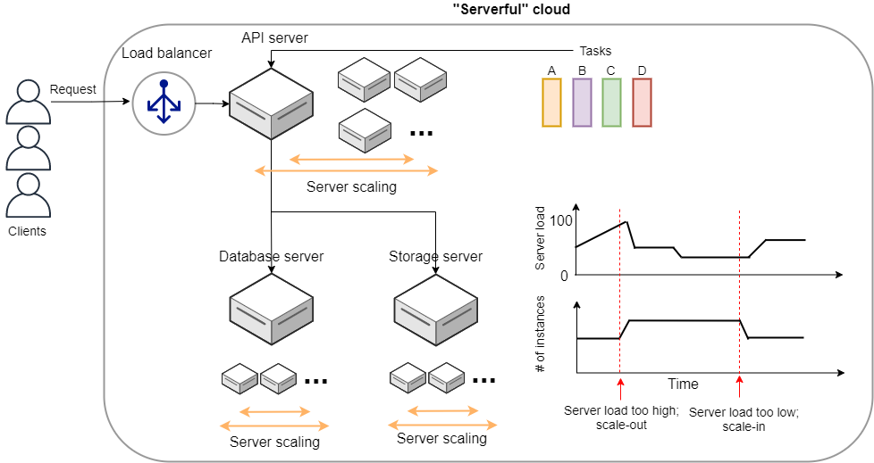

## Serverless クラウドへ

[Serverful クラウド (従来型)](#chap_serverful_cloud) で議論したように，クラスターのスケーリングはクラウドシステムの経済的効率とシステムの安定性を最大化するために必須の作業である． それを反映して，多くの開発者の時間が投資されてきた．

クラスターのスケーリングはすべての開発者が何度も繰り返し行ってきた作業であり，いくつかの側面をテンプレート化し，共通化することができたならば開発のコストを大幅に削減できるだろう． それを実現するには，根本的なレベルからクラウドシステムの設計を考え直す必要がある． **スケーリングを前提**として考えることで，もっと**シンプルで見通しがよいクラウドシステムの設計の仕組みはないだろうか**？ そのような動機が，サーバーレスアーキテクチャが誕生する背後にあった．

従来の serverful なシステムでの最大の問題点は，**サーバーをまるまる占有してしまう**という点にある． すなわち， EC2 インスタンスを起動したとき，そのインスタンスは起動したユーザーだけが使えるものであり，**計算のリソース (CPU や RAM) が独占的に割り当てられた状態**になる． 固定した計算資源の割り当てがされてしまっているので，**インスタンスの計算負荷が 0%であろうが 100%であろうが，均一の使用料金が起動時間に比例**して発生する．

サーバーレスアーキテクチャは，このような **独占的に割り当てられた計算リソースというものを完全に廃止する**ことを出発点とする． サーバーレスアーキテクチャでは，計算のリソースは，クラウドプロバイダーがすべて管理する． クライアントは，仮想インスタンスを一台まるごと借りるのではなく，計算のタスクの需要が生まれる毎に，**実行したいプログラム・コマンドをクラウドに提出する**． クラウドプロバイダーは，自身のもつ巨大な計算リソースから空きを探し，提出されたプログラムを実行し，実行結果をクライアントに返す． 言い換えると，計算リソースのスケーリングやアロケーションなどはクラウドプロバイダーが一手に引き受け，ユーザーはジョブをサブミットすることに注力する，という枠組みである． これを図示すると， [figure_title](#serverless) のようになる．

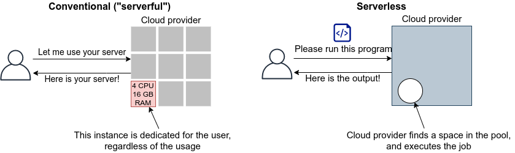

サーバーレスクラウドでは，スケーリングはすべてクラウドプロバイダーが引き受けるので，スケーラビリティーが保証されている． クライアントが同時に大量のタスクを送信した場合でも，クラウドプロバイダー側の独自の仕組みによってすべてのタスクが遅延なく実行される． また，サーバーレスクラウドを利用することで，**クラウドのコストは実際に使用した計算の総量 (稼働時間) で決定される**ことになる． これは，計算の実行総量に関わらずインスタンスの起動時間で料金が決定されていた従来のシステムと比べて大きな違いである．

サーバーレスクラウドは，従来のクラウドとは根本から異なったアプローチなので，コードの書き方やシステムの設計が大きく異なる． サーバーレスクラウドを開発・運用するには，サーバーレス固有の概念や用語に精通している必要がある． 以降では，実際にクラウドを動かしながら，サーバーレスをより具体的に体験していこう．

従来型の(仮想インスタンスをたくさん起動するような)クラウドシステムは，**賃貸**と似ているかもしれない． 部屋を借りるというのは，その部屋でどれだけの時間を過ごそうが，月々の家賃は一定である． 同様に，仮想サーバーも，それがどれほどの計算を行っているかに関わらず，一定の料金が時間ごとに発生する．

一方で，サーバーレスクラウドは，**電気・水道・ガス料金** と似ている． こちらは，実際に使用した量に比例して料金が決定されている． サーバーレスクラウドも，実際に計算を行った総時間で料金が決まる仕組みになっている．

## サーバーレスクラウドを構成するコンポーネント

サーバーレスアーキテクチャの概要がわかってきたところで，ここでは AWS においてサーバーレスクラウドを構成する様々なコンポーネントを紹介していこう． 特に， **Lambda**, **S3**, **DynamoDB** を取り上げ，解説する ([figure_title](#fig:serverless_logos))． サーバーレスクラウドは，これらのコンポーネントを統合することで一つのシステムが出来上がる． ここでは， Lambda，S3，DynamoDB を利用する際に押さえておかなければならない知識を一通り説明しきる都合上，具体的なイメージがわきにくいかもしれない． が，続く [Hands-on \#5: サーバーレス入門](#sec_intro_serverless) でそれぞれについてハンズオン形式で演習を行うので，そこでさらに理解を深めれば大丈夫である．

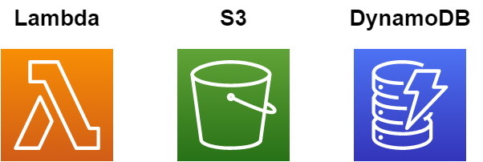

### Lambda

AWS でサーバーレスコンピューティングの中心を担うのが， [Lambda](https://aws.amazon.com/lambda/) である． Lambda の使い方を [figure_title](#lambda_workflow) に図示している． Lambda の仕組みはシンプルで，まずユーザーは実行したいプログラムのコードを事前に登録しておく． プログラムは， Python, Node.js, Ruby などの主要な言語がサポートされている． Lambda に登録されたひとつひとつのプログラムを関数 (Function) とよぶ． そして，関数を実行したいときに，invoke コマンドを Lambda に送信する． Lambda では， invoke のリクエストを受け取るとただちに (数ミリセカンドから数百ミリセカンド程度の時間で) プログラムの実行を開始する． そして，実行結果をクライアントやその他の計算機に返す．

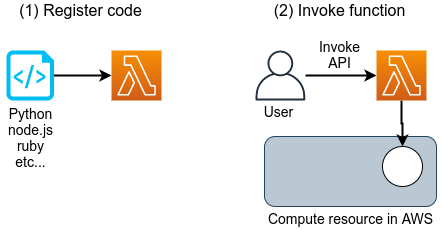

このように，Lambda では占有された仮想インスタンスは存在せず，実行を待っているプログラムだけがある状態である． invoke のリクエストに応じて，プログラムが AWS の巨大な計算機プールのどこかに配置され，実行される． 同時に複数のリクエストが来た場合でも， AWS はそれらを実行するための計算リソースを割り当て，並列的に処理を行ってくれる． 原理上は，**数千から数万のリクエストが同時に来たとしても， Lambda はそれらを同時に実行することができる**． このような，占有された仮想サーバーの存在なしに，動的に関数を実行するサービスのことを総称して **FaaS (Function as a Service)** とよぶ．

Lambda ではそれぞれの関数につき， 128MB から 10240MB のメモリーを使用することができる (執筆時点の仕様)． また，実効的な CPU のパワーはメモリーの量に比例する形で割り当てられる． すなわち，タスクに割り当てたメモリーの量が多ければ多いほど，より多くの CPU リソースが割り当てられることになる (しかし， RAM と CPU パワーの具体的な換算表は AWS からは公開されていない)． 実行時間は 100 ミリ秒の単位で記録され，実行時間に比例して料金が決定される． [table_title](#lambda_pricing) は Lambda の利用料金表である (執筆時点で `ap-north-east1` リージョンを選択した場合)．

<table><caption>Lambda の料金表</caption><colgroup><col style="width: 50%" /><col style="width: 50%" /></colgroup><thead><tr class="header"><th>Memory (MB)</th><th>Price per 100ms</th></tr></thead><tbody><tr class="odd"><td><p>128</p></td><td><p>$0.0000002083</p></td></tr><tr class="even"><td><p>512</p></td><td><p>$0.0000008333</p></td></tr><tr class="odd"><td><p>1024</p></td><td><p>$0.0000016667</p></td></tr><tr class="even"><td><p>3008</p></td><td><p>$0.0000048958</p></td></tr></tbody></table>

実行時間に比例する料金に追加して，リクエストを送信するごとに発生する料金が設定されている． これは，百万回のリクエストにつき $0.2 である． たとえば， 128MB のメモリーを使用する関数を，それぞれ 200 ミリ秒，合計で 100 万回実行した場合， 0.0000002083 \* 2 \* 10^6 + 0.2 = $0.6 の料金となる． ウェブサーバーのデータベースの更新など簡単な計算であれば，200 ミリ秒程度で実行できる関数も多いことから，100 万回データベースの更新を行ったとしても，たった $0.6 しかコストが発生しないことになる． また，コードが実行されず待機状態になっている場合は，発生する料金は 0 である． このように，実際に意味のある処理が行われた時間にのみ，料金が発生する仕組みになっている．

Lambda は比較的短時間で完了する，反復性の高いタスクの実行に向いている． データベースの読み書きはその典型的な例であるが，そのほかにも，画像のサイズをトリミングしたり，サーバーサイドで定期的に実行されるメンテナンス処理などの利用が考えられる． また，複数の Lambda をリレー式に繋げることも可能で，シンプルな処理を組み合わせることで複雑なロジックを表現することができる．

上述の Lambda の料金計算は，説明のためコストに寄与する要素をいくつか省いている点は承知いただきたい． 例えば， DynamoDB の読み書きに関する料金や，ネットワークの通信にかかわるコストが考慮されていない．

### サーバーレスストレージ: S3

サーバーレスの概念は，ストレージにも拡張されている．

従来的なストレージ (ファイルシステム) では，必ずホストとなるマシンと OS が存在しなければならない． したがって，それほどパワーは必要ないまでも，ある程度の CPU リソースを割かなければならない． また，従来的なファイルシステムでは，データ領域のサイズは最初にディスクを初期化するときに決めなければならず，後から容量を増加させることはしばしば困難である (ZFS などのファイルシステムを使えばある程度は自由にファイルシステムのサイズを変更することは可能である)． よって，従来的なクラウドでは，ストレージを借りる際にはあらかじめディスクのサイズを指定せねばならず，ディスクの中身が空であろうと満杯であろうと，同じ利用料金が発生することになる ([figure_title](#fig:s3_vs_filesystem))．

[Simple Storage Service (S3)](https://aws.amazon.com/s3/) は，サーバーレスなストレージシステムを提供する ([figure_title](#fig:s3_vs_filesystem))． S3 は従来的なストレージシステムと異なり， OS に"マウントする”という概念はない． 基本的に API を通じてデータの読み書きの操作が行われる． また，データの冗長化や暗号化，バックアップの作成など，通常ならば OS と CPU が介在しなければならない操作も， API を通じて行うことができる． S3 では事前に決められたディスク領域のサイズはなく，データを入れれば入れた分だけ，保存領域は拡大していく (仕様上はペタバイトスケールのデータを保存することが可能である)． ストレージにかかる料金は，保存してあるデータの総容量で決定される．

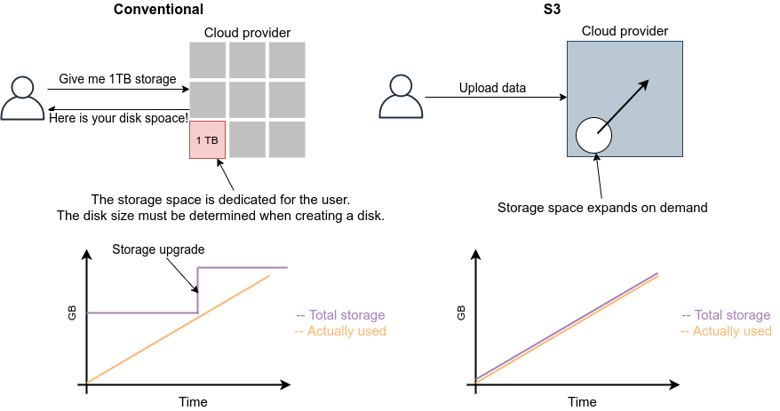

S3 を利用する際に，料金に関わってくる主要な事項をまとめたのが [table_title](#tab:s3_pricing) である (`us-east-1` リージョンのもの． 説明のため主要な事項のみ取り出している． 詳細は [公式ドキュメンテーション "Amazon S3 pricing"](https://aws.amazon.com/s3/pricing/?nc=sn&loc=4) を参照)．

<table><caption>S3 の利用料金</caption><colgroup><col style="width: 50%" /><col style="width: 50%" /></colgroup><thead><tr class="header"><th>項目</th><th>料金</th></tr></thead><tbody><tr class="odd"><td><p>Data storage (First 50TB)</p></td><td><p>$0.023 per GB per month</p></td></tr><tr class="even"><td><p>PUT, COPY, POST, LIST requests (per 1,000 requests)</p></td><td><p>$0.005</p></td></tr><tr class="odd"><td><p>GET, SELECT, and all other requests (per 1,000 requests)</p></td><td><p>$0.0004</p></td></tr><tr class="even"><td><p>Data Transfer IN To Amazon S3 From Internet</p></td><td><p>$0</p></td></tr><tr class="odd"><td><p>Data Transfer OUT From Amazon S3 To Internet</p></td><td><p>$0.09 per GB</p></td></tr></tbody></table>

第一に，データの保存には $0.025 per GB のコストが月ごとに発生する． したがって，1000GB のデータを S3 に一ヵ月保存した場合， $25 の料金が発生することになる． また，`PUT`, `COPY`, `POST` などのリクエスト (=データを書き込む操作) に対しては，データ容量に関係なく，1000 回ごとに $0.005 のコストが発生する． `GET`, `SELECT` などのリクエスト (=データを読み込む操作) に対しては，1000 回ごとに $0.0004 のコストが発生する． また， S3 はデータを外に取り出す際の通信にもコストが生じる． 執筆時点では，S3 からインターネットを通じて外部にデータを転送 (data-out) すると $0.09 per GB のコストが発生する． データをインターネットを通じて S3 に入れる (data-in) 通信は無料で行える． また， AWS の 同じ Region 内のサービス (Lambda や EC2 など) にデータを転送するのは無料である． AWS のリージョンをまたいだデータの転送にはコストが発生する． いずれにせよ，サーバーレスの概念に則り，すべての料金が従量課金制で決定される設定になっている．

### サーバーレスデータベース: DynamoDB

サーバーレスの概念は，データベースにも適用することができる．

ここでいうデータベースとは， Web サービスなどにおけるユーザーや商品の情報を記録しておくための保存領域のことを指している． 従来的に有名なデータベースとしては [MySQL](https://www.mysql.com/), [PostgreSQL](https://www.postgresql.org/), [MongoDB](https://www.mongodb.com/) などが挙げられる． データベースと普通のストレージの違いは，データの検索機能にある． 普通のストレージではデータは単純にディスクに書き込まれるだけだが， データベースでは検索がより効率的になるようなデータの配置がされたり， 頻繁にアクセスされるデータはメモリーにキャッシュされるなどの機能が備わっている． これにより，巨大なデータの中から，興味のある要素を高速に取得することができる．

このような検索機能を実現するには，当然 CPU の存在が必須である． したがって，従来的なデータベースを構築する際は，ストレージ領域に加えて，たくさんの CPU コアを搭載したマシンが用いられることが多い． また，データベースが巨大な場合は複数マシンにまたがった分散型のシステムが設計される． 分散型システムの場合は， [Serverful クラウド (従来型)](#chap_serverful_cloud) で議論したようにデータベースへのアクセス負荷に応じて適切なスケーリングがなされる必要がある．

[DynamoDB](https://aws.amazon.com/dynamodb/) は， AWS が提供しているサーバーレスな分散型データベースである． サーバーレスであるので，占有されたデータベース用仮想インスタンスは存在せず， API を通じてデータの書き込み・読み出し・検索などの操作を行う． S3 と同様に，データ保存領域の上限は定められておらず，データを入れれば入れた分だけ，保存領域は拡大していく． また，データベースへの負荷が増減したときのスケーリングは， DynamoDB が自動で行うので，ユーザーは心配する必要はない．

DynamoDB での利用料金の計算はやや複雑なのだが， "On-demand Capacity" というモードで使用した場合の料金に関わってくる主要な事項をまとめたのが [table_title](#tab:dynamodb_pricing) である (`us-east-1` リージョンのもの． 詳細は [公式ドキュメンテーション "Pricing for On-Demand Capacity"](https://aws.amazon.com/dynamodb/pricing/on-demand/) を参照)．

<table><caption>DynamoDB の利用料金</caption><colgroup><col style="width: 50%" /><col style="width: 50%" /></colgroup><thead><tr class="header"><th>項目</th><th>料金</th></tr></thead><tbody><tr class="odd"><td><p>Write request units</p></td><td><p>$1.25 per million write request units</p></td></tr><tr class="even"><td><p>Read request units</p></td><td><p>$0.25 per million read request units</p></td></tr><tr class="odd"><td><p>Data storage</p></td><td><p>$0.25 per GB-month</p></td></tr></tbody></table>

DynamoDB ではデータの書き込み操作の単位を write request unit とよび，データの読み込み操作の単位を read request unit とよぶ． 基本的に， 1kB 以下のデータを一度書き込むと 1 write request unit を消費し，4kB 以下のデータを一度読み込むと 1 read request unit を消費する (詳しくは [公式ドキュメンテーション "Read/Write Capacity Mode"](https://docs.aws.amazon.com/amazondynamodb/latest/developerguide/HowItWorks.ReadWriteCapacityMode.html) を参照のこと)． write request units は 100 万回ごとに $1.25, read request units は 100 万回ごとに $0.25 のコストが設定されている． また，保存されたデータ容量に対して $0.25 per GB のコストが月ごとに発生する． DynamoDB は高速な検索機能などを備えたデータベースであるので， GB あたりのストレージコストは S3 に比べ 10 倍程度高い． DynamoDB のデータの転送に関わるコストは，同じリージョン内ならば data-in，data-out ともに $0 である． リージョンをまたいだ通信には別途コストが発生する．

### その他のサーバーレスクラウドの構成要素

以上で紹介した Lambda, S3, DynamoDB がサーバーレスクラウドの中で最も使用する頻度が高いサービスになる． その他のサーバーレスクラウドの構成要素を以下に列挙する． いくつかについては，今後のハンズオンを行う中で改めて解説を行う．

-   [API Gateway](https://aws.amazon.com/api-gateway/): API を構築する際のルーティングを担う． [Hands-on \#6: Bashoutter](#sec_bashoutter) で取り上げる．

-   [Fargate](https://aws.amazon.com/fargate/): [Hands-on \#3: AWS で自動質問回答ボットを走らせる](#sec_fargate_qabot) で触れた Fargate も，サーバーレスクラウドの要素の一部である． Lambda との違いは，Lambda よりも大容量のメモリーや CPU を要するような計算などを行うことができる点が挙げられる．

-   [Simple Notification Service (SNS)](https://aws.amazon.com/sns/): サーバーレスのサービス間でイベントをやり取りするためのサービス．

-   [Step Functions](https://aws.amazon.com/step-functions/): サーバーレスのサービス間のオーケストレーションを担う．

**サーバーレスアーキテクチャは万能か？**

この問いへの答えは，筆者は NO であると考える．

ここまで，サーバーレスの利点を強調して説明をしてきたが，まだまだ新しい技術なだけに，欠点，あるいはサーバーフルなシステムに劣る点は数多くある．

大きな欠点を一つあげるとすれば，サーバーレスのシステムは各クラウドプラットフォームに固有なものなので，特定のプラットフォームでしか運用できないシステムになってしまう点であろう． AWS で作成したサーバーレスのシステムを， Google のクラウドに移植するには，かなり大掛かりなプログラムの書き換えが必要になる． 一方， serverful なシステムであれば，プラットフォーム間のマイグレーションは比較的簡単に行うことができる． クラウドプロバイダーとしては，自社のシステムへの依存度を強めることで，顧客を離さないようにするという狙いがあるのだろう…

その他，サーバーレスコンピューティングの欠点や今後の課題などは，次の論文で詳しく議論されている． 興味のある読者はぜひ読んでいただきたい．

-   [Hellerstein et al., "Serverless Computing: One Step Forward, Two Steps Back" arXiv (2018)](https://arxiv.org/abs/1812.03651)

# Hands-on \#5: サーバーレス入門

前章ではサーバーレスアーキテクチャの概要の説明を行った． 本章では，ハンズオン形式でサーバーレスクラウドを実際に動かしながら，具体的な使用方法を学んでいこう． 今回のハンズオンでは Lambda, S3, DynamoDB の三つのサーバーレスクラウドの構成要素に触れていく． それぞれについて，短いチュートリアルを用意してある．

## Lambda ハンズオン

まずは， Lambda を実際に動かしてみよう． ハンズオンのソースコードは GitHub の [handson/serverless/lambda](https://github.com/tomomano/learn-aws-by-coding/tree/main/handson/serverless/lambda) に置いてある．

このハンズオンで使用するアプリケーションのスケッチを [figure_title](#fig:lambda_deploy) に示す． STEP 1 では，AWS CDK を使用して Python で書かれたコードを Lambda に登録する． 続いて STEP 2 では， Invoke API を使用して，同時にいくつもの Lambda を起動し，並列な計算を行う． Lambda のワークフローを体験する目的で最小限の設定である．


このハンズオンは，基本的に [AWS Lambda の無料枠](https://aws.amazon.com/free/?all-free-tier.sort-by=item.additionalFields.SortRank&all-free-tier.sort-order=asc) の範囲内で実行することができる．

[app.py](https://github.com/tomomano/learn-aws-by-coding/blob/main/handson/serverless/lambda/app.py) にデプロイするプログラムが書かれている． 中身を見てみよう．

```py
#
FUNC = """
import time
from random import choice, randint
def handler(event, context):
    time.sleep(randint(2,5))
    sushi = ["salmon", "tuna", "squid"]
    message = "Welcome to Cloud Sushi. Your order is " + choice(sushi)
    print(message)
    return message
"""

class SimpleLambda(core.Stack):

    def __init__(self, scope: core.App, name: str, **kwargs) -> None:
        super().__init__(scope, name, **kwargs)

        #
        handler = _lambda.Function(
            self, 'LambdaHandler',
            runtime=_lambda.Runtime.PYTHON_3_7,
            code=_lambda.Code.from_inline(FUNC),
            handler="index.handler",
            memory_size=128,
            timeout=core.Duration.seconds(10),
            dead_letter_queue_enabled=True,
        )
```

-   ここで， Lambda で実行されるべき関数を定義している． これは非常に単純な関数で，2-5 秒のランダムな時間スリープした後，\["salmon", "tuna", "squid"\] のいずれかの文字列をランダムに選択し， "Welcome to Cloud Sushi. Your order is XXXX" (XXXX は選ばれた寿司のネタ) というメッセージをリターンする．

-   次に， Lambda に &lt;1&gt; で書いた関数を配置している． パラメータの意味は，文字どおりの意味なので難しくはないが，以下に解説する．

    -   `runtime=_lambda.Runtime.PYTHON_3_7`: ここでは， Python3.7 を使って上記で定義された関数を実行せよ，と指定している． Python3.7 のほかに， Node.js, Java, Ruby, Go などの言語を指定することが可能である．

    -   `code=_lambda.Code.from_inline(FUNC)`: 実行されるべき関数が書かれたコードを指定する． ここでは， `FUNC=...` で定義した文字列を渡しているが，文字列以外にもファイルのパスを渡すことも可能である．

    -   `handler="index.handler"`: これは，コードの中にいくつかのサブ関数が含まれているときに，メインとサブを区別するためのパラメータである． `handler` という名前の関数をメイン関数として実行せよ，という意味である．

    -   `memory_size=128`: メモリーは 128MB を最大で使用することを指定している．

    -   `timeout=core.Duration.seconds(10)` タイムアウト時間を 10 秒に設定している． 10 秒以内に関数の実行が終了しなかった場合，エラーが返される．

    -   `dead_letter_queue_enabled=True`: アドバンストな設定なので説明は省略する．

上記のプログラムを実行することで， Lambda 関数がクラウド上に作成される． 早速デプロイしてみよう．

### デプロイ

デプロイの手順は，これまでのハンズオンとほとんど共通である． ここでは，コマンドのみ列挙する (`#` で始まる行はコメントである)． それぞれの意味を忘れてしまった場合は，ハンズオン 1, 2 に戻って復習していただきたい． シークレットキーの設定も忘れずに ([AWS CLI のインストール](#aws_cli_install))．

```shell
# プロジェクトのディレクトリに移動
$ cd handson/serverless/lambda

# venv を作成し，依存ライブラリのインストールを行う
$ python3 -m venv .env
$ source .env/bin/activate
$ pip install -r requirements.txt

# デプロイを実行
$ cdk deploy
```

デプロイのコマンドが無事に実行されれば， [figure_title](#handson_04_lambda_cdk_output) のような出力が得られるはずである． ここで表示されている `SimpleLambda.FunctionName = XXXX` の XXXX の文字列は後で使うのでメモしておこう．


AWS コンソールにログインして，デプロイされたスタックを確認してみよう． コンソールから，Lambda のページに行くと [figure_title](#handson_04_lambda_console_func_list) のような画面から Lambda の関数の一覧が確認できる．


今回のアプリケーションで作成したのが `SimpleLambda` で始まるランダムな名前のついた関数だ． 関数の名前をクリックして，詳細を見てみる． すると [figure_title](#handson_04_lambda_console_func_detail) のような画面が表示されるはずだ． 先ほどプログラムの中で定義した Python の関数がエディターから確認できる． さらに下の方にスクロールすると，関数の各種設定も確認できる．


Lambda で実行されるコードは， Lambda のコンソール画面 ([figure_title](#handson_04_lambda_console_func_detail)) のエディターで編集することもできる． デバッグをするときなどは，こちらを直接いじる方が早い場合もある． その場合は， CDK のコードに行った編集を反映させなおすことを忘れずに．

### Lambda 関数の実行

それでは，作成した Lambda 関数を実行 (invoke) してみよう． AWS の API を使うことで，関数の実行をスタートすることができる． 今回は， [handson/serverless/lambda/invoke_one.py](https://github.com/tomomano/learn-aws-by-coding/blob/main/handson/serverless/lambda/invoke_one.py) に関数を実行するための簡単なプログラムを提供している． 興味のある読者はコードを読んでもらいたい．

以下のコマンドで，Lambda の関数を実行する． コマンドの `XXXX` の部分は，先ほどデプロイしたときに `SimpleLambda.FunctionName = XXXX` で得られた XXXX の文字列で置換する．

```shell
$ python invoke_one.py XXXX
```

すると， `"Welcome to Cloud Sushi. Your order is salmon"` という出力が得られるはずだ． とてもシンプルではあるが，クラウド上で先ほどの関数が走り，乱数が生成されたうえで，ランダムな寿司ネタが選択されて出力が返されている． このコマンドを何度か打ってみて，実行ごとに異なる寿司ネタが返されることを確認しよう．

さて，このコマンドは，一度につき一回の関数を実行したわけであるが， Lambda の本領は一度に大量のタスクを同時に実行できる点である． そこで，今度は一度に 100 個のタスクを同時に送信してみよう． [handson/serverless/lambda/invoke_many.py](https://github.com/tomomano/learn-aws-by-coding/blob/main/handson/serverless/lambda/invoke_many.py) のスクリプトを使用する．

次のコマンドを実行しよう． XXXX の部分は前述と同様に置き換える． 第二引数の `100` は 100 個のタスクを投入せよ，という意味である．

```shell
$ python invoke_many.py XXXX 100
```

すると次のような出力が得られるはずだ．

```shell
....................................................................................................
Submitted 100 tasks to Lambda!
```

実際に，100 個のタスクが同時に実行されていることを確認しよう． [figure_title](#handson_04_lambda_console_func_detail) の画面に戻り， "Monitoring" というタブがあるので，それをクリックする． すると， [figure_title](#handson_04_lambda_console_monitoring) のようなグラフが表示されるだろう．


[figure_title](#handson_04_lambda_console_monitoring) のグラフの更新には数分かかることがあるので，なにも表示されない場合は少し待つ．

[figure_title](#handson_04_lambda_console_monitoring) で "Invocations" が関数が何度実行されたかを意味している． たしかに 100 回実行されていることがわかる． さらに， "Concurrent executions" は何個のタスクが同時に行われたかを示している． ここでは 96 となっていることから，96 個のタスクが並列的に実行されたことを意味している (これが 100 とならないのは，タスクの開始のコマンドが送られたのが完全には同タイミングではないことに起因する)．

このように，非常にシンプルではあるが， Lambda を使うことで，同時並列的に処理を実行することのできるクラウドシステムを簡単に作ることができた．

もしこのようなことを従来的な serverful なクラウドで行おうとした場合，クラスターのスケーリングなど多くのコードを書くことに加えて，いろいろなパラメータを調節する必要がある．

興味がある人は，一気に 1000 個などのジョブを投入してみるとよい． Lambda はそのような大量のリクエストにも対応できることが確認できるだろう． が，あまりやりすぎると Lambda の無料利用枠を超えて料金が発生してしまうので注意．

### スタックの削除

最後にスタックを削除しよう． スタックを削除するには，次のコマンドを実行すればよい．

```shell
$ cdk destroy
```

## DynamoDB ハンズオン

続いて， DynamoDB の簡単なチュートリアルをやってみよう． ハンズオンのソースコードは GitHub の [/handson/serverless/dynamodb](https://github.com/tomomano/learn-aws-by-coding/tree/main/handson/serverless/dynamodb) に置いてある．

このハンズオンで使用するアプリケーションのスケッチを [figure_title](#fig:dynamodb_deploy) に示す． STEP 1 では，AWS CDK を使用して DynamoDB のテーブルを初期化し，デプロイする． 続いて STEP 2 では， API を使用してデータベースのデータの書き込み・読み出し・削除などの操作を練習する．


このハンズオンは，基本的に [AWS DynamoDB の無料枠](https://aws.amazon.com/free/?all-free-tier.sort-by=item.additionalFields.SortRank&all-free-tier.sort-order=asc) の範囲内で実行できる．

[handson/serverless/dynamodb/app.py](https://github.com/tomomano/learn-aws-by-coding/blob/main/handson/serverless/dynamodb/app.py) にデプロイするプログラムが書かれている． 中身を見てみよう．

```python
class SimpleDynamoDb(core.Stack):
    def __init__(self, scope: core.App, name: str, **kwargs) -> None:
        super().__init__(scope, name, **kwargs)

        table = ddb.Table(
            self, "SimpleTable",
            #
            partition_key=ddb.Attribute(
                name="item_id",
                type=ddb.AttributeType.STRING
            ),
            #
            billing_mode=ddb.BillingMode.PAY_PER_REQUEST,
            #
            removal_policy=core.RemovalPolicy.DESTROY
        )
```

このコードで，最低限の設定がなされた空の DynamoDB テーブルが作成される． それぞれのパラメータの意味を簡単に解説しよう．

-   `partition_key`: すべての DynamoDB テーブルには Partition key が定義されていなければならない． Partition key とは，テーブル内の要素 (レコード) ごとに存在する固有の ID のことである． 同一の Partition key をもった要素がテーブルの中に二つ以上存在することはできない (注: Sort Key を使用している場合は除く．詳しくは [公式ドキュメンテーション "Core Components of Amazon DynamoDB"](https://docs.aws.amazon.com/amazondynamodb/latest/developerguide/HowItWorks.CoreComponents.html) 参照)． また， Partition key が定義されていない要素はテーブルの中に存在することはできない． ここでは， Partition key に `item_id` という名前をつけている．

-   `billing_mode`: `ddb.BillingMode.PAY_PER_REQUEST` を指定することで， [On-demand Capacity Mode](https://docs.aws.amazon.com/amazondynamodb/latest/developerguide/HowItWorks.ReadWriteCapacityMode.html#HowItWorks.OnDemand) の DynamoDB が作成される． ほかに `PROVISIONED` というモードがあるが，これはかなり高度なケースを除いて使用しないだろう．

-   `removal_policy`: CloudFormation のスタックが消去されたときに， DynamoDB も一緒に消去されるかどうかを指定する． このコードでは `DESTROY` を選んでいるので，すべて消去される． ほかのオプションを選択すると，スタックを消去しても DynamoDB のバックアップを残す，などの動作を定義することができる．

### デプロイ

デプロイの手順は，これまでのハンズオンとほとんど共通である． ここでは，コマンドのみ列挙する (`#` で始まる行はコメントである)． シークレットキーの設定も忘れずに ([AWS CLI のインストール](#aws_cli_install))．

```shell
# プロジェクトのディレクトリに移動
$ cd handson/serverless/dynamodb

# venv を作成し，依存ライブラリのインストールを行う
$ python3 -m venv .env
$ source .env/bin/activate
$ pip install -r requirements.txt

# デプロイを実行
$ cdk deploy
```

デプロイのコマンドが無事に実行されれば， [figure_title](#handson_04_dynamodb_cdk_output) のような出力が得られるはずである． ここで表示されている `SimpleDynamoDb.TableName = XXXX` の XXXX の文字列は後で使うのでメモしておこう．


AWS コンソールにログインして，デプロイされたスタックを確認してみよう． コンソールから， DynamoDB のページに行き，左のメニューバーから "Tables" を選択する． すると， [figure_title](#handson_04_dynamodb_table_list) のような画面からテーブルの一覧が確認できる．


今回のアプリケーションで作成したのが `SimpleDynamoDb` で始まるランダムな名前のついたテーブルだ． テーブルの名前をクリックして，詳細を見てみる． すると [figure_title](#handson_04_dynamodb_table_detail) のような画面が表示されるはずだ． "Items" のタブをクリックすると，テーブルの中のレコードを確認できる． 現時点ではなにもデータを書き込んでいないので，空である．


### データの読み書き

それでは， [デプロイ](#sec:serverless_dynamodb_deploy) で作ったテーブルを使ってデータの読み書きを実践してみよう． ここでは Python と [boto3](https://boto3.amazonaws.com/v1/documentation/api/latest/index.html) ライブラリを用いた方法を紹介する．

まずは，テーブルに新しい要素を追加してみよう． ハンズオンのディレクトリにある [simple_write.py](https://github.com/tomomano/learn-aws-by-coding/blob/main/handson/serverless/dynamodb/simple_write.py) を開いてみよう． 中には次のような関数が書かれている．

```python
import boto3
from uuid import uuid4
ddb = boto3.resource('dynamodb')

def write_item(table_name):
    table = ddb.Table(table_name)
    table.put_item(
    Item={
        'item_id': str(uuid4()),
        'first_name': 'John',
        'last_name': 'Doe',
        'age': 25,
        }
    )
```

コードを上から読んでいくと，まず最初に boto3 ライブラリをインポートし， `dynamodb` のリソースを呼び出している． `write_item()` 関数は， DynamoDB のテーブルの名前 (上で見た SimpleDynamoDb-XXXX) を引数として受け取る． そして， `put_item()` メソッドを呼ぶことで，新しいアイテムを DB に書き込んでいる． アイテムには `item_id`, `first_name`, `last_name`, `age` の 4 つの属性が定義されている． ここで， `item_id` は先ほど説明した Partition key に相当しており， [UUID4](https://en.wikipedia.org/wiki/Universally_unique_identifier) を用いたランダムな文字列を割り当てている．

では， `simple_write.py` を実行してみよう． "XXXX" の部分を自分がデプロイしたテーブルの名前 (`SimpleDynamoDb` で始まる文字列) に置き換えたうえで，次のコマンドを実行する．

```shell
$ python simple_write.py XXXX
```

新しい要素が正しく書き込めたか， AWS コンソールから確認してみよう． [figure_title](#handson_04_dynamodb_table_detail) と同じ手順で，テーブルの中身の要素の一覧を表示する． すると [figure_title](#fig:dynamodb_table_new_item) のように，期待通り新しい要素が見つかるだろう．


boto3 を使ってテーブルから要素を読みだすことも可能である． ハンズオンのディレクトリにある [simple_read.py](https://github.com/tomomano/learn-aws-by-coding/blob/main/handson/serverless/dynamodb/simple_read.py) を見てみよう．

```python
import boto3
ddb = boto3.resource('dynamodb')

def scan_table(table_name):
    table = ddb.Table(table_name)
    items = table.scan().get("Items")
    print(items)
```

`table.scan().get("Items")` によって，テーブルの中にあるすべての要素を読みだしている．

次のコマンドで，このスクリプトを実行してみよう ("XXXX" の部分を正しく置き換えることを忘れずに）．

```shell
$ python simple_read.py XXXX
```

先ほど書き込んだ要素が出力されることを確認しよう．

### 大量のデータの読み書き

DynamoDB の利点は，最初に述べたとおり，負荷に応じて自在にその処理能力を拡大できる点である．

そこで，ここでは一度に大量のデータを書き込む場合をシミュレートしてみよう． [batch_rw.py](https://github.com/tomomano/learn-aws-by-coding/blob/main/handson/serverless/dynamodb/batch_rw.py) に，一度に大量の書き込みを実行するためのプログラムが書いてある．

次のコマンドを実行してみよう (XXXX は自分のテーブルの名前に置き換える)．

```shell
$ python batch_rw.py XXXX write 1000
```

このコマンドを実行することで，ランダムなデータが 1000 個データベースに書き込まれる．

さらに，データベースの検索をかけてみよう． 今回書き込んだデータには `age` という属性に 1 から 50 のランダムな整数が割り当てられている． `age` が 2 以下であるような要素だけを検索し拾ってくるには，次のコマンドを実行すればよい．

```shell
$ python batch_rw.py XXXX search_under_age 2
```

上の 2 つのコマンドを何回か繰り返し実行してみて，データベースに負荷をかけてみよう． とくに大きな遅延なく結果が返ってくることが確認できるだろう．

### スタックの削除

DynamoDB で十分に遊ぶことができたら，忘れずにスタックを削除しよう．

これまでのハンズオンと同様，スタックを削除するには，次のコマンドを実行すればよい．

```shell
$ cdk destroy
```

## S3 ハンズオン

最後に， S3 の簡単なチュートリアルを紹介する． ハンズオンのソースコードは GitHub の [handson/serverless/s3](https://github.com/tomomano/learn-aws-by-coding/tree/main/handson/serverless/s3) に置いてある．

[figure_title](#fig:s3_deploy) が今回提供する S3 チュートリアルの概要である． STEP 1 として， AWS CDK を用いて S3 に新しい空のバケット (Bucket) を作成する． 続いて STEP 2 では，データのアップロード・ダウンロードの方法を解説する．


このハンズオンは，基本的に [S3 の無料枠](https://aws.amazon.com/free/?all-free-tier.sort-by=item.additionalFields.SortRank&all-free-tier.sort-order=asc) の範囲内で実行することができる．

[app.py](https://github.com/tomomano/learn-aws-by-coding/blob/main/handson/serverless/s3/app.py) にデプロイするプログラムが書かれている． 中身を見てみよう．

```python
class SimpleS3(core.Stack):
    def __init__(self, scope: core.App, name: str, **kwargs) -> None:
        super().__init__(scope, name, **kwargs)

        # S3 bucket to store data
        bucket = s3.Bucket(
            self, "bucket",
            removal_policy=core.RemovalPolicy.DESTROY,
            auto_delete_objects=True,
        )
```

`s3.Bucket()` を呼ぶことによって空のバケットが新規に作成される． 上記のコードだと，バケットの名前は自動生成される． もし，自分の指定した名前を与えたい場合は， `bucket_name` というパラメータを指定すればよい． その際， バケットの名前はユニークでなければならない (i.e. AWS のデプロイが行われるリージョン内で名前の重複がない) 点に注意しよう． もし，同じ名前のバケットが既に存在する場合はエラーが返ってくる．

デフォルトでは， CloudFormation スタックが削除されたとき， S3 バケットとその中に保存されたファイルは削除されない． これは，大切なデータを誤って消してしまうことを防止するための安全策である． `cdk destroy` を実行したときにバケットも含めてすべて削除されるようにするには， `removal_policy=core.RemovalPolicy.DESTROY, auto_delete_objects=True` とパラメータを設定する． 結果もよく理解したうえで，自分の用途にあった適切なパラメータを設定しよう．

### デプロイ

デプロイの手順は，これまでのハンズオンとほとんど共通である． ここでは，コマンドのみ列挙する (`#` で始まる行はコメントである)． シークレットキーの設定も忘れずに ([AWS CLI のインストール](#aws_cli_install))．

```shell
# プロジェクトのディレクトリに移動
$ cd handson/serverless/s3

# venv を作成し，依存ライブラリのインストールを行う
$ python3 -m venv .env
$ source .env/bin/activate
$ pip install -r requirements.txt

# デプロイを実行
$ cdk deploy
```

デプロイを実行すると， [figure_title](#fig:s3_deploy_output) のような出力が得られるはずである． ここで表示されている `SimpleS3.BucketName = XXXX` が，新しく作られたバケットの名前である (今回提供しているコードを使うとランダムな名前がバケットに割り当てられる）． これはあとで使うのでメモしておこう．


### データの読み書き

スタックのデプロイが完了したら，早速バケットにデータをアップロードしてみよう．

まずは，以下のコマンドを実行して， `tmp.txt` という仮のファイルを生成する．

```shell
$ echo "Hello world!" >> tmp.txt
```

ハンズオンのディレクトリにある [simple_s3.py](https://github.com/tomomano/learn-aws-by-coding/blob/main/handson/serverless/s3/simple_s3.py) に [boto3](https://boto3.amazonaws.com/v1/documentation/api/latest/index.html) ライブラリを使用した S3 のファイルのアップロード・ダウンロードのスクリプトが書いてある． `simple_s3.py` を使って，上で作成した `tmp.txt` を以下のコマンドによりバケットにアップロードする． `XXXX` のところは，自分自身のバケットの名前で置き換えること．

```shell
$ python simple_s3.py XXXX upload tmp.txt
```

`simple_s3.py` のアップロードを担当している部分を以下に抜粋する．

```python
def upload_file(bucket_name, filename, key=None):
    bucket = s3.Bucket(bucket_name)

    if key is None:
        key = os.path.basename(filename)

    bucket.upload_file(filename, key)
```

`bucket = s3.Bucket(bucket_name)` の行で `Bucket()` オブジェクトを呼び出している． そして， `upload_file()` メソッドを呼ぶことでファイルのアップロードを実行している．

S3 においてファイルの識別子として使われるのが **Key** である． これは，従来的なファイルシステムにおけるパス (Path) と相同な概念で，それぞれのファイルに固有な Key が割り当てられる必要がある． Key という呼び方は， S3 が [Object storage](https://en.wikipedia.org/wiki/Object_storage) と呼ばれるシステムに立脚していることに由来する． `--key` のオプションを追加して `simple_s3.py` を実行することで， Key を指定してアップロードを実行することができる．

```shell
$ python simple_s3.py XXXX upload tmp.txt --key a/b/tmp.txt
```

ここではアップロードされたファイルに `a/b/tmp.txt` という Key を割り当てている．

ここまでコマンドを実行し終えたところで，一度 AWS コンソールに行き S3 の中身を確認してみよう． S3 のコンソールに行くと，バケットの一覧が見つかるはずである． その中から， `simples3-bucket` から始まるランダムな名前のついたバケットを探し，クリックする． するとバケットの中に含まれるファイルの一覧が表示される ([figure_title](#fig:s3_bucket_filelist))．


ここで実行した 2 つのコマンドによって， `tmp.txt` というファイルと， `a/b/tmp.txt` というファイルが見つかることに注目しよう． 従来的なファイルシステムと似た体験を提供するため， S3 では Key が **"/" (スラッシュ)** によって区切られていた場合，**ツリー状の階層構造**によってファイルを管理することができる．

オブジェクトストレージには本来ディレクトリという概念はない． 上で紹介した "/" による階層づけはあくまでユーザー体験向上の目的のお化粧的な機能である．

次に，バケットからファイルのダウンロードを実行してみよう． `simple_s3.py` を使って，以下のコマンドを実行すればよい． `XXXX` のところは，自分自身のバケットの名前で置き換えること．

```shell
$ python simple_s3.py XXXX download tmp.txt
```

`simple_s3.py` のダウンロードを担当している部分を以下に抜粋する．

```python
def download_file(bucket_name, key, filename=None):
    bucket = s3.Bucket(bucket_name)

    if filename is None:
        filename = os.path.basename(key)

    bucket.download_file(key, filename)
```

S3 からのダウンロードはシンプルで， `download_file()` メソッドを使って，ダウンロードしたい対象の Key を指定すればよい． ローカルのコンピュータでの保存先のパスを 2 個目の引数として渡している．

### スタックの削除

以上のハンズオンで， S3 の一番基本的な使い方を紹介した． ここまでのハンズオンが理解できたら，忘れずにスタックを削除しよう． これまでのハンズオンと同様，スタックを削除するには，次のコマンドを実行すればよい．

```shell
$ cdk destroy
```

# Hands-on \#6: Bashoutter

さて，最後のハンズオンとなる第六回では，これまで学んできたサーバーレスクラウドの技術を使って，簡単なウェブサービスを作ってみよう． 具体的には，人々が自分の作った俳句を投稿する SNS サービス (**Bashoutter** と名付ける) を作成してみよう． Lambda, DynamoDB, S3 などの技術をすべて盛り込み，シンプルながらもサーバーレスの利点を生かしたスケーラブルな SNS アプリが誕生する． 最終的には， [figure_title](#handson_05_bashoutter) のような，ミニマルではあるがとても現代風な SNS サイトが完成する！


## 準備

ハンズオンのソースコードは GitHub の [handson/bashoutter](https://github.com/tomomano/learn-aws-by-coding/tree/main/handson/bashoutter) に置いてある．

本ハンズオンの実行には，第一回ハンズオンで説明した準備 ([準備](#handson_01_prep)) が整っていることを前提とする． それ以外に必要な準備はない．

このハンズオンは，基本的に [AWS の無料枠](https://aws.amazon.com/free/?all-free-tier.sort-by=item.additionalFields.SortRank&all-free-tier.sort-order=asc) の範囲内で実行できる．

## アプリケーションの説明

### API

今回のアプリケーションでは，人々からの俳句の投稿を受け付けたり，投稿された俳句の一覧を取得する，といった機能を実装したい． この機能を実現するための最小限の設計として， [table_title](#tab_handson_05_api) に示すような四つの REST API を今回は実装する． 俳句を投稿する，閲覧する，削除するという基本的なデータ操作を行うための API が完備されている． また， `PATCH /haiku/{item_id}` は， `{item_id}` で指定された俳句に”いいね”をするために使用する．

<table><caption>Bashoutter API</caption><colgroup><col style="width: 50%" /><col style="width: 50%" /></colgroup><tbody><tr class="odd"><td><p><code>GET /haiku</code></p></td><td><p>俳句の一覧を取得する</p></td></tr><tr class="even"><td><p><code>POST /haiku</code></p></td><td><p>新しい俳句を投稿する</p></td></tr><tr class="odd"><td><p><code>PATCH /haiku/{item_id}</code></p></td><td><p><code>{item_id}</code> で指定された俳句にお気に入り票を一つ入れる</p></td></tr><tr class="even"><td><p><code>DELETE /haiku/{item_id}</code></p></td><td><p><code>{item_id}</code> で指定された俳句を削除する</p></td></tr></tbody></table>

それぞれの API のパラメータおよび返り値の詳細は，ハンズオンのソースコードの中の [swagger.yml](https://github.com/tomomano/learn-aws-by-coding/blob/main/handson/bashoutter/specs/swagger.yml) に定義してある．

**Open API Specification** (OAS; 少し前は Swagger Specification とよばれていた) は， REST API のための記述フォーマットである． OAS に従って API の仕様が記述されていると，簡単にドキュメンテーションを生成したり，クライアントアプリケーションを自動生成することができる． [今回用意した API 仕様](https://github.com/tomomano/learn-aws-by-coding/blob/main/handson/bashoutter/specs/swagger.yml) も， OAS に従って書いてある． 詳しくは [Swagger の公式ドキュメンテーション](https://swagger.io/docs/specification/about/) などを参照．

### アプリケーションアーキテクチャ

このハンズオンで作成するアプリケーションの概要を [figure_title](#handson_05_architecture) に示す．


簡単にまとめると，次のような設計である．

-   クライアントからの API リクエストは， **API Gateway** (後述)にまず送信され， API の URI で指定された Lambda 関数へ転送される．

-   それぞれの API のパス (リソース) ごとに独立した Lambda を用意する．

-   俳句の情報 (作者，本文，投稿日時など) を記録するためのデータベース (DynamoDB) を用意する．

-   各 Lambda 関数には， DynamoDB へのアクセス権を付与する．

-   最後に，ウェブブラウザからコンテンツを表示できるよう， ウェブページの静的コンテンツを配信するための S3 バケットを用意する．クライアントはこの S3 バケットにアクセスすることで HTML/CSS/JS などのコンテンツを取得する．

それでは，プログラムのソースコードを見てみよう ([handson/bashoutter/app.py](https://github.com/tomomano/learn-aws-by-coding/blob/main/handson/bashoutter/app.py))．

```python
class Bashoutter(core.Stack):

    def __init__(self, scope: core.App, name: str, **kwargs) -> None:
        super().__init__(scope, name, **kwargs)

        #
        # dynamoDB table to store haiku
        table = ddb.Table(
            self, "Bashoutter-Table",
            partition_key=ddb.Attribute(
                name="item_id",
                type=ddb.AttributeType.STRING
            ),
            billing_mode=ddb.BillingMode.PAY_PER_REQUEST,
            removal_policy=core.RemovalPolicy.DESTROY
        )

        #
        bucket = s3.Bucket(
            self, "Bashoutter-Bucket",
            website_index_document="index.html",
            public_read_access=True,
            removal_policy=core.RemovalPolicy.DESTROY
        )

        common_params = {
            "runtime": _lambda.Runtime.PYTHON_3_7,
            "environment": {
                "TABLE_NAME": table.table_name
            }
        }

        #
        # define Lambda functions
        get_haiku_lambda = _lambda.Function(
            self, "GetHaiku",
            code=_lambda.Code.from_asset("api"),
            handler="api.get_haiku",
            memory_size=512,
            **common_params,
        )
        post_haiku_lambda = _lambda.Function(
            self, "PostHaiku",
            code=_lambda.Code.from_asset("api"),
            handler="api.post_haiku",
            **common_params,
        )
        patch_haiku_lambda = _lambda.Function(
            self, "PatchHaiku",
            code=_lambda.Code.from_asset("api"),
            handler="api.patch_haiku",
            **common_params,
        )
        delete_haiku_lambda = _lambda.Function(
            self, "DeleteHaiku",
            code=_lambda.Code.from_asset("api"),
            handler="api.delete_haiku",
            **common_params,
        )

        #
        # grant permissions
        table.grant_read_data(get_haiku_lambda)
        table.grant_read_write_data(post_haiku_lambda)
        table.grant_read_write_data(patch_haiku_lambda)
        table.grant_read_write_data(delete_haiku_lambda)

        #
        # define API Gateway
        api = apigw.RestApi(
            self, "BashoutterApi",
            default_cors_preflight_options=apigw.CorsOptions(
                allow_origins=apigw.Cors.ALL_ORIGINS,
                allow_methods=apigw.Cors.ALL_METHODS,
            )
        )

        haiku = api.root.add_resource("haiku")
        haiku.add_method(
            "GET",
            apigw.LambdaIntegration(get_haiku_lambda)
        )
        haiku.add_method(
            "POST",
            apigw.LambdaIntegration(post_haiku_lambda)
        )

        haiku_item_id = haiku.add_resource("{item_id}")
        haiku_item_id.add_method(
            "PATCH",
            apigw.LambdaIntegration(patch_haiku_lambda)
        )
        haiku_item_id.add_method(
            "DELETE",
            apigw.LambdaIntegration(delete_haiku_lambda)
        )
```

-   ここで，俳句の情報を記録しておくための DynamoDB テーブルを定義している．

-   静的コンテンツを配信するための S3 バケットを用意している．

-   それぞれの API で実行される Lambda 関数を定義している． 関数は Python3.7 で書かれており，コードは [handson/bashoutter/api/api.py](https://github.com/tomomano/learn-aws-by-coding/blob/main/handson/bashoutter/api/api.py) にある．

-   &lt;3&gt; で定義された Lambda 関数に対し，データベースへの読み書きのアクセス権限を付与している．

-   ここで，API Gateway により，各 API パスとそこで実行されるべき Lambda 関数を紐付けている．

それぞれの項目について，もう少し詳しく説明しよう．

### Public access mode の S3 バケット

S3 のバケットを作成しているコードを見てみよう．

```python
bucket = s3.Bucket(
    self, "Bashoutter-Bucket",
    website_index_document="index.html",
    public_read_access=True,
    removal_policy=core.RemovalPolicy.DESTROY
)
```

ここで注目してほしいのは `public_read_access=True` の部分だ． 前章で， S3 について説明を行ったときには触れなかったが， S3 には **Public access mode** という機能がある． Public access mode をオンにしておくと，バケットの中のファイルは認証なしで (i.e. インターネット上の誰でも) 閲覧できるようになる． この設定は，一般公開されているウェブサイトの静的なコンテンツを置いておくのに最適であり，多くのサーバーレスによるウェブサービスでこのような設計が行われる． public access mode を設定しておくと， `http://XXXX.s3-website-ap-northeast-1.amazonaws.com/` のような固有の URL がバケットに対して付与される． そして，クライアントがこの URL にアクセスをすると，バケットの中にある `index.html` がクライアントに返され，ページがロードされる (どのファイルが返されるかは， `website_index_document="index.html"` の部分で設定している．)

なお，この時点ではバケットは空である． HTML/CSS/JS など静的コンテンツの配置は，デプロイを行った後ほどのステップで行う．

より本格的なウェブページを運用する際には， public access mode の S3 バケットに， [CloudFront](https://aws.amazon.com/cloudfront/) という機能を追加することが一般的である． CloudFront により，　**Content Delivery Nework (CDN)** や暗号化された HTTPS 通信を設定することができる． CloudFront についての詳細は [公式ドキュメンテーション "What is Amazon CloudFront?"](https://docs.aws.amazon.com/AmazonCloudFront/latest/DeveloperGuide/Introduction.html) などを参照いただきたい．

今回のハンズオンでは説明の簡略化のため CloudFront の設定を行わなかったが，興味のある読者は次のリンクのプログラムが参考になるだろう．

-   <https://github.com/aws-samples/aws-cdk-examples/tree/master/typescript/static-site>

今回の S3 バケットには， AWS によって付与されたランダムな URL がついている． これを． `example.com` のような自分のドメインでホストしたければ， AWS によって付与された URL を自分のドメインの DNS レコードに追加すればよい．

### API のハンドラ関数

API リクエストが来たときに，リクエストされた処理を行う関数のことをハンドラ (handler) 関数とよぶ． `GET /haiku` の API に対してのハンドラ関数を Lambda で定義している部分を見てみよう．

```python
get_haiku_lambda = _lambda.Function(
    self, "GetHaiku",
    code=_lambda.Code.from_asset("api"),
    handler="api.get_haiku",
    memory_size=512,
    **common_params
)
```

簡単なところから見ていくと， `memory_size=512` の箇所でメモリーの使用量を 512MB に指定している． また， `code=_lambda.Code.from_asset("api")` によって外部のディレクトリ (`api/`) を参照せよと指定しており， `handler="api.get_haiku"` のところで `api.py` というファイルの `get_haiku()` という関数をハンドラ関数として実行せよ，と定義している．

次に，ハンドラ関数として使用されている `get_haiku()` のコードを見てみよう ([handson/bashoutter/api/api.py](https://github.com/tomomano/learn-aws-by-coding/blob/main/handson/bashoutter/api/api.py))．

```python
ddb = boto3.resource("dynamodb")
table = ddb.Table(os.environ["TABLE_NAME"])

def get_haiku(event, context):
    """
    handler for GET /haiku
    """
    try:
        response = table.scan()

        status_code = 200
        resp = response.get("Items")
    except Exception as e:
        status_code = 500
        resp = {"description": f"Internal server error. {str(e)}"}
    return {
        "statusCode": status_code,
        "headers": HEADERS,
        "body": json.dumps(resp, cls=DecimalEncoder)
    }
```

`response = table.scan()` で，俳句の格納された DynamoDB テーブルから，すべての要素を取り出している． もしなにもエラーが起きなければステータスコード 200 が返され，もしなにかエラーが起こればステータスコード 500 が返されるようになっている．

上記のような操作を，ほかの API についても繰り返すことで，すべての API のハンドラ関数が定義されている．

`GET /haiku` のハンドラ関数で， `response = table.scan()` という部分があるが，実はこれは最善の書き方ではない． DynamoDB の `scan()` メソッドは，最大で 1MB までのデータしか返さない． データベースのサイズが大きく， 1MB 以上のデータがある場合には，再帰的に `scan()` メソッドをよぶ必要がある． 詳しくは [boto3 ドキュメンテーション](https://boto3.amazonaws.com/v1/documentation/api/latest/reference/services/dynamodb.html#DynamoDB.Table.scan) を参照．

### AWS における権限の管理 (IAM)

以下の部分のコードに注目してほしい．

```python
table.grant_read_data(get_haiku_lambda)
table.grant_read_write_data(post_haiku_lambda)
table.grant_read_write_data(patch_haiku_lambda)
table.grant_read_write_data(delete_haiku_lambda)
```

これまでは説明の簡略化のためにあえて触れてこなかったが， AWS には [IAM (Identity and Access Management)](https://aws.amazon.com/iam/) という重要な概念がある． IAM は基本的に，あるリソースがほかのリソースに対してどのような権限をもっているか，を規定するものである． Lambda は，デフォルトの状態ではほかのリソースにアクセスする権限をなにも有していない． したがって， Lambda 関数が DynamoDB のデータを読み書きするためには，それを許可するような IAM が Lambda 関数に付与されていなければならない．

CDK による `dynamodb.Table` オブジェクトには `grant_read_write_data()` という便利なメソッドが備わっており，アクセスを許可したい Lambda 関数を引数としてこのメソッドを呼ぶことで，データベースへの読み書きを許可する IAM を付与することができる． 同様に，CDK の `s3.Bucket` オブジェクトにも `grant_read_write()` というメソッドが備わっており，これによってバケットへの読み書きを許可することができる． このメソッドは，実は [Hands-on \#4: AWS Batch を使って機械学習のハイパーパラメータサーチを並列化する](#sec_aws_batch) で AWS Batch によるクラスターを構成した際に使用した． 興味のある読者は振り返ってコードを確認してみよう．

各リソースに付与する IAM は，**必要最低限の権限を与えるにとどめる**というのが基本方針である． これにより，セキュリティを向上させるだけでなく，意図していないプログラムからのデータベースへの読み書きを防止するという点で，バグを未然に防ぐことができる．

そのような理由により，このコードでは `GET` のハンドラー関数に対しては `grant_read_data()` によって， read 権限のみを付与している．

### API Gateway

[API Gateway](https://aws.amazon.com/api-gateway/) とは， API の"入り口"として，API のリクエストパスに従って Lambda や EC2 などに接続を行うという機能を担う ([figure_title](#fig:bashoutter_api_gateway))． Lambda や EC2 によって行われた処理の結果は，再び API Gateway を経由してクライアントに返される． このように，クライアントとバックエンドサーバーの間に立ち， API のリソースパスに応じて接続先を振り分けるようなサーバーを**ルーター**，あるいは**リバースプロキシ**とよんだりする． 従来的には，ルーターにはそれ専用の仮想サーバーが置かれることが一般的であった． しかし， API Gateway はサーバーレスなルーターとして，固定されたサーバーを配置することなく， API のリクエストが来たときのみ起動し，API のルーティングを実行する． サーバーレスであることの当然の帰結として，アクセスの件数が増大したときにはそれにルーティングの処理能力を自動で増やす機能も備わっている．


API Gateway を配置することで，大量 (1 秒間に数千から数万件) の API リクエストに対応することのできるシステムを容易に構築することができる． API Gateway の料金は [table_title](#tab_handson_05_apigateway_price) のように設定されている． また，無料利用枠により，月ごとに 100 万件までのリクエストは 0 円で利用できる．

<table><caption>API Gateway の利用料金設定 (<a href="https://aws.amazon.com/api-gateway/pricing/">参照</a>)</caption><colgroup><col style="width: 50%" /><col style="width: 50%" /></colgroup><thead><tr class="header"><th>Number of Requests (per month)</th><th>Price (per million)</th></tr></thead><tbody><tr class="odd"><td><p>First 333 million</p></td><td><p>$4.25</p></td></tr><tr class="even"><td><p>Next 667 million</p></td><td><p>$3.53</p></td></tr><tr class="odd"><td><p>Next 19 billion</p></td><td><p>$3.00</p></td></tr><tr class="even"><td><p>Over 20 billion</p></td><td><p>$1.91</p></td></tr></tbody></table>

ソースコードの該当箇所を見てみよう．

```python
#
api = apigw.RestApi(
    self, "BashoutterApi",
    default_cors_preflight_options=apigw.CorsOptions(
        allow_origins=apigw.Cors.ALL_ORIGINS,
        allow_methods=apigw.Cors.ALL_METHODS,
    )
)

#
haiku = api.root.add_resource("haiku")
#
haiku.add_method(
    "GET",
    apigw.LambdaIntegration(get_haiku_lambda)
)
haiku.add_method(
    "POST",
    apigw.LambdaIntegration(post_haiku_lambda)
)

#
haiku_item_id = haiku.add_resource("{item_id}")
#
haiku_item_id.add_method(
    "PATCH",
    apigw.LambdaIntegration(patch_haiku_lambda)
)
haiku_item_id.add_method(
    "DELETE",
    apigw.LambdaIntegration(delete_haiku_lambda)
)
```

-   最初に， `api = apigw.RestApi()` により，空の API Gateway を作成している．

-   次に， `api.root.add_resource()` のメソッドを呼ぶことで， `/haiku` という API パスを追加している．

-   続いて， `add_method()` を呼ぶことで， `GET`, `POST` のメソッドを `/haiku` のパスに定義している．

-   さらに， `haiku.add_resource("{item_id}")` により， `/haiku/{item_id}` という API パスを追加している．

-   最後に， `add_method()` を呼ぶことにより， `PATCH`, `DELETE` のメソッドを `/haiku/{item_id}` のパスに定義している．

このように， API Gateway の使い方は非常にシンプルで，逐次的に API パスとそこで実行されるメソッド・Lambda を記述していくだけでよい．

このプログラムで 新規 API を作成すると， ランダムな URL がその API のエンドポイントとして割り当てられる． これを． `api.example.com` のような自分のドメインでホストしたければ， AWS によって付与された URL を自分のドメインの DNS レコードに追加すればよい．

API Gateway で新規 API を作成したとき， `default_cors_preflight_options=` というパラメータで [Cross Origin Resource Sharing (CORS)](https://developer.mozilla.org/en-US/docs/Web/HTTP/CORS) の設定を行っている． これは，ブラウザで走る Web アプリケーションと API を接続するときに必要な設定である．

## アプリケーションのデプロイ

アプリケーションの中身が理解できたところで，早速デプロイを行ってみよう． デプロイの手順は，これまでのハンズオンとほとんど共通である． ここでは，コマンドのみ列挙する (`#` で始まる行はコメントである)． シークレットキーの設定も忘れずに ([AWS CLI のインストール](#aws_cli_install))．

```shell
# プロジェクトのディレクトリに移動
$ cd intro-aws/handson/bashoutter

# venv を作成し，依存ライブラリのインストールを行う
$ python3 -m venv .env
$ source .env/bin/activate
$ pip install -r requirements.txt

# デプロイを実行
$ cdk deploy
```

デプロイのコマンドが無事に実行されれば， [figure_title](#handson_05_cdk_output) のような出力が得られるはずである． ここで表示されている `Bashoutter.BashoutterApiEndpoint = XXXX`, `Bashoutter.BucketUrl = YYYY` の二つ文字列はあとで使うのでメモしておこう．


AWS コンソールにログインして，デプロイされたスタックを確認してみよう． まずは，コンソールから API Gateway のページに行く． すると， [figure_title](#handson_05_apigw_console_list) のような画面が表示され，デプロイ済みの API エンドポイントの一覧が確認できる．


今回デプロイした "BashoutterApi" という名前の API をクリックすることで [figure_title](#handson_05_apigw_console_detail) のような画面に遷移し，詳細情報を閲覧できる． `GET /haiku`, `POST /haiku` などが定義されていることが確認できる．

それぞれのメソッドをクリックすると，そのメソッドの詳細情報を確認できる． API Gateway は，前述したルーティングの機能だけでなく，認証機能などを追加することも可能である． このハンズオンではとくにこれらの機能は使用しないが， "Method Request" と書いてある項目などがそれに相当する． 次に， [figure_title](#handson_05_apigw_console_detail) で画面右端の赤色で囲った部分に，この API で呼ばれる Lambda 関数が指定されていることに注目しよう． 関数名をクリックと，該当する Lambda のコンソールに遷移し，関数の中身を閲覧することが可能である．


次に， S3 のコンソール画面に移ってみよう． `bashouter-` で始まるランダムな名前のバケットが見つかるはずである ([figure_title](#handson_05_s3_console))．


バケットの名前をクリックすることで，バケットの中身を確認してみよう． `index.html` のほか， `css/`, `js/` などのディレクトリがあるのが確認できるだろう ([figure_title](#handson_05_s3_contents))． これらが，ウェブページの"枠"を定義している静的コンテンツである．


## API リクエストを送信する

それでは，デプロイしたアプリケーションに対し，実際に API リクエストを送信してみよう． まずはコマンドラインから API を送信する演習を行おう． S3 に配置した GUI は一旦おいておく．

ここではコマンドラインから HTTP API リクエストを送信するためのシンプルな HTTP クライアントである [HTTPie](https://httpie.org/) を使ってみよう． HTTPie は，スタックをデプロイするときに Python 仮想環境 (venv) を作成したとき，一緒にインストールされている． 念のためインストールがうまくいっているか確認するには，仮想環境を立ち上げたあとコマンドラインに `http` と打ってみる． ヘルプのメッセージが出力されたら準備 OK である．

まず，先ほどデプロイを実行したときに得られた API のエンドポイントの URL (`Bashoutter.BashoutterApiEndpoint = XXXX` で得られた `XXXX` の文字列) をコマンドラインの変数に設定しておく．

```shell
$ export ENDPOINT_URL=XXXX
```

次に，俳句の一覧を取得するため， `GET /haiku` の API を送信してみよう．

```shell
$ http GET "${ENDPOINT_URL}/haiku"
```

現時点では，まだだれも俳句を投稿していないので，空の配列 (`[]`) が返ってくる．

それでは次に， `POST /haiku` を使って俳句を投稿してみよう．

```shell
$ http POST "${ENDPOINT_URL}/haiku" \
username="松尾芭蕉" \
first="閑さや" \
second="岩にしみ入る" \
third="蝉の声"
```

次のような出力が得られるだろう．

```shell
HTTP/1.1 201 Created
Connection: keep-alive
Content-Length: 49
Content-Type: application/json
....
{
    "description": "Successfully added a new haiku"
}
```

新しい俳句を投稿することに成功したようである． 本当に俳句が追加されたか，再び GET リクエストを呼ぶことで確認してみよう．

```shell
$ http GET "${ENDPOINT_URL}/haiku"

HTTP/1.1 200 OK
Connection: keep-alive
Content-Length: 258
Content-Type: application/json
...
[
    {
        "created_at": "2020-07-06T02:46:04+00:00",
        "first": "閑さや",
        "item_id": "7e91c5e4d7ad47909e0ac14c8bbab05b",
        "likes": 0.0,
        "second": "岩にしみ入る",
        "third": "蝉の声",
        "username": "松尾芭蕉"
    }
]
```

素晴らしい！

次に， `PATCH /haiku/{item_id}` を呼ぶことでこの俳句にいいねを追加してみよう． 一つ前のコマンドで取得した俳句の `item_id` を，次のコマンドの `XXXX` に代入した上で実行しよう．

```shell
$ http PATCH "${ENDPOINT_URL}/haiku/XXXX"
```

`{"description": "OK"}` という出力が得られるはずである． 再び GET リクエストを送ることで，いいね (`likes`) が 1 増えたことを確認しよう．

```shell
$ http GET "${ENDPOINT_URL}/haiku"
...
[
    {
        ...
        "likes": 1.0,
        ...
    }
]
```

最後に， DELETE リクエストを送ることで俳句をデータベースから削除しよう． `XXXX` は `item_id` の値で置き換えたうえで次のコマンドを実行する．

```shell
$ http DELETE "${ENDPOINT_URL}/haiku/XXXX"
```

再び GET リクエストを送ることで，返り値が空 (`[]`) になっていることを確認しよう．

これで，俳句の投稿・取得・削除そしていいねの追加，といった基本的な API がきちんと動作していることが確認できた．

## 大量の API リクエストをシミュレートする

さて，前節ではマニュアルで一つずつ俳句を投稿した． 多数のユーザーがいるような SNS では，1 秒間に数千件以上の投稿がされている． 今回はサーバーレスアーキテクチャを採用したことで，そのような瞬間的な大量アクセスにも容易に対応できるようなシステムが自動的に構築されている． このポイントを実証するため，ここでは大量の API が送信された状況をシミュレートしてみよう．

[handson/bashoutter/client.py](https://github.com/tomomano/learn-aws-by-coding/blob/main/handson/bashoutter/client.py) に，大量の API リクエストをシミュレートするためのプログラムが書かれている． このプログラムを使用すると， `POST /haiku` の API リクエストを指定された回数だけ実行することができる．

テストとして， API を 300 回実行してみよう． 次のコマンドを実行する．

```shell
$ python client.py $ENDPOINT_URL post_many 300
```

数秒のうちに実行が完了するだろう． これがもし，単一のサーバーからなる API だったとしたら，このような大量のリクエストの処理にはもっと時間がかかっただろう． 最悪の場合には，サーバーダウンにもつながっていたかもしれない． したがって，今回作成したサーバーレスアプリケーションは，とてもシンプルながらも 1 秒間に数百件の処理を行えるような，スケーラブルなクラウドシステムであることがわかる． サーバーレスでクラウドを設計することの利点を垣間見ることができただろうか？

先述のコマンドにより大量の俳句を投稿するとデータベースに無駄なデータがどんどん溜まってしまう． データベースを完全に空にするには，次のコマンドを使用する．

```shell
$ python client.py $ENDPOINT_URL clear_database
```

## Bashoutter GUI を動かしてみる

前節ではコマンドラインから API を送信する演習を行った． ウェブアプリケーションでは，これと同じことがウェブブラウザの背後で行われ，ページのコンテンツが表示されている ([figure_title](#fig:web_server) 参照)． 最後に， API が GUI と統合されるとどうなるのか，見てみよう．

CDK のコードで， Public access mode の S3 バケットを作成したことを思い出してほしい． 最初のステップとして，ここにウェブサイトのコンテンツをアップロードしよう． ハンズオンのソースコードの中に `gui/dist` というフォルダが見つかるはずである． ここにはビルド済みのウェブサイトの静的コンテンツ (HTML/CSS/JavaScript) が入っている． AWS CLI のコマンドを使うことでこれらのファイルを S3 にアップロードしよう．

```shell
$ aws s3 cp --recursive ./gui/dist s3://<BUCKET_NAME>
```

コマンドを実行する際は， Bashoutter ハンズオンのディレクトリから行うこと (`./gui/dist` に注目)，そして `<BUCKET_NAME>` にはデプロイした自身のバケットの名前が入る点に注意． 念のため，AWS コンソールにログインし，バケットにファイルがアップロードされている点を確認しておこう．

なお，今回は GUI の説明はとくに行わないが， Bashoutter のウェブサイトは [Vue.js](https://vuejs.org/) と [Vuetify](https://vuetifyjs.com/) という UI フレームワークを使って作成した． Vue を使うことで， Single page application (SPA) の技術でウェブサイトの画面がレンダリングされる． ソースコードは [handson/bashoutter/gui](https://github.com/tomomano/learn-aws-by-coding/tree/main/handson/bashoutter/gui) のディレクトリの中にあるので，興味のある読者は確認してみるとよい．

アップトードが完了したところで，続いてデプロイを実行したときにコマンドラインの出力を見直してみよう． `Bashoutter.BucketUrl=` で与えられた URL が見つかるはずである ([figure_title](#handson_05_cdk_output))． これは，先述したとおり， Public access mode の S3 バケットの URL である．

ウェブブラウザを開き，アドレスバーに S3 の URL を入力しへアクセスしてみよう． すると， [figure_title](#handson_05_bashoutter_2) のようなページが表示されるはずである．


ページが表示されたら，一番上の "API Endpoint URL" と書いてあるテキストボックスに，今回デプロイした **API Gateway の URL を入力**する (今回のアプリケーションでは，API Gateway の URL はランダムに割り当てられるのでこのような GUI の仕様になっている)． そうしたら，画面の "REFRESH" と書いてあるボタンを押してみよう． データベースに俳句が登録済みであれば，俳句の一覧が表示されるはずである． 各俳句の左下にあるハートのアイコンをクリックすることで， "like" の票を入れることができる．

新しい俳句を投稿するには，五七五と投稿者の名前を入力して， "POST" を押す． "POST" を押した後は，再び "REFRESH" ボタンを押すことで最新の俳句のリストをデータベースから取得する．

## アプリケーションの削除

これで， Bashoutter プロジェクトが完成した！ この SNS は，インターネットを通じて世界のどこからでもアクセスできる状態にある． また， [大量の API リクエストをシミュレートする](#simulating_many_apis) で見たように，大量のユーザーの同時アクセスによる負荷がかかっても，柔軟にスケールが行われ遅延なく処理を行うことができる． 極めて簡素ながらも，立派なウェブサービスとしてのスペックは満たしているのである！

Bashoutter アプリを存分に楽しむことができたら，最後に忘れずにスタックを削除しよう．

コマンドラインからスタックの削除を実行するには，次のコマンドを使う．

```shell
$ cdk destroy
```

CDK のバージョンによっては S3 のバケットが空でないと， `cdk destroy` がエラーを出力する場合がある． この場合はスタックを削除する前に， S3 バケットの中身をすべて削除しなければならない．

コンソールから実行するには， S3 コンソールに行き，バケットの中身を開いたうえで，すべてのファイルを選択し， "Actions" → "Delete" を実行すればよいい．

コマンドラインから実行するには， 次のコマンドを使う． &lt;BUCKET NAME&gt; のところは，自分の バケットの名前 ("`BashoutterBucketXXXX`" というパターンの名前がついているはずである) に置き換えることを忘れずに．

```shell
$ aws s3 rm <BUCKET NAME> --recursive
```

## 小括

ここまでが，本書第三部の内容であった．

第三部では，クラウドの応用として，一般の人に使ってもらうようなウェブアプリケーション・データベースをどのようにして作るのか，という点に焦点を当てて，説明を行った． その中で，従来的なクラウドシステムの設計と，ここ数年の最新の設計方法であるサーバーレスアーキテクチャについて解説した． [Hands-on \#5: サーバーレス入門](#sec_intro_serverless) では， AWS でのサーバーレスの実践として， Lambda, S3, DynamoDB のハンズオンを行った． 最後に， [Hands-on \#6: Bashoutter](#sec_bashoutter) では，これらの技術を統合することで，完全サーバーレスなウェブアプリケーション "Bashoutter" を作成した．

これらの演習を通じて，世の中のウェブサービスがどのようにしてでき上がっているのか，少し理解が深まっただろうか？ また，そのようなウェブアプリケーションを自分が作りたいと思ったとき，今回のハンズオンがその出発点となることができたならば幸いである．

# まとめ

# Appendix: 環境構築

本書を読み進めるにあたって，ハンズオンのプログラムを実行するための環境を自分のローカルマシンにセットアップしなければならない． ここでは， AWS やコマンドラインの初心者を想定して，本章で必要なソフトウェアやライブラリのインストールなどを簡単に解説する． 以下に簡単な目次を示そう． 既に環境構築が済んでいる場合は適宜読み飛ばしていただき，関係のある箇所のみ目を通せば良い．

-   AWS アカウントの取得 ([AWS アカウントの取得](#sec:create_aws_account))

-   AWS シークレットキーの作成 ([AWS のシークレットキーの作成](#aws_secrets))

-   AWS CLI のインストール ([AWS CLI のインストール](#aws_cli_install))

-   AWS CDK のインストール ([AWS CDK のインストール](#aws_cdk_install))

-   WSL のインストール ([WSL のインストール](#sec:install_wsl))

-   Docker のインストール ([Docker のインストール](#sec:install_docker))

-   Python venv クイックガイド ([Python クイックガイド](#venv_quick_guide))

-   ハンズオン実行用の Docker image の使い方 ([ハンズオン実行用の Docker image の使い方](#sec_handson_docker))

使用する OS は Linux/Mac/Windows のどれを用いても構わない． Windows のユーザーは， Windows Subsytem for Linux (WSL) を使用することを想定している ([WSL のインストール](#sec:install_wsl))．

また，本書のハンズオンを実行するための [Docker イメージ](https://hub.docker.com/repository/docker/tomomano/labc) を提供している． これを用いると， AWS CLI/CDK や Python の設定などをスキップできるので， Docker の使用方法を知っている読者には便利だろう．

## AWS アカウントの取得

本書で提供するハンズオンを実際に自分で試すには，読者自身で AWS のアカウントの作成をする必要がある． 詳しいアカウントの作成の手順は [公式のドキュメンテーション](https://aws.amazon.com/jp/register-flow/) に書かれているので，そちらも参照していただきたい． 以下の手順に従ってアカウントの作成を行う．

まず，ウェブブラウザから [AWS コンソール](https://aws.amazon.com/console/) にアクセスし，右上の `Create an AWS Account` をクリックする ([figure_title](#fig:aws-signup-1) で実線で囲った部分)．


次に，遷移した先のページでメールアドレスとパスワードなどの登録を行う ([figure_title](#fig:aws-signup-3))．


続いて，住所や電話番号などを訊かれるので，すべて入力しよう ([figure_title](#fig:aws-signup-4))．


次に，クレジットカードの情報の登録を求められる ([figure_title](#fig:aws-signup-5))． 個人で AWS を利用する場合は，利用料金の請求はクレジットカードを経由して行われる． クレジットカードの登録なしには AWS を使い始めることはできないことに注意．


次の画面では，携帯電話の SMS またはボイスメッセージを利用した本人確認が求められる ([figure_title](#fig:aws-signup-6))． 希望の認証方法を選択し，自分の携帯電話番号を入力しよう．


無事に本人確認が完了すると，最後にサポートプランの選択を求められる ([figure_title](#fig:aws-signup-8))． 無料の Basic support を選択しておけば問題ない．


以上のステップにより，アカウントの作成が完了する ([figure_title](#fig:aws-signup-9))． 早速ログインをして， AWS コンソールにアクセスできるか確認しておこう．


## AWS のシークレットキーの作成

AWS シークレットキーとは， AWS CLI や AWS CDK から AWS の API を操作するときに，ユーザー認証を行うための鍵のことである． AWS CLI/CDK を使うには，最初にシークレットキーを発行する必要がある． AWS シークレットキーの詳細は [公式ドキュメンテーション "Understanding and getting your AWS credentials"](https://docs.aws.amazon.com/general/latest/gr/aws-sec-cred-types.html) を参照．

1.  AWS コンソールにログインする．

2.  画面右上のアカウント名をクリックし，表示されるプルダウンメニューから "My Security Credentials" を選択 ([figure_title](#fig:aws_secret_key_1))

3.  "Access keys for CLI, SDK, & API access" の下にある "Create accesss key" のボタンをクリックする ([figure_title](#fig:aws_secret_key_2))

4.  表示された Access key ID, Secret access key を記録しておく (画面を閉じると二度と表示されない)．

5.  鍵を忘れてしまった場合などは，同じ手順で再発行が可能である．

6.  発行したシークレットキーは， `~/.aws/credentials` のファイルに書き込むか，環境変数に設定するなどして使う (詳しくは [AWS CLI のインストール](#aws_cli_install))．


**AWS Educate Starter Account** を用いている場合は，次の手順でシークレットキーを確認する．

-   AWS Educate のコンソール画面から， `vocareum` のコンソールに移動する ([figure_title](#fig:vocareum_console))．

-   `Account Details` をクリックし，続いて `AWS CLI: Show` をクリックする．

-   `aws_access_key_id`, `aws_secret_access_key`, `aws_session_token` が表示される ([figure_title](#fig:vocareum_secret))． ここで表示された内容を `~/.aws/credentials` にコピーする ([AWS CLI のインストール](#aws_cli_install) 参照)． `aws_session_token` の箇所も漏らさずコピーすること．

-   続いて， `~/.aws/config` というファイルを用意し，次の内容を書き込む． 現時点では AWS Starter Account は `us-east-1` リージョンでしか利用できないためである．

    [default]
    region = us-east-1
    output = json

-   上記の説明ではプロファイル名が `default` となっていたが，これは自分の好きな名前に変更してもよい． `default` 以外の名前を使用する場合は，コマンドを実行するときにプロファイル名を指定する必要がある (詳しくは [AWS CLI のインストール](#aws_cli_install))．


## AWS CLI のインストール

読者のために，執筆時点におけるインストールの手順 (Linux 向け) を簡単に記述する． 将来のバージョンでは変更される可能性があるので，常に [公式のドキュメンテーション](https://docs.aws.amazon.com/cli/latest/userguide/install-cliv2.html) で最新の情報をチェックすることを忘れずに．

```shell
$ curl "https://awscli.amazonaws.com/awscli-exe-linux-x86_64.zip" -o "awscliv2.zip"
$ unzip awscliv2.zip
$ sudo ./aws/install
```

インストールできたか確認するため，次のコマンドを打ってバージョン情報が出力されることを確認する．

```shell
$ aws --version
```

インストールができたら，次のコマンドにより初期設定を行う ([参照](https://docs.aws.amazon.com/cli/latest/userguide/cli-chap-configure.html))．

```shell
$ aws configure
```

コマンドを実行すると， `AWS Access Key ID`, `AWS Secret Access Key` を入力するよう指示される． シークレットキーの発行については [AWS のシークレットキーの作成](#aws_secrets) を参照． コマンドは加えて，`Default region name` を訊いてくる． ここには自分の好きな地域 (例えば `ap-northeast-1` =東京リージョン) を指定すればよい． 最後の `Default output format` は `json` としておくとよい．

このコマンドを完了すると， `~/.aws/credentials` と `~/.aws/config`　という名前のファイルが生成されているはずである． 念のため， `cat` コマンドを使って中身を確認してみるとよい．

```shell
$ cat ~/.aws/credentials
[default]
aws_access_key_id = XXXXXXXXXXXXXXXXXX
aws_secret_access_key = YYYYYYYYYYYYYYYYYYY

$ cat ~/.aws/config
[profile default]
region = ap-northeast-1
output = json
```

`~/.aws/credentials` には認証鍵の情報が， `~/.aws/config` には AWS CLI の設定が記録されている．

デフォルトでは， `[default]` という名前でプロファイルが保存される． いくつかのプロファイルを使い分けたければ， default の例に従って，たとえば `[myprofile]` などという名前でプロファイルを追加すればよい．

AWS CLI でコマンドを打つときに，プロファイルを使い分けるには，

```shell
$ aws s3 ls --profile myprofile
```

のように， `--profile` というオプションをつけてコマンドを実行する．

いちいち `--profile` オプションをつけるのが面倒だと感じる場合は， `AWS_PROFILE` という環境変数を設定するとよい．

```shell
$ export AWS_PROFILE=myprofile
```

あるいは，認証情報などを環境変数に設定するテクニックもある．

```shell
export AWS_ACCESS_KEY_ID=XXXXXX
export AWS_SECRET_ACCESS_KEY=YYYYYY
export AWS_DEFAULT_REGION=ap-northeast-1
```

これらの環境変数は， `~/.aws/credentials` よりも高い優先度をもつので，環境変数が設定されていればそちらの情報が使用される ([参照](https://docs.aws.amazon.com/cli/latest/userguide/cli-chap-configure.html))．

**AWS Educate Starter Account** は `us-east-1` のリージョンのみ利用可能である (執筆時点での情報)． よって， AWS Educate Starter Account を使用している場合は， default region を `us-east-1` に設定する必要がある．

## AWS CDK のインストール

読者のために，執筆時点におけるインストールの手順 (Linux 向け) を簡単に記述する． 将来のバージョンでは変更される可能性があるので，常に [公式のドキュメンテーション](https://docs.aws.amazon.com/cdk/latest/guide/getting_started.html) で最新の情報をチェックすることを忘れずに．

Node.js がインストールされていれば，基本的に次のコマンドを実行すればよい．

```shell
$ sudo npm install -g aws-cdk
```

本書のハンズオンは AWS CDK version 1.100.0 で開発した． CDK は開発途上のライブラリなので，将来的に API が変更される可能性がある． API の変更によりエラーが生じた場合は， version 1.100.0 を使用することを推奨する．

```shell
$ npm install -g aws-cdk@1.100
```

インストールできたか確認するため，次のコマンドを打って正しくバージョンが表示されることを確認する．

```shell
$ cdk --version
```

インストールができたら，次のコマンドにより AWS 側の初期設定を行う． これは一度実行すれば OK．

```shell
$ cdk bootstrap
```

`cdk bootstrap` を実行するときは，AWS の認証情報とリージョンが正しく設定されていることを確認する． デフォルトでは `~/.aws/config` にあるデフォルトのプロファイルが使用される． デフォルト以外のプロファイルを用いるときは [AWS CLI のインストール](#aws_cli_install) で紹介したテクニックを使って切り替える．

AWS CDK の認証情報の設定は AWS CLI と基本的に同じである．詳しくは [AWS CLI のインストール](#aws_cli_install) を参照．

## WSL のインストール

本書のハンズオンではコマンドラインから AWS CLI のコマンドを実行したり， Python で書かれたプログラムを実行する． コマンドは基本的に UNIX のターミナルを想定して書かれている． Linux や Mac のユーザーは OS に標準搭載されているターミナルを用いれば良い． Windows を利用している読者は， [Windows Subsystem for Linux (WSL)](https://docs.microsoft.com/en-us/windows/wsl/) を利用することで，仮想の Linux 環境を構築することを推奨する． [Cygwin](https://www.cygwin.com/) などの Linux 環境をエミュレートするほかのツールでも構わないが，本書のプログラムは WSL でのみ動作確認を行っている．

WSL とは， Windows の OS 上で Linux の仮想環境を起動するための， Microsoft 社が公式で提供しているソフトウェアである． Ubuntu など希望の Linux distribution が選択でき，基本的にすべての Linux 向けに作られたプログラム・ソフトウェアを使用することができる．

執筆時点では [WSL 2](https://docs.microsoft.com/en-us/windows/wsl/compare-versions#whats-new-in-wsl-2) が最新版として提供されているので，以下では WSL 2 のインストール手順を簡単に説明する． 細かな詳細などは， [公式ドキュメンテーション](https://docs.microsoft.com/en-us/windows/wsl/install-win10) を参照のこと．

前提として，使用される OS は Windows 10 (Pro または Home エディション) でなければならない． さらに，使用している Windows 10 のバージョンが WSL に対応するバージョンであるかを確認する． X64 のシステムでは Version 1903, Build 18362 以上でなければならない． バージョンが対応していない場合は、 Windows のアップデートを行う．

まず最初に， Administrator 権限で PowerShell を起動する ([figure_title](#fig:powershell))． 左下の Windows メニューの検索バーに `powershell` と入力すると， PowerShell のプログラムが見つかるはずである， これを右クリックし、 `Run as administrator` を選択し起動する．


PowerShell が起動したら、次のコマンドを実行する．

```powershell
dism.exe /online /enable-feature /featurename:Microsoft-Windows-Subsystem-Linux /all /norestart
```

実行して、“The operation completed successfully.” と出力されるのを確認する． これで WSL が enable される．

次に，先ほどと同じ Administrator 権限で開いた PowerShell で次のコマンドを実行する。

```powersh
dism.exe /online /enable-feature /featurename:VirtualMachinePlatform /all /norestart
```

実行して， “The operation completed successfully.” と出力されるのを確認する． これが確認出来たら、一度コンピュータを再起動する．

続いて， Linux kernel update package を次のリンクからダウンロードする． <https://wslstorestorage.blob.core.windows.net/wslblob/wsl_update_x64.msi>

ダウンロードしたファイルをダブルクリックして実行する． ダイアログに従ってインストールを完了させる．

そうしたら，再び PowerShell を開き次のコマンドを実行する。

```shell
wsl --set-default-version 2
```

最後に、自分の好みの Linux distribution をインストールする． ここでは Ubuntu 20.04 をインストールしよう．

Microsoft store のアプリを起動し，検索バーに `Ubuntu` と入力する． Ubuntu 20.04 LTS という項目が見つかるはずなので，それを開き， “Get” ボタンをクリックする ([figure_title](#fig:microsoft_store))． しばらく待つと， Ubuntu 20.04 のインストールが完了する．


Ubuntu 20.04 を初回に起動すると，初期設定が自動で開始され，数分待つことになる． 初期設定が終わると，ユーザー名・パスワードを設定するようプロンプトが出るので，プロンプトに従い入力する．

これで WSL2 のインストールが完了した． 早速 WSL2 を起動してみよう． 左下の Windows メニューの検索バーに `Ubuntu` と入力すると， Ubuntu 20.04 のプログラムが見つかるはずである ([figure_title](#fig:ubuntu))． クリックして起動しよう．


すると，ターミナルの黒い画面が立ち上がるだろう ([figure_title](#fig:wsl_window))． `ls`, `top` などのコマンドを打ってみて， WSL がきちんと動作していることを確認しよう．


オプションとして， [Windows Terminal](https://docs.microsoft.com/en-us/windows/terminal/get-started) というマイクロソフトから提供されているツールを使うと，より快適に WSL を使用することができる． 興味のある読者はこちらのインストールも推奨する．

## Docker のインストール

Docker のインストールの方法は OS によって異なる．

Mac ユーザーは， Docker Desktop をインストールする． インストールの方法は， [Docker のウェブサイト](https://docs.docker.com/docker-for-mac/install/) から， Mac 版の Docker Desktop をダウンロードし，ダウンロードされたファイルをダブルクリックし， `Applications` のフォルダにドラッグするだけで良い． 詳細は [公式ドキュメンテーション](https://docs.docker.com/docker-for-mac/install/) を参照のこと．

Windows のユーザーは，Docker Desktop をインストールする． その際， WSL 2 が事前にインストールされていなければならない． 詳細は [公式ドキュメンテーション](https://docs.docker.com/desktop/windows/install/) を参照のこと． Docker Desktop をインストールすると， WSL からも `docker` コマンドが使用できるようになる．

Linux ユーザー (特に Ubuntu ユーザー) については，インストールの方法はいくつかのアプローチがある． [公式ドキュメンテーション](https://docs.docker.com/engine/install/ubuntu/) にいくつかのインストールの方法が示されているので，詳しい情報はそちらを参照いただきたい．

最も簡単な方法は， Docker が公式で提供しているインストールスクリプトを用いる方法である． この場合，次のコマンドを実行することで Docker がインストールされる．

```shell
$ curl -fsSL https://get.docker.com -o get-docker.sh
$ sudo sh get-docker.sh
```

デフォルトのインストールでは， root ユーザーのみが `docker` コマンドを使用できる設定になっている． 従って，コマンドには毎回 `sudo` を付け加える必要がある． これが面倒だと感じる場合は，次のステップにより，使用するユーザーを `docker` というグループに追加する (詳細は [公式ドキュメンテーション "Post-installation steps for Linux"](https://docs.docker.com/engine/install/linux-postinstall/#manage-docker-as-a-non-root-user) を参照)．

まず最初に， `docker` という名前にグループを追加する． インストールによっては，既に `docker` グループが作られている場合もある．

```sh
$ sudo groupadd docker
```

次に，現在使用しているユーザーを `docker` グループに加える．

```sh
$ sudo usermod -aG docker $USER
```

ここまでできたら，一度ログアウトし，再度ログインする． これによって，グループの変更がターミナルのセッションに反映される．

設定が正しくできているかを確認するため，次のコマンドを実行してみる．

```sh
$ docker run hello-world
```

`sudo` なしでコンテナが実行できたならば，設定は完了である．

## Python `venv` クイックガイド

他人からもらったプログラムで， numpy や scipy のバージョンが違う！などの理由で，プログラムが動かない，という経験をしたことがある人は多いのではないだろうか． もし，自分の計算機の中に一つしか Python 環境がないとすると，プロジェクトを切り替えるごとに正しいバージョンをインストールし直さなければならず，これは大変な手間である．

コードのシェアをよりスムーズにするためには，ライブラリのバージョンはプロジェクトごとに管理されるべきである． それを可能にするのが Python 仮想環境とよばれるツールであり， [venv](https://docs.python.org/3/tutorial/venv.html), [pyenv](https://github.com/pyenv/pyenv), [conda](https://docs.conda.io/en/latest/) などがよく使われる．

そのなかでも， `venv` は Python に標準搭載されているのでとても便利である． `pyenv` や `conda` は，別途インストールの必要があるが，それぞれの長所もある．

`venv` を使って仮想環境を作成するには，

```sh
$ python -m venv .env
```

と実行する． これにより `.env/` というディレクトリが作られ，このディレクトリに依存するライブラリが保存されることになる．

この新たな仮想環境を起動するには

```sh
$ source .env/bin/activate
```

と実行する．

シェルのプロンプトに `(.env)` という文字が追加されていることを確認しよう ([figure_title](#fig_venv_prompt))． これが， "いまあなたは venv の中にいますよ" というしるしになる．


仮想環境を起動すると，それ以降実行する `pip` コマンドは， `.env/` 以下にインストールされる．このようにして，プロジェクトごとに使うライブラリのバージョンを切り分けることができる．

Python では `requirements.txt` というファイルに依存ライブラリを記述するのが一般的な慣例である．他人からもらったプログラムに， `requirements.txt` が定義されていれば，

```sh
$ pip install -r requirements.txt
```

と実行することで，必要なライブラリをインストールし，瞬時に Python 環境を再現することができる．

venv による仮想環境を保存するディレクトリの名前は任意に選べることができるが， `.env` という名前を用いるのが一般的である．

## ハンズオン実行用の Docker image の使い方

ハンズオンを実行するために必要な， Node.js, Python, AWS CDK などがインストールされた Docker image を用意した． これを使用することで，自分のローカルマシンに諸々をインストールする必要なく，すぐにハンズオンのコードが実行できる．

ハンズオンのいくつかのコマンドは Docker の外 = ローカルマシンのリアル環境で実行されなければならない． それらについてはハンズオンの該当箇所に注意書きとして記してある．

Docker イメージは [Docker Hub](https://hub.docker.com/repository/docker/tomomano/labc) においてある． Docker イメージのビルドファイルは GitHub の [docker/Dockerfile](https://github.com/tomomano/learn-aws-by-coding-source-code/blob/main/docker/Dockerfile) にある．

次のコマンドでコンテナを起動する．

```sh
$ docker run -it tomomano/labc:latest
```

初回にコマンドを実行したときのみ，イメージが Docker Hub からダウンロード (pull) される． 二回目以降はローカルにダウンロードされたイメージが使用される．

コンテナが起動すると，次のようなインタラクティブシェルが表示されるはずである (起動時に `-it` のオプションをつけたのがポイントである)．

```sh
root@aws-handson:~/programlisting
```

この状態で `ls` コマンドを打つと， `handson/` というディレクトリがあるはずである． ここに `cd` する．

```sh
$ cd handson
```

すると，各ハンズオンごとのディレクトリが見つかるはずである．

あとは，ハンズオンごとにディレクトリを移動し，ハンズオンごとの virtualenv を作成し，スタックのデプロイを行えばよい ([プログラムを実行する](#sec_handson_ec2_run) など参照)． ハンズオンごとに使用する依存ライブラリが異なるので，それぞれのハンズオンごとに virtualenv を作成するという設計になっている．

AWS の認証情報を設定することも忘れずに． [AWS CLI のインストール](#aws_cli_install) で記述したように， `AWS_ACCESS_KEY_ID` などの環境変数を設定するのが簡単な方法である． あるいは，**ローカルマシンの** `~/.aws/credentials` に認証情報が書き込まれているなら，このディレクトリをコンテナに**マウント**することで，同じ認証ファイルをコンテナ内部から参照することが可能である． この選択肢を取る場合は，次のコマンドでコンテナを起動する．

```sh
$ docker run -it -v ~/.aws:/root/.aws:ro tomomano/labc:latest
```

これにより，ローカルマシンの `~/.aws` をコンテナの `/root/.aws` にマウントすることができる． 最後の `:ro` は read-only を意味する． 大切な認証ファイルが誤って書き換えられてしまわないように， read-only のフラグをつけることをおすすめする．

`/root/` がコンテナ環境におけるホームディレクトリである． ここで紹介した認証ファイルをマウントするテクニックは， SSH 鍵をコンテナに渡すときなどにも使える．

# ライセンス

本教科書およびハンズオンのソースコードは [CC BY-NC-ND 4.0](https://creativecommons.org/licenses/by-nc-nd/4.0/) に従うライセンスで公開しています．

教育など非商用の目的での本教科書の使用や再配布は自由に行うことが可能です． 商用目的で本書の全体またはその一部を無断で転載する行為は，これを固く禁じます．
