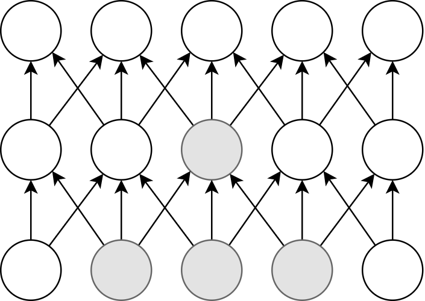

# クラウドで行う科学計算・機械学習

計算機が発達した現代では，計算機によるシミュレーションやビッグデータの解析は，科学・エンジニアリングの研究の主要な柱である． これらの大規模な計算を実行するには，クラウドは最適である． 本章から始まる第二部では，どのようにしてクラウド上で科学計算を実行するのかを，ハンズオンとともに体験してもらう． 科学計算の具体的な題材として，今回は機械学習(深層学習)を取り上げる．

なお，本書では [PyTorch](https://pytorch.org/) ライブラリを使って深層学習のアルゴリズムを実装するが，深層学習および PyTorch の知識は不要である． 講義ではなぜ・どうやって深層学習をクラウドで実行するかに主眼を置いているので，実行するプログラムの詳細には立ち入らない． 将来，自分で深層学習を使う機会が来たときに，詳しく学んでもらいたい．

## なぜ機械学習をクラウドで行うのか？

2010 年頃に始まった第三次 AI ブームのおかげで，学術研究だけでなく社会・ビジネスの文脈でも機械学習に高い関心が寄せられている． とくに，**深層学習 (ディープラーニング)** とよばれる多層のレイヤーからなるニューラルネットワークを用いたアルゴリズムは，画像認識や自然言語処理などの分野で圧倒的に高い性能を実現し，革命をもたらしている．

深層学習の特徴は，なんといってもそのパラメータの多さである． 層が深くなるほど，層間のニューロンを結ぶ重みパラメータの数が増大していく． たとえば，最新の言語モデルである [GPT-3](https://arxiv.org/abs/2005.14165) には**1750 億個**ものパラメータが含まれている． このような膨大なパラメータを有することで，深層学習は高い表現力と汎化性能を実現しているのである．

GPT-3 に限らず，最近の SOTA (State-of-the-art) の性能を達成するニューラルネットワークでは，百万から億のオーダーのパラメータを内包することは頻繁になってきている． そのような巨大なニューラルネットを訓練 (最適化) させるのは，当然のことながら膨大な計算コストがかかる． 結果として，ひとつの計算機では丸一日以上の時間がかかる場合も珍しくない． 深層学習の発展の速度は目覚ましく，研究・ビジネス両方の観点からも，いかにスループットよくニューラルネットワークの最適化を行えるかが鍵となってくる． そのような問題を解決するのにとても有効な手段が，クラウドである！ [???](#sec_first_ec2) でその片鱗を見たように，クラウドを使用することでゼロから数千に至るまでの数のインスタンスを動的に起動し，並列に計算を実行することができる． さらに，深層学習を加速させる目的で，深層学習の演算に専用設計された計算チップ (GPU など) がある． クラウドを利用すると，そのような専用計算チップも無尽蔵に利用することができる． 事実，先述した GPT-3 の学習も，詳細は明かされていないが，Microsoft 社のクラウドを使って行われたと報告されている．

## GPU による深層学習の高速化

深層学習の計算で欠かすことのできない技術として， **GPU (Graphics Processing Unit)** について少し説明する．

GPU は，その名のとおり，元々はコンピュータグラフィックスを出力するための専用計算チップである． CPU (Central Processing Unit) に対し，グラフィックスの演算に特化した設計がなされている． 身近なところでは， XBox や PS5 などのゲームコンソールなどに搭載されているし，ハイエンドなノート型・デスクトップ型計算機にも搭載されていることがある． コンピュータグラフィックスでは，スクリーンにアレイ状に並んだ数百万個の画素をビデオレート (30 fps) 以上で処理する必要がある． そのため，GPU はコアあたりの演算能力は比較的小さいかわりに，チップあたり数百から数千のコアを搭載しており ([figure_title](#gpu_architecture))，スクリーンの画素を並列的に処理することで，リアルタイムでの描画を実現している．

このように，コンピュータグラフィクスの目的で生まれた GPU だが，2010 年前後から，その高い並列計算能力をグラフィックス以外の計算 (科学計算など) に用いるという流れ (**General-purpose computing on GPU; GPGPU**) が生まれた． GPU のコアは，その設計から，行列の計算など，単純かつ規則的な演算が得意であり，そのような演算に対しては数個程度のコアしかもたない CPU に比べて圧倒的に高い計算速度を実現することができる． 現在では GPGPU は分子動力学や気象シミュレーション，そして機械学習など多くの分野で使われている．

ディープラーニングで最も頻繁に起こる演算が，ニューロンの出力を次の層のニューロンに伝える**畳み込み (Convolution)** 演算である ([figure_title](#fig:convolution))． 畳み込み演算は，まさに GPU が得意とする演算であり， CPU ではなく GPU を用いることで学習を飛躍的に (最大で数百倍程度) 加速させることができる．

このように GPU は機械学習の計算で欠かせないものであるが，なかなか高価である． たとえば，科学計算・機械学習に専用設計された NVIDIA 社の Tesla V100 というチップは，一台で約百万円の価格が設定されている． 機械学習を始めるのに，いきなり百万円の投資はなかなか大きい． だが，クラウドを使えば，初期コスト０で GPU を使用することができる．

機械学習を行うのに， V100 が必ずしも必要というわけではない． むしろ，研究者などでしばしば行われるのは，コンピュータゲームに使われるグラフィックス用の GPU を買ってきて (NVIDIA GeForce シリーズなど)，開発のときはをそれを用いる，というアプローチである． グラフィックス用のいわゆる"コンシューマ GPU"は，市場の需要が大きいおかげで，10 万円前後の価格で購入することができる． V100 と比べると，コンシューマ GPU はコアの数が少なかったり，メモリーが小さかったりなどで劣る点があるが， それらを除いては計算能力にとくに制限があるわけではなく，開発の段階では十分な性能である場合がほとんどである． プログラムができあがって，ビッグデータの解析や，モデルをさらに大きくしたいときなどに，クラウドは有効だろう．

クラウドで GPU を使うには， GPU が搭載された EC2 インスタンスタイプ (`P3`, `P2`, `G3`, `G4` など) を選択しなければならない． [table_title](#table_gpu_instances) に，代表的な GPU 搭載のインスタンスタイプを挙げる (執筆時点での情報)．

<table style="width:100%;"><caption>GPUを搭載したEC2インスタンスタイプ</caption><colgroup><col style="width: 14%" /><col style="width: 14%" /><col style="width: 14%" /><col style="width: 14%" /><col style="width: 14%" /><col style="width: 14%" /><col style="width: 14%" /></colgroup><thead><tr class="header"><th>Instance</th><th>GPUs</th><th>GPU model</th><th>GPU Mem (GiB)</th><th>vCPU</th><th>Mem (GiB)</th><th>Price per hour ($)</th></tr></thead><tbody><tr class="odd"><td>
p3.2xlarge
</td><td>
1
</td><td>
NVIDIA V100
</td><td>
16
</td><td>
8
</td><td>
61
</td><td>
3.06
</td></tr><tr class="even"><td>
p3n.16xlarge
</td><td>
8
</td><td>
NVIDIA V100
</td><td>
128
</td><td>
64
</td><td>
488
</td><td>
24.48
</td></tr><tr class="odd"><td>
p2.xlarge
</td><td>
1
</td><td>
NVIDIA K80
</td><td>
12
</td><td>
4
</td><td>
61
</td><td>
0.9
</td></tr><tr class="even"><td>
g4dn.xlarge
</td><td>
1
</td><td>
NVIDIA T4
</td><td>
16
</td><td>
4
</td><td>
16
</td><td>
0.526
</td></tr></tbody></table>

[table_title](#table_gpu_instances) からわかるとおり， CPU のみのインスタンスと比べると少し高い価格設定になっている． また，古い世代の GPU (V100 に対しての K80) はより安価な価格で提供されている． 1 インスタンスあたりの GPU の搭載数は 1 台から最大で 8 台まで選択することが可能である．

GPU を搭載した一番安いインスタンスタイプは， `g4dn.xlarge` であり，これには廉価かつ省エネルギー設計の NVIDIA T4 が搭載されている． 後のハンズオンでは，このインスタンスを使用して，ディープラーニングの計算を行ってみる．

[table_title](#table_gpu_instances) の価格は `us-east-1` のものである． リージョンによって多少価格設定が異なる．

V100 を一台搭載した `p3.2xlarge` の利用料金は一時間あたり $3.06 である． V100 が約百万円で売られていることを考えると，約 3000 時間 (= 124 日間)，通算で計算を行った場合に，クラウドを使うよりも V100 を自分で買ったほうがお得になる，という計算になる (実際には，自前で V100 を用意する場合は， V100 だけでなく， CPU やネットワーク機器，電気使用料も必要なので，百万円よりもさらにコストがかかる)．

GPT-3 で使われた計算リソースの詳細は論文でも明かされていないのだが， [Lambda 社のブログ](https://lambdalabs.com/blog/demystifying-gpt-3/)で興味深い考察が行われている (Lambda 社は機械学習に特化したクラウドサービスを提供している)．

記事によると，1750 億のパラメータを訓練するには，一台の GPU (NVIDIA V100) を用いた場合，342 年の月日と 460 万ドルのクラウド利用料が必要となる，とのことである． GPT-3 のチームは，複数の GPU に処理を分散することで現実的な時間のうちに訓練を完了させたのであろうが，このレベルのモデルになってくるとクラウド技術の限界を攻めないと達成できないことは確かである．

深層学習を詳しく勉強したい人には以下の参考書を推薦したい． 深層学習の基礎的な概念や理論は普遍的であるが，この分野は日進月歩なので，常に最新の情報を取り入れることを忘れずに．

-   [Deep Learning (Ian Goodfellow, Yoshua Bengio and Aaron Courville)](https://www.deeplearningbook.org/) 出版されてから数年が経つが，深層学習の理論的な側面を学びたいならばおすすめの入門書． ウェブで無料で読むことができる． 日本語版も出版されている． 実装についてはほとんど触れられていないので，理論家向けの本．

-   [ゼロから作る Deep Learning (斎藤 康毅)](https://www.oreilly.co.jp/books/9784873117584/) 合計三冊からなるシリーズ． 理論と実装がバランスよく説明されていて，深層学習の入門書の決定版．

-   [Dive into Deep Learning (Aston Zhang, Zachary C. Lipton, Mu Li, and Alexander J. Smola)](https://d2l.ai/) 深層学習の基礎から最新のアルゴリズムまでを，実装を通して学んでいくスタイルの本． ウェブで無料で読むことができる，1000 ページ越えの超大作． これを読破することができれば，深層学習の実装で困ることはないだろう．
