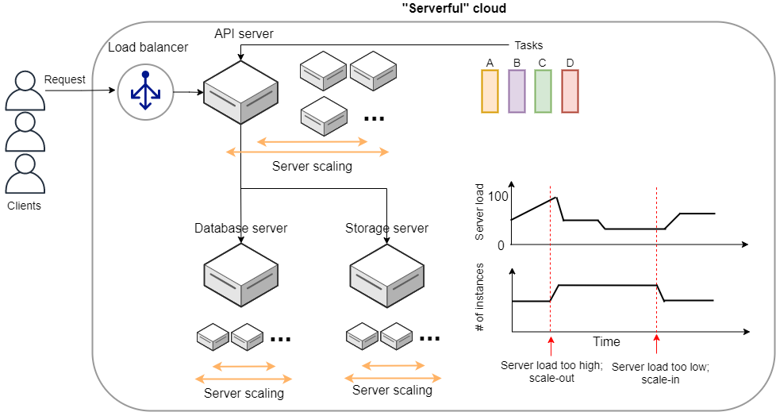
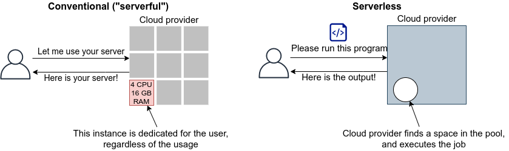
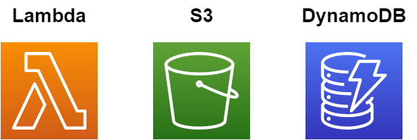
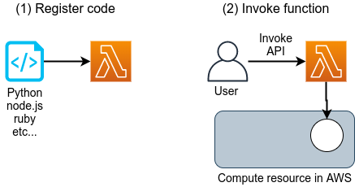
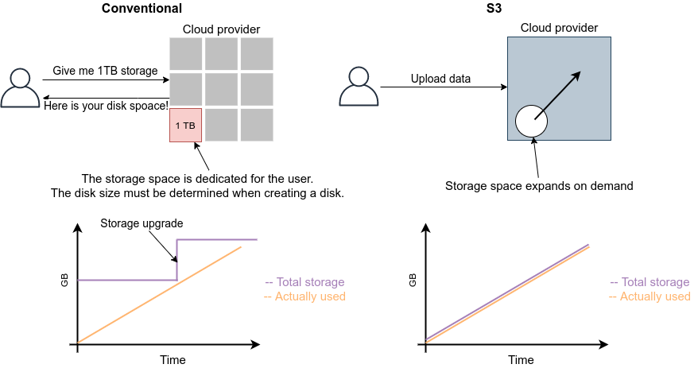

# Serverless architecture

サーバーレスアーキテクチャ (Serverless architecture) あるいは サーバーレスコンピューティング (Serverless computing) とは，従来とは全く異なるアプローチに基づくクラウドシステムの設計方法である． 歴史的には， AWS が 2014 年に発表した [Lamba](https://aws.amazon.com/lambda/) がサーバーレスアーキテクチャの先駆けとされている． その後， Google や Microsoft などのクラウドプラットフォームも同様の機能の提供を開始している． サーバーレスアーキテクチャの利点は，スケーラブルなクラウドシステムを安価かつ簡易に作成できる点であり，近年いたるところで導入が進んでいる．

Serverless とは，文字どおりの意味としてはサーバーなしで計算をするということになるが，それは一体どういう意味だろうか？ サーバーレスについて説明するためには，まずは従来的な， "serverful" とよばれるようなシステムについて解説しなければならない．

## Serverful クラウド (従来型)

従来的なクラウドシステムのスケッチを [figure_title](#serverful) に示す． クライアントから送信されたリクエストは，最初に API サーバーに送られる． API サーバーでは，リクエストの内容に応じてタスクが実行される． タスクには，API サーバーだけで完結できるものもあるが，多くの場合，データベースの読み書きが必要である． データベースには，データベース専用の独立したサーバーマシンが用いられることが一般的である． また，画像や動画などの容量の大きいデータは，また別のストレージサーバーに保存されることが多い． これらの API サーバー，データベースサーバー，ストレージサーバーはそれぞれ独立したサーバーマシンであり， AWS の言葉では EC2 による仮想インスタンスを想定してもらったらよい．

多くのウェブサービスでは，多数のクライアントからのリクエストを処理するため，複数のサーバーマシンがクラウド内で起動し，負荷を分散するような設計がなされている． クライアントから来たリクエストを計算容量に余裕のあるサーバーに振り分けるような操作を **Load balancing** とよび，そのような操作を担当するマシンのことを **Load balancer** という．

計算負荷を分散する目的で多数のインスタンスを起動するのはよいのだが，計算負荷が小さすぎてアイドリング状態にあるようではコストと電力の無駄遣いである． したがって，すべてのサーバーが常に目標とする計算負荷を維持するよう，計算の負荷に応じてクラスター内の仮想サーバーの数を動的に増減させるような仕組みが必要である． そのような仕組みを**クラスターのスケーリング**とよび，負荷の増大に応答して新しい仮想インスタンスをクラスターに追加する操作を **scale-out**，負荷の減少に応答してインスタンスをシャットダウンする操作を **scale-in** とよぶ． クラスターのスケーリングは， API サーバーではもちろんのこと，データベースサーバー・ストレージサーバーでも必要になる． ストレージサーバーでは，例えば頻繁にアクセスされるデータはキャッシュ領域に保存したり，データのコピーを複数作るなどのスケーリングが行われる． データベースサーバーも同様に，頻繁にアクセスされるデータのアクセスがパンクしてしまわないよう，分散的な処理が必要となる． このように，**クラウドシステム内すべての箇所で，負荷が均一になるような調整が必要であり，開発者は多くの時間をそのチューニングに費やさなければならない．** また，サービスの利用者の数などに応じてスケーリングの設定は常に見直される必要があり，継続的な開発が要求される．

さらに問題を複雑にするのは，API サーバーで処理されるべきタスクが，非一様な点である． 非一様であるとは，たとえばタスク A は 3000 ミリ秒の実行時間と 512MB のメモリーを消費し，別のタスク B は 1000 ミリ秒の実行時間と 128MB のメモリーを消費する，というような状況を指している． 一つのサーバーマシンが計算負荷が異なる複数のタスクを処理する場合，クラスターのスケーリングはより複雑になる． この状況をシンプルにするために，１サーバーで実行するタスクは１種類に限る，という設計も可能であるが，そうするとで生まれる弊害も多い (ほとんど使われないタスクに対してもサーバー一台をまるまる割り当てなければならない = ほとんどアイドリング状態になってしまう，など)．

## Serverless クラウドへ

[Serverful クラウド (従来型)](#chap_serverful_cloud) で議論したように，クラスターのスケーリングはクラウドシステムの経済的効率とシステムの安定性を最大化するために必須の作業である． それを反映して，多くの開発者の時間が投資されてきた．

クラスターのスケーリングはすべての開発者が何度も繰り返し行ってきた作業であり，いくつかの側面をテンプレート化し，共通化することができたならば開発のコストを大幅に削減できるだろう． それを実現するには，根本的なレベルからクラウドシステムの設計を考え直す必要がある． **スケーリングを前提**として考えることで，もっと**シンプルで見通しがよいクラウドシステムの設計の仕組みはないだろうか**？ そのような動機が，サーバーレスアーキテクチャが誕生する背後にあった．

従来の serverful なシステムでの最大の問題点は，**サーバーをまるまる占有してしまう**という点にある． すなわち， EC2 インスタンスを起動したとき，そのインスタンスは起動したユーザーだけが使えるものであり，**計算のリソース (CPU や RAM) が独占的に割り当てられた状態**になる． 固定した計算資源の割り当てがされてしまっているので，**インスタンスの計算負荷が 0%であろうが 100%であろうが，均一の使用料金が起動時間に比例**して発生する．

サーバーレスアーキテクチャは，このような **独占的に割り当てられた計算リソースというものを完全に廃止する**ことを出発点とする． サーバーレスアーキテクチャでは，計算のリソースは，クラウドプロバイダーがすべて管理する． クライアントは，仮想インスタンスを一台まるごと借りるのではなく，計算のタスクの需要が生まれる毎に，**実行したいプログラム・コマンドをクラウドに提出する**． クラウドプロバイダーは，自身のもつ巨大な計算リソースから空きを探し，提出されたプログラムを実行し，実行結果をクライアントに返す． 言い換えると，計算リソースのスケーリングやアロケーションなどはクラウドプロバイダーが一手に引き受け，ユーザーはジョブをサブミットすることに注力する，という枠組みである． これを図示すると， [figure_title](#serverless) のようになる．

サーバーレスクラウドでは，スケーリングはすべてクラウドプロバイダーが引き受けるので，スケーラビリティーが保証されている． クライアントが同時に大量のタスクを送信した場合でも，クラウドプロバイダー側の独自の仕組みによってすべてのタスクが遅延なく実行される． また，サーバーレスクラウドを利用することで，**クラウドのコストは実際に使用した計算の総量 (稼働時間) で決定される**ことになる． これは，計算の実行総量に関わらずインスタンスの起動時間で料金が決定されていた従来のシステムと比べて大きな違いである．

サーバーレスクラウドは，従来のクラウドとは根本から異なったアプローチなので，コードの書き方やシステムの設計が大きく異なる． サーバーレスクラウドを開発・運用するには，サーバーレス固有の概念や用語に精通している必要がある． 以降では，実際にクラウドを動かしながら，サーバーレスをより具体的に体験していこう．

従来型の(仮想インスタンスをたくさん起動するような)クラウドシステムは，**賃貸**と似ているかもしれない． 部屋を借りるというのは，その部屋でどれだけの時間を過ごそうが，月々の家賃は一定である． 同様に，仮想サーバーも，それがどれほどの計算を行っているかに関わらず，一定の料金が時間ごとに発生する．

一方で，サーバーレスクラウドは，**電気・水道・ガス料金** と似ている． こちらは，実際に使用した量に比例して料金が決定されている． サーバーレスクラウドも，実際に計算を行った総時間で料金が決まる仕組みになっている．

## サーバーレスクラウドを構成するコンポーネント

サーバーレスアーキテクチャの概要がわかってきたところで，ここでは AWS においてサーバーレスクラウドを構成する様々なコンポーネントを紹介していこう． 特に， **Lambda**, **S3**, **DynamoDB** を取り上げ，解説する ([figure_title](#fig:serverless_logos))． サーバーレスクラウドは，これらのコンポーネントを統合することで一つのシステムが出来上がる． ここでは， Lambda，S3，DynamoDB を利用する際に押さえておかなければならない知識を一通り説明しきる都合上，具体的なイメージがわきにくいかもしれない． が，続く [???](#sec_intro_serverless) でそれぞれについてハンズオン形式で演習を行うので，そこでさらに理解を深めれば大丈夫である．

### Lambda

AWS でサーバーレスコンピューティングの中心を担うのが， [Lambda](https://aws.amazon.com/lambda/) である． Lambda の使い方を [figure_title](#lambda_workflow) に図示している． Lambda の仕組みはシンプルで，まずユーザーは実行したいプログラムのコードを事前に登録しておく． プログラムは， Python, Node.js, Ruby などの主要な言語がサポートされている． Lambda に登録されたひとつひとつのプログラムを関数 (Function) とよぶ． そして，関数を実行したいときに，invoke コマンドを Lambda に送信する． Lambda では， invoke のリクエストを受け取るとただちに (数ミリセカンドから数百ミリセカンド程度の時間で) プログラムの実行を開始する． そして，実行結果をクライアントやその他の計算機に返す．

このように，Lambda では占有された仮想インスタンスは存在せず，実行を待っているプログラムだけがある状態である． invoke のリクエストに応じて，プログラムが AWS の巨大な計算機プールのどこかに配置され，実行される． 同時に複数のリクエストが来た場合でも， AWS はそれらを実行するための計算リソースを割り当て，並列的に処理を行ってくれる． 原理上は，**数千から数万のリクエストが同時に来たとしても， Lambda はそれらを同時に実行することができる**． このような，占有された仮想サーバーの存在なしに，動的に関数を実行するサービスのことを総称して **FaaS (Function as a Service)** とよぶ．

Lambda ではそれぞれの関数につき， 128MB から 10240MB のメモリーを使用することができる (執筆時点の仕様)． また，実効的な CPU のパワーはメモリーの量に比例する形で割り当てられる． すなわち，タスクに割り当てたメモリーの量が多ければ多いほど，より多くの CPU リソースが割り当てられることになる (しかし， RAM と CPU パワーの具体的な換算表は AWS からは公開されていない)． 実行時間は 100 ミリ秒の単位で記録され，実行時間に比例して料金が決定される． [table_title](#lambda_pricing) は Lambda の利用料金表である (執筆時点で `ap-north-east1` リージョンを選択した場合)．

<table><caption>Lambda の料金表</caption><colgroup><col style="width: 50%" /><col style="width: 50%" /></colgroup><thead><tr class="header"><th>Memory (MB)</th><th>Price per 100ms</th></tr></thead><tbody><tr class="odd"><td>
128
</td><td>
$0.0000002083
</td></tr><tr class="even"><td>
512
</td><td>
$0.0000008333
</td></tr><tr class="odd"><td>
1024
</td><td>
$0.0000016667
</td></tr><tr class="even"><td>
3008
</td><td>
$0.0000048958
</td></tr></tbody></table>

実行時間に比例する料金に追加して，リクエストを送信するごとに発生する料金が設定されている． これは，百万回のリクエストにつき $0.2 である． たとえば， 128MB のメモリーを使用する関数を，それぞれ 200 ミリ秒，合計で 100 万回実行した場合， 0.0000002083 \* 2 \* 10^6 + 0.2 = $0.6 の料金となる． ウェブサーバーのデータベースの更新など簡単な計算であれば，200 ミリ秒程度で実行できる関数も多いことから，100 万回データベースの更新を行ったとしても，たった $0.6 しかコストが発生しないことになる． また，コードが実行されず待機状態になっている場合は，発生する料金は 0 である． このように，実際に意味のある処理が行われた時間にのみ，料金が発生する仕組みになっている．

Lambda は比較的短時間で完了する，反復性の高いタスクの実行に向いている． データベースの読み書きはその典型的な例であるが，そのほかにも，画像のサイズをトリミングしたり，サーバーサイドで定期的に実行されるメンテナンス処理などの利用が考えられる． また，複数の Lambda をリレー式に繋げることも可能で，シンプルな処理を組み合わせることで複雑なロジックを表現することができる．

上述の Lambda の料金計算は，説明のためコストに寄与する要素をいくつか省いている点は承知いただきたい． 例えば， DynamoDB の読み書きに関する料金や，ネットワークの通信にかかわるコストが考慮されていない．

### サーバーレスストレージ: S3

サーバーレスの概念は，ストレージにも拡張されている．

従来的なストレージ (ファイルシステム) では，必ずホストとなるマシンと OS が存在しなければならない． したがって，それほどパワーは必要ないまでも，ある程度の CPU リソースを割かなければならない． また，従来的なファイルシステムでは，データ領域のサイズは最初にディスクを初期化するときに決めなければならず，後から容量を増加させることはしばしば困難である (ZFS などのファイルシステムを使えばある程度は自由にファイルシステムのサイズを変更することは可能である)． よって，従来的なクラウドでは，ストレージを借りる際にはあらかじめディスクのサイズを指定せねばならず，ディスクの中身が空であろうと満杯であろうと，同じ利用料金が発生することになる ([figure_title](#fig:s3_vs_filesystem))．

[Simple Storage Service (S3)](https://aws.amazon.com/s3/) は，サーバーレスなストレージシステムを提供する ([figure_title](#fig:s3_vs_filesystem))． S3 は従来的なストレージシステムと異なり， OS に"マウントする”という概念はない． 基本的に API を通じてデータの読み書きの操作が行われる． また，データの冗長化や暗号化，バックアップの作成など，通常ならば OS と CPU が介在しなければならない操作も， API を通じて行うことができる． S3 では事前に決められたディスク領域のサイズはなく，データを入れれば入れた分だけ，保存領域は拡大していく (仕様上はペタバイトスケールのデータを保存することが可能である)． ストレージにかかる料金は，保存してあるデータの総容量で決定される．

S3 を利用する際に，料金に関わってくる主要な事項をまとめたのが [table_title](#tab:s3_pricing) である (`us-east-1` リージョンのもの． 説明のため主要な事項のみ取り出している． 詳細は [公式ドキュメンテーション "Amazon S3 pricing"](https://aws.amazon.com/s3/pricing/?nc=sn&loc=4) を参照)．

<table><caption>S3 の利用料金</caption><colgroup><col style="width: 50%" /><col style="width: 50%" /></colgroup><thead><tr class="header"><th>項目</th><th>料金</th></tr></thead><tbody><tr class="odd"><td>
Data storage (First 50TB)
</td><td>
$0.023 per GB per month
</td></tr><tr class="even"><td>
PUT, COPY, POST, LIST requests (per 1,000 requests)
</td><td>
$0.005
</td></tr><tr class="odd"><td>
GET, SELECT, and all other requests (per 1,000 requests)
</td><td>
$0.0004
</td></tr><tr class="even"><td>
Data Transfer IN To Amazon S3 From Internet
</td><td>
$0
</td></tr><tr class="odd"><td>
Data Transfer OUT From Amazon S3 To Internet
</td><td>
$0.09 per GB
</td></tr></tbody></table>

第一に，データの保存には $0.025 per GB のコストが月ごとに発生する． したがって，1000GB のデータを S3 に一ヵ月保存した場合， $25 の料金が発生することになる． また，`PUT`, `COPY`, `POST` などのリクエスト (=データを書き込む操作) に対しては，データ容量に関係なく，1000 回ごとに $0.005 のコストが発生する． `GET`, `SELECT` などのリクエスト (=データを読み込む操作) に対しては，1000 回ごとに $0.0004 のコストが発生する． また， S3 はデータを外に取り出す際の通信にもコストが生じる． 執筆時点では，S3 からインターネットを通じて外部にデータを転送 (data-out) すると $0.09 per GB のコストが発生する． データをインターネットを通じて S3 に入れる (data-in) 通信は無料で行える． また， AWS の 同じ Region 内のサービス (Lambda や EC2 など) にデータを転送するのは無料である． AWS のリージョンをまたいだデータの転送にはコストが発生する． いずれにせよ，サーバーレスの概念に則り，すべての料金が従量課金制で決定される設定になっている．

### サーバーレスデータベース: DynamoDB

サーバーレスの概念は，データベースにも適用することができる．

ここでいうデータベースとは， Web サービスなどにおけるユーザーや商品の情報を記録しておくための保存領域のことを指している． 従来的に有名なデータベースとしては [MySQL](https://www.mysql.com/), [PostgreSQL](https://www.postgresql.org/), [MongoDB](https://www.mongodb.com/) などが挙げられる． データベースと普通のストレージの違いは，データの検索機能にある． 普通のストレージではデータは単純にディスクに書き込まれるだけだが， データベースでは検索がより効率的になるようなデータの配置がされたり， 頻繁にアクセスされるデータはメモリーにキャッシュされるなどの機能が備わっている． これにより，巨大なデータの中から，興味のある要素を高速に取得することができる．

このような検索機能を実現するには，当然 CPU の存在が必須である． したがって，従来的なデータベースを構築する際は，ストレージ領域に加えて，たくさんの CPU コアを搭載したマシンが用いられることが多い． また，データベースが巨大な場合は複数マシンにまたがった分散型のシステムが設計される． 分散型システムの場合は， [Serverful クラウド (従来型)](#chap_serverful_cloud) で議論したようにデータベースへのアクセス負荷に応じて適切なスケーリングがなされる必要がある．

[DynamoDB](https://aws.amazon.com/dynamodb/) は， AWS が提供しているサーバーレスな分散型データベースである． サーバーレスであるので，占有されたデータベース用仮想インスタンスは存在せず， API を通じてデータの書き込み・読み出し・検索などの操作を行う． S3 と同様に，データ保存領域の上限は定められておらず，データを入れれば入れた分だけ，保存領域は拡大していく． また，データベースへの負荷が増減したときのスケーリングは， DynamoDB が自動で行うので，ユーザーは心配する必要はない．

DynamoDB での利用料金の計算はやや複雑なのだが， "On-demand Capacity" というモードで使用した場合の料金に関わってくる主要な事項をまとめたのが [table_title](#tab:dynamodb_pricing) である (`us-east-1` リージョンのもの． 詳細は [公式ドキュメンテーション "Pricing for On-Demand Capacity"](https://aws.amazon.com/dynamodb/pricing/on-demand/) を参照)．

<table><caption>DynamoDB の利用料金</caption><colgroup><col style="width: 50%" /><col style="width: 50%" /></colgroup><thead><tr class="header"><th>項目</th><th>料金</th></tr></thead><tbody><tr class="odd"><td>
Write request units
</td><td>
$1.25 per million write request units
</td></tr><tr class="even"><td>
Read request units
</td><td>
$0.25 per million read request units
</td></tr><tr class="odd"><td>
Data storage
</td><td>
$0.25 per GB-month
</td></tr></tbody></table>

DynamoDB ではデータの書き込み操作の単位を write request unit とよび，データの読み込み操作の単位を read request unit とよぶ． 基本的に， 1kB 以下のデータを一度書き込むと 1 write request unit を消費し，4kB 以下のデータを一度読み込むと 1 read request unit を消費する (詳しくは [公式ドキュメンテーション "Read/Write Capacity Mode"](https://docs.aws.amazon.com/amazondynamodb/latest/developerguide/HowItWorks.ReadWriteCapacityMode.html) を参照のこと)． write request units は 100 万回ごとに $1.25, read request units は 100 万回ごとに $0.25 のコストが設定されている． また，保存されたデータ容量に対して $0.25 per GB のコストが月ごとに発生する． DynamoDB は高速な検索機能などを備えたデータベースであるので， GB あたりのストレージコストは S3 に比べ 10 倍程度高い． DynamoDB のデータの転送に関わるコストは，同じリージョン内ならば data-in，data-out ともに $0 である． リージョンをまたいだ通信には別途コストが発生する．

### その他のサーバーレスクラウドの構成要素

以上で紹介した Lambda, S3, DynamoDB がサーバーレスクラウドの中で最も使用する頻度が高いサービスになる． その他のサーバーレスクラウドの構成要素を以下に列挙する． いくつかについては，今後のハンズオンを行う中で改めて解説を行う．

-   [API Gateway](https://aws.amazon.com/api-gateway/): API を構築する際のルーティングを担う． [???](#sec_bashoutter) で取り上げる．

-   [Fargate](https://aws.amazon.com/fargate/): [???](#sec_fargate_qabot) で触れた Fargate も，サーバーレスクラウドの要素の一部である． Lambda との違いは，Lambda よりも大容量のメモリーや CPU を要するような計算などを行うことができる点が挙げられる．

-   [Simple Notification Service (SNS)](https://aws.amazon.com/sns/): サーバーレスのサービス間でイベントをやり取りするためのサービス．

-   [Step Functions](https://aws.amazon.com/step-functions/): サーバーレスのサービス間のオーケストレーションを担う．

**サーバーレスアーキテクチャは万能か？**

この問いへの答えは，筆者は NO であると考える．

ここまで，サーバーレスの利点を強調して説明をしてきたが，まだまだ新しい技術なだけに，欠点，あるいはサーバーフルなシステムに劣る点は数多くある．

大きな欠点を一つあげるとすれば，サーバーレスのシステムは各クラウドプラットフォームに固有なものなので，特定のプラットフォームでしか運用できないシステムになってしまう点であろう． AWS で作成したサーバーレスのシステムを， Google のクラウドに移植するには，かなり大掛かりなプログラムの書き換えが必要になる． 一方， serverful なシステムであれば，プラットフォーム間のマイグレーションは比較的簡単に行うことができる． クラウドプロバイダーとしては，自社のシステムへの依存度を強めることで，顧客を離さないようにするという狙いがあるのだろう…

その他，サーバーレスコンピューティングの欠点や今後の課題などは，次の論文で詳しく議論されている． 興味のある読者はぜひ読んでいただきたい．

-   [Hellerstein et al., "Serverless Computing: One Step Forward, Two Steps Back" arXiv (2018)](https://arxiv.org/abs/1812.03651)
