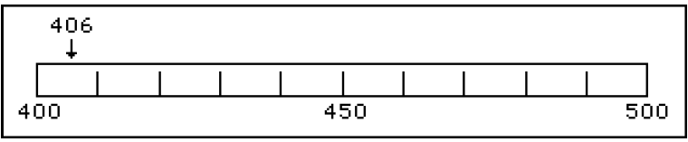

# 1-1 Introduction to Physics

### Recall

- Review types of zeros and the rules for significant digits
- Review mass vs. weight, precision vs. accuracy, and dimensional analysis problem solving

### Notes

- **Scientific Rules Review**
  
  - **Rule 1: Non-zero digits are always significant.**

    - Hopefully, this rule seems rather obvious. If you measure something and the device you use (ruler, thermometer, triple-beam balance, etc.) returns a number to you, then you have made a measurement decision and that ACT of measuring gives significance to that particular numeral (or digit) in the overall value you obtain.
    - Hence a number like $26.38$ would have four significant figures and $7.94$ would have three. The problem comes with numbers like $0.00980$ or $28.09$.
  - **Rule 2: Any zeros between two significant digits are significant.**

    - Suppose you had a number like $406$. By the first rule, the $4$ and the $6$ are significant. However, to make a measurement decision on the $4$ (in the hundred's place) and the $6$ (in the unit's place), you HAD to have made a decision on the ten's place. The measurement scale for this number would have hundreds and tens marked with an estimation made in the unit's place. Like this:

    

  - **Rule 3: A final zero or trailing zeros in the decimal portion ONLY are significant.**

    - This rule causes the most difficulty with ChemTeam students. Here are two examples of this rule with the zeros this rule affects in boldface:

      $\begin{aligned}&0.00500 \\&0.03040\end{aligned}$

      Here are two more examples where the significant zeros are in boldface:

      $\begin{aligned}&2.30 \times 10^{-5} \\&4.500 \times 10^{12}\end{aligned}$

- **What Zeros are Not Discussed Above**
  
  - **Zero Type #1: Space holding zeros on numbers less than one.**

    Here are the first two numbers from just above with the digits that are NOT significant in boldface:

    $\begin{aligned}
     &0 . \mathbf{0 0} 500 \\
     &0 . \mathbf{0} 3040
     \end{aligned}$

    These zeros serve only as space holders. They are there to put the decimal point in its correct location. They DO NOT involve measurement decisions. Upon writing the numbers in scientific notation $\left(5.00 \times 10^{-3} \text { and } 3.040 \times 10^{-2}\right)$, the non-significant zeros disappear.

  - **Zero Type #2: the zero to the left of the decimal point on numbers less than one.** 

    When a number like $0.00500$ is written, the very first zero (to the left of the decimal point) is put there by convention. Its sole function is to communicate unambiguously that the decimal point is a decimal point. If the number were written like this, $.00500$, there is a possibility that the decimal point might be mistaken for a period. Many students omit that zero. They should not.

  - **Zero Type #3: trailing zeros in a whole number.**

    200 is considered to have only ONE significant figure while 25,000 has two.
     This is based on the way each number is written. When whole number are written as above, the zeros, BY DEFINITION, did not require a measurement decision, thus they are not significant.
     However, it is entirely possible that 200 really does have two or three significant figures. If it does, it will be written in a different manner than 200.

    Typically, scientific notation is used for this purpose. If 200 has two significant figures, then $2.0 * 10^2$ is used. If it has three, then $2.00 * 10^2$ is used. If it had four, then 200.0 is sufficient. See [type 2](#type2).

  - **Zero Type #4: leading zeros in a whole number.**

    00250 has two significant figures. $005.00 \times 10^{-4}$ has three.

### Summary

Significant figures (also known as the significant digits, precision or resolution) of a number in positional notation are digits in the number that are reliable and absolutely necessary to indicate the quantity of something.

If a number expressing the result of a measurement (e.g., length, pressure, volume, or mass) has more digits than the number of digits allowed by the measurement resolution, then only as many digits as allowed by the measurement resolution are reliable, and so only these can be significant figures.

For example, if a length measurement gives 114.8 mm while the smallest interval between marks on the ruler used in the measurement is 1 mm, then the first three digits (1, 1, and 4, showing 114 mm) are certain and so they are significant figures. Digits which are uncertain but reliable are also considered significant figures. In this example, the last digit (8, which adds 0.8 mm) is also considered a significant figure even though there is uncertainty in it.