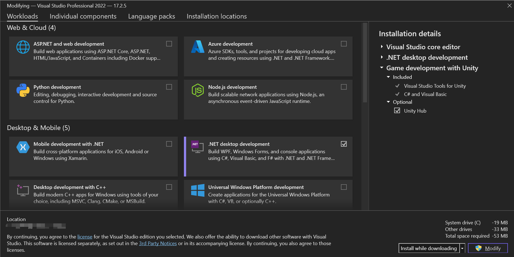
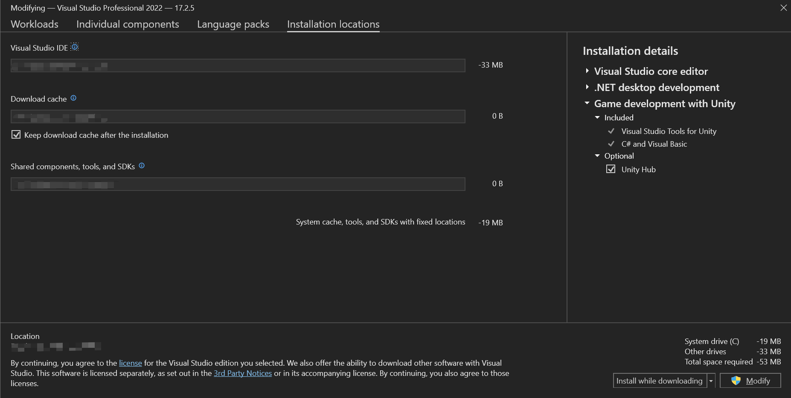
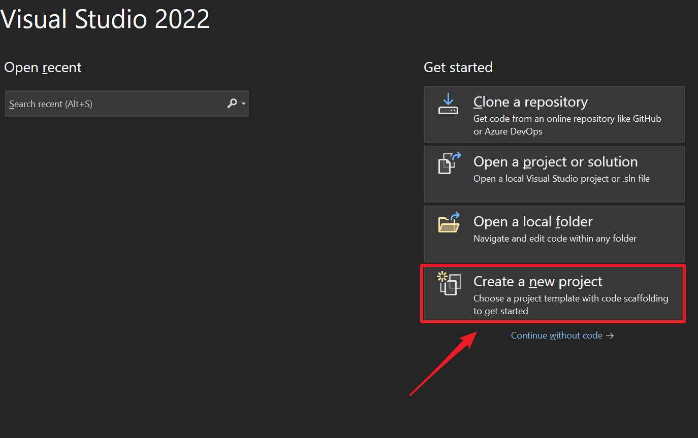
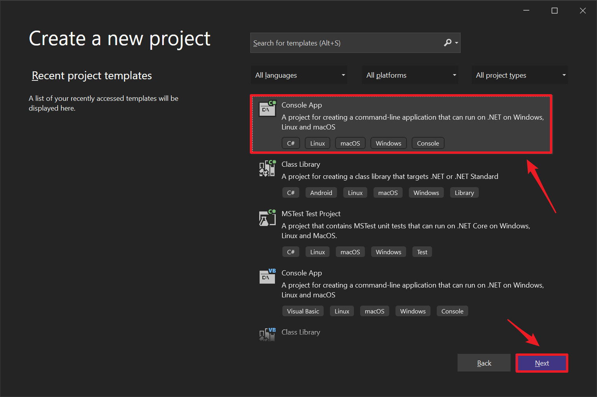
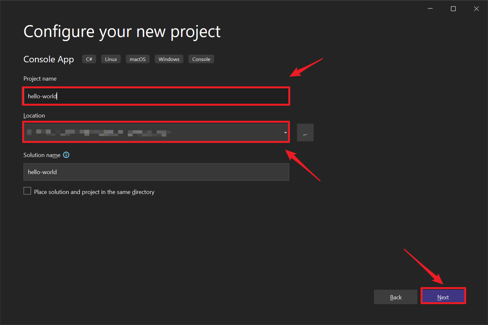
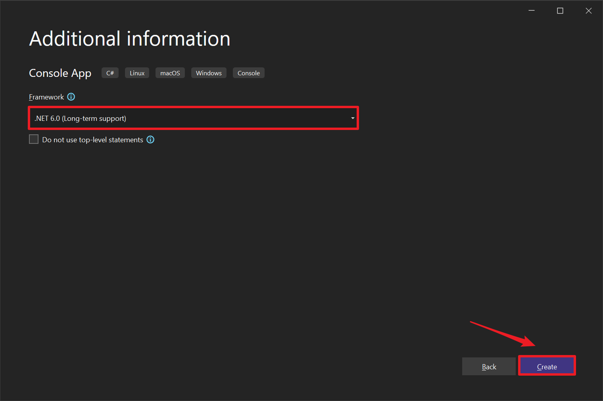

# 1-1 Getting Started with C#

## 1-1-1 Installing Visual Studio IDE

Since C# uses .NET (Dot Net) framework which is developed by Microsoft, yet it's always a good spot to start with the IDE developed by its own environment creator-Microsoft; which it will be taking account into Visual Studio as a primary IDE for C# development.

- [Visual Studio](https://visualstudio.microsoft.com/vs/community/) community is a complete free version of Visual Studio for personal usages or open source software (OSS) contributors published via Microsoft, it covers mostly every achievable packages along with debugging toolkits, enough for personal/indie-developers.

## 1-1-2 Installing C# Environment

A installer at around 1.60mb while be automatically downloaded, click on the installer with file extension `.exe` a package & Visual Studio installer GUI while be shortly prompted after checks and downloads.

Click on the scope with `.NET desktop development` only if only targeting C# basic developments, others are optional in regard to own developing preferences or criteria.

::: warning
**Optional**: An option point for people with relatively small C drivers as me whom preferably would like to install packages/workloads/components on other drivers, navigate to the `Installation location` tab and specify your installation location to other drivers as shown in the image, I installed Unity development kit+.Net desktop development kit in this case which adds up to unexpectedly 10GB in total whereas my C Drive only got 12.7GB left, fortunately I doubled checked the installation location before I started using any third party applications. (Drivers in this scenario has been blurred out with mosaic for privacy purposes)

:::

Installation should be taking around up to 20-30 minutes based on the bandwidth or server status of Microsoft or other unexpected factors, in most case with only .NET environment installed it shouldn't be taking more than 1 hour, if it exceed beyonds, make sure you double check your network status. I would recommend a good choice to grab a cup of coffee☕ and chill with some musics :') !

When all packages are settled on download finished, the installer will automatically opens a landing page of Visual Studio's IDE, it may requires you to sign on to Microsoft if your IDE installed is with Visual Studio Professional version, but simply closing the log-on page seems working just fine with logged; this might relates to some further service accessibility, but it wouldn't be an issue to dive right into your first C# program!

## 1-1-3 Configuring the very first project

With the Get Started colum listed aside on the right of the landing page, navigate down to the `Create a new project` section, and click as in the image follows.

Next click on the Console App section to generate a default command-line application template then click on next to proceed as in the image follows.

The wizard will lead you to project configuration page where you will be naming your first application and locating your preferred project location on local drivers, in my case I named the first project as `hello-world` since learning a new programming language should always start with the default command-line Hello World printing!

The wizard **might** ask you some kind of additional information about your .NET workload environments based on the version you installed, but in normal cases just press next with the default configurations, as follows.

