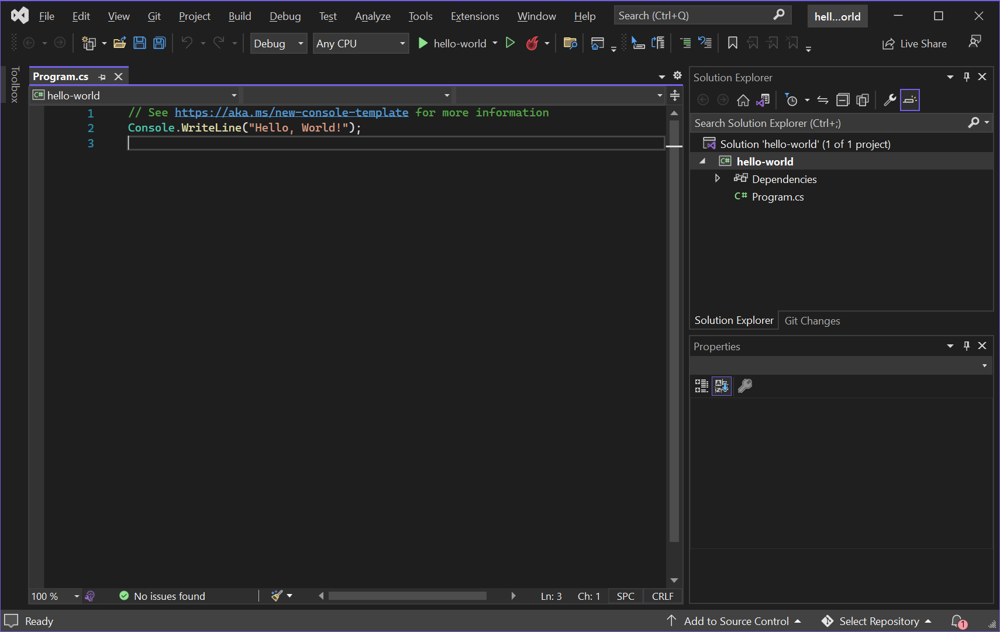
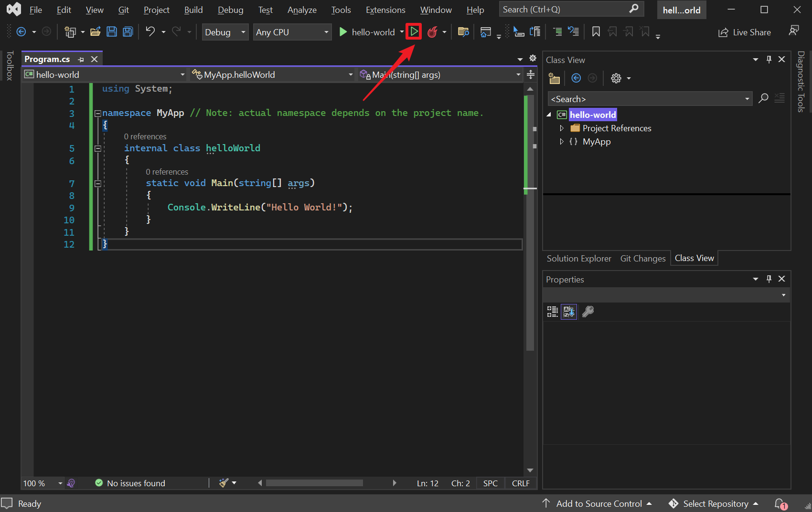
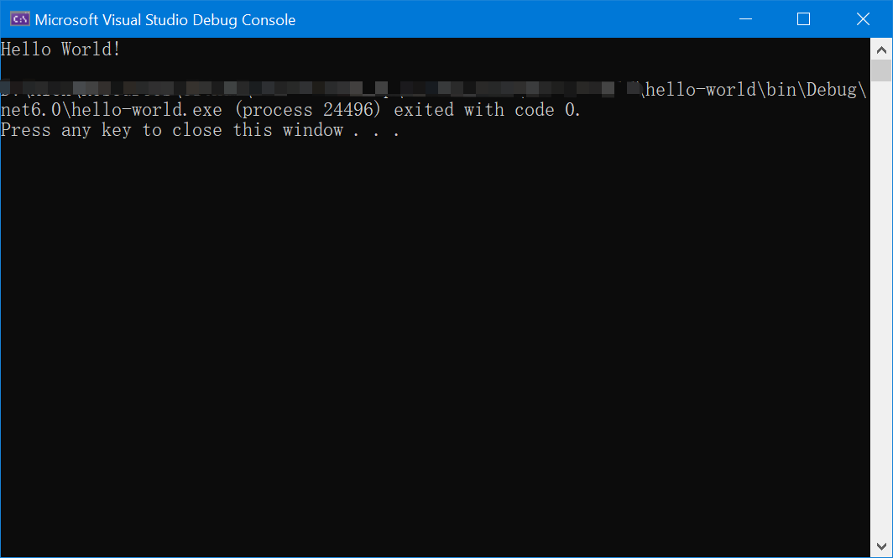

# 1-2 Writing your first C# program

## 1-2-1 Template program

After the tedious installation & configuration section, Visual Studio should automatically open up the IDE with a blank template containing with the following command, shown both in the code fences & the image below.

```cs
// See https://aka.ms/new-console-template for more information
Console.WriteLine("Hello, World!");
```

According to official docs provided by [@Microsoft](https://docs.microsoft.com/en-us/dotnet/core/tutorials/top-level-templates), Starting with .NET 6, the project template for new C# console apps generates the following code in the `Program.cs` file:

```cs
// See https://aka.ms/new-console-template for more information
Console.WriteLine("Hello, World!");
```

The new output uses recent C# features that simplify the code you need to write for a program. For .NET 5 and earlier versions, the console app template generates the following code:

```cs
using System;

namespace MyApp // Note: actual namespace depends on the project name.
{
    internal class Program
    {
        static void Main(string[] args)
        {
            Console.WriteLine("Hello World!");
        }
    }
}
```

These two forms represent the same program. Both are valid with C# 10.0. When you use the newer version, you only need to write the body of the `Main` method. The compiler synthesizes a `Program` class with a `Main` method and places all your top level statements in that `Main` method. You don't need to include the other program elements, the compiler generates them for you. You can learn more about the code the compiler generates when you use top level statements in the article on [top level statements](https://docs.microsoft.com/en-us/dotnet/csharp/fundamentals/program-structure/top-level-statements) in the C# Guide's fundamentals section.

::: warning
But in this notebook, with will be working through with .NET 5, for a strong base which would **possibly** required in further development on your own, but they work in the same way, just in a more simplified way to be noticed.
:::



It is always okay to not understanding what is going on with the program's source code at the very start when encountering a new programming language, we'll discuss in later chapters.

## 1-2-2 Debug & run the first program

Copy the following code wrapped inside the code fences, 

```cs
using System;

namespace helloWorld
{
  class Program
  {
    static void Main(string[] args)
    {
      Console.WriteLine("Hello World!");    
    }
  }
}
```


Let's run/debug or first program! Click on the <i class="fa-regular fa-play" style="color:#9ae69a"></i> Debug button rendered in green on the icon located on the middle-top of the multifunctional bar of Visual Studio; or if you prefer keyboard hotkeys, go for <kbd>F5</kbd> on your keyboard, this will compile and execute your code. a pop of your command prompt should contain the following content, as the image shown below.



```bash
Hello World!

${workspaceFolder}\bin\Debug\net6.0\hello-world.exe (process 24496) exited with code 0.
Press any key to close this window . . .
```

Until now, **CONGRATULATIONS**! You have just ran and compiled your very first C# program!

::: tip
to be noted that the variable `${workspaceFolder}` in the code fences above is a variable defining to the `bin` folder for your executable binary outputs folder, don't worry about it if you do not understand.
:::

